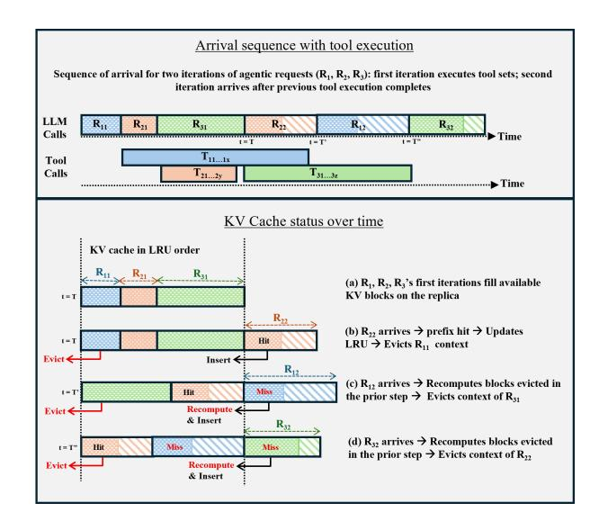

## Sutradhara: An Intelligent Orchestrator-Engine Co-design for Tool-based Agentic Inference

Anish Biswas Microsoft Research India Bengaluru, India

Jayashree Mohan Microsoft Research India Bengaluru, India Kanishk Goel Microsoft Research India Bengaluru, India

Alind Khare Microsoft M365 Research Bengaluru, India Srivarshinee S Microsoft M365 Research Bengaluru, India

Anjaly Parayil Microsoft M365 Research Bengaluru, India

## Chetan Bansal Microsoft M365 Research Redmond, USA

#### **Abstract**

Agentic applications are LLMs that iteratively invoke external tools to accomplish complex tasks [27, 29]. Such toolbased agents are rapidly becoming the dominant paradigm for deploying language models in production. Unlike traditional single-turn inference, agentic workloads chain together multiple LLM calls and tool executions before producing a final response, creating a new performance bottleneck that manifests as increased latency in First Token Rendered (FTR) of the final answer. Through analysis of requests at production scale, we reveal three critical challenges: tool calls account for 30-85% of FTR latency, KV cache hit rates collapse despite substantial context reuse across iterations [9, 30], and sequential orchestration wastes potential intrarequest parallelism. These bottlenecks stem from a design gap in which orchestrators and LLM engines operate as decoupled black boxes, preventing cross-layer optimizations.

We present Sutradhara, a co-designed agentic inference system that integrates orchestration with LLM serving through a thin API enabling three optimizations: overlap tool execution with subsequent LLM prefill using tool-aware prompt splitting, streaming tool execution to dispatch tools incrementally during decode rather than waiting for complete output, and orchestrator-aware cache management that uses semantic hints to improve hit rates and reduce thrashing. Implemented on vLLM, Sutradhara improves the throughput-latency trade-off in agentic systems, sustains up to 77% higher load at the same median FTR latency, or reduces median FTR latency by up to 15% at the same load while reducing end-to-end latency by up-to 11% on A100 GPUs.

#### 1 Introduction

Large language models have rapidly evolved from research prototypes to production systems powering mission-critical applications. While early deployments focused on simple Ram Ramjee Microsoft Research India Redmond, USA

> **[图片提取文字 (无描述)]:**
> Baseline Tool, Tool, LLM2 Tool, Sutradhara Latency Tool Tool2 Tool reduction

(a) SUTRADHARA systematically unlocks intra-request parallelism

> **[图片提取文字 (无描述)]:**
> ICHOIII 15 -15%Critical Path Tool Time Prefill 3 © 30 SE 20 Request 1 Request 2 Max QPS (×10 50-10 30--20.1% $\mathfrak{S}^{40}$ 30-20-20-10-Baseline SD

(b) Throughput (c) FTR Latency

(d) FTR Breakdown

**Figure 1.** (a)Sutradhara systematically parallelizes the execution of LLM and tools and enables workload-aware KV eviction. (b) Sutradhara (SD) sustains upto 77% higher load than baseline (BL) at the same median FTR (38s) and (c) reduces median FTR by 15% at the same load. (d) For two random requests in the trace, these techniques reduce FTR by 20 – 42%.

query-response patterns, modern LLM applications increasingly adopt agentic architectures—autonomous systems that iteratively invoke LLMs and external tools to accomplish complex tasks. These systems represent a fundamental shift in how we deploy LLMs. Rather than treating models as stateless oracles that answer isolated queries, agentic architectures enable LLMs to reason, plan, and interact with the external world through iterative tool use [17, 29].

However, this architectural shift introduces a critical performance challenge that existing LLM serving infrastructure fails to address: latency explosions in user-perceived response times. Traditional LLM serving systems optimize for Time-To-First-Token (TTFT) and inter-token latency, treating each inference request as an independent unit of work. In contrast, agentic applications chain together multiple LLM calls and tool invocations in iterative loops before producing a final response. User-perceived latency—measured as First

1

Token Rendered (FTR) of the final answer encompasses not just a single LLM forward pass, but the cumulative latency of multiple LLM calls interspersed with tool executions until the first user-visible token is generated. In production systems, FTR latency can span seconds or even tens of seconds severely degrading user experience.

To understand these challenges systematically, we conduct the first large-scale empirical study of agentic inference performance using synthetic traces from production workloads in a large cloud provider. Our analysis reveals three critical insights that challenge conventional assumptions about LLM serving bottlenecks. (1) Tool execution dominates tail latency, accounting for 30-85% of FTR latency while individual tool calls can exceed LLM prefill time. While LLM prefill and decode have been the traditional focus of optimization efforts [2, 9, 11, 12, 16], we find that tool calls—often dismissed as "thin" external I/O operations—could be a major component of FTR latency. (2) Sequential orchestration leaves parallelism unexploited, as 60-80% of each iteration's prefill is tool-independent yet current systems wait for all tool outputs before beginning the next iteration; similarly tools are executed only after LLM decodes complete, while it is possible to stream tool executions as decode progresses. (3) KV cache thrashing destroys reuse opportunities despite context reuse, as workload-agnostic LRU eviction thrashes shared prefixes when agentic requests execute concurrently.

These findings point to a fundamental architectural mismatch: **orchestrators and LLM engines operate as decoupled black boxes**, communicate only through opaque request-response interfaces. The orchestrator has knowledge of iterations, tool dependencies, and prompt composition, while the engine controls scheduling, batching, and KV cache management. Neither layer leverages information from the other to make globally optimal decisions. Breaking this abstraction barrier is essential to address bottlenecks.

We present Sutradhara, a co-designed agentic inference system that tightly integrates orchestration logic with LLM engine scheduling through a thin, principled API. SUTRAD-HARA enables three key optimizations: (1) parallel execution through prompt splitting, where iteration i + 1 speculatively begins prefill using tool-independent context while iteration i's tools execute, then incrementally extends the prefill when tool outputs arrive; (2) streaming tool dispatch during decode, where a streaming JSON parser identifies complete tool call objects as they are decoded and dispatches them immediately rather than waiting for full decode completion; and (3) orchestrator-aware cache management, where semantic metadata tags and reuse hints guide a priority-aware eviction policy that retains high-value blocks while evicting transient content, combined with request-aware scheduling that prioritizes completing in-flight requests. Figure 1 shows how intra request parallelism enables Sutradhara to achieve significant latency reduction of up-to 42% per request.

We implement Sutradhara as an asynchronous event-driven orchestrator built on top of vLLM v0.11.0, with targeted modifications to the v1 scheduler totaling fewer than 3500 lines of code. The orchestrator-engine interface consists of five new API calls (Table 1) that enable hint passing, parallel execution coordination, and cache metadata communication. Our implementation requires no changes to model architectures, training procedures, or inference kernels. We evaluate Sutradhara across A100-80GB GPUs using synthetic traces from production on Qwen3-14B. Compared to the vLLM baseline, Sutradhara achieves a better throughput-latency tradeoff, sustains up to 77% higher load at the same median FTR latency, or reduces median FTR latency by up to 15% at the same load while improving end-to-end latency by 11%.

In summary, this paper makes the following contributions:

- Empirical characterization. First large-scale analysis of agentic inference workloads, identifying tool execution variance, sequential bottlenecks, and cache thrashing as dominant sources of tail FTR latency (§3).
- **Co-designed architecture.** We propose SUTRADHARA, an orchestrator-engine co-design, with three novel techniques; prompt splitting with tool execution overlap, streaming tool dispatch, and semantic cache management that exploits agentic request structure (§4).
- Implementation and evaluation. We implement SUTRADHARA on vLLM with minimal invasiveness and demonstrate across models and workloads that it sustains up to 77% higher load at the same median FTR latency, or alternatively reduces median and tail FTR latency by up to 15% and 11% at the same load on an A100-GPU cluster (§5).

## 2 Background

## 2.1 Agentic Inference

Agentic inference represents a fundamental departure from traditional single-turn LLM inference. In standard LLM serving, a user submits a query, the model performs a single forward pass (prefill followed by autoregressive decode), and returns a complete response. The serving system optimizes for metrics like Time-To-First-Token (TTFT) and per-token decode latency, treating each request as an isolated, stateless computation. Agentic inference, by contrast, enables LLMs to interact with external tools and APIs through iterative execution loops. Rather than producing a final answer in one shot, the LLM reasons about a task, decides which tools to invoke, examines their outputs, and continues this process until reaching a satisfactory answer.

## 2.2 Agentic inference serving framework

Figure 2 illustrates the standard architecture for agentic inference serving, consisting of three primary components that interact through well-defined interfaces.

> **[图片提取文字 (无描述)]:**
> Response User request Repeat Orchestrator Inference Engine Tool Execution (vLLM) Layer

Figure 2. Workflow: (1) User request arrives; (2) Orchestrator sends LLM query and receives response; (3) Tools optionally invoked based on response; (4) Iterative loop of LLM and tools; (5) Final user-visible response returned.

LLM Serving Engine. The engine handles low-level inference execution—batching requests, managing GPU memory, scheduling prefill and decode operations. Modern production systems use frameworks like vLLM [\[9\]](#page-11-0) or SGLang [\[30\]](#page-12-2), which implement optimizations such as continuous batching, PagedAttention, and prefix caching. The engine exposes a request-response API where clients submit prompts and receive generated token sequences. Importantly, the engine treats each LLM call as independent—it has no visibility into whether a request is part of an agentic workflow, or which iteration it belongs to.

Orchestrator. The orchestrator implements the control logic for agentic execution. Built as an asynchronous event-driven system (typically using Python's asyncio or similar frameworks), it manages the iterative loop: constructing prompts from conversation history and tool outputs, dispatching LLM calls to the engine, parsing structured outputs to extract tool specifications, invoking tools through their respective APIs, and tracking iteration state. The orchestrator maintains semantic knowledge about request structure—which prompt sections depend on tool outputs, which tools are executing , and how context accumulates across iterations. However, this knowledge remains isolated within the orchestrator and is not communicated to the engine.

Tool Execution Layer. Tools are services accessed through APIs, libraries, or sand-boxed execution environments [\[23\]](#page-12-3). Common tools include web search, code execution, file system operations, and API calls to third-party services. Tools execute asynchronously and independently; when multiple tools are invoked in the same iteration, they run in parallel [\[8\]](#page-11-6). Tool execution time varies dramatically based on query complexity, external service load, and network conditions, ranging from milliseconds to seconds.

Multi-iteration execution structure. An agentic request consists of multiple iterations, where each iteration follows a structured pattern:

1. LLM Call: The orchestrator submits a prompt to the LLM engine containing system instructions, conversation history, and (for > 1) outputs from previous

- tool calls. The engine performs prefill to process the prompt, then generates tokens auto-regressively during decode. For the intermediate iterations, the decode output specifies which tools to invoke, typically formatted as structured JSON. For the final iteration, the decode output is the user-facing final response.
- 2. Tool execution : The orchestrator parses the tool specifications and dispatches each tool for execution. Each iteration can dispatch multiple tools, that may execute independently and finish at different times.

Sequential execution. Current agentic systems enforce a strict sequential execution between prefills, decodes, and tool calls per iteration. Our analysis shows that there is scope to enable intra-request parallelism across iterations, thereby optimizing request completion latencies.

## 3 Analysis

This section presents the agentic workload characterization that highlights bottlenecks in orchestration and KV cache behavior. We conclude with design requirements for an optimized system.

## 3.1 Trace collection

Agentic Platform. To understand the performance characteristics of agentic inference in production environments, we analyze workloads from a major cloud provider's internal agentic platform deployed across thousands of enterprise customers. This platform provides a general-purpose orchestration framework that manages iterative LLM-tool execution loops. It dispatches requests to a heterogeneous fleet of LLM serving endpoints and coordinates calls to an extensible tool registry containing 20+ integrated services including web search APIs, enterprise chat, email, file searches, code execution, internal knowledge bases, and third-party SaaS integrations. The orchestrator implements a standard agentic execution pattern: issue an LLM request with available tools, parse structured output to identify tool calls, execute tools and collect outputs, append results to context, and iterate until the LLM produces a final response. The orchestrator could modify instructions and system prompts in any iteration depending on the set of tool calls made. This architecture is representative of popular agentic systems including LangChain [\[10\]](#page-11-7), AutoGen [\[18\]](#page-11-8), and proprietary enterprise frameworks.

Workload Generation. We analyze workloads issued on this platform with synthetic user profiles and data, instead of the real customer-facing queries as its prompt tokens are eyes-off for privacy reasons. The synthetic queries on this actual production platform are created through an automated pipeline that first provisions test users along with their synthetically generated enterprise context, including files, chats, and calendar events. Then, a structured sets of

> **[图片提取文字 (无描述)]:**
> (a) Iteration Depth (b) Tool Fan-Out (e) Tool Time Ratio 1.0 1.0 1.0 0.8 0.8 0.8 0.6  ${\mathop {\Xi }}_{0.4}^{0.6}$ 0.6 0.4 0.4 0.2 0.2 0.2 0.0 0.0 0.0 20 0.8 1.0 10 15 0.0 0.2 0.4 0.6 Tool Time / FTR Ratio Iterations per Request Tool Calls per Iteration (c) Prompt Length (d) Response Length (f) Tool Latency Variation 1.0 Median Latency 0.8 0.8 Norm. 0.2 Intermediate 0.2 Final  $10^{-2}$ 0.0 0.0 40000 50000 1000 1500 10000 20000 30000 500 0 В Ε Prompt Length (tokens) Tool Response Length (tokens)

**Figure 3.** Detailed statistics of the agentic production trace. The distributions illustrate the structural characteristics of multi-step requests (a-d) and the associated tool execution dynamics (e-f). (e) denotes the normalized tool latency with respect to the median.

evaluation queries are executed on the platform, each designed to replicate realistic tasks such as document retrieval, summarization, and information search. By modeling workflows and entity relationships, the synthetic workload environment closely mirrors production scenarios. We also validate all the observations gained from synthetic workloads against customer-facing production workload. We analyze 6000 agentic requests across different user categories.

## **3.1.1 Metrics and Definitions.** The key metrics are:

<u>First Token Rendered (FTR)</u>. FTR is defined as the elapsed time from user request submission to the rendering of the *first token* of the final user-visible response.

Iteration Depth. No. of LLM calls in an agentic request.

*Tool Call Fan-Out.* Number of tool invocations *per iteration*.

#### 3.2 Trace statistics

We first present the overall trace characteristics. For each request, we categorize the number of LLM iterations into two types; intermediate iterations that perform tool invocations and a final iteration that generates the user visible response and doesn't result in any tool calls. Figure 3 presents the overall trace characteristics (a) the distribution of iteration depth per request (b) tool call fan out per iteration, (c) prefill length distribution and (d) generated token distribution by iteration type. A median agentic request issues about 2 LLM iterations, one intermediate and one final, while in the tail, the iteration depth goes up to 7. Similarly, the per iteration tool call fan out is 2 in the median case, but some iterations could have as high as 21 tool calls made in a single iteration. The median prompt length across intermediate and final iterations is about 20K tokens, while the tail could be 3x

higher. The majority of the context is the system prompt (that could vary depending on the iteration and tools invoked in the previous iteration), and tool-specific instructions and formatting metadata. However, the median generated tokens for intermediate iterations is about 5x lower than the final iteration; this makes the intermediate iterations more prefill-bound, while the final iteration is decode-bound.

#### 3.3 Trace-driven analysis

We present our key findings on the production workload.

Finding 1: Tool call execution dominates the tail FTR. Figure 3(e) presents the cumulative distribution of tool execution time as a fraction of total FTR latency across our workload. While the median request spends only 32% of its FTR latency executing tools (with the remaining 68% spent in LLM prefill and decode), the tail exhibits dramatically different behavior. At the 90th percentile, tool execution accounts for 61% of FTR latency, climbing to 85% at the 99th percentile. This tail dominance contradicts the conventional assumption that tool calls are lightweight I/O operations contributing marginally to end-to-end latency [11, 16].

Our analysis further reveals variability in tool execution latency. Figure 3(f) shows box plots of tool latencies normalized to each tool's median (p50) for six representative production tools. Even after normalization, all tools exhibit wide dispersion and pronounced right tails. By p75, normalized latency reaches 1.23–1.52× p50 across tools, and at p90 spans 1.60–3.28× p50. This heavy-tailed behavior indicates that tool execution latency remains highly sensitive to factors such as query complexity, backend contention, and the volume of data accessed (e.g., in search-style tools). As a result, tool execution time remains inherently difficult

> **[图片提取文字 (无描述)]:**
> 1.0 0.0 0.5 0.6 0.7 0.8 Start Position (ratio)

Figure 4. CDF of prompt prefix fraction independent of tool output

to predict, making tool-execution-time-aware KV caching strategies impractical in practice [11].

The magnitude of tool execution time presents a clear optimization opportunity. Even partially overlapping tool execution with subsequent LLM computation could yield significant latency reductions. However, exploiting this opportunity requires tight coordination between the orchestrator and LLM engine, which is a capability fundamentally absent in current black-box architectures where components communicate solely through request-response interfaces.

Finding 2 : Sequential orchestration leaves substantial parallelism unexploited. Current orchestrators enforce strict sequential execution within each agentic request: iteration i completes LLM decode, all tool calls execute to completion, all tool outputs return, and only then does iteration i+1 begin prefill. This pipeline unnecessarily serializes the three phases – prefill, decode, and tool execution that could potentially overlap. We identify two specific sources of unexploited parallelism that stem from this rigid sequencing.

<u>Opportunity 1: Prefill-tool overlap.</u> Figure 4 analyzes prompt composition across iterations, measuring the fraction of each prompt consisting of tool-independent content versus tool-dependent outputs. We observe that 50-80% of iteration i+1's prompt is available when iteration i finishes decode. System instructions, conversation history, and templates don't depend on tool outputs. Only the final 20-50% needs tool results. This creates a natural split point. The orchestrator could start prefill on the part of the prompt independent of tool outputs while tools execute. and extend the prefill incrementally.

Opportunity 2: Decode-tool overlap. LLMs generate tool calls as JSON: ["tool": "search", "query": "...", "tool": "plot", "query": "..."]. Current orchestrators wait for the entire array before dispatching tools. But once the first JSON object completes (closing }), that tool can execute immediately, allowing for streaming tool execution as decodes progress.

Finding 3: KV cache thrashing lowers prefix reuse. Agentic requests exhibit significant context reuse both across iterations within a request, as well as across requests that make similar tool calls. Across iterations, conversation history accumulates, whereas system prompts and instruction templates to consume tool output depend on tool call made in the prior iteration; such system prompts could be shared

> **[图片提取文字 (无描述)]:**
> Arrival sequence with tool execution Sequence of arrival for two iterations of agentic requests (R1, R2, R3): first iteration executes tool sets; second iteration arrives after previous tool execution completes LLM  $R_{11}$ Rsı R,, R Calls ➤ Time 1 - T' T11...1x Tool Calls KV Cache status over time KV cache in LRU order (a) R1, R2, R3's first iterations fill available KV blocks on the replica t = T(b) R2, arrives → prefix hit → Updates Hit LRU → Evicts R11 context Evict € Insert R12\_\_ (c) R12 arrives → Recomputes blocks evicted in Miss t = T'Hit the prior step → Evicts context of Rst Recompute 4 Evict € & Insert R32 (d) Rv, arrives → Recomputes blocks evicted Miss t = T-Hit Miss in the prior step → Evicts context of R,, Evict € Recompute 4 & Insert

**Figure 5.** Thrashing due to workload-agnostic KV eviction policy

across requests that make similar tool calls. Standard prefix caching mechanisms should enable high cache hit rates by reusing these shared prefixes. However, we observe systematic cache thrashing that severely degrades performance under concurrent agentic workload execution.

Root cause: Workload-agnostic LRU eviction. Popular serving platforms [9, 30] employ Least Recently Used (LRU) eviction policies that treat all cached KV blocks identically, lacking awareness of agentic request structure. To understand the thrashing behavior, consider three concurrent agentic requests  $R_1$ ,  $R_2$ , and  $R_3$  shown in Figure 5. Each request performs two iterations, where the first iteration generates tool calls (denoted  $T_{i1...1x}$ ,  $T_{i1...2y}$ ,  $T_{i1...3z}$  for requests  $R_i$ ) and the second iteration can only begin after the previous iteration's tool execution completes.

At time t = T, all three requests complete their first LLM calls  $(R_{11}, R_{21}, R_{31})$  and their KV blocks fill the available cache capacity in LRU order (Figure 5(a)). When  $R_2$ 's second iteration  $(R_{22})$  arrives at t = T', it gets a prefix cache hit from  $R_{21}$ . However, inserting  $R_{22}$ 's new KV blocks causes LRU to evict  $R_{11}$ 's context (Figure 5(b)). Subsequently, when  $R_{12}$  arrives at t = T'', it must recompute the evicted blocks from  $R_{11}$ , which in turn triggers eviction of  $R_{31}$ 's context (Figure 5(c)). This cascading pattern continues as  $R_{32}$  arrives at t = T''' and must recompute  $R_{31}$ 's evicted blocks, further evicting  $R_{22}$ 's context (Figure 5(d)). The problem is that LRU evicts by recency, ignoring that  $R_{11}$ ,  $R_{21}$ ,  $R_{31}$  are first-iteration contexts that will be reused by blocked second iterations. We address this by using workload-aware eviction hints to evict KV-cache regions with lower reuse likelihood (§4.3).

In this work, we assume only HBM caching; thus, evicted KV blocks are recomputed. Alternatively, these blocks could be offloaded to secondary storage (e.g., CPU) using systems such as LMCache [5] or Mooncake [24]. In that case, our

| API Call                             | Purpose                                                                       |
|--------------------------------------|-------------------------------------------------------------------------------|
| <pre>submit_partial_ prefill()</pre> | Submit tool-independent prompt slice                                          |
| extend_prefill()                     | Append tool outputs to pinned partial prefill context                         |
| register_streaming_ callback()    | Receive partial decode outputs token-by-token                                 |
| tag_kv_blocks()                      | Annotate cached KV blocks with semantic hints (e.g., system_prompt, response) |
| set_reuse_priority()                 | Set priorities among KV blocks for pinning                                    |

Table 1. APIs that enable orchestrator-engine co-design.

ideas remain applicable, as prefetching the right KV blocks is still required due to the HBM-storage latency hierarchy.

**3.3.1 Summary.** Our three key findings reveal a fundamental architectural problem: current agentic systems suffer from a **lack of co-design between the orchestrator and LLM inference engine**. Today's architectures treat these components as independent black boxes that communicate solely through opaque request-response interfaces. The orchestrator dispatches individual LLM calls and waits for complete responses before proceeding, while the engine treats each request as an isolated inference job with no awareness of its role in a multi-iteration agentic workflow. This decoupling prevents both layers from exploiting information that could enable critical optimizations.

