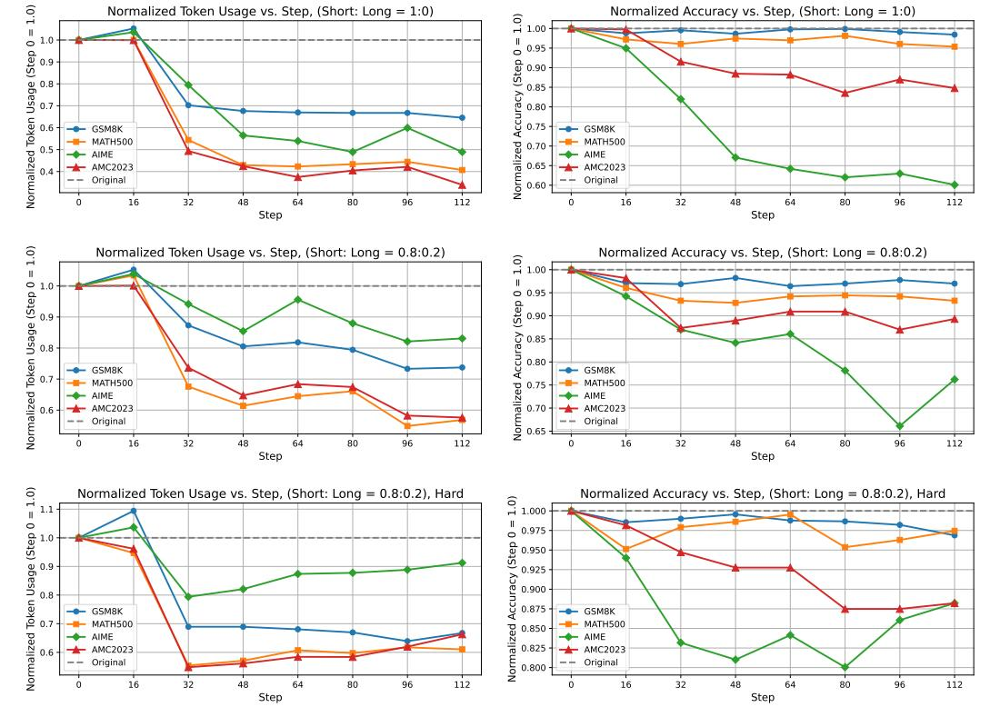

# 1 Introduction

*"He that can have patience can have what he will." — Benjamin Franklin*

Recent efforts have developed reasoning-oriented Large Language Models (LLMs) capable of solving complex tasks. These models progressed from System 1 to System 2 paradigms [\[55,](#page-16-0) [28\]](#page-13-0). System 1 implementations, such as GPT-4o [\[39\]](#page-14-0), LLaMA-3 [\[12\]](#page-11-0), leverage rapid intuitive processing for immediate responses but struggle with complex reasoning tasks. In contrast, System 2 architectures such as DeepSeek-R1 [\[10\]](#page-10-0) are fine-tuned with extended thinking chains to promote deliberate analysis through iterative self-assessment, error mitigation, and verification. However, reasoning-oriented LLMs, which employ system-2 reasoning, tend to engage in excessive deliberation even for simple problems. This results in unnecessary exploration and planning, ultimately impairing their efficiency and practicality.

Direct approaches aim to addressing the issues of cognitive redundancy and excessive deliberation within reasoning LLMs. *Training-free* methods [\[51,](#page-15-0) [53,](#page-15-1) [14\]](#page-12-0) include some that control the internal states of the model during reasoning through prompts or confidence-based techniques to compress the model. Alternatively, the pathway, exemplified by model merging, involves intervening in the parameters of the reasoning LLM to produce relatively concise solutions. *Training-based* methods primarily focus on sampling and synthesizing relatively concise reasoning paths on specified problem sets through various strategies [\[48,](#page-15-2) [52,](#page-15-3) [33\]](#page-13-1). These methods involve performing reinforcement learning [\[34,](#page-14-1) [19,](#page-13-2) [31,](#page-13-3) [1\]](#page-10-1) or supervised fine-tuning (SFT) [\[5\]](#page-10-2) on reasoning LLMs, enabling the model to learn to generate more concise yet still correct reasoning paths.

Such methods typically require careful collection of problems and precise control of the data ratio for different lengths to achieve good results, leading to a complex process of parameter tuning and data construction. For example, TOPS [\[52\]](#page-15-3) requires pre-processing steps to manually label SFT data to construct length-sensitive models, while CoT-Valve [\[33\]](#page-13-1) generates data by creating intermediate models through model interpolation for sampling. This construction process is often tedious [\[52\]](#page-15-3), computationally expensive [\[1\]](#page-10-1), or difficult to control for quality [\[33\]](#page-13-1).

### Demystifying Short/Long CoT Mixture in LLM Thinking Compression

- System-1 data (Short CoT on GSM8K-like easy problems) reduces reasoning redundancy on all problem levels. (Section [2\)](#page-2-0) Short CoT reduces reasoning redundancy on simple questions and demonstrates generalization across varying levels of problem difficulty.
- System-2 data (Long CoT only on s1-like difficult problems) helps maintain performance. (Section [2\)](#page-2-0) Incorporating a small proportion of Long CoT, particularly on challenging problems, can mitigate the accuracy degradation introduced by short CoT, while long CoT on simple questions doesn't help much.
- Dynamic re-weighting of System-1/2 data builds effcient LLM Reasoning Compression. (Section [3.1\)](#page-4-0) Driven by a simple intuition, we design a dynamic reweighting algorithm for system-1/2 data, achieving strong performance in LLM reasoning compression.

We investigate the effects of mixing short CoT and long CoT data on compressing reasoning. Our findings suggest that long CoT and short CoT induce divergent optimization directions in the model's reasoning behavior. Increasing the proportion of short CoT encourages more concise reasoning patterns, but may lead to a decline in reasoning accuracy. In contrast, raising the proportion of long CoT helps preserve reasoning performance on complex tasks, though at the expense of reduced compression efficiency. This naturally raises the question: *Can we identify an optimal Long-to-Short data mixture that strikes the best trade-off—maximizing reasoning efficiency while maintaining accuracy?*

We base our approach on an intuitive motivation: when a model is thinking too long, it should re-weight more intuitive reasoning paths to simplify the thinking process. Conversely, when the thinking is too direct, it should incorporate more slow-thinking reasoning chains to encourage deeper contemplation. We propose a dynamic Thinking Length Data Re-Weighting method (TLDR), which dynamically balances the model's complex reasoning using long CoT and efficient reasoning using short CoT data, enabling the model to eliminate redundant cognitive processes. First, we construct short CoT data for simple problems and long CoT data for complex problems. The model begins

> **[图片提取文字 (无描述)]:**
> Normalized Token Usage (Step 0 = 1.0) Normalized Token Usage vs. Step, (Short: Long = 1:0) Normalized Accuracy vs. Step, (Short: Long = 1:0) 1.0) Normalized Accuracy (Step 0 0.90 0.80 0.80 0.75 0.65 0.66 0.66 0.66 → GSM8K - GSM8K MATH500 MATH500 AMC2023 ★ AMC2023 Original -- Original 16 32 48 64 80 96 16 32 48 64 112 80 96 112 Step Step Normalized Token Usage (Step 0 = 1.0) Normalized Token Usage vs. Step, (Short: Long = 0.8:0.2) Normalized Accuracy vs. Step, (Short: Long = 0.8:0.2) 1.00 Normalized Accuracy (Step 0 ................................... GSM8K → GSM8K MATH500 MATH500 AIME - AIME ★ AMC2023 ★ AMC2023 -- Original -- Original 16 48 80 48 64 32 64 112 16 32 80 112 Step Step Normalized Token Usage (Step 0 = 1.0) Normalized Token Usage vs. Step, (Short: Long = 0.8:0.2), Hard Normalized Accuracy vs. Step, (Short: Long = 0.8:0.2), Hard 1.0) 1.000 0.975 0.950 0.925 0.975 0.925 Accuracy 0.900 0.875 → GSM8K → GSM8K Normalized / 0.850 0.825 0.800 MATH500 MATH500 AIME -AMC2023 ★ AMC2023 -- Original — Original 16 32 96 112 32 48 112 0 48 64 80 16 64 80 96 Step Step

Figure 1: Impact of Combining Short CoT and Long CoT in Fixed Ratios on Thinking Compression Performance and Token Cost. We assessed the variation decay rate in output token length and accuracy on datasets of various question difficulty, spanning from GSM8K to AIME. The Normalized Token/Acc metric detail please refer to Equ. 11 and Equ. 12.

with an initial ratio and performs reasoning compression using mixed data. After completing a compression cycle, the model re-evaluates the expected benefits of System-1 CoT data and System-2 CoT data to achieve improved performance. Specifically, and in line with intuition, System-1 CoT data can enhance efficiency, so we use an efficiency metric to measure the expected benefit of System-1 data. System-2 CoT, on the other hand, improves reasoning accuracy, and we use an accuracy metric to measure the benefit of System-2 data in terms of reasoning capability.

Compared to various methods requiring fine-tuning data with different reasoning lengths, our approach enables dynamic ratio learning by utilizing the self-sampled long CoT data and the short CoT data constructed by the original instruct/base model. Through experiments on DeepSeek-Distill-7B/14B, our model achieves excellent compression results on the 7B/14B models, with only a slight decrease in reasoning capability.

