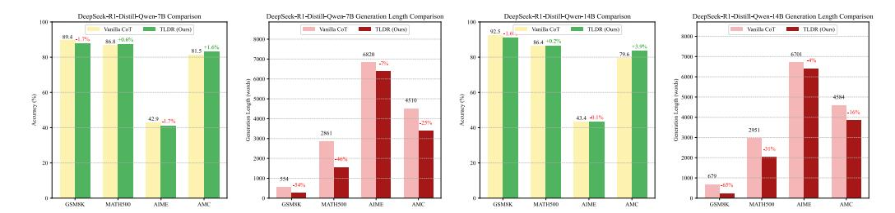
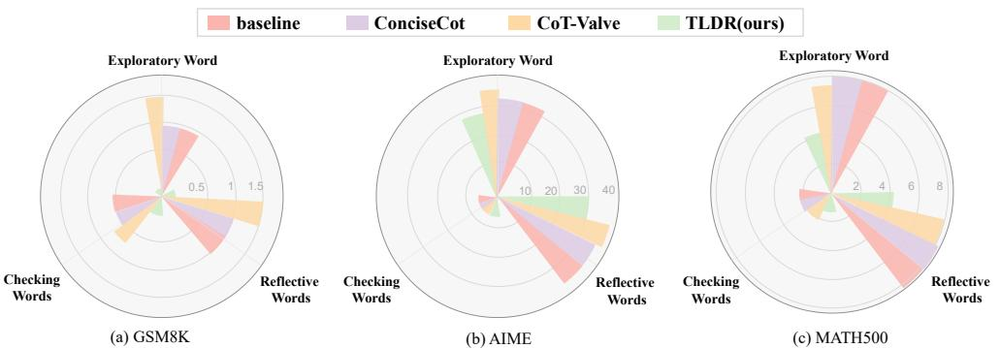

# 4.1 Experimental Setup

**Datasets and Metrics.** Following prior efforts, we evaluate TLDR on several widely-used benchmarks that span a broad range of difficulty levels, including ASDiv [35], GSM8K [9], MATH-500 [17], and AIME2024 [2], AMC [3] in Table 1. To ensure the stability of the evaluation, we performed multiple samplings for each dataset and took the average accuracy. For GSM8K, MATH500, and GPQA, we sampled each question 4 times and took the average accuracy of the 4 solutions. For AIME24 and AMC23, we sampled each solution 8 times and took the average accuracy of the 8 solutions. The token count was calculated using the corresponding tokenizer of the language model, and our evaluation environment was modified using the Skythought library.

**Baselines.** We compared three types of baselines:

| Model                       |       | Ac   | curacy |      | Generation Length |       |      |      |      |      |  |
|-----------------------------|-------|------|--------|------|-------------------|-------|------|------|------|------|--|
|                             | GSM8K | MATH | AIME   | AMC  | Avg.              | GSM8K | MATH | AIME | AMC  | Avg. |  |
| DeepSeek-R1-Distill-Qwen-7B |       |      |        |      |                   |       |      |      |      |      |  |
| Original Model              | 89.4  | 86.8 | 42.9   | 81.5 | 75.2              | 554   | 2861 | 6820 | 4510 | 3686 |  |
| -TLDR                       | 87.7  | 87.4 | 41.2   | 83.1 | 74.8              | 253   | 1556 | 6368 | 3386 | 2891 |  |
| -L1-same                    | 86.4  | 88.6 | 42.2   | 84.6 | 75.4              | 301   | 2301 | 5875 | 3784 | 3056 |  |
| -L1-lower                   | 86.4  | 87.6 | 45.1   | 84.6 | 75.9              | 312   | 1831 | 5675 | 3807 | 2906 |  |
| -L1-higher                  | 86.1  | 88.4 | 45.5   | 83.3 | 75.8              | 292   | 2589 | 6007 | 3746 | 3158 |  |

Table 3: Performance comparison of TLDR with budget-aware baseline, L1 [1]. The accuracy is measured by sampling multiple responses from the LLMs and to reduce variance. The terms *same*, *lower*, and *higher* refer to setting the budget to match our results, 20% lower, and 20% higher, respectively. MATH means MATH500 dataset.

| Model                                                   |       | Ac   | curacy |      |      | Generation Length |      |      |      |      |  |
|---------------------------------------------------------|-------|------|--------|------|------|-------------------|------|------|------|------|--|
|                                                         | GSM8K | MATH | AIME   | AMC  | Avg. | GSM8K             | MATH | AIME | AMC  | Avg. |  |
| DeepSeek-R1-Distill-Qwen-7B System-1 Short CoT Ablation |       |      |        |      |      |                   |      |      |      |      |  |
| Original Model                                          | 89.4  | 86.8 | 42.9   | 81.5 | 60.1 | 554               | 2861 | 6820 | 4510 | 2949 |  |
| -TLDR-Easy                                              | 87.7  | 87.4 | 41.2   | 83.1 | 59.9 | 253               | 1556 | 6368 | 3386 | 2313 |  |
| -TLDR-Medium                                            | 88.2  | 86.2 | 41.5   | 31.3 | 61.8 | 318               | 2083 | 6604 | 3945 | 3238 |  |
| -TLDR-Hard                                              | 83.6  | 80.2 | 30.0   | 65.3 | 64.8 | 495               | 2970 | 6874 | 4947 | 3822 |  |
| DeepSeek-R1-Distill-Qwen-7B System-2 Long CoT Ablation  |       |      |        |      |      |                   |      |      |      |      |  |
| Original Model                                          | 89.4  | 86.8 | 42.9   | 81.5 | 60.1 | 554               | 2861 | 6820 | 4510 | 2949 |  |
| -TLDR-Easy                                              | 83.9  | 86.8 | 42.5   | 83.4 | 74.2 | 446               | 2639 | 6580 | 4047 | 3428 |  |
| -TLDR-Medium                                            | 91.6  | 87.6 | 40.4   | 81.5 | 75.3 | 542               | 2761 | 6553 | 4116 | 2950 |  |
| -TLDR-Hard                                              | 87.7  | 87.4 | 41.2   | 83.1 | 74.8 | 253               | 1556 | 6368 | 3386 | 2828 |  |

Table 4: An ablation study on the difficulty levels of ShortCoT and LongCoT was conducted during the construction of the ShortCoT and LongCoT dataset. The accuracy is measured by sampling multiple responses from the LLMs and taking the average to reduce variance. & denotes the CoT-Valve [33] result that we reproduced using the officially dataset. MATH means MATH500 dataset.

*Prompt-based* methods. We compared our approach with the well-known prompt-based baselines in the community, including TALE-EP [14], which requires the prompt to be as simple as possible, and ConciseCoT [26], which demands the use of the most concise CoT steps during step-by-step reasoning.

Model-Merging-based Methods. Model Merging leverages the rich knowledge from short CoT Instruct and the long CoT model for model fusion, aiming to achieve the shortest yet most effective reasoning process. We compared this approach with the Avg. Merging method used in Kimi-1.5 [43, 46] and some advanced merging method, like Task-Arithmetic-Merging, Ties-Merging, Ties-Dare-Merging, discussed in [46].

*Reward-based Methods.* ThinkPruner [20] uses progressive compression of RL training length to improve the effectiveness of context utilization during exploration. *SimPO*shortest was introduced in Overthink [24] to adjust the effectiveness of the RL algorithm by length-guided RL training.

We find that our approach can maintain accuracy across datasets of varying difficulty while achieving satisfactory compression rates. In contrast, merging-based methods still suffer from significant performance drops on challenging problems. Compared to CoT-Valve and ThinkPrune, our method attains excellent compression rates, particularly on the ASDiv and GSM8K datasets, where over-exploration tends to occur. CoT-Valve, as an SFT-based approach, requires carefully designed model blending and the construction of length-diverse datasets for dynamic learning. In contrast, our method only requires straightforward data sampling and adaptive mixing ratios, achieving adaptive reasoning in a much simpler way.

> **[图片提取文字 (无描述)]:**
> DeepSeek-R1-Distill-Qwen-7B Comparison DeepSeek-R1-Distill-Qwen-7B Generation Length Comparison DeepSeek-R1-Distill-Qwen-14B Comparison DeepSeek-R1-Distill-Qwen-14B Generation Length Comparison Vanilla CoT Vanilla CoT TLDR (Ours) Vanilla CoT TLDR (Ours) Vanilla CoT TLDR (Ours) TLDR (Ours) 89.4 -1.7% 8000 86.8 +0.6% 8000 86.4 +0.2% +3.9% 6820 6701 79.6 7000 7000 4584 4510 43.4 -0.1% 42.9 -1.7% £ 4000 -25% 2951 2861 S 3000 S 3000 -31% 2000 2000 -46% 1000 1000 4 x-65% GSM8K MATH500 AIME AMC AIME GSM8K AIME AMC AMC GSM8K MATH500 MATH500 GSM8K MATH500 AIME

Figure 3: Comparison of accuracy and generation length between Vanilla CoT and our TLDR method on four benchmark datasets (GSM8K, MATH500, AIME, AMC) using DeepSeek-R1-Distill-Qwen models. TLDR consistently reduces generation length while maintaining or improving accuracy across both 7B and 14B model scales.

> **[图片提取文字 (无描述)]:**
> ConciseCot CoT-Valve TLDR(ours) baseline **Exploratory Word Exploratory Word Exploratory Word** 0.5 20 30 40 Checking Reflective Checking Reflective Checking Reflective Words Words Words Words Words Words (a) GSM8K (c) MATH500 (b) AIME

Figure 4: Frequency comparison of different keywords. The figure illustrates the distribution of exploratory, checking, and reflective keywords across datasets. *Exploratory Keywords: wait, Reflective Word: but, Checking Words: make sure/confirm/verify/check*, TLDR significantly reduces the presence of such words, reflecting its ability to produce streamlined and efficient reasoning steps.

### 4.2 Comparison of Dynamic Compression vs. Static Compression Data.

We compared our dynamic algorithm with several simple static data mixing methods, including directly mixing data according to a simple ratio and constructing length-uniform data using parameter interpolation. MixChain-Z-GSM8K is a Long2Short dataset proposed by CoT-Valve in Table 2.

### 4.3 Ablation of Different System-1/2 Source

We also discovered that incorporating higher-difficulty CoT data into a short-long mixed dataset could effectively eliminate redundancies in CoT for their compressed version. However, direct mixing could lead to performance degradation. After introducing a dynamic ratio method, we found that flexibly adjusting the ratio could effectively maintain performance in Table 4. We categorized the sources of questions in the thinking compression data into three difficulty levels: *easy*, *medium*, and *hard*. *easy* questions are from GSM8K, *medium* questions are from the training set of MATH500, and *hard* questions are from the s1 prompt questions.

**Short CoT Compression Generalization Analysis of Easy-to-Hard.** We tested the construction of System-1 data, examining the composition of data from different thinking compression sources. Our experiments found that constructing data based on low-difficulty problems could significantly reduce the token count of high-difficulty problems while maintaining performance. We found that using lower-difficulty problems to construct thinking compression data for redundancy removal can further generalize to higher-difficulty problems.

**Long CoT Performance Generalization Analysis of Hard-to-Easy** We also conducted an analysis of the following aspects: during the sampling of long CoT, we utilized data from three distinct sources—*easy*, *medium*, *hard* prompt. Our findings reveal that only by constructing long CoT using hard problems and dynamically adjusting their proportions during training can we recover the original performance associated with long CoT. This strategy effectively mitigates the risk of forgetting in reasoning capabilities during continual learning.

### 4.4 Comparison with Token Budgeted-Aware Model

We compared our redundancy reduction method with both quota-controlled models and reasoning models under the same token budget, in order to evaluate the effectiveness of our approach relative to explicit quota-based control. The results show that our method achieves higher reasoning accuracy than both the L1 [\[1\]](#page-10-1) baselines under the same token quota. Furthermore, our approach demonstrates more efficient utilization of context length and does not require explicitly specifying a reasoning quota, offering a more flexible and adaptive inference mechanism. TLDR demonstrates stronger compression efficiency on simple problems.

