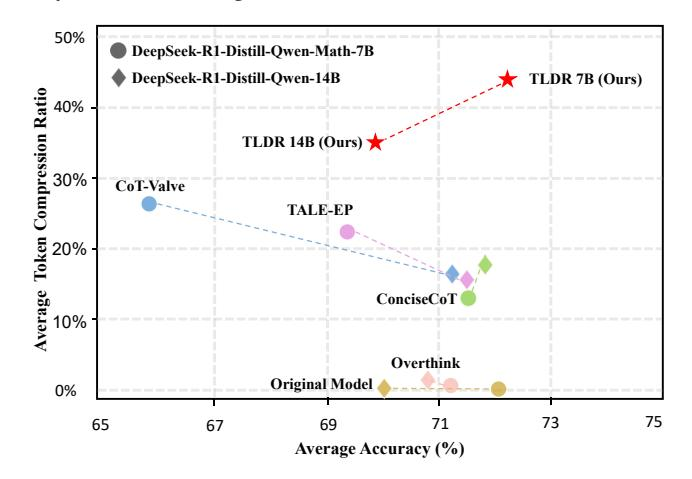

# TL;DR: Too Long, Do Re-weighting for Efficient LLM Reasoning Compression

Zhong-Zhi Li $^{\chi\pi*}$ , Xiao Liang $^{\rho\gamma*}$ , Zihao Tang $^{\phi}$ , Lei Ji $^{\phi}$ , Peijie Wang $^{\chi\pi}$ , Haotian Xu $^{\gamma}$ , Xing W $^{\pi}$ , Haizhen Huang $^{\phi}$ , Weiwei Deng $^{\phi}$ , Yeyun Gong $^{\phi}$ , Zhijiang Guo $^{\theta\beta}$ , Xiao Liu $^{\phi\dagger}$ , Fei Yin $^{\chi\pi}$ , Cheng-Lin Liu $^{\chi\pi\dagger}$  School of Artificial Intelligence, Chinese Academy of Sciences  $^{\pi}$ Institute of Automation, Chinese Academy of Sciences  $^{\rho}$ University of California, Los Angeles  $^{\gamma}$ Tsinghua University  $^{\phi}$ Microsoft  $^{\beta}$ Hong Kong University of Science and Technology (Guangzhou) https://github.com/zzli2022/TLDR

### **Abstract**

Large Language Models (LLMs) have recently achieved remarkable progress by leveraging Reinforcement Learning and extended Chain-of-Thought (CoT) techniques. However, the challenge of performing efficient language reasoning—especially during inference with extremely long outputs—has drawn increasing attention from the research community. In this work, we propose a dynamic ratio-based training pipeline that does not rely on sophisticated data annotations or interpolation between multiple models. We continuously balance the weights between the model's System-1 and System-2 data to eliminate redundant reasoning processes while preserving the model's reasoning capability. We validate our approach across models on DeepSeek-R1-Distill-7B and DeepSeek-R1-Distill-14B and on a diverse set of benchmarks with varying difficulty levels. Our method significantly reduces the number of output tokens by nearly 40% while maintaining the accuracy of the reasoning. Our code and data will be available soon.

> **[图片提取文字 (无描述)]:**
> 50% DeepSeek-R1-Distill-Qwen-Math-7B DeepSeek-R1-Distill-Qwen-14B TLDR 7B (Ours) Average Token Compression Ratio TLDR 14B (Ours) CoT-Valve TALE-EP ConciseCoT Overthink Original Model 0% 75 73 65 69 71 67 Average Accuracy (%)

Comparison of TLDR and baseline models in terms of average accuracy and token compression ratio. Higher values on both axes indicate better performance.

\*Equal contribution. Work done during internships at Microsoft.

 $^\dagger$ Correspondence to Zhijiang Guo, Xiao Liu and Cheng-Lin Liu.  $\boxtimes$ : zhijiangguo@hkust-gz.edu.cn; xiaoliu2@microsoft.com; liucl@nlpr.ia.ac.cn.

