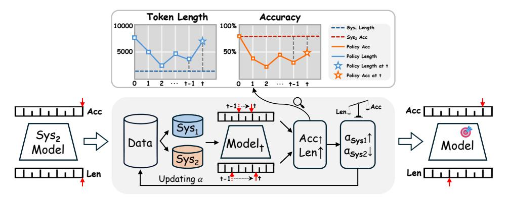

# 2 Rethinking Short-Long CoT in Thinking Compression

We first constructed the short CoT data using simple problems and recorded how, as training steps increased, this subset contributed to token compression and accuracy retention across datasets of varying difficulty in math benchmarks.

We find that short CoT thinking data for simple problems (System-1 data) can help compress the token usage across questions of various difficulty levels. We leverage the short-cut solutions obtained from simple questions in GSM8K to fine-tune the model and then observe the token compression rates and accuracy drop rates across four datasets, ranging from simple to difficult: GSM8K, MATH500, AMC, and AIME. As shown in Figure 1, directly fine-tuning the long CoT model with short CoT data achieves good length compression for both simple and complex problems. We were pleasantly surprised to see that this form of length compression generalizes well across

> **[图片提取文字 (无描述)]:**
> Token Length Accuracy 10000 100% --- Sys, Length - Sys2 Acc Policy Acc 5000 50% Policy Length Policy Length at t Policy Acc at t ··· t-1 t ··· t-1 t †-1<u>:</u>-><u>|</u>† Acc Acc Acc Sys1 Sys2  $\alpha_{\text{Sys}1} \uparrow$ Acc1 Data /Model+ Model Model Len1 asys2↓ Len Len Updating  $\alpha$ †-1 + 1 + 1 + 1 + 1 + 1 + 1 + 1 + 1 + 1 +

Figure 2: Overview of TLDR: Starting with a System-2 model, we iteratively update it on both Short-CoT and Long-CoT samples. The ratios of both data sources are adjusted every several steps based on the current average model accuracy and token length from the validation set until convergence.

questions of all difficulty levels, and that it maintains strong performance on simple questions. However, this approach comes at a cost, as it leads to a significant decrease in reasoning ability on difficult problems. As this portion of the data is derived from intuitive CoT reasoning on simple problems, we denote it as System-1 data. It seems that directly using short CoT fine-tuning can only encourage the reasoning LLM to retain its System 1 reasoning abilities, while its ability for System 2 reasoning—slow and cautious thinking for complex problems—is largely lost.

We find that long CoT thinking data for difficult problems (System-2 data) can help maintain the model's performance on challenging tasks, while simple question doesn't help much. We sample with the s1 [37] like hard question prompt and then blend the System-2 data into the previous System-1 thinking dataset at a fixed short CoT vs. long CoT ratio: 0.8:0.2. We then observe the token compression rates and accuracy drop rates across four datasets.

It is worth noting that, by contrast, when we mix more long CoT data from simpler questions, the model still experiences a significant drop in performance on difficult questions. Refer to the middle and bottom parts of Figure 1, where we mix the long CoT sampled from challenging problems with the short CoT from simple problems. As a baseline, we also mix long CoT and short CoT from simple problems. The long CoT from difficult problems achieves lower accuracy drop rates across different datasets while maintaining comparable token compression rates. We are unable to recover the original performance simply by using long CoT data from simple questions through data replay. Similar to the deliberate reasoning characteristic of the System-2 process on difficult problems, we refer to this part of the data as System-2 data.

A key question we directly address is whether a direct mixing ratio of the two types of data(System-1/2 data), can be employed for post-training the long CoT model, resulting in a solution that eliminates redundancy without compromising performance. Based on these observations, we propose a dynamic approach aimed at identifying the optimal Thinking Compression data.

