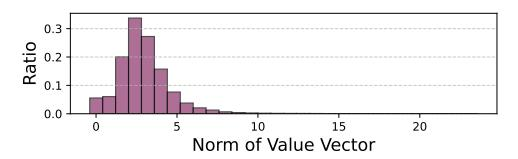
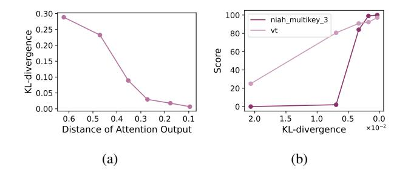
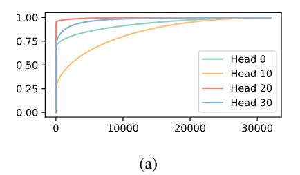
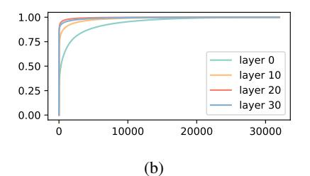
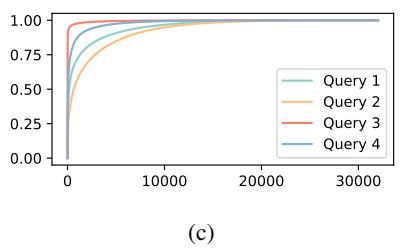
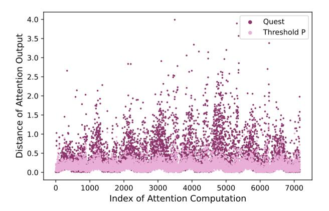

# 2. Background

#### 2.1. Large Language Models

LLMs consist of transformer blocks, each with an attention and a feed-forward module. In the attention module, input embeddings are projected into Query (Q), Key (K), and Value (V ) vectors. For a given Q vector, attention weights wi for the i-th token are computed as ( QK⊤ √ d )i , then normalized via softmax to obtain attention scores. These attention scores are multiplies by the V vectors to produce the output (Eq. [\(1\)](#page-2-1)). This result is then processed by the feed-forward module, with residual connections and layer normalization refining the final token representation.

> **[图片提取文字 (无描述)]:**
> Norm of Value Vector

Figure 2. The distribution of ||V|| across different layers, heads, and decoding tokens. The results indicate that ||V|| values are concentrated within a very narrow range.

$$O = \operatorname{softmax} \left( \exp \left( \frac{QK^{\top}}{\sqrt{d}} \right) \right) V \tag{1}$$

At the request level, LLM inference consists of two phases: the prefill phase and the decode phase. In the prefill phase, all input tokens are processed simultaneously to generate  $Q,\,K,\,$  and V vectors, with the K and V vectors stored in the KV-cache to avoid recomputation. In the decode phase, only the last generated token is processed, with its  $Q,\,K,\,$  and V vectors computed. The current Q vector interacts with the cached K and V vectors to generate the output.

Unlike prefill, the decode phase is executed for each generated token, making it the primary bottleneck in inference for many workloads. For instance, in summarization tasks with 64K-token input documents, generating just 1024 tokens can take up to four times longer than the prefill phase.

#### 2.2. Long-Context Models

The recent increasing demand for long-context models has driven advancements in extending the context window of LLMs. Techniques like Rotary Position Embeddings (Su et al., 2023) have enabled a significant expansion in context length, such as increasing LLaMA-2's context window to 32K in LongChat (Li et al., 2023) and 128K in Yarn-Llama-2 (Peng et al., 2023), and even 1 million recently (Liu et al., 2024b). However, as context length grows dramatically, loading the KV cache becomes an increasingly significant bottleneck during token generation, which can account for over half of the total decode time (Tang et al., 2024).

#### 3. Analysis

In this section, we first analyze the intrinsic sparsity in attention and how this sparsity affects downstream task performance (Sec. 3.1 & Sec. 3.2). We then present the drawbacks of existing fixed token budget approaches and propose cumulative attention score as the new target (Sec. 3.4 & Sec. 3.5). Finally, we illustrate the challenges of applying cumulative attention score and propose clustering and distribution-fitting techniques as the solution (Sec. 3.6 & Sec. 3.7).

> **[图片提取文字 (无描述)]:**
> 0.30 100 niah\_multikey\_3 0.25 0.20 0.15 0.10 0.05 vt 80 Score 60 40 0.10 20 0.05 -0.00 2.0 0.6 0.5 0.3 0.2 0.1 1.5 1.0 0.5 0.0 0.4  $\times 10^{-2}$ Distance of Attention Output KL-divergence a

Figure 3. Comparison of KL-Divergence with attention distance (a) and its relation with downstream task scores (b).

#### 3.1. Intrinsic Sparsity in Self-Attention Mechanisms

In the decode phase, for one request, assuming there are n previous tokens, the attention formula in Eq. (1) can be rewritten as

$$o = \sum_{i=1}^{n} s_i v_i, \ s_i = \frac{\exp(\frac{qk_i^{\top}}{\sqrt{d}})}{\sum_{i=1}^{n} \exp(\frac{qk_i^{\top}}{\sqrt{d}})}.$$
 (2)

Fig. 2 shows that the distribution of  $\|v_i\|$  for each token has a small variance. Thus, the contribution of the token is mostly determined by  $s_i$ . Due to the exponential term  $\exp(\frac{qk_i^{\mathsf{T}}}{\sqrt{d}})$ , only a small subset of tokens has a significant impact on the model output (Zhang et al., 2023; Xiao et al., 2023), indicating that the attention operation in LLMs is inherently sparse, which motivates the possibility of only loading a subset of tokens to approximate the attention output and incur lower computational overhead.

#### 3.2. Rethinking Attention Approximation

The sparse attention methods can be formulated as

$$\tilde{o}(I) = \sum_{i \in I} \tilde{s}_i v_i, \quad \tilde{s}_i = \frac{\exp(\frac{qk_i^\top}{\sqrt{d}})}{\sum_{i \in I} \exp(\frac{qk_i^\top}{\sqrt{d}})}$$
(3)

where I is the index set of tokens selected by the sparse attention method,  $I\subset [n]$ . The distance between o and  $\tilde{o}(I)$  can be formulated as

$$\epsilon(I) = \|o - \tilde{o}(I)\|. \tag{4}$$

Intuitively, a smaller distance between o and  $\tilde{o}(I)$  reduces the difference between the output token distributions of sparse attention and full attention. We demonstrate this by measuring the Kullback–Leibler (KL) divergence, a statistical metric that quantifies the difference between probability distributions, on the output logits as a function of attention distance. Fig. 3a shows that decreasing attention distance consistently lowers KL-divergence, meaning the sparse attention output more closely resembles the full attention

> **[图片提取文字 (无描述)]:**
> 1.00 0.75 Head 0 0.50 Head 10 0.25 Head 20 Head 30 0.00 10000 20000 30000

> **[图片提取文字 (无描述)]:**
> 1.00 -0.75 layer 0 0.50 layer 10 0.25 layer 20 layer 30 0.00 10000 20000 30000

> **[图片提取文字 (无描述)]:**
> 1.00 -0.75 -Query 1 0.50 Query 2 0.25 Query 3 Query 4 0.00 10000 20000 30000 (c)

Figure 4. Variation in sparsity across attention heads (a), model layers (b), and query tokens (c).

> **[图片提取文字 (无描述)]:**
> 4.0 Quest Threshold P 3.5 Distance of Attention Outpul 3.0 2.0 2.5 1.5 0.5 1.0 0.5 0.5 0.5 0.5 0.5 0.5 0.5 0.5 0.5 0 0.0 1000 3000 4000 5000 6000 7000 2000 Index of Attention Computation

Figure 5. Distance of attention output to full attention of Quest (Tang et al., 2024) and setting cumulative attention score threshold P, measured with Llama3.1-8B-Instruct model. Each dot represents the distance of one attention computation identified by (head index, layer index, decode step).

output. This alignment in token distributions also improves downstream task accuracy, as demonstrated in Fig. 3b for tasks in the RULER benchmark, which is widely used to assess the long-context abilities of a model.

Therefore, the goal of sparse attention is to find an index set I that minimizes  $\epsilon(I)$  under some constraint of |I|.

