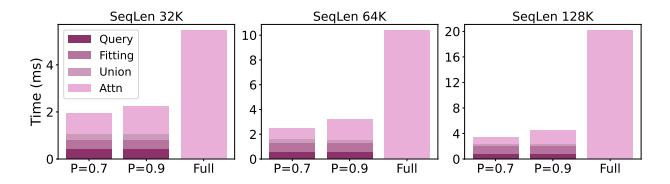
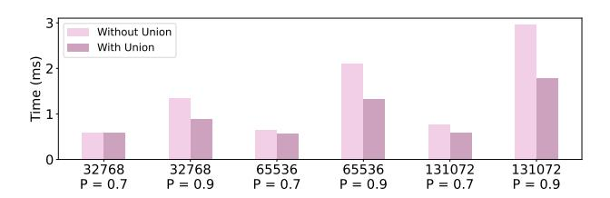
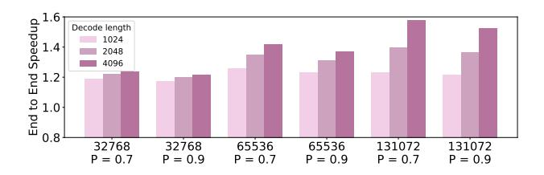

# 5.3. Efficiency Evaluation

We begin by analyzing the latency breakdown of Tactic, focusing on token clustering during the prefill phase and attention computation for critical tokens during decoding (Sec. [5.3.1\)](#page-8-2). Next, we evaluate Tactic's end-to-end perfor-

*Table 4.* Performance comparison on RULER. Each score is computed by averaging accuracy of all tasks in RULER.

| Methods                | Config | 16K  | 32K  | 64K  | 96K  | Avg. |
|------------------------|--------|------|------|------|------|------|
|                        |        | -    |      |      |      |      |
| Llama-3.1-8B-Instruct  | Full   | 91.3 | 86.0 | 85.2 | 85.0 | 86.8 |
| Tactic                 | 75%    | 90.9 | 85.5 | 83.4 | 78.9 | 84.7 |
| PyramidKV              | 75%    | 61.8 | 67.4 | 60.8 | 62.5 | 63.1 |
| Ada-SnapKV             | 75%    | 58.0 | 62.2 | 59.2 | 58.7 | 59.2 |
| Quest                  | 75%    | 70.0 | 71.5 | 69.7 | 65.7 | 69.2 |
| Tactic                 | 90%    | 90.3 | 84.9 | 82.8 | 80.5 | 84.6 |
| PyramidKV              | 90%    | 73.1 | 76.2 | 74.2 | 68.6 | 73.0 |
| Ada-SnapKV             | 90%    | 72.7 | 76.4 | 74.3 | 68.7 | 73.0 |
| Quest                  | 90%    | 85.8 | 81.9 | 79.8 | 70.5 | 79.5 |
| Mega-Beam-Mistral-512k | Full   | 90.9 | 88.4 | 82.7 | 83.1 | 86.3 |
| Tactic                 | 75%    | 88.0 | 88.8 | 81.7 | 82.5 | 85.2 |
| PyramidKV              | 75%    | 80.2 | 79.0 | 75.2 | 74.0 | 77.1 |
| Ada-SnapKV             | 75%    | 80.6 | 78.1 | 75.4 | 73.6 | 76.8 |
| Quest                  | 75%    | 80.7 | 79.0 | 71.4 | 70.5 | 75.4 |
| Tactic                 | 90%    | 90.3 | 88.0 | 81.0 | 82.6 | 85.4 |
| PyramidKV              | 90%    | 84.3 | 82.7 | 76.2 | 86.2 | 82.4 |
| Ada-SnapKV             | 90%    | 84.7 | 81.8 | 76.2 | 87.1 | 82.4 |
| Quest                  | 90%    | 81.1 | 81.3 | 73.5 | 79.7 | 78.9 |

> **[图片提取文字 (无描述)]:**
> SegLen 32K SegLen 64K SegLen 128K 20 10-Query 16 Fitting Time (ms) 8 Union 12-6 Attn 4 P=0.7 P = 0.7Full P = 0.7P=0.9 P = 0.9Full P = 0.9Full

Figure 10. Latency breakdown of Tactic in the attention of decode stage for different sequence lengths and different thresholds.

mance and its speed-up relative to full attention (Sec. 5.3.3).

#### 5.3.1. LATENCY BREAKDOWN

Latency of clustering during prefill. We measure the time taken clustering for different sequence lengths in Tab. 6. We divide the clustering time into two steps. The first step is called distance calculation, where each K-vector computes its distance from the cluster centroids and assigns itself to the nearest cluster. The second step is called cluster update, where the centroids are updated based on the distances of K-vectors in the cluster.

We observe that, as the sequence length increases, the clustering time increases quadratically and is dominated by the distance calculation. However, large sequences also significantly increase the prefill time. Overall, across different sequence lengths, the clustering time always stays below 6% of the prefill time.

Latency of attention during decode. In the decode stage, Tactic identifies and performs attention on critical tokens. We break down this process into four parts: 1) Cluster sorting, where the clusters are ranked based on the dot product of centroids and queries, 2) Distribution fitting, where Tactic samples a small portion of tokens and derives the attention score to identify the token budget for each attention head, 3)

*Table 5.* Average number of tokens selected by Tactic for different tasks, context lengths, cumulative attention scores and models.

|                 |      |       | na-3.1-8 | B-Instr  |       |      |       |       |
|-----------------|------|-------|----------|----------|-------|------|-------|-------|
| Task            | 16   | δK    | 32K      |          | 64    | K    | 96K   |       |
|                 | 75%  | 90%   | 75%      | 90%      | 75%   | 90%  | 75%   | 90%   |
| NIAH_Single 1   | 166  | 813   | 363      | 1567     | 456   | 2404 | 1790  | 3319  |
| NIAH_Single 2   | 271  | 1289  | 534      | 2196     | 711   | 3209 | 2030  | 3940  |
| NIAH_Single 3   | 171  | 1015  | 369      | 1820     | 507   | 3031 | 1068  | 3952  |
| NIAH_Multikey 1 | 224  | 1052  | 449      | 1832     | 654   | 2792 | 978   | 4438  |
| NIAH_Multikey 2 | 399  | 1612  | 706      | 2533     | 981   | 3902 | 1405  | 5527  |
| NIAH_Multikey 3 | 340  | 1428  | 567      | 2404     | 798   | 3990 | 1068  | 5062  |
| NIAH_Multivalue | 246  | 1769  | 478      | 2679     | 692   | 4458 | 1025  | 8147  |
| NIAH_Multiquery | 253  | 1524  | 465      | 2648     | 681   | 4830 | 915   | 6011  |
| FWE             | 282  | 1572  | 515      | 2693     | 778   | 4376 | 963   | 6202  |
| CWE             | 443  | 1939  | 570      | 3036     | 655   | 4707 | 780   | 6731  |
| QA 1            | 329  | 1250  | 704      | 2565     | 852   | 3830 | 3417  | 5055  |
| QA 2            | 547  | 1484  | 1092     | 2263     | 1662  | 3455 | 2120  | 4276  |
| VT              | 118  | 731   | 253      | 1413     | 269   | 2028 | 404   | 3068  |
|                 |      | MegaB | eam-Mi   | stral-7B | -512K |      |       |       |
| Task 16K        |      |       | 32K      |          | 64K   |      | 96K   |       |
|                 | 75%  | 90%   | 75%      | 90%      | 75%   | 90%  | 75%   | 90%   |
| NIAH_Single 1   | 1410 | 1176  | 2521     | 2354     | 4715  | 4512 | 7042  | 7271  |
| NIAH_Single 2   | 1418 | 1665  | 2704     | 3364     | 5113  | 6732 | 7668  | 10472 |
| NIAH_Single 3   | 3005 | 2032  | 5312     | 3800     | 10235 | 7327 | 15492 | 11090 |
| NIAH_Multikey 1 | 1486 | 1661  | 2872     | 3415     | 5332  | 5983 | 7781  | 8767  |
| NIAH_Multikey 2 | 1480 | 1639  | 2826     | 3031     | 5288  | 5956 | 8240  | 9279  |
| NIAH_Multikey 3 | 2840 | 2039  | 5990     | 4306     | 11438 | 7741 | 17088 | 11292 |
| NIAH_Multivalue | 2880 | 2225  | 5070     | 4006     | 10180 | 7463 | 16138 | 11853 |
| NIAH_Multiquery | 3088 | 2165  | 5234     | 4075     | 9931  | 7551 | 14420 | 11164 |
| FWE             | 2706 | 1809  | 5537     | 3685     | 10837 | 7157 | 16558 | 10818 |
| CWE             | 4240 | 2526  | 7404     | 4869     | 13189 | 8802 | 18329 | 13215 |
| QA 1            | 1003 | 1502  | 2772     | 3132     | 5828  | 5685 | 6007  | 9150  |
| QA 2            | 724  | 1718  | 2124     | 3017     | 4853  | 6520 | 8598  | 8598  |
| VT              | 2227 | 1409  | 4132     | 2619     | 8667  | 4719 | 14318 | 8671  |

*Table 6.* Comparison of clustering time and prefill time. Getting distance between K-vectors and cluster centroid dominates the clustering time. For all sequence lengths, clustering overhead is negligible compared to prefill.

| SeqLen | Get Distance (s) | Update (s) | Prefill (s) |  |  |
|--------|------------------|------------|-------------|--|--|
| 32768  | 0.15             | 0.01       | 5.66        |  |  |
| 65536  | 0.61             | 0.01       | 15.80       |  |  |
| 131072 | 2.72             | 0.02       | 49.53       |  |  |

performing attention for the selected tokens. Fig. 10 shows the latency of this breakdown for different sequence lengths.

The latency of sparse attention during decode is reduced significantly, while the overheads of sorting and distribution fitting remain low across various sequence lengths. Overall, Tactic achieves up to  $7.29\times$  speedup compared to the full attention.

#### 5.3.2. Ablation Study for Query Head Union

We evaluate the benefits of taking the union of grouped query heads versus computing attention for each query head individually. As shown in Fig. 11 Across different context lengths and ratio P, taking unions can achieve up to  $1.65\times$  attention speedup, due to the reduced memory loading.

#### 5.3.3. END-TO-END PERFORMANCE

We compute the end-to-end performance of Tactic with different output tokens, sequence lengths, and ratios in Fig. 12 considering the prefill stages and the clustering overhead.

> **[图片提取文字 (无描述)]:**
> Without Union With Union Time (ms) 32768 32768 65536 65536 131072 131072 P = 0.7P = 0.9P = 0.7P = 0.9P = 0.7P = 0.9

Figure 11. Ablation study on taking union for the GQA model. Taking union significantly reduce the attention time.

> **[图片提取文字 (无描述)]:**
> Speedup 1.4 Decode length 1024 2048 4096 End to End 1.0 32768 65536 65536 32768 131072 131072 P = 0.9P = 0.7P = 0.9P = 0.7P = 0.9P = 0.7

Figure 12. End-to-end speedup of Tactic compared to the full attention.

Overall, Tactic achieves a speedup up to  $1.58 \times$  compared to full attention.

#### 6. Conclusion

We presented Tactic, a sparsity-adaptive attention mechanism for efficient long-context LLM inference. Unlike fixed token budget methods, Tactic dynamically selects tokens based on cumulative attention scores, adapting to variations in attention sparsity. By leveraging clustering-based sorting and distribution fitting, Tactic accurately estimates token importance with low overhead. Our results showed that Tactic outperforms existing sparse attention methods, achieving higher accuracy and significant inference speedups, making it a practical solution for long-context LLMs.

#### References

Ainslie, J., Lee-Thorp, J., de Jong, M., Zemlyanskiy, Y., Lebrón, F., and Sanghai, S. Gqa: Training generalized multi-query transformer models from multi-head checkpoints, 2023.

Bai, Y., Lv, X., Zhang, J., Lyu, H., Tang, J., Huang, Z., Du, Z., Liu, X., Zeng, A., Hou, L., Dong, Y., Tang, J., and Li, J. LongBench: A bilingual, multitask benchmark for long context understanding. In Ku, L.-W., Martins, A., and Srikumar, V. (eds.), *Proceedings of the 62nd Annual Meeting of the Association for Computational Linguistics (Volume 1: Long Papers)*, pp. 3119–3137, Bangkok, Thailand, August 2024. Association for Computational Linguistics. doi: 10.18653/v1/2024.acl-long.172. URL https://aclanthology.org/2024.acl-long.172.

Cai, Z., Zhang, Y., Gao, B., Liu, Y., Liu, T., Lu, K., Xiong, W., Dong, Y., Chang, B., Hu, J., and Xiao, W. Pyramidkv: Dynamic kv cache compression based on pyramidal information funneling, 2024. URL https://arxiv.org/abs/2406.02069.

Chen Wu and Yin Song and Eden Duthie. aws-prototyping/MegaBeam-Mistral-7B-512k, 2024.

URL https://huggingface.co/aws-prototyping/MegaBeam-Mistral-7B-512k.

Dasigi, P., Lo, K., Beltagy, I., Cohan, A., Smith, N. A., and Gardner, M. A dataset of information-seeking questions and answers anchored in research papers. In Toutanova, K., Rumshisky, A., Zettlemoyer, L., Hakkani-Tur, D., Beltagy, I., Bethard, S., Cotterell, R., Chakraborty, T., and Zhou, Y. (eds.), *Proceedings of the 2021 Conference of the North American Chapter of the Association for Computational Linguistics: Human Language Technologies*, pp. 4599–4610, Online, June 2021. Association for Computational Linguistics. doi: 10.18653/v1/2021.naaclmain.365. URL https://aclanthology.org/2021.naacl-main.365.

Dubey, A., Jauhri, A., Pandey, A., Kadian, A., Al-Dahle, A., Letman, A., Mathur, A., Schelten, A., Yang, A., Fan, A., et al. The llama 3 herd of models. *arXiv preprint arXiv:2407.21783*, 2024.

Feng, Y., Lv, J., Cao, Y., Xie, X., and Zhou, S. K. Adakv: Optimizing kv cache eviction by adaptive budget allocation for efficient llm inference, 2024. URL https://arxiv.org/abs/2407.11550.

Ge, S., Zhang, Y., Liu, L., Zhang, M., Han, J., and Gao, J. Model tells you what to discard: Adaptive kv cache compression for llms, 2024. URL https://arxiv.org/abs/2310.01801.

Grattafiori, A., Dubey, A., Jauhri, A., Pandey, A., Kadian, A., Al-Dahle, A., Letman, A., Mathur, A., Schelten, A., Vaughan, A., Yang, A., Fan, A., Goyal, A., Hartshorn, A., Yang, A., Mitra, A., Sravankumar, A., Korenev, A., Hinsvark, A., Rao, A., Zhang, A., Rodriguez, A., Gregerson, A., Spataru, A., Roziere, B., Biron, B., Tang, B., Chern, B., Caucheteux, C., Nayak, C., Bi, C., Marra, C., et al. The llama 3 herd of models, 2024. URL https://arxiv.org/abs/2407.21783.

Hsieh, C.-P., Sun, S., Kriman, S., Acharya, S., Rekesh, D., Jia, F., Zhang, Y., and Ginsburg, B. Ruler: What's the real context size of your long-context language models?, 2024. URL https://arxiv.org/abs/2404.06654.

Joshi, M., Choi, E., Weld, D., and Zettlemoyer, L. TriviaQA: A large scale distantly supervised challenge dataset for reading comprehension. In Barzilay, R. and Kan,

- M.-Y. (eds.), *Proceedings of the 55th Annual Meeting of the Association for Computational Linguistics (Volume 1: Long Papers)*, pp. 1601–1611, Vancouver, Canada, July 2017. Association for Computational Linguistics. doi: 10.18653/v1/P17-1147. URL [https:](https://aclanthology.org/P17-1147) [//aclanthology.org/P17-1147](https://aclanthology.org/P17-1147).
- Kocisk ˇ y, T., Schwarz, J., Blunsom, P., Dyer, C., Her- ´ mann, K. M., Melis, G., and Grefenstette, E. The NarrativeQA reading comprehension challenge. *Transactions of the Association for Computational Linguistics*, 6:317–328, 2018. doi: 10.1162/tacl a 00023. URL <https://aclanthology.org/Q18-1023>.
- Li, D., Shao, R., Xie, A., Sheng, Y., Zheng, L., Gonzalez, J. E., Stoica, I., Ma, X., and Zhang, H. How long can open-source llms truly promise on context length?, June 2023. URL [https://lmsys.org/blog/2023-](https://lmsys.org/blog/2023-06-29-longchat) [06-29-longchat](https://lmsys.org/blog/2023-06-29-longchat).
- Liu, G., Li, C., Zhao, J., Zhang, C., and Guo, M. Clusterkv: Manipulating llm kv cache in semantic space for recallable compression, 2024a. URL [https://arxiv.](https://arxiv.org/abs/2412.03213) [org/abs/2412.03213](https://arxiv.org/abs/2412.03213).
- Liu, X., Yan, H., Zhang, S., An, C., Qiu, X., and Lin, D. Scaling laws of rope-based extrapolation, 2024b. URL <https://arxiv.org/abs/2310.05209>.
- Peng, B., Quesnelle, J., Fan, H., and Shippole, E. Yarn: Efficient context window extension of large language models, 2023.
- Rae, J. W., Potapenko, A., Jayakumar, S. M., and Lillicrap, T. P. Compressive transformers for long-range sequence modelling, 2019. URL [https://arxiv.org/abs/](https://arxiv.org/abs/1911.05507) [1911.05507](https://arxiv.org/abs/1911.05507).
- Su, J., Lu, Y., Pan, S., Murtadha, A., Wen, B., and Liu, Y. Roformer: Enhanced transformer with rotary position embedding, 2023. URL [https://arxiv.org/abs/](https://arxiv.org/abs/2104.09864) [2104.09864](https://arxiv.org/abs/2104.09864).
- Tang, J., Zhao, Y., Zhu, K., Xiao, G., Kasikci, B., and Han, S. Quest: Query-aware sparsity for efficient longcontext llm inference, 2024. URL [https://arxiv.](https://arxiv.org/abs/2406.10774) [org/abs/2406.10774](https://arxiv.org/abs/2406.10774).
- Xiao, G., Tian, Y., Chen, B., Han, S., and Lewis, M. Efficient streaming language models with attention sinks. *arXiv*, 2023.
- Yang, Z., Qi, P., Zhang, S., Bengio, Y., Cohen, W., Salakhutdinov, R., and Manning, C. D. HotpotQA: A dataset for diverse, explainable multi-hop question answering. In Riloff, E., Chiang, D., Hockenmaier, J.,

- and Tsujii, J. (eds.), *Proceedings of the 2018 Conference on Empirical Methods in Natural Language Processing*, pp. 2369–2380, Brussels, Belgium, October-November 2018. Association for Computational Linguistics. doi: 10.18653/v1/D18-1259. URL [https:](https://aclanthology.org/D18-1259) [//aclanthology.org/D18-1259](https://aclanthology.org/D18-1259).
- Ye, Z., Chen, L., Lai, R., Lin, W., Zhang, Y., Wang, S., Chen, T., Kasikci, B., Grover, V., Krishnamurthy, A., and Ceze, L. Flashinfer: Efficient and customizable attention engine for llm inference serving. *arXiv preprint arXiv:2501.01005*, 2025. URL [https://](https://arxiv.org/abs/2501.01005) [arxiv.org/abs/2501.01005](https://arxiv.org/abs/2501.01005).
- Zhang, Z., Sheng, Y., Zhou, T., Chen, T., Zheng, L., Cai, R., Song, Z., Tian, Y., Re, C., Barrett, C., Wang, Z., and ´ Chen, B. H2o: Heavy-hitter oracle for efficient generative inference of large language models, 2023.

