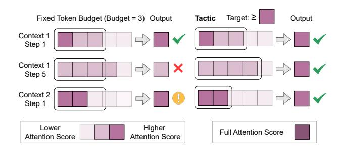

# Tactic: Adaptive Sparse Attention with Clustering and Distribution Fitting for Long-Context LLMs

Kan Zhu $^{*\,1}$  Tian Tang $^{*\,1\,2}$  Qinyu Xu $^{*\,1\,2}$  Yile Gu $^1$  Zhichen Zeng $^1$  Rohan Kadekodi $^1$  Liangyu Zhao  $^1$  Ang Li $^1$  Arvind Krishnamurthy $^1$  Baris Kasikci $^1$ 

#### **Abstract**

Long-context models are essential for many applications but face inefficiencies in loading large KV caches during decoding. Prior methods enforce fixed token budgets for sparse attention, assuming a set number of tokens can approximate full attention. However, these methods overlook variations in the importance of attention across heads, layers, and contexts.

To address these limitations, we propose Tactic, a sparsity-adaptive and calibration-free sparse attention mechanism that dynamically selects tokens based on their cumulative attention scores rather than a fixed token budget. By setting a target fraction of total attention scores, Tactic ensures that token selection naturally adapts to variations in attention sparsity. To efficiently approximate this selection, Tactic leverages clustering-based sorting and distribution fitting, allowing it to accurately estimate token importance with minimal computational overhead.

We show that Tactic outperforms existing sparse attention algorithms, achieving superior accuracy and up to  $7.29\times$  decode attention speedup. This improvement translates to an overall  $1.58\times$  end-to-end inference speedup, making Tactic a practical and effective solution for long-context LLM inference in accuracy-sensitive applications.

#### 1. Introduction

Large language models (LLMs) power a wide range of applications, from conversational assistants to document analysis systems and search engines. The demand for multiturn interactions and long-document processing has driven an expansion of context length, growing from thousands to

> **[图片提取文字 (无描述)]:**
> Target: ≥ Fixed Token Budget (Budget = 3) Output Tactic Output Context 1 Step 1 Context 1 Step 5 Context 2 Step 1 Higher Lower Full Attention Score Attention Score Attention Score

Figure 1. Comparison between fixed-budget-based methods and Tactic. Fixed-budget-based methods may select excessive tokens or have a large difference from full attention score. In contrast, Tactic dynamically selects tokens to efficiently approximate full attention based on a cumulative attention score, considering variation of sparsity across different query tokens and contexts.

as many as one million tokens (Liu et al., 2024b).

However, supporting long contexts in LLM inference presents significant challenges, primarily due to the growing memory footprint of the Key-Value (KV) cache (Tang et al., 2024). The memory requirements of the KV cache scale proportionally with the context length, therefore, it can quickly become a bottleneck despite optimizations such as Grouped-Query Attention (GQA) (Ainslie et al., 2023). Furthermore, the need to repeatedly load the KV cache for every generated token becomes a bottleneck. For instance, loading the large KV cache can account for over 50% of the total latency during auto-regressive decoding, significantly impeding the efficiency of large-scale serving systems. (Tang et al., 2024)

To mitigate the high cost of KV-cache loading, recent methods approximate full attention by selecting a subset of stored Key and Value vectors, corresponding to a subset of tokens, within a fixed token budget (Liu et al., 2024a; Tang et al., 2024; Zhang et al., 2023; Xiao et al., 2023). These approaches exploit the natural sparsity of attention, where only a small fraction of tokens significantly influence the output due to the softmax operation. By leveraging this sparsity, they aim to reduce the overhead of loading the KV-cache without sacrificing model accuracy.

Alas, existing fixed budget-based methods have several

\*Equal contribution 1University of Washington 2Tsinghua University. Correspondence to: Baris Kasikci   <baris@cs.washington.edu>.

shortcomings. Some methods employ a global fixed token budget [\(Tang et al.,](#page-10-1) [2024;](#page-10-1) [Xiao et al.,](#page-10-4) [2023;](#page-10-4) [Zhang](#page-10-3) [et al.,](#page-10-3) [2023\)](#page-10-3), not accounting for variations in attention sparsity across attention heads, and layers. In practice, some attention heads focus on significantly more tokens than others, and the level of sparsity fluctuates across layers. More adaptive methods [\(Cai et al.,](#page-9-1) [2024;](#page-9-1) [Feng et al.,](#page-9-2) [2024;](#page-9-2) [Ge](#page-9-3) [et al.,](#page-9-3) [2024\)](#page-9-3) attempt to distribute token budgets more effectively using calibration data or predefined rules, but they remain constrained by static allocation and cannot adapt to query tokens and contexts, often leading to suboptimal approximations in different cases.

To address the limitations of fixed-budget-based methods, we propose Tactic, a sparsity-adaptive and calibration-free post-training sparse attention mechanism that improves both the accuracy and efficiency of long-context LLM inference. Fig. [1](#page-0-0) shows a comparison between existing fixed budgetbased methods and Tactic. Instead of enforcing a fixed budget, Tactic dynamically selects tokens starting from ones with the highest attention score to ensure that their cumulative attention scores (where attention score represents the softmax output of the Query-Key product) reach a target fraction of the full attention score.

Dynamic and selective accumulation of attention scores offers two key advantages. First, it provides inherent flexibility—Tactic selects fewer tokens in high-sparsity cases and more in low-sparsity cases without requiring calibration. Second, since attention scores are multiplied by V vectors with similar norms, and the selected attention scores cumulatively reach at least a fraction of the total attention score, a cumulative attention score target guarantees, unlike token budgets in prior works, a bounded difference between sparse and full attention (see Sec. [3.2](#page-2-0) and App. [A\)](#page-11-0).

However, efficiently selecting tokens to reach a certain fraction P of cumulative attention score is challenging. To minimize the number of tokens selected (i.e., loads from memory), the optimal way is to select tokens following a descending order of attention score until the cumulative attention score surpasses P. Thus, similar to prior works, efficiently sorting tokens by their contribution to the cumulative attention score is crucial for Tactic. However, unlike fixed budget-based methods that simply stop at a fixed token count, Tactic must track cumulative attention score in real time, requiring the exact attention score values for each token, making the selection process more complex.

To approximate optimal token selection, Tactic introduces two key techniques: clustering and distribution fitting. First, to efficiently sort tokens, Tactic clusters similar tokens to reduce computational overhead. However, we observe that positional proximity, which is used for clustering tokens by prior work [\(Tang et al.,](#page-10-1) [2024\)](#page-10-1), does not necessarily guarantee similarity in Key vectors, which are fundamental to

attention computation. Since attention operates on Query-Key interactions rather than token positions, Tactic groups tokens using K-means clustering based on Key-vector similarity (i.e., vector distance). During decoding, Tactic approximates the sorted list of tokens by sorting clusters based on the similarity between Query vectors and cluster centroids. After approximating token sorting, Tactic estimates the attention score for each token by leveraging the observation that attention scores follow a smooth distribution. Using distribution fitting, Tactic effectively keep track of attained cumulative attention score to determine the end of selection.

By loading only the cluster centroids along with a small sampled subset of tokens (∼ 2.5% of the KV cache size in practice), Tactic efficiently selects the most critical tokens that reach the target cumulative attention score. To balance efficiency and accuracy, Tactic performs full attention on newly generated tokens and updates the clustering every fixed number of decoding steps (e.g., 2048).

Our experiments show that Tactic achieves superior and consistent accuracy compared to existing algorithms including Quest [\(Tang et al.,](#page-10-1) [2024\)](#page-10-1), PyramidKV [\(Cai et al.,](#page-9-1) [2024\)](#page-9-1) and Ada-KV [\(Feng et al.,](#page-9-2) [2024\)](#page-9-2), offering a more effective solution for long-context LLM inference in accuracy-sensitive applications. Tactic achieves up to 7.29× decode attention speedup, which leads to 1.58× end-to-end speedup.

In summary, we contribute the following:

- A detailed analysis of the dynamic nature of attention sparsity across heads, layers, queries, and contexts.
- Tactic, a sparsity-adaptive attention algorithm that uses clustering and distribution fitting to dynamically determine the token budget for achieving cumulative attention score targets.
- A comprehensive evaluation of Tactic, demonstrating Tactic consistently achieves high accuracy and significant speedup.

