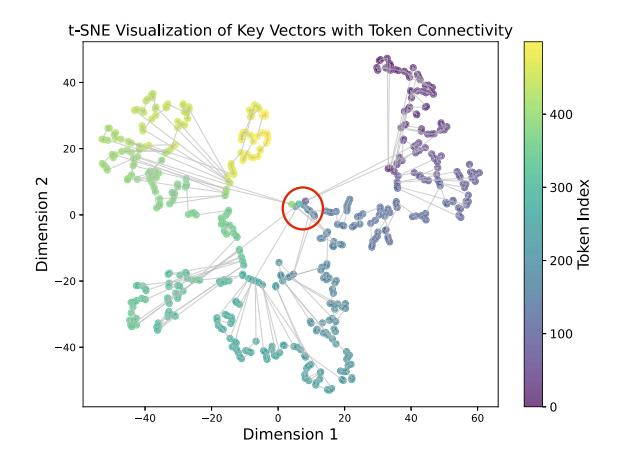

# 3.4. Cumulative Attention Score: A More Robust Target for Sparse Attention

The key drawback of existing work is the reliance on a fixed total token budget, making it hard to adapt to sparsity variations. Instead, we propose directly using the cumulative attention score of tokens in I to guide token selection.

Specifically, we define p(I) as the cumulative attention score of tokens in I, which is

$$p(I) = \sum_{i \in I} s_i = \frac{\sum_{i \in I} \exp(\frac{qk_i^\top}{\sqrt{d}})}{\sum_{i=1}^n \exp(\frac{qk_i^\top}{\sqrt{d}})}$$
 (5)

These cumulative attention score targets offer two key advantages over fixed token budgets. First, they inherently adapt to sparsity variations without requiring assumptions or calibration data. Less sparse heads, layers, query tokens, and contexts naturally require more tokens to reach a given cumulative attention score than sparser ones. Second, targeting cumulative attention score provides a theoretical guarantee on attention distance. Specifically, the attention distance is bounded by

$$\epsilon(I) \le 2(1 - p(I)) \max_{i} ||v_i||. \tag{6}$$

A detailed proof is provided in App. [A.](#page-11-0) Since value vectors V have similar norms across tokens (Fig. [2\)](#page-2-3) , setting a threshold P (typically close to 1.0) for p(I) establishes a tight upper bound on ϵ(I). Identifying the minimal index set I that satisfies p(I) ≥ P reduces the variance of the attention approximation error, as shown in Fig. [5.](#page-3-1) This improved attention distance approximation directly enhances downstream task performance, as demonstrated in Sec. [3.2](#page-2-0) .

## 3.5. Challenges of Attaining Cumulative Attention Scores

Identifying the minimal subset of tokens that achieve a target cumulative attention score is a challenging task. The optimal way is to select tokens following a descending order of attention score until the cumulative attention score surpasses the target value. Therefore, like prior approaches, Tactic must rank tokens by attention score to minimize the number of tokens needed to reach the desired cumulative attention score. However, unlike previous methods, Tactic also requires the attention score values for each token to track the cumulative sum of selected tokens in real-time. This process involves two key components: (1) computing the sum of attention intermediate values, exp(qk⊤/ √ d), for the selected token set I, and (2) computing the total sum of exp(qk⊤/ √ d) used for normalization. Additionally, this estimation must be computationally efficient, as it lies on the critical path during decoding.

#### 3.6. Sorting Tokens via Clustering

Similar to prior works, Tactic groups tokens to reduce computational overhead. However, existing methods rely on positional order, assuming consecutive tokens share similar attention patterns [\(Tang et al.,](#page-10-1) [2024\)](#page-10-1). As shown in Fig. [6,](#page-4-3) this is suboptimal since Key vectors of consecutive tokens are often scattered in the embedding space, meaning positional proximity does not imply similarity in attention behavior. Moreover, modern attention kernels efficiently handle non-contiguous KV-cache access, making positional grouping unnecessary. Instead, Tactic applies K-means clustering to group tokens based on Key-vector similarity, then ranks them using the dot product between Query vectors and cluster centroids, ensuring selection aligns with actual attention behavior.

The runtime performance overhead of cluster-based sorting is 1 2×Average Cluster Size , compared to full attention[1](#page-4-4) , which in practice is below 2%.

> **[图片提取文字 (无描述)]:**
> t-SNE Visualization of Key Vectors with Token Connectivity 40 -400 20 -Token Index Dimension 2 0. -20 -100 -40 -40 -20 20 60 -40 Dimension 1

Figure 6. t-SNE visualization of 500 Key vectors. Consecutive tokens are connected by lines. There are significant jumps and discontinuities even if tokens are consecutive. This indicates that adjacent tokens may not have similar K-vectors. Nonetheless, at the center of the figure (circled), K-vectors from different segments of the text show high similarity.

We validate the results of clustering by showing the ground truth attention score of tokens after sorting them based on clustering and estimation in Fig. [7.](#page-5-0) Despite rare spikes, clustering-based sorting gives a high-fidelity approximation of full attention-based token ordering.

### 3.7. Estimating Attention Score via Distribution Fitting

While clustering effectively sorts tokens by attention score, it introduces large errors when estimating absolute attention score values. This occurs because the cluster centroid represents the center of tokens, but due to non-linearity, its attention score does not accurately reflect the average attention score of individual tokens. Thus, Tactic requires a more precise approach to estimating attention score. We observe that after partial sorting, the attention score distribution follows a consistent pattern across heads, layers, and contexts. For example, as shown in Fig. [7,](#page-5-0) the attention score is high for a few tokens and then smoothly decreases, forming a long-tail distribution. This structure suggests that function fitting can be used to estimate attention score. Despite outliers at the beginning of the curve, sampling tokens along the distribution allows accurate parameter estimation, enabling precise attention score predictions.

