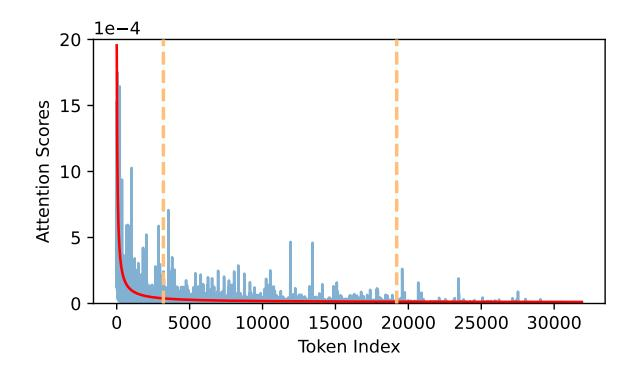
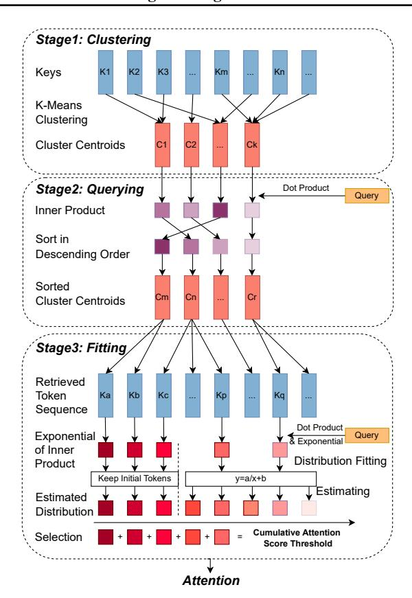
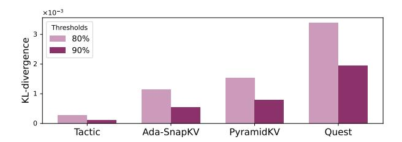

# 4. Methodology

## 4.1. Algorithm Overview

Fig. [8](#page-5-1) provides an overview of Tactic's workflow. During prefill, Tactic performs K-means clustering on key vectors to group similar tokens. During decode, Tactic ranks tokens based on the dot product between cluster centroids and

1The term 2 comes from clustering being only performed on K-cache, while the KV cache is twice as large as K-cache.

> **[图片提取文字 (无描述)]:**
> 1e-4 20 -Attention Scores 15000 20000 Token Index

Figure 7. The distribution of attention scores after cluster-based sorting for one request in PG19 dataset using Llama3.1-8B-Instruct model. Despite some variations, the overall trend closely aligns with the function  $y = \frac{a}{x} + b$ .

the current query vector. Tactic then models the distribution of attention score with a fitted curve and determines the tokens to meet the desired cumulative attention score threshold. After token selection, Tactic handles the Group Query Attention (GQA) and then performs the attention using FlashInfer (Ye et al., 2025).

#### 4.2. Clustering

To organize tokens for efficient sorting, Tactic performs K-means clustering on the key vectors for each head in every layer during the prefill phase. We empirically choose the average cluster size to be 32 to balance accuracy and efficiency. Clustering begins by randomly sampling SeqLen/Average cluster size data points as the initial cluster centroids. In each iteration, the distance between K-vectors and centroids is computed and the token will be assigned to the nearest cluster. After the assignment step, the centroids are updated as the mean of the key vectors assigned to each cluster. This process repeats until convergence or until a maximum of 10 iterations is reached3.

#### 4.3. Querying

Once the tokens are organized into clusters, Tactic identifies critical clusters for a given query vector Q in the decode phase. The criticality of each cluster is determined by the dot product between Q and each cluster centroid4. This process produces a sequence of clusters sorted by the criticality, from which we can derive a partially sorted token list.

> **[图片提取文字 (无描述)]:**
> Stage1: Clustering Keys K1 K2 КЗ Km Kn K-Means Clustering Cluster Centroids Ck Stage2: Querying Dot Product Query Inner Product Sort in Descending Order Sorted Cluster Centroids Stage3: Fitting Retrieved Token Ka Kb Kc Kp Kq Sequence Dot Product Exponential Query & Exponential of Inner Distribution Fitting Product Keep Initial Tokens y=a/x+b Estimating Estimated Distribution **Cumulative Attention** Selection Score Threshold Attention

Figure 8. The overall workflow of Tactic. Tactic operates in three stages to achieve low overhead adaptive sparse attention.

#### 4.4. Fitting Attention Score Distribution

The next step of Tactic is to determine the token budget required to meet the cumulative attention score. Tactic models the distribution of the exponential values of the dot products  $(\exp(\frac{QK^{\top}}{\sqrt{d}}))$  for each token using a lightweight function  $y=\frac{a}{x}+b$ , where a and b are parameters to be determined and x is the position in the sorted list of tokens. To estimate these parameters, we select two segments of the tokens in the middle of the curve (e.g., 10% and 60% of all the tokens), and calculate the average of tokens within each segment (as labeled in Fig. 7). Using these two data points, we can solve for a and b, which provides an estimation of attention score for all tokens.

However, initial tokens are often outliers and cannot be accurately described by the curve. Moreover, these tokens feature high attention score, and thus a bad estimation would cause high deviations of estimated cumulative attention score which affects the accuracy of Tactic. Luckily, we observed that this only happens within 1-2% of total tokens. Therefore, Tactic directly calculates the exponential values of the dot products for these tokens. A detailed description of the Distribution Fitting stage is provided in Alg. 1.

&lt;sup>2Note that neither multiple initializations nor K-Means ++ initialization drastically improves the clustering quality, and in fact leads to high-performance overhead.

&lt;sup>3More iterations do not improve the quality of clustering.

&lt;sup>4Compared to distance, dot product directly relates to the attention score, which is more accurate.

#### 4.5. Taking Union for Group Query Attention models

Modern models use Grouped Query Attention (GQA) to reduce the KV cache size (Dubey et al., 2024), where multiple query heads share a single KV head. However, loading KV heads separately for each query head is inefficient. To optimize this, query heads within the same group are batched. A challenge arises when using sparse attention, as different query heads may select to attend to different KV tokens. Finding the minimal set of KV tokens that satisfies the cumulative attention scores (attention score) across all query heads is NP-hard. To address this, Tactic simplifies the problem by taking the union of selected tokens across all query heads and loading them at once, ensuring that each head retains the KV tokens it requires to perform attention while reducing repetitive loading.

#### 4.6. Attention on Selected Tokens

Finally, Tactic performs actual attention for selected tokens using FlashInfer (Ye et al., 2025). Notably, variations in sparsity across different heads cause an imbalanced attention workload. Traditional implementations primarily address imbalances across varying request lengths but struggle to handle head-level imbalance efficiently. To address this, Tactic divides each request into subrequests. Each subrequest processes a KV head and its corresponding Query head, with sequence length determined by the tokens selected for each KV head. This transforms head-level imbalance back into sequence-level imbalance, which Flashinfer handles efficiently.

#### 5. Experiments

#### 5.1. Setting

We evaluate Tactic for both accuracy and efficiency. We use two models: Llama-3.1-8B-Instruct (Grattafiori et al., 2024), a widely used model with Grouped-Query Attention; and MegaBeam-Mistral-7B-512k (Chen Wu and Yin Song and Eden Duthie, 2024), an extended version of Mistral-7B-Instruct-v0.2 with a 512k token context window.

For accuracy evaluations, we use the PG19 language modeling dataset (Rae et al., 2019), six tasks from the LongBench dataset(Bai et al., 2024), including HotpotQA(Yang et al., 2018), TriviaQA(Joshi et al., 2017), MultifieldQA(Bai et al., 2024), NarrativeQA(Kočiský et al., 2018), Qasper(Dasigi et al., 2021), and Musique(Bai et al., 2024). Additionally, we conduct experiments on the RULER benchmark(Hsieh et al., 2024), using 50 examples for each dataset. We compare Tactic with the most popular fixed token budget KV cache eviction algorithms, Quest (Tang et al., 2024), PyramidKV (Cai et al., 2024) and Ada-SnapKV (Feng et al., 2024). To ensure consistency, we set the page size in Quest and the cluster size in our method to 16. Both Ada-SnapKV

> **[图片提取文字 (无描述)]:**
> $\times 10^{-3}$ Thresholds KL-divergence 80% 90% Tactic PyramidKV Ada-SnapKV Quest

Figure 9. KL-Divergence with full attention evaluation of Tactic and other baseline methods on the PG19 dataset. Tactic maintains the most accurate output in two configurations.

| Threshold             | Optimal                | Cluster Optimal | Tactic | Achieved | Success |  |  |  |  |
|-----------------------|------------------------|-----------------|--------|----------|---------|--|--|--|--|
| Llama-3.1-8B-Instruct |                        |                 |        |          |         |  |  |  |  |
| 50%                   | 50% 71 166 185 66% 92% |                 |        |          |         |  |  |  |  |
| 60% 122               |                        | 271             | 294    | 72%      | 89%     |  |  |  |  |
| 70% 212               |                        | 451             | 490    | 78%      | 86%     |  |  |  |  |
| 80% 394               |                        | 802 89          |        | 84%      | 84%     |  |  |  |  |
| 90%                   | 895                    | 1723            | 1975   | 91%      | 86%     |  |  |  |  |
| MegaBeam-Mistral-512k |                        |                 |        |          |         |  |  |  |  |
| 50%                   | 71                     | 166             | 185    | 66%      | 92%     |  |  |  |  |
| 60%                   | 122                    | 271             | 294    | 72%      | 89%     |  |  |  |  |
| 70%                   | 212                    | 451             | 490    | 78%      | 86%     |  |  |  |  |
| 80%                   | 394                    | 802             | 890    | 84%      | 84%     |  |  |  |  |
| 90%                   | 895                    | 1723            | 1975   | 91%      | 86%     |  |  |  |  |

Table 1. Evaluation of number of tokens selected and ratio of cumulative attention score achieved. The *Optimal* method is to select tokens following a descending order o attention scores. The *Cluster Optimal* method is to select tokens following the order produced by clustering. Success means the ratio of cases achieve the threshold.

and PyramidKV follow the configuration settings outlined in (Feng et al., 2024), including an observation window size of 32 and a max pooling kernel size of 7. For the clustering process, we limit the maximum number of iterations to 10.

For efficiency evaluations, we perform the evaluation on Nvidia Ada 6000 GPUs with CUDA 12.4 compared with full attention using Flashinfer (Ye et al., 2025).

#### 5.2. Accuracy Evaluation

