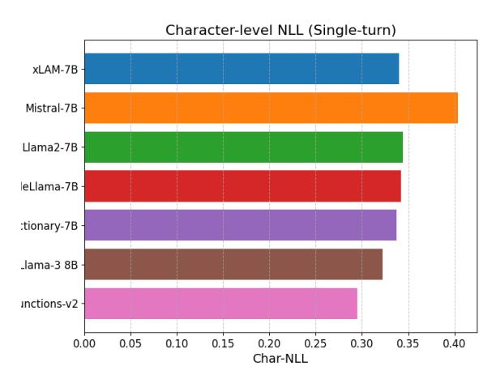
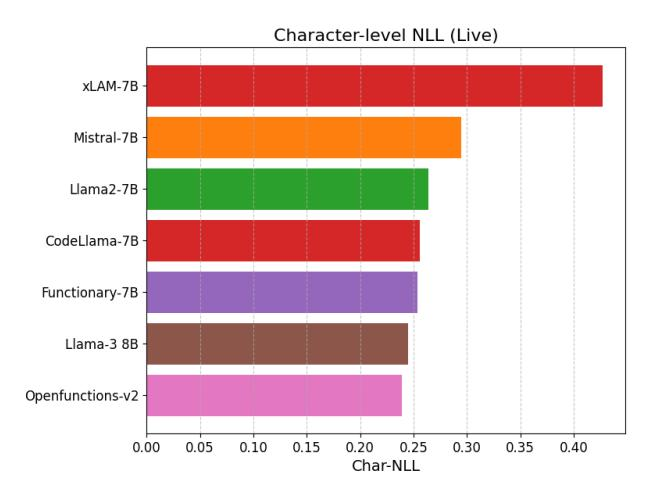
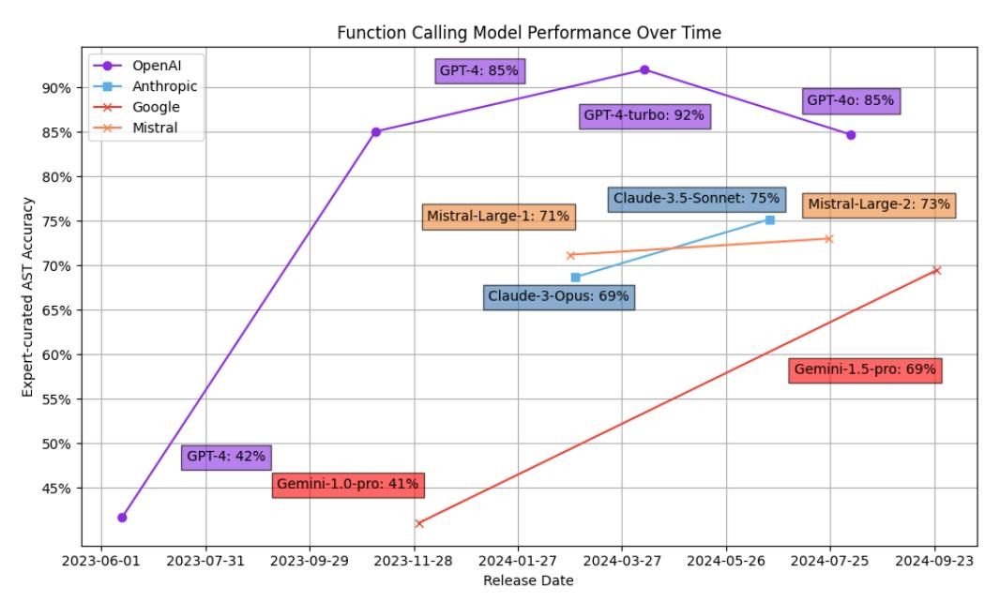
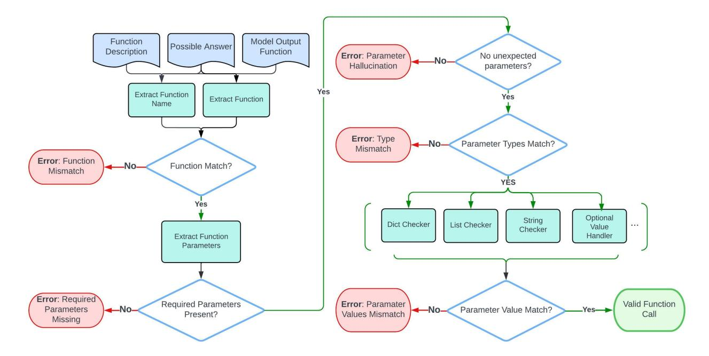
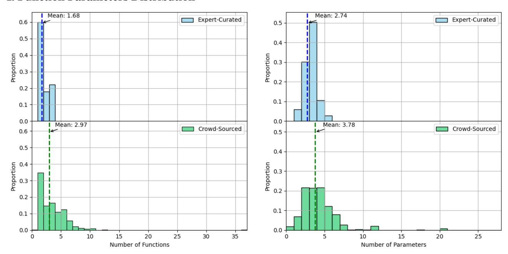

# **5.5.** Measuring Data Contamination using crowd-sourced

Traditional benchmarks inadvertently compromise if a model's training data overlaps with the evaluation set, leading to artificially low perplexity and Negative log likelihood on those benchmarks. By comparing language modeling metrics between crowd-sourced and single-turn, we can diagnose possible data contamination or overfitting. In particular, an abnormally low perplexity or character-level negative log-likelihood (char-NLL) on the static single-turn benchmark, coupled with a significant performance drop on crowd-sourced, would signal that the model may have memorized the former. On the other hand, consistent performance across single-turn and crowd-sourced suggests genuine generalization rather than training exposure to the test answers

<span id="page-7-1"></span>Table 2: While all models display consistently high perplexity in single-turn dataset then its crowd-sourced counterpart, the relative difference entails the model's familiarity to the single-turn which is open to be trained on as evaluation entries.

| Model              | PPL (single-turn) | PPL (crowd-sourced) |
|--------------------|-------------------|---------------------|
| Llama2-7B          | 3.47              | 2.56                |
| Openfunctions-v2   | 3.09              | 2.49                |
| CodeLlama-7B       | 3.45              | 2.49                |
| Meta-Llama-3 8B    | 3.58              | 2.63                |
| Mistral-7B         | 4.39              | 2.92                |
| Functionary-7B     | 3.81              | 2.73                |
| Salesforce xLAM-7B | 3.67              | 5.09                |

<span id="page-7-2"></span>Table 3: Character-level negative log-likelihood (Char-NLL) metric provides insights similar to those from Table 2. As the outputs of the function calls are structured, Char-NLL effectively captures model uncertainty and predictive performance at the token level across both single-turn and crowd-sourced settings. Lower values indicate better modeling of structured output.

| Model              | Char-NLL (single-turn) | Char-NLL (crowd-sourced) |
|--------------------|------------------------|--------------------------|
| Llama2-7B          | 0.344                  | 0.264                    |
| Openfunctions-v2   | 0.295                  | 0.239                    |
| CodeLlama-7B       | 0.342                  | 0.256                    |
| Meta-Llama-3 8B    | 0.322                  | 0.245                    |
| Mistral-7B         | 0.404                  | 0.295                    |
| Functionary-7B     | 0.337                  | 0.254                    |
| Salesforce xLAM-7B | 0.340                  | 0.427                    |

Tables 2 and 3 present the perplexity and char-NLL metrics, respectively, for several open-source models on the original single-turn benchmark versus the novel crowd-sourced dataset (wherein lower values signify superior predictive performance). It is observed that the majority of models achieve comparable or improved performance, i.e., lower perplexity and char-NLL on the crowd-sourced data relative to single-turn. For instance, Llama 2-7B (Touvron et al., 2023) exhibits a perplexity of 3.47 on single-turn compared to 2.56 on crowd-sourced, and a char-NLL of 0.344 versus 0.264. Similarly, Openfunctions-v2 and CodeLlama-7B also demonstrate slightly enhanced performance on the crowdsourced queries. This trend implies that these models did not derive an unfair advantage from memorization on the original benchmark. This finding supports the inference that their strong benchmark scores are attributable to genuine capability rather than exposure to test solutions. In contrast, Salesforce xLAM-7B (Zhang et al., 2024) shows an increase in perplexity from 3.67 to 5.09(char-NLL from 0.340 to 0.427) on crowd-sourced, representing a notable performance degradation.

These performance decrements underscore the utility of the crowd-sourced dataset as a "stress test" for models: any model that has primarily memorized benchmark solutions or was overly tuned to the static test distribution is likely to be exposed through a significant score regression on the new dataset. In the instances of xLAM, the crowd-sourced evaluation reveals vulnerabilities that the original static test masked. It is noteworthy that both are specialized or smaller-

scale models, which may have been exposed to limited data variety; consequently, when confronted with genuinely novel queries, their performance markedly declines.

Overall, the perplexity and char-NLL metrics across singleturn and crowd-sourced present a coherent pattern. Figure [6,](#page-8-0) and [7](#page-8-1) visualize these results, plotting each model's performance on single-turn against its performance on crowdsourced. The majority of data points are situated near the diagonal, signifying comparable proficiency on both datasets. In contrast, the outlier models deviate sharply upward, indicating higher perplexity/NLL on crowd-sourced. This analysis substantiates the practical value of the BFCL Live methodology. By incorporating a real-world test set, a more robust indicator of contamination or overfitting is obtained. Models cannot rely on memorized answers for crowd-sourced queries; thus, any substantial discrepancy in metrics serves as an immediate flag for potential evaluation inflation. In summary, these comparative metrics confirm that top-performing models maintain strong generalization on fresh data, whereas models exhibiting any indication of contamination or poor robustness are clearly identified by the performance gap between their single-turn and crowd-sourced scores.

<span id="page-8-0"></span>> **[图片提取文字 (无描述)]:**
> Character-level NLL (Single-turn) xLAM-7B -Mistral-7B Llama2-7B leLlama-7B -:tionary-7B \_lama-3 8B inctions-v2 0.00 0.05 0.10 0.15 0.20 0.25 0.30 0.35 0.40 Char-NLL


Figure 6: Character-level NLL on single-turn dataset.

#### 5.6. Memory Management Category Analysis

Current models struggle with memory tasks; even the benchmark leader, *openai o1-2024-12-17 (FC)*, reaches only 12% accuracy. We observe models demonstrate faulty behaviors in memory management and organization. For instance, when preserving the fact that "the user is a fourth-year male CS major," some models save as one key (user profile), others split it (major, year, gender). Splitting quickly exhausts key space, demands frequent merges, and complicates retrieval.

Models often hallucinate during key retrieval. Because the key–value store requires exact matches, models should first call list keys to view existing keys before retrieving

<span id="page-8-1"></span>> **[图片提取文字 (无描述)]:**
> Character-level NLL (Live) xLAM-7B Mistral-7B -Llama2-7B -CodeLlama-7B -Functionary-7B -Llama-3 8B -Openfunctions-v2 -0.05 0.10 0.15 0.20 0.00 0.25 0.30 0.35 0.40 Char-NLL


Figure 7: Character-level NLL on crowd-sourced dataset.

information. While some models handle this correctly, most skip listing the keys and instead attempt to guess a key when calling retrieve, leading to mismatches and errors. Even worse, many models give up after a single failure, mistakenly concluding that the information is unavailable rather than attempting to look up valid keys.

## 6. Conclusion

The Berkeley Function Calling Leaderboard (BFCL) establishes a new standard for evaluating large language models' (LLMs) ability to invoke and manage external tools and APIs. By introducing a comprehensive benchmark that spans single-turn, crowd-sourced, multi-turn, and agentic scenarios, BFCL provides a robust and scalable framework for assessing the function-calling capabilities critical to agentic AI systems. Its use of Abstract Syntax Tree (AST) based evaluation ensures reproducibility and avoids the scalability limitations of execution-based methods. The inclusion of real-world, multilingual user queries further enhances the benchmark's practical relevance.

Our analysis reveals that while many LLMs perform well on simple single-turn tasks, they often falter in more complex agentic and memory-intensive scenarios. This underscores the gap between current LLM performance and the demands of real-world, long-horizon reasoning tasks. Moreover, our comparative evaluations with crowd-sourced data expose potential overfitting in static benchmarks and highlight BFCL's role in stress-testing generalization.

As function-calling becomes a foundational capability for LLM-powered applications, BFCL serves as an essential tool for the community. We hope this benchmark not only drives advancements in LLM architectures and training but also promotes transparent and reproducible evaluation practices in the development of functionally robust AI agents.

## Impact Statement

The introduction of the Berkeley Function Calling Leaderboard (BFCL) represents a significant advancement in the evaluation and benchmarking of large language models (LLMs) for function-calling capabilities. Function calling is an increasingly critical skill for LLMs, enabling them to integrate seamlessly with external systems, perform complex tasks, and reason effectively in stateful, multi-turn interactions. Despite its importance, existing benchmarks inadequately capture the diversity, complexity, and real-world applicability of function-calling scenarios.

BFCL addresses these challenges by presenting a multifaceted benchmark that evaluates LLMs across single-turn, multi-turn, crowd-sourced, and agentic datasets. By leveraging innovative techniques such as Abstract Syntax Tree (AST) substring matching for scalable and deterministic evaluation, and incorporating real-world user-contributed data, BFCL sets a new standard for evaluating LLMs' capabilities.

This benchmark has the potential to significantly shape the development of next-generation LLMs by providing researchers and practitioners with a comprehensive tool to assess and improve function-calling performance. Moreover, it paves the way for more robust, adaptable, and ethically-aligned LLM deployments in diverse domains such as healthcare, finance, and education.

Ultimately, BFCL contributes to the broader goal of making LLMs more effective, and reliable in real-world applications, fostering innovation and ensuring responsible AI use.

## References

- <span id="page-9-4"></span>Attouche, L., Baazizi, M.-A., Colazzo, D., Ghelli, G., Sartiani, C., and Scherzinger, S. Validation of modern json schema: Formalization and complexity. *Proceedings of the ACM on Programming Languages*, 8(POPL):1451– 1481, 2024.
- <span id="page-9-6"></span>Basu, K., Abdelaziz, I., Chaudhury, S., Dan, S., Crouse, M., Munawar, A., Kumaravel, S., Muthusamy, V., Kapanipathi, P., and Lastras, L. A. Api-blend: A comprehensive corpora for training and benchmarking api llms, 2024. URL <https://arxiv.org/abs/2402.15491>.
- <span id="page-9-9"></span>Chen, Z., Du, W., Zhang, W., Liu, K., Liu, J., Zheng, M., Zhuo, J., Zhang, S., Lin, D., Chen, K., and Zhao, F. Teval: Evaluating the tool utilization capability of large language models step by step, 2024. URL [https://](https://arxiv.org/abs/2312.14033) [arxiv.org/abs/2312.14033](https://arxiv.org/abs/2312.14033).
- <span id="page-9-10"></span>Cohere, T. Command a: An enterprise-ready large language model, 2025. URL [https://arxiv.org/](https://arxiv.org/abs/2504.00698) [abs/2504.00698](https://arxiv.org/abs/2504.00698).

- <span id="page-9-7"></span>Erdogan, L. E., Lee, N., Jha, S., Kim, S., Tabrizi, R., Moon, S., Hooper, C., Anumanchipalli, G., Keutzer, K., and Gholami, A. Tinyagent: Function calling at the edge, 2024. URL <https://arxiv.org/abs/2409.00608>.
- <span id="page-9-3"></span>Gao, D., Wang, H., Li, Y., Sun, X., Qian, Y., Ding, B., and Zhou, J. Text-to-sql empowered by large language models: A benchmark evaluation. *Proc. VLDB Endow.*, 17(5):1132–1145, January 2024. ISSN 2150- 8097. doi: 10.14778/3641204.3641221. URL [https:](https://doi.org/10.14778/3641204.3641221) [//doi.org/10.14778/3641204.3641221](https://doi.org/10.14778/3641204.3641221).
- <span id="page-9-12"></span>Ge, T., Chan, X., Wang, X., Yu, D., Mi, H., and Yu, D. Scaling synthetic data creation with 1,000,000,000 personas, 2024. URL [https://arxiv.org/abs/](https://arxiv.org/abs/2406.20094) [2406.20094](https://arxiv.org/abs/2406.20094).
- <span id="page-9-1"></span>Guo, Z., Cheng, S., Wang, H., Liang, S., Qin, Y., Li, P., Liu, Z., Sun, M., and Liu, Y. Stabletoolbench: Towards stable large-scale benchmarking on tool learning of large language models, 2024.
- <span id="page-9-8"></span>Guo, Z., Cheng, S., Wang, H., Liang, S., Qin, Y., Li, P., Liu, Z., Sun, M., and Liu, Y. Stabletoolbench: Towards stable large-scale benchmarking on tool learning of large language models, 2025. URL [https://arxiv.org/](https://arxiv.org/abs/2403.07714) [abs/2403.07714](https://arxiv.org/abs/2403.07714).
- <span id="page-9-0"></span>Huang, S., Zhong, W., Lu, J., Zhu, Q., Gao, J., Liu, W., Hou, Y., Zeng, X., Wang, Y., Shang, L., Jiang, X., Xu, R., and Liu, Q. Planning, creation, usage: Benchmarking LLMs for comprehensive tool utilization in realworld complex scenarios. In Ku, L.-W., Martins, A., and Srikumar, V. (eds.), *Findings of the Association for Computational Linguistics: ACL 2024*, pp. 4363– 4400, Bangkok, Thailand, August 2024. Association for Computational Linguistics. doi: 10.18653/v1/2024. findings-acl.259. URL [https://aclanthology.](https://aclanthology.org/2024.findings-acl.259/) [org/2024.findings-acl.259/](https://aclanthology.org/2024.findings-acl.259/).
- <span id="page-9-5"></span>Kim, S., Moon, S., Tabrizi, R., Lee, N., Mahoney, M. W., Keutzer, K., and Gholami, A. An LLM compiler for parallel function calling. In *Forty-first International Conference on Machine Learning*, 2024. URL [https:](https://openreview.net/forum?id=uQ2FUoFjnF) [//openreview.net/forum?id=uQ2FUoFjnF](https://openreview.net/forum?id=uQ2FUoFjnF).
- <span id="page-9-11"></span>Lin, C.-Y. ROUGE: A package for automatic evaluation of summaries. In *Text Summarization Branches Out*, pp. 74–81, Barcelona, Spain, July 2004. Association for Computational Linguistics. URL [https:](https://aclanthology.org/W04-1013/) [//aclanthology.org/W04-1013/](https://aclanthology.org/W04-1013/).
- <span id="page-9-2"></span>Lu, J., Holleis, T., Zhang, Y., Aumayer, B., Nan, F., Bai, F., Ma, S., Ma, S., Li, M., Yin, G., Wang, Z., and Pang, R. Toolsandbox: A stateful, conversational, interactive evaluation benchmark for llm tool use capabilities, 2024. URL <https://arxiv.org/abs/2408.04682>.

- <span id="page-10-19"></span>Marten, R., Vu, T., Cheng-Jie Ji, C., Sharma, K., Dimakis, A., and Sathiamoorthy, M. Curator, January 2025.
- <span id="page-10-14"></span>MetaAI. The llama 3 herd of models, 2024. URL [https:](https://arxiv.org/abs/2407.21783) [//arxiv.org/abs/2407.21783](https://arxiv.org/abs/2407.21783).
- <span id="page-10-6"></span>OpenAI. Gpt-4 technical report, 2024. URL [https://](https://arxiv.org/abs/2303.08774) [arxiv.org/abs/2303.08774](https://arxiv.org/abs/2303.08774).
- <span id="page-10-17"></span>OpenAI. Openai community forum, 2025a. URL [https:](https://community.openai.com) [//community.openai.com](https://community.openai.com). Community of developers building AI-powered applications.
- <span id="page-10-16"></span>OpenAI. Function calling, 2025b. URL [https:](https://platform.openai.com/docs/guides/function-calling) [//platform.openai.com/docs/guides/](https://platform.openai.com/docs/guides/function-calling) [function-calling](https://platform.openai.com/docs/guides/function-calling). Documentation for integrating OpenAI models with custom code and external services.
- <span id="page-10-5"></span>Packer, C., Wooders, S., Lin, K., Fang, V., Patil, S. G., Stoica, I., and Gonzalez, J. E. Memgpt: Towards llms as operating systems, 2024. URL [https://arxiv.](https://arxiv.org/abs/2310.08560) [org/abs/2310.08560](https://arxiv.org/abs/2310.08560).
- <span id="page-10-13"></span>Panickssery, A., Bowman, S. R., and Feng, S. Llm evaluators recognize and favor their own generations, 2024. URL <https://arxiv.org/abs/2404.13076>.
- <span id="page-10-1"></span>Patil, S. G., Zhang, T., Wang, X., and Gonzalez, J. E. Gorilla: Large language model connected with massive apis. In *The Thirty-eighth Annual Conference on Neural Information Processing Systems*, 2024. URL [https:](https://openreview.net/forum?id=tBRNC6YemY) [//openreview.net/forum?id=tBRNC6YemY](https://openreview.net/forum?id=tBRNC6YemY).
- <span id="page-10-12"></span>Qin, Y., Liang, S., Ye, Y., Zhu, K., Yan, L., Lu, Y., Lin, Y., Cong, X., Tang, X., Qian, B., Zhao, S., Hong, L., Tian, R., Xie, R., Zhou, J., Gerstein, M., Li, D., Liu, Z., and Sun, M. Toolllm: Facilitating large language models to master 16000+ real-world apis, 2023. URL <https://arxiv.org/abs/2307.16789>.
- <span id="page-10-7"></span>Sasaki, M., Watanabe, N., and Komanaka, T. Enhancing contextual understanding of mistral llm with external knowledge bases. 2024.
- <span id="page-10-2"></span>Schick, T., Dwivedi-Yu, J., Dessi, R., Raileanu, R., Lomeli, M., Hambro, E., Zettlemoyer, L., Cancedda, N., and Scialom, T. Toolformer: Language models can teach themselves to use tools. In *Thirty-seventh Conference on Neural Information Processing Systems*, 2023. URL [https://openreview.net/forum?](https://openreview.net/forum?id=Yacmpz84TH) [id=Yacmpz84TH](https://openreview.net/forum?id=Yacmpz84TH).
- <span id="page-10-11"></span>Song, Y., Xiong, W., Zhu, D., Wu, W., Qian, H., Song, M., Huang, H., Li, C., Wang, K., Yao, R., Tian, Y., and Li, S. Restgpt: Connecting large language models with real-world restful apis, 2023. URL [https://arxiv.](https://arxiv.org/abs/2306.06624) [org/abs/2306.06624](https://arxiv.org/abs/2306.06624).

- <span id="page-10-3"></span>Srinivasan, V. K., Dong, Z., Zhu, B., Yu, B., Mao, H., Mosk-Aoyama, D., Keutzer, K., Jiao, J., and Zhang, J. Nexusraven: a commercially-permissive language model for function calling. In *NeurIPS 2023 Workshop on Instruction Tuning and Instruction Following*, 2023. URL [https://openreview.net/forum?](https://openreview.net/forum?id=Md6RUrGz67) [id=Md6RUrGz67](https://openreview.net/forum?id=Md6RUrGz67).
- <span id="page-10-8"></span>team, N. Nexusraven-v2: Surpassing gpt-4 for zero-shot function calling, 2023. URL [https://nexusflow.](https://nexusflow.ai/blogs/ravenv2) [ai/blogs/ravenv2](https://nexusflow.ai/blogs/ravenv2).
- <span id="page-10-15"></span>Team, Q. Qwen3 technical report, 2025. URL [https:](https://arxiv.org/abs/2505.09388) [//arxiv.org/abs/2505.09388](https://arxiv.org/abs/2505.09388).
- <span id="page-10-18"></span>Touvron, H., Martin, L., Stone, K., Albert, P., Almahairi, A., Babaei, Y., Bashlykov, N., Batra, S., Bhargava, P., Bhosale, S., Bikel, D., Blecher, L., Ferrer, C. C., Chen, M., Cucurull, G., Esiobu, D., Fernandes, J., Fu, J., Fu, W., Fuller, B., Gao, C., Goswami, V., Goyal, N., Hartshorn, A., Hosseini, S., Hou, R., Inan, H., Kardas, M., Kerkez, V., Khabsa, M., Kloumann, I., Korenev, A., Koura, P. S., Lachaux, M.-A., Lavril, T., Lee, J., Liskovich, D., Lu, Y., Mao, Y., Martinet, X., Mihaylov, T., Mishra, P., Molybog, I., Nie, Y., Poulton, A., Reizenstein, J., Rungta, R., Saladi, K., Schelten, A., Silva, R., Smith, E. M., Subramanian, R., Tan, X. E., Tang, B., Taylor, R., Williams, A., Kuan, J. X., Xu, P., Yan, Z., Zarov, I., Zhang, Y., Fan, A., Kambadur, M., Narang, S., Rodriguez, A., Stojnic, R., Edunov, S., and Scialom, T. Llama 2: Open foundation and fine-tuned chat models, 2023. URL <https://arxiv.org/abs/2307.09288>.
- <span id="page-10-9"></span>Trivedi, H., Khot, T., Hartmann, M., Manku, R., Dong, V., Li, E., Gupta, S., Sabharwal, A., and Balasubramanian, N. Appworld: A controllable world of apps and people for benchmarking interactive coding agents, 2024. URL <https://arxiv.org/abs/2407.18901>.
- <span id="page-10-4"></span>Vu, T., Iyyer, M., Wang, X., Constant, N., Wei, J., Wei, J., Tar, C., Sung, Y.-H., Zhou, D., Le, Q., and Luong, T. Freshllms: Refreshing large language models with search engine augmentation, 2023. URL [https://arxiv.](https://arxiv.org/abs/2310.03214) [org/abs/2310.03214](https://arxiv.org/abs/2310.03214).
- <span id="page-10-0"></span>Yao, S., Chen, H., Yang, J., and Narasimhan, K. Webshop: Towards scalable real-world web interaction with grounded language agents. In Koyejo, S., Mohamed, S., Agarwal, A., Belgrave, D., Cho, K., and Oh, A. (eds.), *Advances in Neural Information Processing Systems*, volume 35, pp. 20744–20757. Curran Associates, Inc., 2022.
- <span id="page-10-10"></span>Yao, S., Shinn, N., Razavi, P., and Narasimhan, K. τ -bench: A benchmark for tool-agent-user interaction in real-world domains, 2024. URL [https://arxiv.org/abs/](https://arxiv.org/abs/2406.12045) [2406.12045](https://arxiv.org/abs/2406.12045).

<span id="page-11-1"></span>Zhang, J., Lan, T., Zhu, M., Liu, Z., Hoang, T., Kokane, S., Yao, W., Tan, J., Prabhakar, A., Chen, H., Liu, Z., Feng, Y., Awalgaonkar, T., Murthy, R., Hu, E., Chen, Z., Xu, R., Niebles, J. C., Heinecke, S., Wang, H., Savarese, S., and Xiong, C. xlam: A family of large action models to empower ai agent systems, 2024. URL [https://](https://arxiv.org/abs/2409.03215) [arxiv.org/abs/2409.03215](https://arxiv.org/abs/2409.03215).

<span id="page-11-0"></span>Zhong, Z. and Chen, D. A frustratingly easy approach for entity and relation extraction. In Toutanova, K., Rumshisky, A., Zettlemoyer, L., Hakkani-Tur, D., Beltagy, I., Bethard, S., Cotterell, R., Chakraborty, T., and Zhou, Y. (eds.), *Proceedings of the 2021 Conference of the North American Chapter of the Association for Computational Linguistics: Human Language Technologies*, pp. 50–61, Online, June 2021. Association for Computational Linguistics. doi: 10.18653/v1/2021.naacl-main.5. URL [https:](https://aclanthology.org/2021.naacl-main.5/) [//aclanthology.org/2021.naacl-main.5/](https://aclanthology.org/2021.naacl-main.5/).

## <span id="page-12-0"></span>A. System Prompt for Prompting Models

To enable prompting models to execute function-calling actions, we use the following universal system prompt, where the {functions} placeholder is replaced with the function documentation(s):

*"""*

- *You are an e x p e r t i n composing f u n c t i o n s . You are g i v e n a q u e s t i o n and a s e t o f p o s s i b l e f u n c t i o n s . Based on t h e q u e s t i o n , you w i l l need t o make one or more f u n c t i o n / t o o l c a l l s t o a c h i e v e t h e purpose .*
- *I f none o f t h e f u n c t i o n s can be used , p o i n t i t o u t . I f t h e g i v e n q u e s t i o n l a c k s t h e p a r a m e t e r s r e q u i r e d by t h e f u n c t i o n , a l s o p o i n t i t o u t .*

*You s h o u l d o n l y r e t u r n t h e f u n c t i o n c a l l s i n your r e s p o n s e .*

*I f you d e c i d e t o i n v o k e any o f t h e f u n c t i o n ( s ) , you MUST p u t i t i n t h e f o r m a t o f [ func name1 ( params name1=params value1 , params name2=p a r a m s v a l u e 2 . . . ) , func name2 ( params ) ]*

*You SHOULD NOT i n c l u d e any o t h e r t e x t i n t h e r e s p o n s e .*

*At each turn , you s h o u l d t r y your b e s t t o c o m p l e t e t h e t a s k s r e q u e s t e d by t h e u s e r w i t h i n t h e c u r r e n t t u r n . C o n t i n u e t o o u t p u t f u n c t i o n s t o c a l l u n t i l you have f u l f i l l e d t h e u s e r ' s r e q u e s t t o t h e b e s t o f your a b i l i t y . Once you have no more f u n c t i o n s t o c a l l , t h e s y s t e m w i l l c o n s i d e r t h e c u r r e n t t u r n c o m p l e t e and proceed t o t h e n e x t t u r n or t a s k .*

*Here i s a l i s t o f f u n c t i o n s i n JSON f o r m a t t h a t you can i n v o k e .* \ *n*{ *f u n c t i o n s* }\*n """*

## <span id="page-12-1"></span>B. Data Augmentation on Function Documents

*Parallel Functions Category*: We created an additional user query that invoked the same function but with a different set of parameter values. This allowed us to expand the dataset by having multiple questions that invoked the same function, each with different input parameters. For example:

```
Parallel Functions Augmentation
query1 + [{'name': 'func1', 'description': 'order takeout'}] -> ans1
query2 (which contains query1) + [{'name': 'func1', 'description': 'order
takeout'}] -> [ans1, ans2]
```

The key transformation here is introducing query2 and generating ans2 based on a different set of parameter values.

*Multiple Functions Category*: In this category, we combined several function documents from different base entries to introduce distractor functions. However, the user query remained unmodified. These distractor functions were meant to test whether the model could accurately select the relevant function and not be misled by additional, unrelated function docs. GPT was used to ensure that none of the distractors could be alternative solutions to the function call. For example:

```
Multiple Functions Augmentation
query + [{'name': 'func1', 'description': 'order takeout'}] -> ans1
query + [{'name': 'func1', 'description': 'order takeout'}, {'name':
'func2', 'description': 'get weather'}] -> [ans1]
```

Here, the distractor func2 is added to test the model's ability to focus on func1 and avoid being distracted by irrelevant functions.

*Multiple Parallel Functions Category*: We combined multiple user queries and function documents from different base

entries, ensuring that more function docs were combined than user queries. This transformation tested the model's ability to handle multiple function calls and filter out unused functions. Some of the functions remained unused in the process, creating a more complex multi-query scenario. For example:

```
Multiple Parallel Functions Augmentation
query1 + [func1] -> ans1
query1 + query2 + [func1, func2, func3] -> [ans1, ans2]
```

The transformation here introduced query2 and added func2 and func3 while testing how the model handles the multiple function calls.

*Function Parameter Removal*: Based on the base entry, we asked GPT to remove one or more pieces of parameter information from the user prompt, while keeping the function document unchanged. In this case, the model was expected to either ask a follow-up question to clarify the missing information or return an error message instead of making a function call (which would be considered a hallucination). This will be used in the irrelevance category. For example:

```
Function Parameter Removal Augmentation
query1 + [func1] -> ans1
query1' (missing parameter info) + [func1] -> [No Function Call, Model asks
for clarification.]
```

The key transformation involved removing the necessary parameter info in query1' and testing whether the model responded with a clarification or error message.

*Function Removal*: In this case, we removed one or more invoked functions from the function list in the augmented multiple parallel entries (from the previous step). The model was expected to either ask for more information on the missing function or produce an error indicating the absence of a relevant function for the query. This will be used in the irrelevance category. For example:

```
Function Removal Augmentation
query1 + query2 + [func1, func2, func3] -> [ans1, ans2]
query1 + query2 + [func1, func3] -> [No Function Call, Model asks for
clarification.]
```

The transformation involved removing func2 from the list and verifying whether the model recognized its absence, producing the appropriate error message.

## <span id="page-13-0"></span>C. Single Turn Dataset Formal Definition

## C.1. Dataset Structure

Each entry in the dataset consists of a user query, a list of candidate functions, and a corresponding expected model output:

• AST-based functions: Each entry is represented as:

$$(q, F, A)$$
, where  $q$  is the user query,  $F = \{f_1, f_2, \dots\}$  is the function set, and  $A$  is the labeled function and valid parameter set. (1)

• Executable functions: Each entry follows:

$$(q, F, \hat{f}(P))$$
, where  $\hat{f}(P)$  is the expected executable function call, and 
$$P = \{p_1, p_2 \dots\}$$
 is the set of parameters used in the function. (2)

#### C.2. Dataset Categories

We categorize function-calling scenarios based on the number of available tools and the type of invocation:

• Simple (S): Single available tool, single function invocation.

$$|F| = 1, \quad |\hat{f}(P)| = 1$$
 (3)

• Multiple (M): Multiple available tools, single function invocation.

$$|F| > 1, \quad |\hat{f}(P)| = 1$$
 (4)

• Parallel (P): Single available tool, multiple function invocations in a single turn.

$$|F| = 1, \quad |\hat{f}(P)| > 1$$
 (5)

• Parallel Multiple (PM): Multiple available tools, multiple distinct functions called in parallel.

$$|F| > 1, \quad |\hat{f}(P)| > 1$$
 (6)

• Relevance (R): At least one function call is expected.

$$|F| \ge 1, |\hat{f}(P)| \ge 1$$
 (7)

• Irrelevance (I): Single or multiple available tools, but no function invocation is expected.

$$|F| \ge 1, \quad \hat{f}(P) = \emptyset$$
 (8)

## <span id="page-14-0"></span>D. Multi-turn Dataset Formal Definition

## D.1. Multi-turn Dataset Structure

Dataset Structure Each dataset entry consists of a multi-turn user query sequence and a corresponding ground truth function trajectory:

$$(Q,T), \quad \text{where } Q = \{q_1, q_2, ..., q_n\} \text{ represents the user queries,}$$

$$T = \{\tau_1, \tau_2, ..., \tau_n\} \text{ represents the assistant's expected function call trajectory per turn.}$$
(9)

#### D.2. Dataset Categories

The dataset is divided into four categories:

• Base (B): Standard multi-turn tasks where each turn has at least one expected function call.

$$\forall i, |\tau_i| \ge 1 \tag{10}$$

• Missing Parameters (MP): One turn contains an underspecified query, and the expected assistant response is a natural language follow-up.

$$\exists i \text{ s.t. } \tau_i = \emptyset, \quad q_{i+1} \text{ resolves missing parameters.}$$
 (11)

• Missing Functions (MF): One turn requests a function that is unavailable, prompting the assistant to respond with a clarification request.

$$\exists i \text{ s.t. } \tau_i = \emptyset, \quad q_{i+1} \text{ provides missing function information.}$$
 (12)

• Long Context (LC): User queries and assistant responses in each turn contain a high number of tokens.

$$\forall i, \quad |q_i| + |\tau_i| \gg 1 \tag{13}$$

## <span id="page-15-0"></span>E. Data Generation Pipeline Implementation Details

#### E.1. Single-turn Dataset

Data Collection For the single-turn tasks, we divide the data collection into two categories based on their evaluation method: AST categories that use Abstract Syntax Tree, and Execute categories that evaluate by execution. The evaluation methodology is discussed in [4.1](#page-3-0) and [4.2.](#page-4-0)

*AST*: We collect functions from popular GitHub repositories (top 100 starred) in Python, Java, and JavaScript. These functions are well-documented, making them ideal candidates for our downstream tasks. We exclude trivial functions such as init , eq , and functions with fewer than two parameters (excluding the self parameter) to ensure complexity and relevance.

*Execute*: The category is divided into two sub-categories based on the backend type. 1) Pure Python Functions: We manually constructed functions inspired by common math and physics calculations. These are purely executable Python functions that don't rely on external APIs. 2) Python Functions Wrapped APIs: This sub-category includes functions that invoke API calls from popular public API providers such as ExchangeRate API, OMDb API, and Geocoding API. We focused on GET requests, as they are the most common in real-world scenarios. These functions demonstrate the model's ability to generate executable REST API calls through complex function documentation, using requests.get() along with the API's hardcoded URL and a description of the function's purpose and parameters.

Data Preprocessing We pre-process them to extract useful context for downstream data generation tasks.

*AST*: We extract function names, descriptions, parameter names, types, and default values directly from signatures and docstrings.

*Execute*: For executable functions, we use Python's requests.get() as function document template. The schemas included base URLs, query parameters, path parameters, and body parameters.

Data Generation We transform the extracted function information, such as docstrings from python functions and API documentation from ExchangeRate, into well-formatted function documents. This transformation ensures consistent formatting, including proper descriptions of parameters, types, and default values, making them compatible with our downstream evaluation pipeline. Once the function documentation was generated, realistic user questions were created based on these documents and their use in the original codebase or API context.

Data Transformation To introduce complexity and mimic diverse real-world function-calling scenarios, we expand the dataset through various transformations detailed in [B.](#page-12-1) These transformations included augmenting the entries to simulate different function calling patterns, such as parallel and multiple, and introducing scenarios with queries having incomplete or missing information to test the model's behavior.

Data Validation We ensure 1) function documentations adhered to the BFCL format, including all required function schema fields. 2) The function parameters are precisely defined and correctly categorized. 3) User prompts were relevant, clear, and properly aligned with the corresponding function documentation. We've instructed three human experts

## <span id="page-15-1"></span>E.2. Crowd-sourced Dataset

Data Collection For the crowd-sourced dataset, 64,517 real-world user queries are collected between 2024-02-26 and 2024-04-01 via our hosted model endpoint.

Data Preprocessing To preprocess the collected data:

*Deduplication*: We applied the ROUGE-L [\(Lin,](#page-9-11) [2004\)](#page-9-11) score and OpenAI's text-embedding models to remove duplicate queries and function docs.

*Exclusion of Public Datasets*: We filtered out any queries from public test sets such as those from Nexus Function Calling Leaderboard to prevent contamination.

*Data Parsing*: The valid function documentation was then parsed into a JSON format compatible with the BFCL evaluation pipeline.

Data Generation The expert-curated dataset doesn't have a data generation phase, because all entries are authenticate user-contributed data. The result from the pre-processing phase go directly into the transformation phase.

Data Transformation *Minimum Edit Transformation*: Using the minimum edit principle, human annotators applied necessary corrections to improve clarity, precision, and consistency without changing the core content of the function docs or user prompts.

Data Validation In addition to all the data validation step used in the single-turn section, we also make sure that 1) The transformed function doc and prompt preserve their original semantic meaning. 2) Any sensitive information in user prompts was replaced with placeholders to maintain privacy, and ambiguous content was clarified.

#### <span id="page-16-0"></span>E.3. Multi-turn Dataset

Data Collection The multi-turn dataset began with the creation of a custom API codebase that spanned eight domains, including Vehicle Control, Trading Bots, Travel Booking, File System, Messaging, Twitter, Ticket Booking, and Math. Each API was designed to simulate real-world multi-turn function calls.

Data Preprocessing We constructed a graph of function dependencies, where each function represented a node, and edges mapped output dependencies. This setup allowed us to model realistic multi-turn interactions across different APIs and domains.

Data Generation The data generation process for multi-turn interactions involved:

• Task Generation: We prompt GPT-4o-0806a to invoke a series of function calls and then derive a natural langugage query that requires the function trajectories. The questions vary in tone and style to simulate different user personas and interaction scenarios.

Precisely, we adopted the dataset from Persona Hub [\(Ge et al.,](#page-9-12) [2024\)](#page-9-12) to generate a diverse evaluation dataset with different personas ranging from people with different occupations, age groups, etc. For example, a persona can look like:

High school physics teachers Science historians Elderly hermits Each persona would have a unique style to phrase the request.

- Function Lists: For each task, we provided a list of available functions from both primary and companion APIs.
- Initial Configurations: We set up initial states (e.g., pre-authenticated sessions) to avoid unnecessary interactions and focus on meaningful multi-turn tasks.
- Human-labeled Ground Truth: Expert human labelers reviewed and labeled each data point with ground truth for each multi-turn interaction.

Data Transformation During data transformation, we scaled the dataset by sampling execution paths through the graph. Additionally, incomplete tasks were fixed by introducing additional configurations and function calls to maintain coherence.

Data Validation Validation in multi-turn interactions involved:

- Question Validation: Ensuring that the questions were specific and complete.
- Ground Truth Validation: Verifying that the multi-turn function call sequences matched the ground truth.
- Initial Configuration Validation: Ensuring that the initial configurations were complete and relevant to the multi-turn tasks.
- Function List Validation: Checking that all necessary functions were included in the task's function list.
- API Code Validation: Using unit tests and format checkers to ensure that the API code was consistent and complied with the required standards.

## <span id="page-17-0"></span>F. LLM Judge BFCL Error Analyzer Implementation Details

We use GPT-40-08-06 as a judge, using bespoke curator (Marten et al., 2025) for structured synthetic data generation. The judge prompt is formatted as follows,

```
### **Error Analysis Prompt **
**Role: **
You are an **error analysis expert** tasked with identifying and classifying
   failures in the AI assistant's responses. Your goal is to determine if and
   where the assistant failed, categorizing the root cause as one of the
   following:
- **Failed to Understand Function Documentation **
- **Failed to Understand User's Request**
- **Failed to Understand Environment State **
- **No Failure **
**Instructions: **
Carefully analyze the provided **multi-turn conversation ** to identify any
   failures and their underlying causes.
### **Initial Configuration and User Queries **
- **Initial Configuration: ** {initial_config}
- **Related Function Documentations:**
{function_documentation}
- **List of User Queries: ** {user_queries}
### **Evaluation Process**
Use the following guidelines to critically evaluate the multi-turn responses:
1. **Compare the model's function call traces ** with the ground truth function
   call traces to identify any discrepancies in API usage.
2. **Compare the end state ** with the ground truth state to determine if the
   model achieved the correct outcome.
3. **Pay attention to any mechanistic errors ** reported by the state checker, as
   these indicate validation failures.
### **Entry ID: { entry_id } **
#### **Turn-by-Turn Breakdown**
{turns_breakdown}
### **State Checker Results **
{ state_checker_results }
```

```
### **Failure Categorization **
A failure occurs **ONLY** if:
- The environment's **final state ** differs from the **ground truth state **, OR
- The assistant **failed to produce the minimum required trajectory **.
**Exploration Steps **
- The assistant may take exploration steps, which may result in execution errors.
- **Do not penalize ** the assistant for exploration steps.
- **Only mark** the critical step that leads to the failure.
If the **state checker reports an error **, a failure **definitely ** occurred.
If the **state checker reports "None" **, check if the model failed to produce the
    **minimum required trajectory **.
### **Example Failure Analyses**
#### **Example 1**
**Context: ** Fuel tank has 5 gallons of gas initially. Max capacity is 50 gallons
**User: ** *Fill the fuel tank until we are able to reach Rivermist. Oil costs
   money so I just need to reach there, I don't need a full tank.*
**Assistant Response: ** 'fillFuelTank(fuel_amount = 50)'
**Ground Truth: ** 'display CarStatus ('fuel'), fill Fuel Tank (fuel Amount = 44) '
**Failure Analysis: **
- **Failure Type: ** *Failed to Understand Environment State *
- **Description: ** The model filled the tank to maximum capacity without checking
    the current fuel level first.
- **Turn ID: ** '0'
#### **Example 2**
**Context: ** User has a trading account with $10,000 balance.
**User: ** *I want to buy some Apple stock, but first tell me its current price
   and make sure I can afford at least 5 shares.*
**Assistant Response: ** 'execute_trade(symbol='AAPL', quantity=5, order_type='
   market', side='buy')'
**Ground Truth: ** 'get_stock_price(symbol='AAPL')'
**Failure Analysis: **
- **Failure Type: ** *Failed to Understand User's Request*
- **Description: ** The model executed a trade immediately when the user only
   requested price information and affordability check.
- **Turn ID: ** '0'
### **Final Task**
Now, identify the failures using the above categorization. **Only identify ONE
   root cause of the failure.**
```

```
If there is **NO failure ** in ANY turn, **report exactly ONE entry ** with:

- **Failure Type: ** 'No Failure '

- **Description: ** 'No Failure Occurs'

- **Root Cause: ** 'No Failure Occurs'

- **Turn ID: ** '-1'

### **Your Failure Analysis: **
```

## G. Function Calling Model Performance over time

PLease refer to Figure 7.

> **[图片提取文字 (无描述)]:**
> Function Calling Model Performance Over Time OpenAl GPT-4: 85% Anthropic 90% GPT-40: 85% Google GPT-4-turbo: 92% Mistral 85% 80% Claude-3.5-Sonnet: 75% Mistral-Large-2: 73% Expert-curated AST Accuracy Mistral-Large-1: 71% 75% 70% Claude-3-Opus: 69% 65% 60% Gemini-1.5-pro: 69% 55% 50% GPT-4: 42% Gemini-1.0-pro: 41% 45% 2023-06-01 2023-07-31 2023-11-28 2024-01-27 2024-03-27 2023-09-29 2024-05-26 2024-07-25 2024-09-23 Release Date


Figure 8: Models from 2023 and early 2024 struggled with reliable function calling at scale. As model sizes grew and function calling became a post-training objective, their capabilities improved significantly.

## <span id="page-19-0"></span>H. BFCL AST Substring Matching

#### Parallel Tool Calls

By definition, *parallel* tool calls execute simultaneously; therefore, their order is irrelevant. If strict sequencing *is* required, the model must emit one function call at a time and wait for its completion before producing the next.

Given a predicted sequence  $A = [a_1, a_2, \dots, a_m]$  and a ground-truth sequence  $B = [b_1, b_2, \dots, b_n]$ ,

- we do **not** require positional alignment;
- any predicted call  $a_i$  may match any ground-truth call  $b_i$ .

The evaluation follows an *all-or-nothing* rule: if even a single ground-truth call is unmatched, the entire prediction fails. This ensures the model identifies *all* required calls, regardless of order.

> **[图片提取文字 (无描述)]:**
> Model Output Function Possible Answer Description Function Error: Parameter No unexpected Hallucination parameters? Yes Extract Function Extract Function Name Error: Type Parameter Types Match? -No-Mismatch Error: Function Function Match? -No-Mismatch YES Optional String Dict Checker List Checker Value Checker Handler Extract Function Parameters Error: Required Required Parameters Valid Function Error: Paramater -No-Parameter Value Match? Parameters -No-Yes-Present? Values Mismatch Call Missing


Figure 9: BFCL AST Substring Matching procedure. The model response is parsed to extract function information in the systematic manner outlined above.

#### Parameter Values

#### INTEGER VS. FLOAT

- Python only: an int may be supplied where a float is expected (Python auto-converts).
- Java & JavaScript: when documentation specifies a float, the model must output a literal float (e.g. 5.0); an int such as 5 is incorrect.
- Supplying a float for an int parameter is invalid in *all* languages.

## LIST AND TUPLE

- Order matters: [1,2,3] ̸= [2,3,1]. For order-agnostic questions, all permutations of the correct answer are enumerated.
- Type matching is recursive for nested structures; outer and inner element types must satisfy the specification.

#### STRING

- Comparison is case-insensitive.
- All strings are standardized before checking:
  - whitespace removed,
  - punctuation ,./-\_\*ˆ (note: and ˆ) stripped.

#### • Examples

```
Possible dates: ["20th June", "2023-06-20", "06/20/2023", "Jun.20, 2023"]
Possible locations: ["New York City", "NYC"]
```

### DICTIONARY (D I C T)

- Key presence and value correctness are checked.
- Key order is ignored (dictionaries are inherently unordered).

### LIST OF DICTIONARIES

- The *list* order of dictionaries matters.
- Within each dictionary, key order does *not* matter.

#### Cross-Language Notes

For Java and JavaScript, strings representing code constructs are converted to Python equivalents using Tree-Sitters before evaluation. During conversion, parameter types are also validated (e.g. a Java long must end with L).

## I. Function Parameters Distribution

> **[图片提取文字 (无描述)]:**
> Mean: 2.74 Mean: 1.68 Expert-Curated **Expert-Curated** 0.6 0.5 0.5 0.4 Proportion Proportion 0.3 0.2 0.2 0.1 0.1 0.0 0.0 Mean: 2.97 Mean: 3.78 Crowd-Sourced Crowd-Sourced 0.6 0.5 0.5 0.4 Proportion 0.3 Proportion 0.3 0.2 0.2 0.1 0.1 0.0 0.0 20 25 30 25 15 35 10 15 20 10 Number of Functions Number of Parameters


Figure 10: Distribution of functions (left) and function parameters (right) in BFCL dataset between single-turn and crowd-sourced categories. The histograms reveal that the crowd-sourced data entries have broader range and higher mean in both functions and parameters count compared to single-turn scenarios. It's worth noting that in crowd-sourced, we have entries with 37 functions and functions with 21 parameters, where that max number for single-turn is only 3.36 and 3.69, respectively.

## <span id="page-21-0"></span>J. Format Instruction Prompt for Agentic Task

This is the additional system prompt that models would receive on agentic dataset entries:

*"""*

*For your f i n a l answer t o t h e user , you must respond i n t h i s f o r m a t :* { *' answer ' : A s h o r t and p r e c i s e answer t o t h e q u e s t i o n , ' c o n t e x t ' : A b r i e f e x p l a n a t i o n o f how you a r r i v e d a t t h i s answer or why i t i s c o r r e c t* } *. I f you do n o t know t h e answer , respond w i t h* { *' answer ' : ' I do n o t know ' , ' c o n t e x t ' : ' I do n o t know '* } *. I f you t h i n k t h e q u e s t i o n c a n n o t be p r o p e r l y answered , r e s p o n s e w i t h* { *' answer ' : ' I c a n n o t answer t h i s q u e s t i o n ' , ' c o n t e x t ' : A s h o r t r e a s o n e x p l a i n i n g why t h i s q u e s t i o n c a n n o t be answered* } *. """*

22