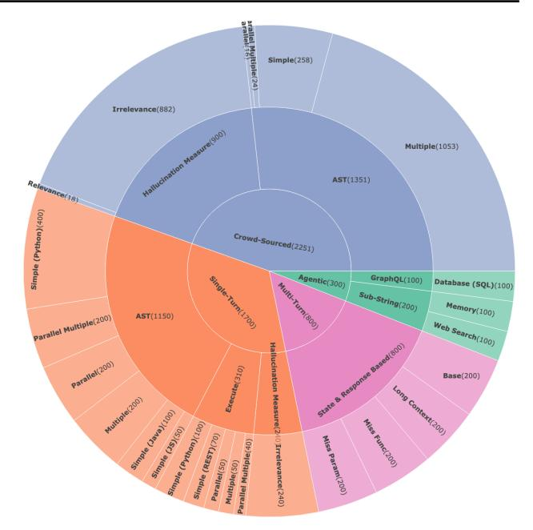
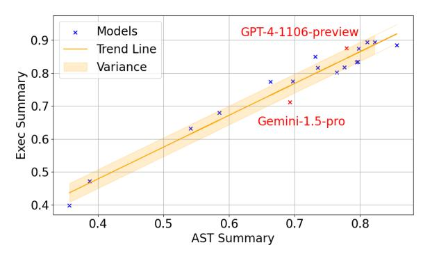
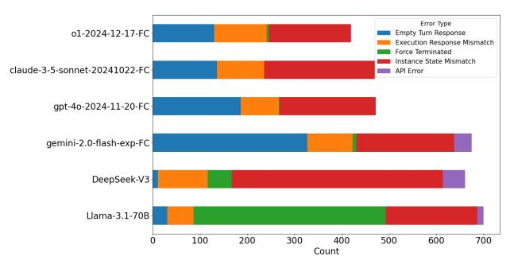
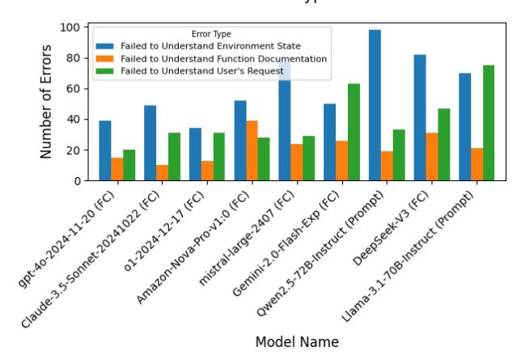

## The Berkeley Function Calling Leaderboard (BFCL): From Tool Use to Agentic Evaluation of Large Language Models

Shishir G. Patil 1 Huanzhi Mao 1 Fanjia Yan 1 Charlie Cheng-Jie Ji 1 Vishnu Suresh 1 Ion Stoica 1 Joseph E. Gonzalez 1

## Abstract

Function calling, also called tool use, refers to an LLM's ability to invoke external functions, APIs, or user-defined tools—an essential capability for agentic LLM applications. Despite its prominence, there does not exist a standard benchmark to evaluate function calling due to two reasons – the challenging nature of evaluating when a function call is valid, and the challenge of acquiring diverse, real-world functions. We present the Berkeley Function Calling Leaderboard (BFCL), a comprehensive benchmark designed to evaluate function calling in a wide range of real-world settings. The BFCL benchmark evaluates serial and parallel function calls, across various programming languages, using a novel Abstract Syntax Tree (AST) evaluation method that can easily scale to thousands of functions. We construct the benchmark using a combination of expert-curated and user-contributed functions and associated prompts. Finally, BFCL benchmark evaluates the ability of models to abstain and reason in a stateful multistep agentic setting. Evaluating a wide range of models, we observe that while state-of-the-art LLMs excel at single-turn calls, memory, dynamic decisionmaking, and long-horizon reasoning remain open challenges. Since its preview, BFCL has become the defacto standard for evaluating function-calls, and can be accessed at [https://gorilla.](https://gorilla.cs.berkeley.edu/leaderboard.html) [cs.berkeley.edu/leaderboard.html](https://gorilla.cs.berkeley.edu/leaderboard.html)

## 1. Introduction

Large Language Models (LLMs) have made significant strides in diverse domains, including conversational AI, rea-

*Proceedings of the* 42 nd *International Conference on Machine Learning*, Vancouver, Canada. PMLR 267, 2025. Copyright 2025 by the author(s).

soning, and creative multimodal tasks. However, agents powering use-cases such as coding, and knowledge discovery [\(Huang et al.,](#page-9-0) [2024;](#page-9-0) [Yao et al.,](#page-10-0) [2022\)](#page-10-0) often require LLMs to interface with external (e.g., web-search) to either retrieve up-to-date information or to enact actions which have realworld consequences. To aid in this, previous work such as Gorilla [\(Patil et al.,](#page-10-1) [2024\)](#page-10-1) and Toolformer [\(Schick et al.,](#page-10-2) [2023\)](#page-10-2) introduced techniques to train LLMs to use tools, and since then there has been growing interest in enabling LLMs to leverage external tools, a capability commonly referred to as *function calling* or *tool use*.

Despite substantial progress in leveraging function calling in LLMs, evaluating function calling remains challenging. Existing solutions, such as Gorilla—APIBench [\(Patil et al.,](#page-10-1) [2024\)](#page-10-1), propose methods for assessing function calls but exhibit notable limitations: APIBench's evaluation metrics focus primarily on functional correctness, overlooking semantic errors or variations in API usage. Other benchmarks—ToolBench [\(Guo et al.,](#page-9-1) [2024\)](#page-9-1), ToolSandbox [\(Lu](#page-9-2) [et al.,](#page-9-2) [2024\)](#page-9-2), and the Nexus Function Calling Leaderboard [\(Srinivasan et al.,](#page-10-3) [2023\)](#page-10-3)—fail to capture real-world use cases or patterns such as parallel invocations. We discuss some of these limitations in more detail in the related work section.

To address these challenges, we introduce the Berkeley Function Calling Leaderboard (BFCL), a largescale, multi-task, multi-turn benchmark that distinguishes function-calling capabilities among LLMs by evaluating their ability to invoke the correct function call. BFCL is composed of four parts: (1) 'single-turn' that tests singleturn function-calling scenarios, including parallel function invocations and multiple function candidates; (2) 'crowdsourced' which consists of 2, 251 curated from more than 67, 000 community contributed real-life function-calling datapoints; (3) 'multi-turn' featuring eight curated API suites and 1000 queries, assessing sustained context management and dynamic decision-making; and finally (4) 'agentic' spanning applications [\(Vu et al.,](#page-10-4) [2023\)](#page-10-4), database queries [\(Gao et al.,](#page-9-3) [2024\)](#page-9-3), and chatbot context management [\(Packer](#page-10-5) [et al.,](#page-10-5) [2024\)](#page-10-5). This comprehensive structure spans singlefunction tasks to complex, multi-step real-world use cases, enabling a thorough evaluation of an LLM's adaptability,

1University of California, Berkeley. Correspondence to: Shishir G. Patil <shishirpatil@berkeley.edu>.

correctness, and effectiveness in function invocation.

Evaluating LLMs' function-invocation capabilities poses unique challenges because deterministic validation typically requires executing the corresponding functions which complicates large-scale evaluation. BFCL overcomes this by introducing a novel validation strategy that obviates the need for function execution. Drawing inspiration from programming language literature, we employ Abstract Syntax Tree (AST) sub-string matching as a proxy for actual function execution, thereby facilitating scalable evaluations. To validate this approach, we utilize a subset of our dataset to evaluate models using the earlier mentioned execution approach and observe a strong correlation between BFCL's execution and AST metrics.

As models increasingly incorporate function calling capability, our phased release lets us compare if BFCL's single-turn dataset has possibly leaked into the training data of the latest models. To investigate this, through CharNLL as a measure, we compare LLMs' familiarity with the single-turn dataset against that of the crowd-sourced dataset which was released six months apart.

In summary, this work makes the following contributions:

- 1. BFCL is a diverse dataset of 5, 551 question-functionanswer pairs across multiple programming languages, including Python, Java, JavaScript, REST APIs, and SQL. This diversity ensures a comprehensive assessment of LLMs' function-calling ability across a range of domains and use cases.
- 2. A novel application of Abstract Syntax Trees (AST) based sub-string matching to serve as a proxy for function execution and enabling scalable, deterministic validation of function calls.
- 3. The first inclusion of community-contributed, realworld user queries and functions in function-calling evaluations, providing a more accurate representation of practical complexities and use cases.

## 2. Related Work

Language Models Using Tools. Function calling [\(Schick](#page-10-2) [et al.,](#page-10-2) [2023\)](#page-10-2) extends the capabilities of LLMs beyond its own knowledge base by enabling them to interact with external tools and APIs. Unlike structured output [\(Zhong](#page-11-0) [& Chen,](#page-11-0) [2021\)](#page-11-0), function calling allows LLMs to perform tasks requiring real-time data or external computation [\(At](#page-9-4)[touche et al.,](#page-9-4) [2024\)](#page-9-4). Models like GPT-4 [\(OpenAI,](#page-10-6) [2024\)](#page-10-6) have demonstrated early ability to generate structured JSON for function invocation, prompting research into leveraging API calls as functions. More recent models have natively integrated function calling, empowering them to interact

> **[图片提取文字 (无描述)]:**
> arallel Multiple(24) Simple(258) Irrelevance(882) Halled nation Manuface 900 Multiple(1053) AST(1351) Relevance(18) Simple (Python)(400) Crowd-Sourced(2251) Agentic(300) GraphQL(100) Mari Turnego Database (SQL)(100) Sub-String(200) Memory(100) Parallel Multiple(200) AST(1150) Web Search(100) Store & Response Sandricko Hallucination Measure(2/0 Irrelevance(240) Parallel(200) Base(200) Long Contest (200) day feet of the state of the state of the state of the state of the state of the state of the state of the state of the state of the state of the state of the state of the state of the state of the state of the state of the state of the state of the state of the state of the state of the state of the state of the state of the state of the state of the state of the state of the state of the state of the state of the state of the state of the state of the state of the state of the state of the state of the state of the state of the state of the state of the state of the state of the state of the state of the state of the state of the state of the state of the state of the state of the state of the state of the state of the state of the state of the state of the state of the state of the state of the state of the state of the state of the state of the state of the state of the state of the state of the state of the state of the state of the state of the state of the state of the state of the state of the state of the state of the state of the state of the state of the state of the state of the state of the state of the state of the state of the state of the state of the state of the state of the state of the state of the state of the state of the state of the state of the state of the state of the state of the state of the state of the state of the state of the state of the state of the state of the state of the state of the state of the state of the state of the state of the state of the state of the state of the state of the state of the state of the state of the state of the state of the state of the state of the state of the state of the state of the state of the state of the state of the state of the state of the state of the state of the state of the state of the state of the state of the state of the state of the state of the state of the state of the state of the state of the state of the state of the state of the state of the state of the state of the state of the state of the state of the state of the st Simple (Python)(100) Miss Function Simple (35)/50) Simple (REST)(70) Miss param(200) Parallel Multiple(40) Parallel(50) Multiple(50)

Figure 1: This chart visualizes the diverse categories within BFCL. The inner ring represents the four major sections, the middle ring specifies their respective evaluation methods, and the outer ring highlights each category. Numbers indicate the total number of datapoints in each category.

with external systems for knowledge retrieval [\(Sasaki et al.,](#page-10-7) [2024\)](#page-10-7) and real-time interaction. Furthermore, advancements like the LLMCompiler [\(Kim et al.,](#page-9-5) [2024\)](#page-9-5) optimize this process through parallel function execution, improving both efficiency and accuracy. This integration of function calling represents a crucial step towards more capable and versatile LLMs and subsequently unlocks broad agentic behaviors.

Benchmark for Function Calling. Quite a few benchmarks have been proposed to test LLM's ability to perform function calling, in this work, we focus on those designed to evaluate a model's native function-calling capabilities, rather than methods that rely on prompt-based or code-generation approaches (e.g., Nexus Raven [\(team,](#page-10-8) [2023\)](#page-10-8) uses a promptbased protocol, and AppWorld [\(Trivedi et al.,](#page-10-9) [2024\)](#page-10-9) emphasis code generation capability). Among benchmarks that do evaluate native function calling, many such as App Blend [\(Basu et al.,](#page-9-6) [2024\)](#page-9-6) and API Bench [\(Patil et al.,](#page-10-1) [2024\)](#page-10-1) focus solely on single-turn interactions. Although TinyAgent [\(Er](#page-9-7)[dogan et al.,](#page-9-7) [2024\)](#page-9-7) addresses nested function calls, it does so by using placeholder variables instead of letting the model see the actual execution output of earlier calls; in effect, it still operates under a single-turn framework.

For benchmarks that truly cover multi-turn interactions, most are constrained by a narrow domain scope or a limited set of functions. TauBench [\(Yao et al.,](#page-10-10) [2024\)](#page-10-10), for example, supports only 28 functions spanning two domains (airline and retail), and RestBench [\(Song et al.,](#page-10-11) [2023\)](#page-10-11) offers scenarios solely within the TMDB and Spotify domains. The

narrow coverage (< 150 entries) is more prone to overfitting and does not sufficiently reflect the breadth of realworld function-calling scenarios. Furthermore, benchmarks like ToolSandBox [\(Lu et al.,](#page-9-2) [2024\)](#page-9-2) and TauBench [\(Yao](#page-10-10) [et al.,](#page-10-10) [2024\)](#page-10-10) rely on LLMs to simulate user queries. Despite careful attempt to control the user simulator's behavior, LLM-based users remain prone to hallucination and instruction-following errors, which confound evaluation.

Other works, such as ToolBench [\(Qin et al.,](#page-10-12) [2023\)](#page-10-12), depend solely on Rapid APIs that are subject to high variance in performance, making reproducibility a challenge. While the subsequent StableToolBench [\(Guo et al.,](#page-9-8) [2025\)](#page-9-8) version mitigates this by caching or simulating API responses, it continues to rely on LLM-based evaluators for determining response solvability, thus risking model-induced biases and undermining objectivity (e.g., GPT-family models tending to favor responses from their own model [\(Panickssery et al.,](#page-10-13) [2024\)](#page-10-13)). Similar issues exist in T-Eval [\(Chen et al.,](#page-9-9) [2024\)](#page-9-9), which also depends on LLM-based evaluation.

Lastly, current benchmarks uniformly employ LLM-curated user queries, limiting their ability to accurately reflect genuine user interactions.

Our benchmark directly addresses these shortcomings by incorporating deterministic evaluation metrics, an extensive and diverse set of robust multi-turn interactions, and a unique multilingual dataset derived from real-world, usercontributed queries that have more than 15 languages represented in user queries, including Chinese, French, Japanese, and Korean, etc. Additionally, on top of Python and REST (which are commonly covered in existing benchmarks), we also have entries in Java and JavaScript for more diverse programming languages.

Collectively, these enhancements enable a more comprehensive, fair, and reproducible assessment of LLM function calling, setting our benchmark apart from existing efforts.

Impact: Since it's preview, BFCL has become the defacto evaluation for function calling used by all leading labs developing large language models [\(MetaAI,](#page-10-14) [2024;](#page-10-14) [Team,](#page-10-15) [2025;](#page-10-15) [Cohere,](#page-9-10) [2025\)](#page-9-10). The leaderboard is constantly evolving and is in it's current iteration (v4). This paper collapses the timeline and condenses all the learnings

## 3. Berkeley Function Calling Leaderboard

BFCL employs a structured data curation pipeline to construct our benchmarking dataset across different categories. The pipeline follows five stages: data collection sources functions from online repositories, APIs, and user queries; data pre-processing extracts and structures key function attributes; data generation standardizes functions and user queries into a schema that can be presented to the

| <b>Multiple Functions</b>                                           | Parallel Functions                               | Function Relevance Detection                                         |  |  |  |  |
|---------------------------------------------------------------------|--------------------------------------------------|-------------------------------------------------------------------------|--|--|--|--|
| User: Prompt: What is 2 + 3?                                        | User: Prompt: What is (2 + 3) and (4 + 5)? | User: Prompt: What is 2*3?                                              |  |  |  |  |
| <pre>Function:   [add(int a, int b),   mult(int a, int b)   ]</pre> | Function: [add(int a, int b)]                    | Function: [add(int a, int b)]                                           |  |  |  |  |
| Agent: add(a=2, b=3)                                             | Agent: [add(a=2, b=3), add(a=4, b=5)]            | Agent: Error. The user asks for adding but we only have multiplication. |  |  |  |  |

Figure 2: Examples of single-turn function-calling scenarios to illustrate multiple, parallel, and irrelevance entry types outlined in Section [3.1.](#page-2-0)

LLMs; data transformation augments data with incomplete queries, and data validation ensures consistency and correctness through comprehensive unit-tests.

#### 3.1. Single-turn Dataset

We classify single turn function-calling scenarios into five types based on the number of available tools and their invocation patterns. Simple involves one tool with a single invocation, whereas Multiple includes several tools each invoked once. Parallel scenarios feature multiple invocations of a single tool, and Parallel Multiple combines multiple tools with multiple invocations. Irrelevance refers to cases where tools are available but not invoked. Detailed definitions are provided in Appendix [C.](#page-13-0)

We evaluate function calling through two methods: ASTbased substring matching and executable tests. For ASTbased evaluation, we curate functions in Python, Java, and JavaScript from popular GitHub repositories, filtering out trivial ones. For executable tests, we include (1) Python functions covering mathematical and physical computations, and (2) API-wrapped functions emulating real-world services (e.g., currency exchange and geocoding). Functions are standardized into a schema to avoid inconsistent documentation and ensure fair model comparisons. We further increase complexity by generating multiple and parallel calls, adding distractor functions, and testing robustness with missing parameters. See Appendix [E](#page-15-0) for details.

#### 3.2. Crowd-sourced Dataset

The crowd-sourced dataset contains 64,517 real single-turn user queries collected between 2024-02-26 and 2024-04-01, representing genuine function-call interactions from users. We remove duplicates via ROUGE-L and embedding based similarity, and exclude queries from public sets to avoid contamination. Human experts minimally edit queries for clarity and adherence to our function schema, preserving their original semantics. See Appendix [E.2](#page-15-1) for details. This dataset has the same dataset structure and categories as Section [3.1.](#page-2-0)

### 3.3. Multi-turn Dataset

Multi-turn covers an entire conversation between the user and the assistant. Each conversation includes multiple turns—a new user message—and each turn may involve one or more steps—individual interactions between the assistant and a tool or environment.

Our multi-turn dataset evaluates the LLMs's ability to handle queries that evolve over multiple turns. It is divided into four categories: Base category covers the basic multi-turn user queries asking everyday tasks and providing all necessary information. Missing Parameters tests the model's ability to recognize when critical parameter information is missing from the user request and cannot be inferred from the system. Missing Functions tests the model to identify when no available function can fulfill the user request. Long Context challenges the model's ability to maintain accuracy in multi-turn long context queries or function call results. Detailed definitions are provided in Appendix [D.](#page-14-0)

To construct the dataset, we developed a custom API codebase across diverse domains like vehicle control, ensuring full transparency of API state and design. Data generation involves task generation of multi-turn queries that describe real-world tasks, along with specified initial API state configurations and function documents. Human annotators label ground truth trajectories from the generated multi-turn queries. Data validation includes question completeness, initial state verification, and function call sequence alignment with human-labeled ground truth. Detailed data generation and validation processes are outlined in Appendix [E.3.](#page-16-0)

#### 3.4. Agentic Dataset

The Agentic dataset is divided into three categories. We describe them in detail below. They share similar data curation pipeline as the single-turn dataset in Section [3.1.](#page-2-0)

## 3.4.1. WEB SEARCH DATASET

For this category, the LLM has two tools: a DuckDuckGo search function that retrieves webpage titles, snippets, and URLs, and a fetch function that extracts full webpage content. To ensure fairness across models with varying knowledge cutoffs, questions focus on recent but stable information, such as the 2024 TIME Person of the Year, rather than constantly changing data like stock prices.

## 3.4.2. MEMORY DATASET

Our memory dataset spans five distinct domains, each chosen to reflect a practical, real-world use case for LLMs—*college advising, customer support, medical assistant*, etc. Within every domain, the model is first given a concise *setting prompt* (e.g., "You are an academic advisor helping a sophomore plan their coursework") and then

participates in a sequence of consecutive conversations that gradually reveal user-specific facts. After each domain-level dialogue block, we record a *memory snapshot*. Evaluation queries are issued with an *empty chat history* but access to the stored snapshot, probing whether the model can accurately retrieve, add, overwrite, or delete information that was mentioned minutes (short-term) or many turns (long-term) earlier. This design lets us measure how well the model maintains and updates memory across both topic boundaries and temporal gaps, mirroring real deployment scenarios where sustained, personalized assistance is critical.

#### 3.4.3. SQL DATASET

Each question in the SQL category can be succinctly translated into an SQL query. Traditional text-to-SQL tasks typically involve prompting language models to generate a valid SQL query, then evaluating the result via exact string matching or by querying a predefined database. In BFCL, however, we adopt a more structured approach by supplying the LLM with a JSON-based schema that defines fundamental SQL operations (e.g., SELECT, INSERT, UPDATE, DELETE). Each operation includes detailed structured parameters needed for a complete SQL query (e.g., WHERE, LIMIT, JOIN). This schema allows for a deterministic translation of function calls into SQL queries and supports nested or more complex queries through the composition of multiple function calls.

## 4. Evaluation Methodology

BFCL employs tailored evaluation protocols for each dataset category. The Single-Turn category use both *AST-substring matching* (Section [4.1\)](#page-3-0) and *execution-response matching* (Section [4.2\)](#page-4-0), whereas the Crowd-Sourced category relies solely on the AST matcher. The Multi-Turn category combines a *state-based* and a *response-based* checker (Section [4.4\)](#page-4-1), and the Agentic category is evaluated with a strict *exact-match* criterion (Section [4.5\)](#page-4-2).

We later quantify the agreement among the AST substringmatching and execution-response matching metrics (Section [4.3\)](#page-4-3) to validate the reliability of the AST approach, highlight differences in inference strategies for prompt-only versus function-calling models (Section [5.1\)](#page-4-4), and, finally, leverage perplexity ratios on the single-turn and crowdsourced settings to detect potential data contamination in the BFCL single-turn corpus.

#### 4.1. AST Substring Matching

Evaluating function calls by direct execution can be challenging due to the limited availability of executable functions and the laborious process of manual implementation, which curtails the diversity of functions available for testing.

> **[图片提取文字 (无描述)]:**
> Models GPT-4-1106-preview × 0.9 Trend Line × Variance Exec Summary 6.0 9.0 × Gemini-1.5-pro 0.5 0.4 0.4 0.5 0.7 0.8 0.6 **AST Summary**

Figure 3: The Abstract Syntax Tree (AST) based evaluation (AST Summary) are strongly correlated with the evaluation by executing the functions (Exec Summary) validating AST as a reliable off-line evaluation methodology.

To address this, we introduce an Abstract Syntax Tree (AST) substring matching approach that preserves alignment with execution-based evaluation without actual execution.

We restrict the model's output to Python-callable function calls using prompt-based instructions, then extract function names and parameters through Python's ast module. Instead of requiring exact parameter matches, we verify that each parameter belongs to a predefined set of valid values. A function call is correct if the function name matches exactly and if all parameter values fall within their respective possible answers. For details on the AST matching rules, please refer to Appendix [H.](#page-19-0)

#### 4.2. Execution Response Matching

Execution response matching involves validating function calls by executing them and comparing the results against expected outcomes. There are three ways we compare the response. For functions that output deterministic results, we check for exact-match of the response. For functions whose outputs are time sensitive, we execute the ground truth function call and the model's output function call simultaneously and match the results, accounting for real-time value fluctuations. For nested lists or dictionaries, we perform structure matching, which only checks the length of the list and the presence of the dictionary key.

#### 4.3. AST Matching Performance

By comparing the scores and relative rankings on the BFCL single-turn dataset, evaluated using AST and Execution in Figure [3,](#page-4-5) we observe a strong correlation between AST scores and execution-based performance. This suggests that AST matching serves as a reliable indicator of model effectiveness in real-world scenarios.

#### 4.4. State & Response Based Evaluation

For multi-turn tasks, we employ two checks after each turn: state-based and response-based. An entry is correct only

if it passes both checks in all turns.

State-Based Evaluation compares the system's final state after each turn (i.e., after all function calls) with the groundtruth state. Multiple sequences of function calls can achieve the same result, but the final state must match the labeled outcome. This approach captures modifications to the system (e.g., creating files or removing stocks from a watchlist).

Response-Based Evaluation verifies that the model follows the necessary sequence of function calls (the *minimal viable execution result path*) to produce the requested output. This is critical for read-only requests (e.g., retrieving stock prices), where we want to ensure the model calls the appropriate functions rather than guessing the result.

While state-based evaluation is a powerful technique, it cannot detect whether non-state-changing functions (e.g., get zipcode by city or estimate distance) were actually invoked. We need response-based checks to confirm the model is reasoning through the task reliably (e.g., calling get zipcode by city(City Name) before get weather by zipcode(City Zipcode)). By combining both types of evaluation, BFCL provides deeper insight into the model's correctness and decisionmaking process.

#### 4.5. Exact-Match Evaluation

During evaluation, the model is given explicit formatting instructions through the system prompt detailed in Appendix [J.](#page-21-0) We evaluate only the dedicated answer field with a strict exact-match criterion. Focusing on this individual field prevents spurious positives that would occur if the reference phrase appeared incidentally inside a longer, unclear sentence. For example, consider a yes/no question: a reply such as "I am not sure because no relevant information was found" contains the token "no," but the model has not actually committed to the negative answer. By isolating the answer field, such cases are not erroneously marked as correct responses.

Before matching, both candidate and reference answers are normalized—converted to lowercase and stripped of punctuation—using the same procedure as in our AST-based evaluation. A prediction is deemed correct if and only if the normalized strings are identical.

## 5. Results and Analysis

#### 5.1. Accuracy

Table [1](#page-5-0) presents the evaluation results of various LLMs on BFCL. While the top-performing models excel in singleturn, crowd-sourced, and hallucination-related metrics, there remains significant room for improvement in multi-turn and agentic tasks, particularly in memory management.

Table 1: Evaluating different LLMs on BFCL. The categories are defined in Section 4

| Model                                                          | Overall Acc  |              |              |                 | Singl             | e Turn       |              |                     |                   | Crowd Sourced |              |                 | d Hallucination Measure |              | Multi Turn    |              |              |              | Agentic      |              |             |              |
|----------------------------------------------------------------|--------------|--------------|--------------|-----------------|-------------------|--------------|--------------|---------------------|-------------------|---------------|--------------|-----------------|-------------------------|--------------|---------------|--------------|--------------|--------------|--------------|--------------|-------------|--------------|
|                                                                |              | Simple       | Multiple     | AST Parallel | Parallel Multiple | Simple       | Multiple     | Execute Parallel | Parallel Multiple | Simple        | Multiple     | AST Parallel | Parallel Multiple       | Irrelevance  | Relevance     | Base         | Miss Func    | Miss Param   | Long Context | Web Search   | Memory      | SQL          |
| gpt-4o-2024-11-20 (Prompt)                                     | 66.4         | 79.4         | 95.5         | 94.0            | 83.5              | 100.0        | 94.0         | 86.0                | 77.5              | 84.9          | 79.8         | 87.5            | 75.0                    | 83.8         | 83.3          | 59.0         | 41.0         | 35.5         | 55.0         | 64.0         | 6.0         | 78.0         |
| gpt-4o-2024-11-20 (FC)                                         | 65.8         | 77.2         | 93.5         | 93.0            | 86.0              | 88.3         | 92.0         | 94.0                | 82.5              | 81.4          | 78.8         | 87.5            | 75.0                    | 83.1         | 83.3          | 62.5         | 6.0          | 37.5         | 58.0         | 82.0         | 0.0         | 81.0         |
| GPT-4-turbo-2024-04-09 (FC)                                    | 60.9         | 70.4         | 91.0         | 90.0            | 87.5              | 87.4         | 90.0         | 86.0                | 77.5              | 83.7          | 78.6         | 81.2            | 70.8                    | 83.8         | 72.2          | 54.0         | 13.5         | 35.5         | 49.5         | 66.0         | 4.0         | 50.0         |
| GPT-4o-mini-2024-07-18 (FC)                                    | 60.6         | 74.8         | 92.0         | 90.0            | 84.0              | 83.3         | 92.0         | 84.0                | 75.0              | 78.7          | 76.2         | 87.5            | 70.8                    | 74.7         | 83.3          | 47.5         | 19.5         | 29.0         | 40.5         | 78.0         | 6.0         | 66.0         |
| o1-2024-12-17 (Prompt)                                         | 59.1         | 72.7         | 93.5         | 91.5            | 85.0              | 58.6         | 92.0         | 86.0                | 82.5              | 82.9          | 76.5         | 81.2            | 75.0                    | 87.8         | 72.2          | 50.5         | 0.5          | 48.5         | 44.5         | 5.0          | 12.0        | 91.0         |
| Qwen2.5-72B-Instruct (Prompt) Gemini-2.0-Flash-Exp (Prompt) | 57.0 56.8 | 80.2 76.8 | 97.5 95.5 | 93.5 95.0    | 92.0 92.5      | 99.3 63.6 | 94.0 92.0 | 90.0 84.0        | 87.5 80.0      | 85.3 85.7  | 82.1 79.3 | 62.5 81.2    | 75.0 87.5            | 72.8 86.4 | 100.0 77.8 | 24.5 28.0 | 20.0         | 15.5 19.0 | 12.0         | 54.0 73.0 | 8.0         | 70.0 53.0 |
| ToolACE-2-8B (FC)                                              | 56.6         | 75.3         | 92.5         | 92.5            | 90.0              | 95.4         | 92.0         | 86.0                | 75.0              | 70.9          | 79.0         | 81.2            | 54.2                    | 90.1         | 72.2          | 48.5         | 29.0         | 28.0         | 42.0         | 25.0         | 2.0         | 37.0         |
| Amazon-Nova-Pro-v1:0 (FC)                                      | 56.6         | 68.8         | 92.5         | 92.0            | 84.5              | 97.1         | 84.0         | 84.0                | 77.5              | 80.2          | 77.5         | 81.2            | 58.3                    | 71.0         | 77.8          | 37.5         | 19.0         | 22.0         | 26.0         | 76.0         | 0.0         | 51.0         |
| Qwen2.5-32B-Instruct (FC)                                      | 55.6         | 72.8         | 94.0         | 93.5            | 88.5              | 97.6         | 88.0         | 84.0                | 77.5              | 80.2          | 80.1         | 43.8            | 62.5                    | 81.9         | 64.7          | 29.5         | 25.5         | 20.5         | 13.5         | 53.0         | 4.0         | 45.0         |
| Gemini-2.0-Flash-Exp (FC)                                      | 55.5         | 68.4         | 89.5         | 92.0            | 90.5              | 61.9         | 88.0         | 80.0                | 80.0              | 74.8          | 70.7         | 81.2            | 70.8                    | 91.5         | 55.6          | 31.0         | 0.5          | 22.5         | 27.0         | 70.0         | 6.0         | 45.0         |
| BitAgent-8B                                                    | 55.0         | 76.2         | 95.0         | 94.0            | 82.5              | 98.6         | 94.0         | 88.0                | 77.5              | 77.9          | 77.4         | 87.5            | 70.8                    | 82.4         | 83.3          | 48.0         | 40.0         | 26.5         | 39.5         | 22.0         | 0.0         | 29.0         |
| GPT-4o-mini-2024-07-18 (Prompt)                                | 54.5         | 80.1         | 90.5         | 89.5            | 87.0              | 62.9         | 96.0         | 82.0                | 82.5              | 81.4          | 76.7         | 93.8            | 79.2                    | 80.7         | 83.3          | 33.0         | 12.0         | 17.0         | 26.0         | 43.0         | 0.0         | 63.0         |
| Claude-3.5-Sonnet-20241022 (FC)                                | 53.8         | 78.8         | 94.5         | 3.5             | 5.0               | 97.6         | 90.0         | 4.0                 | 0.0               | 84.1          | 82.0         | 25.0            | 20.8                    | 74.0         | 77.8          | 55.0         | 19.0         | 42.5         | 47.5         | 74.0         | 4.0         | 60.0         |
| o1-mini-2024-09-12 (Prompt) o1-2024-12-17 (FC)              | 53.5 52.8 | 71.2 67.9 | 89.0 93.0 | 83.5            | 72.0 0.0       | 89.3 60.6 | 86.0 94.0 | 78.0 0.0         | 77.5              | 72.9 81.8  | 71.6 79.0 | 75.0            | 75.0 0.0             | 89.6 82.0 | 61.1 72.2  | 40.5 52.5 | 5.0 38.0  | 34.5 30.5 | 33.0 43.0 | 7.0 48.0  | 0.0 12.0 | 70.0 83.0 |
| claude-3.5-haiku-20241022 (FC)                                 | 52.3         | 68.0         | 92.0         | 2.5             | 0.0               | 87.9         | 90.0         | 24.0                | 0.0               | 82.9          | 78.3         | 18.8            | 0.0                     | 63.7         | 83.3          | 54.5         | 26.5         | 35.0         | 44.0         | 83.0         | 6.0         | 59.0         |
| Owen2.5-32B-Instruct (Prompt)                                  | 52.1         | 70.2         | 94.5         | 90.5            | 88.0              | 96.6         | 90.0         | 90.0                | 82.5              | 83.0          | 78.5         | 62.5            | 58.3                    | 73.8         | 100.0         | 25.0         | 20.0         | 15.0         | 11.0         | 46.0         | 0.0         | 42.0         |
| Amazon-Nova-Lite-v1:0 (FC)                                     | 52.1         | 69.8         | 94.0         | 84.0            | 66.0              | 92.0         | 84.0         | 80.0                | 65.0              | 72.9          | 70.1         | 75.0            | 66.7                    | 76.4         | 66.7          | 27.5         | 5.5          | 17.5         | 19.0         | 62.0         | 0.0         | 58.0         |
| GPT-4-turbo-2024-04-09 (Prompt)                                | 51.4         | 82.5         | 95.5         | 93.5            | 92.0              | 99.3         | 96.0         | 80.0                | 82.5              | 88.0          | 84.1         | 100.0           | 79.2                    | 35.6         | 100.0         | 42.5         | 25.0         | 20.5         | 33.0         | 27.0         | 0.0         | 54.0         |
| Llama-3.1-70B-Instruct (Prompt)                                | 50.4         | 77.9         | 96.0         | 94.5            | 91.5              | 94.0         | 98.0         | 86.0                | 82.5              | 78.3          | 76.2         | 87.5            | 66.7                    | 54.8         | 100.0         | 16.5         | 13.0         | 10.5         | 10.0         | 56.0         | 0.0         | 61.0         |
| Llama-3.3-70B-Instruct (Prompt)                                | 50.4         | 74.8         | 94.5         | 84.0            | 87.0              | 95.7         | 98.0         | 84.0                | 85.0              | 81.8          | 77.1         | 93.8            | 66.7                    | 48.7         | 100.0         | 9.0          | 8.0          | 4.5          | 6.0          | 78.0         | 0.0         | 64.0         |
| Claude-3.5-Sonnet-20241022 (Prompt)                            | 49.4 49.2 | 81.4         | 92.0         | 70.5            | 46.0 89.0      | 100.0        | 92.0         | 68.0                | 60.0              | 86.8          | 80.1         | 81.2            | 45.8                    | 64.4         | 77.8          | 9.0 19.5  | 5.5          | 5.0          | 10.5         | 68.0 30.0 | 0.0         | 60.0         |
| Qwen2.5-14B-Instruct (FC) Hammer2.1-7b (FC)                 | 49.2 48.6 | 69.7 78.1 | 95.0 95.0 | 88.0 93.5    | 89.0 88.0      | 90.4 86.4 | 92.0         | 72.0 86.0        | 85.0 77.5      | 77.1 76.7  | 75.0 77.4 | 75.0 81.2    | 70.8 70.8            | 77.7 78.6 | 55.6 82.3  | 35.5         | 17.0 25.5 | 16.5 19.0 | 10.5 14.0 | 30.0 14.0 | 0.0         | 30.0 13.0 |
| Qwen2.5-14B-Instruct (Prompt)                                  | 48.6         | 73.2         | 92.5         | 92.0            | 85.0              | 92.4         | 90.0         | 88.0                | 85.0              | 74.4          | 75.8         | 62.5            | 66.7                    | 77.1         | 77.8          | 19.0         | 11.5         | 12.0         | 6.5          | 28.0         | 0.0         | 26.0         |
| claude-3.5-haiku-20241022 (Prompt)                             | 46.6         | 76.2         | 93.0         | 84.0            | 79.5              | 97.9         | 90.0         | 76.0                | 75.0              | 84.9          | 75.0         | 87.5            | 54.2                    | 65.8         | 77.8          | 16.0         | 0.5          | 8.0          | 14.5         | 0.0          | 2.0         | 68.0         |
| Command-R-Plus (FC)                                            | 46.5         | 72.1         | 89.5         | 82.5            | 64.0              | 90.9         | 90.0         | 84.0                | 60.0              | 70.5          | 58.8         | 62.5            | 45.8                    | 53.2         | 72.2          | 16.5         | 10.0         | 9.0          | 17.0         | 69.0         | 0.0         | 45.0         |
| Command R7B (FC)                                               | 46.4         | 68.2         | 91.5         | 85.5            | 81.5              | 87.1         | 92.0         | 82.0                | 75.0              | 63.2          | 58.7         | 56.2            | 62.5                    | 81.0         | 55.6          | 6.5          | 1.5          | 6.5          | 5.5          | 69.0         | 0.0         | 18.0         |
| ToolACE-8B (FC)                                                | 45.6         | 76.7         | 93.5         | 90.5            | 89.5              | 97.4         | 94.0         | 88.0                | 77.5              | 73.3          | 76.7         | 81.2            | 70.8                    | 87.9         | 83.3          | 7.5          | 11.5         | 5.0          | 7.0          | 9.0          | 0.0         | 13.0         |
| Haha-7B                                                        | 45.2         | 78.1         | 95.5         | 89.5            | 81.0              | 80.4         | 96.0         | 88.0                | 80.0              | 78.3          | 77.6         | 75.0            | 70.8                    | 80.7         | 83.3          | 13.0         | 10.0         | 11.5         | 7.0          | 20.0         | 0.0         | 8.0          |
| Hammer2.1-3b (FC)                                              | 45.0         | 81.4         | 95.0         | 89.5            | 81.5              | 82.9         | 92.0         | 84.0                | 77.5              | 73.3          | 73.3         | 62.5            | 66.7                    | 81.9         | 82.3          | 27.5         | 17.5         | 14.5         | 10.0         | 2.0          | 0.0         | 6.0          |
| Qwen2.5-7B-Instruct (FC) xI_AM-8x7b-r (FC)                  | 44.7 44.2 | 71.8 73.6 | 95.0 90.0 | 90.0 69.0    | 86.0 38.0      | 95.4 89.2 | 94.0 90.0 | 84.0 72.0        | 77.5 45.0      | 75.6 74.8  | 75.6 79.3 | 68.8 43.8    | 66.7 58.3            | 69.1 67.2 | 77.8 94.4  | 13.5 26.0 | 14.5 13.0 | 11.0         | 7.0 11.5  | 12.0 23.0 | 0.0         | 14.0 34.0 |
| Amazon-Nova-Lite-v1:0 (FC)                                     | 43.7         | 69.8         | 94.0         | 84.0            | 66.0              | 92.0         | 84.0         | 80.0                | 65.0              | 72.9          | 79.3         | 75.0            | 66.7                    | 76.4         | 66.7          | 27.5         | 5.5          | 17.5         | 19.0         | 10.0         | 0.0         | 9.0          |
| xLAM-7b-r (FC)                                                 | 43.0         | 74.2         | 95.5         | 81.0            | 73.5              | 74.0         | 96.0         | 82.0                | 67.5              | 72.1          | 74.9         | 50.0            | 62.5                    | 77.1         | 94.4          | 16.5         | 8.5          | 7.5          | 7.5          | 14.0         | 0.0         | 9.0          |
| GoGoAgent                                                      | 42.9         | 75.4         | 93.0         | 92.0            | 84.5              | 95.4         | 96.0         | 88.0                | 80.0              | 72.9          | 75.4         | 68.8            | 66.7                    | 83.1         | 77.8          | 1.5          | 2.0          | 0.5          | 0.0          | 10.0         | 0.0         | 14.0         |
| Qwen2.5-7B-Instruct (Prompt)                                   | 42.7         | 75.3         | 94.5         | 91.5            | 84.5              | 92.1         | 90.0         | 86.0                | 85.0              | 76.7          | 74.9         | 62.5            | 70.8                    | 65.2         | 88.9          | 9.5          | 8.5          | 7.0          | 5.5          | 14.0         | 0.0         | 15.0         |
| Llama-3.3-70B-Instruct (Prompt)                                | 42.4         | 74.8         | 94.5         | 84.0            | 87.0              | 95.7         | 98.0         | 84.0                | 85.0              | 81.8          | 77.1         | 93.8            | 66.7                    | 48.7         | 100.0         | 9.0          | 8.0          | 4.5          | 6.0          | 36.0         | 2.0         | 8.0          |
| Gemma-3-12b-it (Prompt)                                        | 41.4         | 77.3         | 95.0         | 90.0            | 73.0              | 84.7         | 94.0         | 80.0                | 72.5              | 84.9          | 70.8         | 87.5            | 62.5                    | 61.1         | 88.9          | 8.0          | 3.5          | 2.5          | 4.5          | 25.0         | 0.0         | 13.0         |
| Hammer2.1-1.5b (FC)                                            | 41.3         | 74.7         | 92.0         | 84.5            | 80.0              | 86.6         | 90.0         | 82.0 86.0        | 75.0              | 71.3          | 69.8         | 50.0            | 62.5                    | 79.3         | 77.8          | 14.5         | 12.5         | 9.0          | 6.0          | 0.0          | 0.0         | 2.0          |
| Ministral-8B-Instruct-2410 (FC) MiniCPM3-4B-FC (FC)         | 40.9 30.0 | 71.8 69.8 | 91.5 91.5 | 84.5 82.5    | 87.5 79.5      | 71.3         | 86.0 90.0 | 86.0 86.0        | 75.0 85.0      | 75.6 74.8  | 72.3 63.9 | 62.5 43.8    | 62.5 62.5            | 55.3 72.2 | 70.6 72.2  | 21.5 5.0  | 8.5          | 10.0         | 5.5 1.5   | 13.0         | 0.0         | 12.0 8.0  |
| Amazon-Nova-Micro-v1:0 (FC)                                    | 39.8         | 63.5         | 88.0         | 77.5            | 55.5              | 80.4         | 76.0         | 68.0                | 52.5              | 65.9          | 64.2         | 62.5            | 45.8                    | 74.2         | 72.2          | 24.5         | 5.5          | 14.0         | 20.5         | 10.0         | 0.0         | 5.0          |
| Llama-3.1-8B-Instruct (Prompt)                                 | 39.6         | 72.8         | 93.5         | 87.0            | 83.5              | 83.7         | 96.0         | 88.0                | 77.5              | 74.0          | 73.3         | 56.2            | 54.2                    | 48.8         | 77.8          | 13.0         | 10.0         | 7.5          | 8.0          | 8.0          | 0.0         | 9.0          |
| Granite-20b-FunctionCalling (FC)                               | 39.4         | 72.8         | 91.5         | 84.0            | 81.5              | 84.9         | 92.0         | 86.0                | 82.5              | 68.2          | 56.3         | 43.8            | 58.3                    | 74.8         | 88.9          | 6.0          | 1.5          | 4.5          | 1.5          | 0.0          | 0.0         | 29.0         |
| Qwen2.5-3B-Instruct (FC)                                       | 38.7         | 73.3         | 92.0         | 73.5            | 76.5              | 86.9         | 90.0         | 66.0                | 70.0              | 74.0          | 72.1         | 62.5            | 45.8                    | 64.3         | 88.9          | 8.5          | 6.0          | 4.5          | 5.0          | 3.0          | 0.0         | 5.0          |
| Falcon3-10B-Instruct (FC)                                      | 37.1         | 70.5         | 93.5         | 87.5            | 87.0              | 97.1         | 92.0         | 92.0                | 82.5              | 76.4          | 76.2         | 50.0            | 41.7                    | 31.9         | 94.4          | 6.0          | 5.0          | 4.5          | 4.5          | 12.0         | 0.0         | 8.0          |
| Qwen2.5-1.5B-Instruct (FC)                                     | 36.6 35.7 | 72.4 74.2 | 87.0 90.5 | 81.5 79.5    | 75.5 79.0      | 88.0 80.9 | 90.0 86.0 | 78.0 80.0        | 72.5 80.0      | 74.0 69.8  | 66.1 66.5 | 50.0 56.2    | 45.8 62.5            | 62.7 54.2 | 94.4 88.9  | 4.0 5.5   | 1.5 3.5   | 3.0          | 1.5 2.5   | 0.0          | 0.0         | 1.0          |
| Qwen2.5-3B-Instruct (Prompt) Llama-3.2-3B-Instruct (Prompt) | 35.6         | 73.8         | 92.0         | 80.5            | 76.0              | 87.3         | 92.0         | 78.0                | 77.5              | 64.0          | 64.9         | 12.5            | 45.8                    | 51.7         | 88.9          | 8.5          | 2.5          | 4.5          | 5.5          | 0.0          | 0.0         | 5.0          |
| Falcon3-7B-Instruct (FC)                                       | 35.4         | 64.8         | 89.5         | 86.5            | 88.5              | 89.0         | 94.0         | 86.0                | 77.5              | 74.0          | 66.5         | 75.0            | 62.5                    | 33.7         | 88.9          | 3.5          | 3.5          | 3.5          | 3.0          | 8.0          | 0.0         | 6.0          |
| Qwen2.5-1.5B-Instruct (Prompt)                                 | 35.3         | 71.0         | 86.0         | 70.0            | 66.5              | 80.4         | 94.0         | 88.0                | 80.0              | 70.5          | 59.3         | 56.2            | 41.7                    | 63.0         | 83.3          | 1.5          | 2.5          | 0.5          | 0.0          | 0.0          | 0.0         | 3.0          |
| DBRX-Instruct (Prompt)                                         | 35.0         | 73.5         | 92.0         | 42.5            | 37.0              | 90.1         | 88.0         | 46.0                | 52.5              | 78.3          | 73.0         | 75.0            | 41.7                    | 40.5         | 94.4          | 0.0          | 0.0          | 0.0          | 0.0          | 9.0          | 6.0         | 36.0         |
| Hammer2.1-0.5b (FC)                                            | 34.0         | 68.0         | 83.0         | 71.5            | 54.0              | 68.4         | 84.0         | 82.0                | 47.5              | 60.1          | 58.0         | 50.0            | 45.8                    | 73.9         | 77.8          | 4.0          | 0.5          | 3.0          | 1.5          | 0.0          | 0.0         | 1.0          |
| Bielik-11B-v2.3-Instruct (Prompt)                              | 32.5         | 71.2         | 93.5         | 46.0            | 49.5              | 76.6         | 90.0         | 44.0                | 50.0              | 72.9          | 69.3         | 43.8            | 54.2                    | 40.6         | 77.8          | 7.0          | 0.5          | 3.0          | 4.5          | 6.0          | 0.0         | 10.0         |
| GLM-4-9b-Chat (FC)                                             | 30.1         | 65.2         | 81.5         | 0.0             | 0.0               | 94.0         | 90.0         | 0.0                 | 0.0               | 72.5          | 64.4         | 0.0             | 0.0                     | 79.7         | 66.7          | 3.5          | 4.0          | 2.5          | 4.0          | 3.0          | 0.0         | 8.0          |
| xLAM-7b-fc-r (FC)                                              | 30.0         | 76.8         | 93.5         | 77.0            | 41.0              | 84.5         | 92.0         | 56.0                | 10.0              | 78.7          | 58.0         | 31.2            | 25.0                    | 45.0         | 77.8          | 0.0          | 0.0          | 0.0          | 0.0          | 2.0          | 0.0         | 5.0          |
| MiniCPM3-4B (Prompt)                                           | 29.2 28.9 | 63.5         | 72.5         | 65.5            | 62.0              | 40.4         | 34.0         | 48.0                | 80.0              | 46.5          | 34.8         | 43.8 37.5    | 41.7 29.2            | 74.4 48.1 | 50.0          | 3.0          | 3.5          | 1.0 0.5   | 0.5          | 0.0          | 0.0         | 3.0          |
| Gemma-3-4b-it (Prompt) Meta-Llama-3-8B-Instruct (Prompt)    | 28.9         | 64.3 62.7 | 91.5 82.5 | 56.5 48.0    | 41.0 50.0      | 68.1 77.7 | 80.0 86.0 | 30.0 42.0        | 12.5 60.0      | 72.9 61.2  | 62.8 61.4 | 37.5            | 33.3                    | 48.1 18.6 | 77.8 77.8  | 0.0          | 0.0          | 1.0          | 0.0 0.5   | 0.0 2.0   | 0.0         | 6.0 7.0   |
| Owen2.5-0.5B-Instruct (FC)                                     | 27.1         | 61.2         | 78.0         | 60.0            | 50.0              | 51.2         | 88.0         | 52.0                | 52.5              | 56.2          | 41.3         | 56.2            | 20.8                    | 46.2         | 88.9          | 1.0          | 2.0          | 1.0          | 1.0          | 0.0          | 0.0         | 0.0          |
| Falcon3-3B-Instruct (FC)                                       | 22.7         | 58.0         | 69.0         | 61.0            | 25.0              | 54.6         | 46.0         | 20.0                | 10.0              | 55.4          | 56.3         | 31.2            | 37.5                    | 34.5         | 77.8          | 0.5          | 0.5          | 0.0          | 1.0          | 0.0          | 0.0         | 3.0          |
| Qwen2-1.5B-Instruct (Prompt)                                   | 22.0         | 51.2         | 79.0         | 46.5            | 40.5              | 46.6         | 76.0         | 52.0                | 35.0              | 48.8          | 40.3         | 12.5            | 25.0                    | 21.2         | 94.4          | 0.5          | 1.0          | 0.0          | 0.5          | 0.0          | 0.0         | 0.0          |
| Qwen2.5-0.5B-Instruct (Prompt)                                 | 21.0         | 58.2         | 68.0         | 53.5            | 33.0              | 63.1         | 70.0         | 62.0                | 52.5              | 53.9          | 34.8         | 56.2            | 16.7                    | 16.4         | 94.4          | 0.0          | 0.0          | 0.0          | 0.0          | 0.0          | 0.0         | 0.0          |
| Llama-3.1-8B-Instruct (FC)                                     | 21.0         | 55.8         | 54.0         | 48.5            | 34.5              | 58.7         | 58.0         | 54.0                | 30.0              | 51.9          | 49.0         | 37.5            | 41.7                    | 4.9          | 94.4          | 5.0          | 7.5          | 5.0          | 4.0          | 4.0          | 0.0         | 0.0          |
| Llama-3.1-70B-Instruct (FC)                                    | 20.8         | 49.2         | 24.5         | 12.5            | 15.0              | 53.0         | 36.0         | 30.0                | 7.5               | 52.3          | 52.6         | 31.2            | 25.0                    | 44.8         | 100.0         | 7.0          | 4.0          | 4.5          | 4.0          | 5.0          | 0.0         | 0.0          |
| xLAM-1b-fc-r (FC)                                              | 18.7         | 71.7         | 86.0         | 5.0             | 2.0               | 77.8         | 90.0         | 4.0                 | 0.0               | 64.0          | 53.4         | 6.2             | 0.0                     | 6.7          | 100.0         | 0.5          | 0.0          | 0.0          | 0.0          | 0.0          | 0.0         | 0.0          |
| Llama-3.2-1B-Instruct (Prompt)                                 | 15.4         | 29.2 3.6  | 33.5 6.0  | 36.0 17.5    | 15.0              | 34.1 9.4  | 28.0         | 34.0 18.0        | 5.0 15.0       | 31.4 4.7   | 7.6          | 12.5            | 4.2 12.5             | 59.7 87.2 | 38.9 0.0   | 0.0          | 0.0          | 0.0          | 0.0          | 0.0          | 0.0         | 0.0          |
| Falcon3-1B-Instruct (FC) Gemma-3-1b-it (Prompt)             | 13.1         | 3.6 43.5  | 6.0 38.5  | 17.5            | 9.0 2.0        | 9.4 34.0  | 4.0          | 18.0                | 15.0              | 4.7 31.0   | 10.5         | 0.0             | 12.5                    | 87.2 30.9 | 0.0 50.0   | 0.0          | 0.0          | 0.0          | 0.0          | 0.0          | 0.0         | 1.0          |
| Ocuma-5-10-it (Prompt)                                         | 14.3         | 45.3         | 36.3         | 2.0             | 2.0               | 34.0         | 44.0         | 4.0                 | 0.0               | 31.0          | 10.5         | 0.0             | 0.0                     | 30.9         | 30.0          | 0.0          | 0.0          | 0.0          | 0.0          | 0.0          | 0.0         | 1.0          |

Models that support native function-calling (FC), such as GPT-4, Gemini-1.5-Pro, Claude-3.5-Sonnet, can run BFCL directly by supplying all function definitions in their tools input field. In contrast, most models lack built-in function-calling capabilities. For these models, we use a prompt-based workaround: we guide them to produce structured function calls through the system prompt (detailed in Appendix A), placing the function definitions in the system prompt rather than in a dedicated tools field. Throughout this paper, we refer to models that have their native function-calling feature enabled as "FC models" (or operating in "FC mode"), and those for which we rely on system prompts to trigger function calls as "prompting models" (or in "prompting mode").

If a model supports both FC and prompting modes, we find that the FC mode outputs tend to be structured responses that lower parsing errors. However, these structural constraints of the FC mode can limit the flexibility of a model in complex function calling scenarios. We therefore see more capable models often performing better in the prompting mode. For instance, Claude cannot execute parallel

function calls in FC mode, whereas it can in prompting mode. In addition, when handling other programming languages (e.g., Java or JavaScript), models in prompting mode often outperforms FC mode.

Prompting models exhibit on average three times more decoding issues than FC models (412.93 vs. 182.5 out of 4,251 total entries), aligning with the observation that structured FC-mode outputs are easier to parse. However, among successfully decoded responses in the *multiple* function-call category, FC models show more incorrect function-call counts on average (77.5 vs. 21). A similar trend appears in the *parallel multiple* category, indicating that prompting models are generally more flexible in complex scenarios.

#### 5.2. Dataset Composition Difference

We construct the data generation pipeline for single-turn based on our understanding of the composition of real-life function-calling scenarios from our experiences building a function-calling LLM, and from function-calling documentations (OpenAI, 2025b) and community forums (OpenAI, 2025a). At that time, there were no formal crowd-sourced

datasets. After we collected the crowd-sourced part of this dataset, we found that there are quite a few differences between the single turn and the crowd-sourced.

In crowd-sourced, there are significantly more scenarios on multiple and much less parallel function calling scenarios. This observation reflects how most users interact with function calling: high demand for the feature of having to intelligently choose between functions and lower demand for making parallel function calls in a single turn.

Crowd-sourced dataset also differ from single turn in that they contain multi-lingual user prompts, multi-lingual function docs, as well as user prompts that contains lots of redundant information, etc. As an example of the rich diversity we observed in our dataset, we even include a classification function triggered through function calling.

On average, each entry in crowd-sourced contains 3 function choices, with the maximum one having 37 function choices. Each function has an average of 4 parameters, with the maximum one having 28 parameters. Here are some statistics and distributions.

#### 5.3. Parallel Function Call Ability

When a question requires multiple function calls (whether to the same function or different ones), the model can issue them all at once in a single turn, or sequentially across multiple turns. For tasks that have no interdependencies among calls, issuing parallel function calls in a single turn significantly reduces latency. For instance, checking the stock prices of 20 different stocks simultaneously is far more efficient than making 20 separate requests.

We observe notable shifts in the evlolution of models' abilities to generate parallel function calls. Early models (e.g., the Claude Sonnet) lacked any function call capability. Later iterations introduced partial support for parallel calls—albeit with suboptimal performance. Interestingly, with the release of flagship versions such as o1-2024-12-17-FC and claude-3-5-sonnet-20241022-FC, the parallel function call feature appears to have regressed or even removed! We hypothesize that this is because although parallel calls can be more efficient for non-interdependent tasks, they may adversely affect accuracy when function calls are chained. In many real-world scenarios, each subsequent call relies on information returned by the previous one. As a result, generating calls one at a time—waiting for each execution's result—might ultimately be both faster and more accurate for these use cases.

#### 5.4. Multi Turn Error Analysis

We analyze the errors made by models in two ways: The first is through a deterministic algorithmic approach for classifying the different ways a model's results don't align with our ground truth answers. The second is an LLM-as-a-Judge approach to better understand the root-causes behind the the errors.

#### 5.4.1. DETERMINISTIC ERROR ANALYSIS

We classify the errors shown by our benchmarked models into 5 categories: Empty Turn Response Error, Instance State Mismatch, Execution Response Mismatch, Force Termination, and API Error. An Empty Response Error refers to when a model does not make any function call for one or more turns in the conversation. An Instance State Mismatch refers to a discrepancy between the model's internal representation of the API state and the expected ground truth state. An Execution Response Mismatch error occurs when the responses generated by the model for a specific turn do not include all the expected responses defined in the ground truth for that turn. The Force Termination error occurs when the model's processing is abruptly stopped during inference. This happens in cases when the model uses many steps within a turn in an attempt to answer the user's question leading to termination of its efforts. Lastly, the API Error simply groups all the cases the model's provided API endpoint failed to run on an entry in the dataset due to it being down or the token length of our questions going over the maximum allowable input token length.

> **[图片提取文字 (无描述)]:**
> Error Type o1-2024-12-17-FC **Empty Turn Response** Execution Response Mismatch Force Terminated Instance State Mismatch claude-3-5-sonnet-20241022-FC API Error qpt-4o-2024-11-20-FC gemini-2.0-flash-exp-FC DeepSeek-V3 Llama-3.1-70B 100 200 300 400 600 700 500 Count

Figure 4: Error distribution across models on the BFCL Multi-Turn Dataset showing the counts of different error types: Empty Response Error, Execution Response Mismatch, Force Terminated, Instance State Mismatch, and API Error. The total number of entries in the dataset is 800.

## 5.4.2. LLM-AS-A-JUDGE ERROR ANALYSIS

In addition to the mechanical error analysis, we employed LLMs-as-judges to classify and analyze the root causes of failures in multi-turn interactions. We utilized a few-shot structured prompting method to query the LLMs about error cases. The prompts included detailed multi-turn conversation logs, initial configurations, and user queries. The judges were tasked with explaining and categorizing failures into predefined types: 1) Failed to Understand Environment State: Errors stemming from inaccurate assumptions or hallucinated environment states. 2) Failed to Understand User's Request: Misinterpretation of user request specifi-

> **[图片提取文字 (无描述)]:**
> Distribution of Error Types Across Models

> **[图片提取文字 (无描述)]:**
> 100 Error Type Failed to Understand Environment State Number of Errors 80 Failed to Understand Function Documentation Failed to Understand User's Request 60 40 20 Charles 3:550 met: 2014 1022 HC Cape 2.5.12 He Hard Prompt Amadon Moute Provided Ho. Gening of Best Long Held Libra 3.7.100 Harvet Hornor histalage 240 lect Shrangarting HC oragaran Hea Model Name

Figure 5: The bar chart shows the frequency of three error types—failed to understand environment state, failed to understand function documentation, and failed to understand the user's request—across various AI models. Error types are color-coded, illustrating differences in model performance.

## cations. 3) **Failed to Understand Function Documentation**: Errors due to misinterpretation or misuse of provided function documentation. Full judge prompt template is in Appendix F

The most prevalent failure mode across models was **Failed** to **Understand Environment State** as can be seen in Figure 5. These errors occurred when the model either hallucinated or assumed incorrect environment state information, including attempting actions in incorrect directories or failing to execute necessary steps due to premature termination of actions due to state misalignment. **Failed to Understand User's Request** was the second most frequent error type. These failures typically arose when the model misinterpreted user intent, such as returning unsorted data instead of sorted content or failing to execute requested multi-step operations in the correct sequence user requested.

