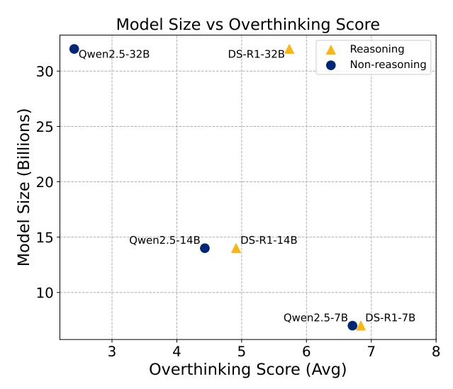

# 5. Results

We generate and evaluate 3908 trajectories using our evaluation methodology across all models. We make publicly available every trajectory alongside their corresponding overthinking score and the reasoning behind this score.

Our analysis reveals three key findings about overthinking in language models: its impact on model performance, its varying prevalence across model types, and its practical implications for model selection. Illustrated in [Figure 3.](#page-1-1) We observe that overthinking consistently impacts performance across all evaluated models, with reasoning-optimized models showing higher overthinking tendencies than generalpurpose ones as illustrated in [Figure 1.](#page-0-0)

## 5.1. Overthinking and Issue resolution

We observe a strong negative correlation between overthinking and performance on SWE-bench, as illustrated in [Fig](#page-0-0)[ure 1.](#page-0-0) Both reasoning and non-reasoning models show decreased performance as overthinking increases, though with notably different patterns.

## 5.2. Overthinking and Model Type

We make three key observations with regard to overthinking in reasoning and non-reasoning models. The results are presented in Figure [1.](#page-0-0)

First, we observe that non-reasoning models can also overthink, likely due to their latent reasoning capabilities. Recent studies suggest that non-reasoning models also exhibit reasoning abilities [\(Wei et al.,](#page-10-10) [2023;](#page-10-10) [Yao et al.,](#page-11-6) [2023;](#page-11-6) [Chen](#page-9-17) [et al.,](#page-9-17) [2023;](#page-9-17) [Kojima et al.,](#page-9-18) [2023\)](#page-9-18).

Second, reasoning models exhibit significantly higher overthinking scores than non-reasoning models, as shown in [Table 3.](#page-6-1) Since these models are explicitly trained for reasoning and generate extended chains of thought by simulating environmental interactions, they are more likely to suffer overthinking manifestations.

| Model         | β1      | R2    | p-value |
|---------------|---------|-------|---------|
| Reasoning     | -7.894  | 0.892 | 0.000   |
| Non-Reasoning | -15.938 | 0.839 | 0.010   |

Table 1. Regression Results for Reasoning and Non-Reasoning Models

Lastly, we also observe that non-reasoning models that overthink suffer from severe degradation in issue resolution, as indicated by the beta coefficients in [Table 1.](#page-5-0) A lower beta coefficient corresponds to a more significant impact of overthinking on performance. We suspect that since nonreasoning models are not trained for reasoning, they are

| Measure              | Value             |  |  |
|----------------------|-------------------|--|--|
| Reasoning Models     | $3.505 \pm 1.774$ |  |  |
| Non-Reasoning Models | $2.228\pm0.751$   |  |  |

Table 2. Average Overthinking Scores for Reasoning and Non-Reasoning Models

not capable of handling reasoning chains effectively, thus showing worse results.

## 5.3. Overthinking and Model Size

Our evaluation examines two model families across three size variants (32B, 14B, 7B): the non-reasoning Qwen2.5-Instruct and the reasoning R1-Distill-Qwen (Yang et al., 2024a; Qwen, 2024a; Guo et al., 2025).

As illustrated in Figure 6, our analysis suggests a negative correlation between model size and overthinking behavior. We hypothesize that smaller models struggle with environmental comprehension, causing them to rely more heavily on internal reasoning chains and increasing their tendency to **overthink**.

The relationship between model size and overthinking manifests differently across model types. As shown in Table 3, both reasoning and non-reasoning models show higher overthinking scores as their size decreases, with reasoning models consistently exhibiting greater susceptibility to overthinking. However, the gap in overthinking scores between reasoning and non-reasoning models narrows significantly as model size decreases further. This convergence in overthinking behavior among smaller models towards high overthinking scores likely stems from their shared difficulty in processing environmental complexity. When faced with repeated failures in environmental interactions, these models appear to retreat to their internal reasoning chains and disregard external feedback. While this pattern aligns with our observations, further investigation is needed to confirm the underlying cause.

| Measure        | Value             |  |  |
|----------------|-------------------|--|--|
| DS-R1 Family   | $6.700 \pm 1.656$ |  |  |
| Qwen2.5 Family | $5.001 \pm 1.732$ |  |  |

Table 3. Overthinking Score Comparison for R1 and Qwen2.5

### 5.4. Overthinking and Token Usage

Prior research has suggested that token usage can serve as an indicator for overthinking (Chen et al., 2024b). To investigate this relationship, we analyze the o1 model, manipulating its reasoning effort parameter between high and low settings, which directly influences the number of rea-

> **[图片提取文字 (无描述)]:**
> Model Size vs Overthinking Score Reasoning Qwen2.5-32B DS-R1-32B Non-reasoning 30 Model Size (Billions) Qwen2.5-14B DS-R1-14B 10 Qwen2.5-7B DS-R1-7B 3 Overthinking Score (Avg)

Figure 6. This graph showcases that both families suggest negative correlations between overthinking and model size. With reasoning and non-reasoning models showing close overthinking scores in their 7B and 14B counterparts

soning tokens used (OpenAI, 2025a).

Our analysis reveals that o1 models with low reasoning effort demonstrate 35% higher overthinking scores compared to their high-effort counterparts. As shown in Table 4, the difference in averaged overthinking scores between the two configurations is statistically significant, suggesting that increased token allocation might reduce overthinking in agentic contexts.

This finding challenges the perception that increased reasoning token usage correlates with overthinking as shown by some recent studies (Chen et al., 2024b). Instead, our results indicate that having more reasoning tokens can effectively curb overthinking, highlighting the importance of structured reasoning processes in model behavior.

| Measure | Value             |  |  |
|---------|-------------------|--|--|
| ol Low  | $2.774 \pm 3.081$ |  |  |
| ol High | $2.426 \pm 2.880$ |  |  |

Table 4. Overthinking scores comparison between o1 model configurations with low and high reasoning effort settings

## 5.5. Overthinking and Context Window

We analyze models across different context window sizes, ranging from 8K to 32K tokens. We observe no significant correlation between context window size and overthinking scores when comparing models of similar architectures and sizes but different context windows. For instance, comparing Qwen2.5-32B (32K context) with QwQ-32B (32K

context) shows overthinking scores of 2.31 ± 0.42 and 2.28 ± 0.39 respectively (p > 0.05).

We hypothesize that this lack of correlation may be because overthinking behaviors are more influenced by a model's architectural design and training approach rather than its context capacity. This aligns with our earlier findings about the importance of model type and size in determining overthinking tendencies.

## 5.6. Practical Implications

OpenAI showcased that reasoning models exhibit a disproportionate increase in computational costs relative to their performance gains [\(ARC,](#page-9-20) [2024\)](#page-9-20). Our experiments with SWE-bench Verified dataset confirm this observation: o1 with high reasoning effort achieves a 29.1% resolution rate at \$1,400, while the low reasoning variant reaches 21.0% at \$400 — a 3.5× cost difference for an 8.1 percentage point improvement in performance.

Metrics. To address this efficiency gap, we computed the (1) Pass@k, which represents the percentage of tasks where at least one successful solution is found among K sampled trajectories, and (2) Lowest Overthinking@K, which selects the trajectory with the lowest overthinking score among K samples and reports the percentage of these selected trajectories that are successful. Pass@K evaluates the model's ability to find any working solution (i.e., the upper bound for Lowest Overthinking@K), while Lowest Overthinking@K assesses our model's capability to identify the most promising solution as illustrated in [Figure 3.](#page-1-1) The confidence intervals (CI) showcased were computed using Wilson score [\(Wallis,](#page-10-8) [2013\)](#page-10-8)

This method of selecting solutions based on overthinking scores yields impressive efficiency gains. By limiting to two samples with the lowest reasoning, we achieve a 27.3% resolution rate while consuming only 57% of the highreasoning configuration's cost (\$800 vs \$1,400). Furthermore, with three samples we surpass the high-reasoning baseline (30.3% vs 29.1%) while still saving \$200 in computational costs. Our findings demonstrate that monitoring and controlling overthinking behavior is a highly effective strategy for optimizing both the performance and efficiency of language reasoning models in real-world applications.

