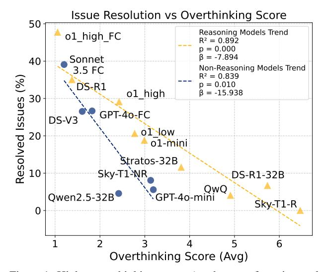
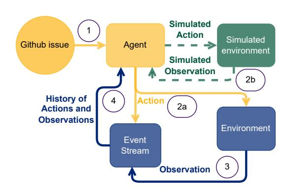
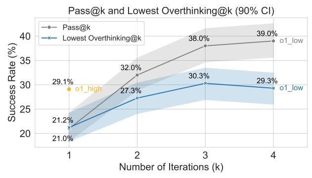

# The Danger of Overthinking: Examining the Reasoning-Action Dilemma in Agentic Tasks

Alejandro Cuadron 12 Dacheng Li 1 Wenjie Ma 1 Xingyao Wang 3 Yichuan Wang 1 Siyuan Zhuang 1 Shu Liu 1 Luis Gaspar Schroeder 1 Tian Xia 1 Huanzhi Mao 1 Nicholas Thumiger 2 Aditya Desai 1 Ion Stoica 1 Ana Klimovic 2 Graham Neubig 4 Joseph E. Gonzalez 1

### **Abstract**

Large Reasoning Models (LRMs) represent a breakthrough in AI problem-solving capabilities, but their effectiveness in interactive environments can be limited. This paper introduces and analyzes **overthinking** in LRMs—a phenomenon where models favor extended internal reasoning chains over environmental interaction. Through experiments on software engineering tasks using SWE Bench Verified, we observe three recurring patterns: Analysis Paralysis, Rogue Actions, and Premature Disengagement. We propose a framework to study these behaviors, which correlates with human expert assessments, and analyze 4018 **trajectories**. We observe that higher overthinking scores correlate with decreased performance, with reasoning models exhibiting stronger tendencies toward overthinking compared to non-reasoning models. Our analysis reveals that simple efforts to mitigate overthinking in agentic environments such as selecting the solution with the lower overthinking score — can improve model performance by almost 30% while reducing computational costs by 43%. These results suggest that mitigating overthinking has strong practical implications. We suggest that by leveraging native function-calling capabilities and selective reinforcement learning overthinking tendencies could be mitigated. We also open-source our evaluation framework and dataset to facilitate research in this direction at https://github.com/ AlexCuadron/Overthinking.

> **[图片提取文字 (无描述)]:**
> Issue Resolution vs Overthinking Score 50 Reasoning Models Trend o1 high FC  $R^2 = 0.892$ p = 0.000 $\beta = -7.894$ Sonnet 40 Non-Reasoning Models Trend 3.5 FC  $R^2 = 0.839$ Resolved Issues (%) p = 0.010DS-R1 o1 high  $\beta = -15.938$ GPT-40-FC DS-V3 ol low o1-mini Stratos-32B Sky-T1-NR DS-R1-32B QwQ Qwen2.5-32B GPT-40-mini Sky-T1-R 0 6 Overthinking Score (Avg)

Figure 1. Higher overthinking scores (tendency to favor internal reasoning over environmental feedback) correlate with lower issue resolution rates across all models. Reasoning models exhibit consistently higher overthinking tendencies, suggesting that excessive reliance on internal simulation impairs task performance. Model nomenclature: "FC" indicates native function calling capability, "DS" represents DeepSeek models, and suffixes o1\_high and o1\_low denote models with reasoning effort set to high and low respectively.

### 1. Introduction

Large Reasoning Models (LRMs) (Guan et al., 2025; Xu et al., 2025), such as OpenAI's o1 (OpenAI, 2024e), Alibaba's QwQ (Qwen, 2024b), or Deepseek's R1 (Guo et al., 2025) represent a breakthrough in large language models (LLMs). These advanced systems have fundamentally redefined AI's problem-solving capabilities across various domains (Besta et al., 2025). In particular, LRM's self-correction abilities enable them to achieve impressive scores in several benchmarks, such as AIME 2024 (AoPS, 2024), MMLU (Hendrycks et al., 2021), or GPQA-Diamond (Rein et al., 2023) among others (Guo et al., 2025; OpenAI, 2024e;d; Qwen, 2024b; Guan et al., 2025).

Despite extensive analysis of LRMs in non-agentic environ-

&lt;sup>1Department of EECS, University of California, Berkeley, USA 2Department of Computer Science, ETH, Zurich, Switzerland 3Department of Computer Science, University of Illinois Urbana-Champaign, USA 4Department of Computer Science, Carnegie Mellon University, USA. Correspondence to: Alejandro Cuadron <acuadron@berkeley.edu>.

> **[图片提取文字 (无描述)]:**
> Simulated Action Simulated Github issue Agent environment Simulated Observation 2b History of Action 2a Actions and Observations Environment Event Stream 3 Observation

Figure 2. OpenHands Execution Pipeline. 1) The system initializes by presenting the agent with the primary issue and previous action history. 2) The agent reaches a decision point – 2a) Direct action formulation and execution, or 2b) Internal simulation of potential actions and outcomes, potentially leading to **overthinking**. 3) The chosen action is executed, generating environmental feedback which updates the event stream. This cycle continues until task completion.

ments, there remains a critical gap in understanding how LRMs perform in agentic environments (Smeyatsky, 2024), where models must simultaneously gather, retain, and act upon new information to complete their tasks (Zhang et al., 2024; Yang et al., 2024b). In this context, LRMs face a fundamental challenge: models must choose between engaging directly with their environment or relying on internal reasoning about potential actions and their hypothetical consequences, a challenge we define as the *Reasoning-Action Dilemma*.

In this work, we present the first comprehensive empirical study of LRMs in agentic tasks at balancing the Reasoning-Action Dilemma, using real-world software engineering tasks as our experimental framework (Jimenez et al., 2024; Yang et al., 2024b). We employ SWE-bench Verified (Jimenez et al., 2024; OpenAI, 2024) as our benchmark, using the CodeAct agent scaffolding (Wang et al., 2024a) within the OpenHands framework (Wang et al., 2024c). This setup creates a controlled environment where models must balance information gathering with reasoning chains while maintaining context across multiple interactions as illustrated in Figure 2. A proper balance becomes critical as too much reliance on internal reasoning chains might lead to false assumptions about the environment.

We observe that LRMs exhibit a consistent pattern of favoring internal simulation over environmental interaction in the Reasoning-Action Dilemma, spending increasing amounts of time constructing elaborate chains of predicted actions rather than adapting to actual system responses, a

> **[图片提取文字 (无描述)]:**
> Pass@k and Lowest Overthinking@k (90% CI) Pass@k 39.0% 40 Lowest Overthinking@k 38.0% o1 low Success Rate (%) 22 22 22 22 22 22 22 22 22 22 22 22 22 32.0% 30.3% 29.3% 29.1% o1 low 27.3% 21.2% 20 21.0% Number of Iterations (k)

Figure 3. Performance comparison of Pass@k and Lowest Overthinking@k on SWE-bench Verified. Pass@k represents the success rate when considering k solutions, while Lowest Overthinking@k shows the success rate when selecting the solution with minimal overthinking from k samples. Using k=2 samples with low reasoning effort, we achieve a 27.3% success rate while reducing computational costs by 43% compared to high reasoning configurations. Increasing to k=3 further improves performance to 30.3% surpassing the high configuration using 15% less computational costs. The confidence intervals (CI) were computed using Wilson score (Wallis, 2013).

### phenomenon we define as overthinking.

To quantify **overthinking**, we develop and validate a systematic evaluation framework using LLM-as-a-judge (Zheng et al., 2023) that identifies three key patterns: Analysis Paralysis, Rogue Actions, and Premature Disengagement (Figure 4). Our scoring system strongly correlates with human expert assessments (Figure 5), confirming its reliability in measuring a model's tendency to favor internal simulation over environmental interaction. We applied this framework to analyze **4018 trajectories**, creating a comprehensive open-source dataset to advance research in balancing reasoning and action in agentic environments.

Statistical analysis reveals two distinct patterns in overthinking behavior. First, regression analysis demonstrates a significant negative correlation between overthinking and issue resolution rates for both reasoning and non-reasoning models (Figure 1), with the latter showing a steeper decline in performance as overthinking increases. Second, a direct comparison reveals that reasoning models consistently exhibit higher overthinking scores—nearly three times higher than non-reasoning models—with this difference being statistically significant as shown afterward in Table 2. These patterns suggest that while all models are susceptible to overthinking, reasoning models are particularly prone to this behavior.

Addressing overthinking yields substantial practical benefits. Running o1 with high reasoning effort achieves 29.1% issue resolution but costs \$1,400, while the low reasoning variant reaches 21.0% at  $3.5 \times$  lower cost (\$400). Instead of using the expensive high-reasoning configuration, we found that

generating two solutions with low reasoning effort (\$800 total) and selecting the one with a lower overthinking score achieves 27.3% resolution rate [\(Figure 3\)](#page-1-1). This simple strategy nearly matches the performance of high-reasoning configurations while reducing computational costs by 43%, demonstrating that overthinking mitigation can dramatically improve the efficiency of LRMs in real-world applications.

Additionally, we suggest two potential approaches to mitigate overthinking in LRMs in agentic environments: native function-calling capabilities and selective reinforcement learning. Both approaches could significantly reduce overthinking while improving model performance, with functioncalling models showing particularly promising results [\(Sec](#page-7-0)[tion 6.3\)](#page-7-0). To facilitate further research into these solutions, we release our evaluation framework and dataset, enabling the broader research community to build upon these findings across different environments and architectures.

