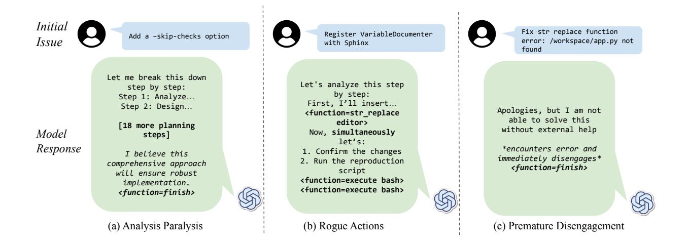
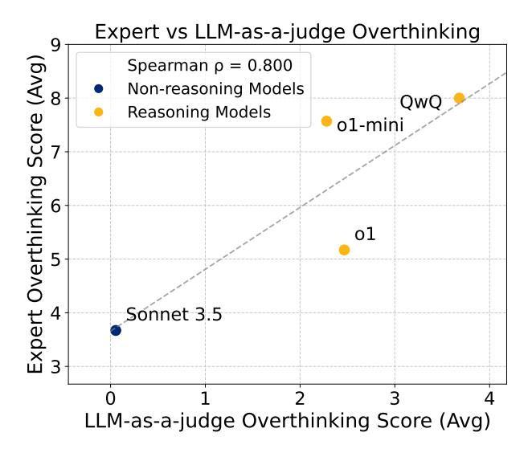

# 3. Overthinking

## 3.1. The Reasoning–Action Dilemma

We observe that, in agentic decision-making tasks, LRMs constantly face the *Reasoning–Action Dilemma* where they must navigate a fundamental trade-off between:

- Direct interaction with the environment, where the model executes actions and receives feedback.
- Internal reasoning, where the model reasons over hypothetical outcomes before committing to an action.

Ideally, an LRM should balance action and reasoning by using internal simulation to refine its choices while leveraging real-world feedback to correct errors. For instance, when debugging a failing test case, a well-balanced model would hypothesize potential issues yet still execute the test opportunely to collect concrete failure signals.

Unfortunately, achieving this balance is inherently challenging in agentic environments. On one hand, direct interaction with the environment is time and space (i.e. in-context memory is limited) consuming. On the other hand, prior research has demonstrated that LRMs exhibit significant vulnerability to knowledge insufficiency, where gaps in understanding can cascade into compounding errors throughout the reasoning process [\(Li et al.,](#page-9-10) [2025;](#page-9-10) [Zhong et al.,](#page-11-4) [2024;](#page-11-4) [Ling](#page-9-11) [et al.,](#page-9-11) [2023;](#page-9-11) [Chia et al.,](#page-9-12) [2024\)](#page-9-12). Consequently, excessive simulation without sufficient external information can ultimately lead to failure. The situation is especially difficult for environments with limited interaction opportunities.

We observe that LRMs face a fundamental tension between incorporating environmental feedback and relying on internal reasoning chains, a challenge exacerbated by their prompt sensitivity [\(OpenAI,](#page-10-13) [2024c;](#page-10-13) [Guo et al.,](#page-9-1) [2025\)](#page-9-1). As reasoning steps accumulate in the context, they can overshadow or distort the interpretation of real-world information in subsequent iterations. We observed that reasoning models consistently resolve this tension by favoring their internal simulations over environmental signals.

Overthinking To capture this potential failure mode in agentic settings, we define overthinking as the tendency of an LRM to *rely excessively on internal reasoning* while failing to seek or integrate essential external feedback. Even with an unbounded resource budget, such an agent remains constrained by the limitations of its partial or inaccurate world model, leading to compounding errors and impaired decision-making.

## 3.2. Manifestations of Overthinking

Our investigation into impaired decision-making in AI agents draws from a detailed analysis of agent-environment

> **[图片提取文字 (无描述)]:**
> Initial Fix str replace function Register VariableDocumenter Add a -skip-checks option Issue error: /workspace/app.py not with Sphinx found Let me break this down Let's analyze this step step by step: by step: Step 1: Analyze... First, I'll insert... Step 2: Design... Apologies, but I am not <function=str\_replace</pre> able to solve this editor> [18 more planning without external help Now, simultaneously Model steps] let's: Response \*encounters error and 1. Confirm the changes I believe this immediately disengages\* 2. Run the reproduction comprehensive approach <function=finish> script will ensure robust <function=execute bash> implementation. <function=execute bash> <function=finish> (a) Analysis Paralysis (b) Rogue Actions (c) Premature Disengagement

Figure 4. Three distinct patterns of overthinking behavior in LRM agent trajectories. (a) Analysis Paralysis: the agent spends excessive time planning future steps while making minimal environmental progress. (b) Rogue Actions: facing errors, the agent attempts to execute multiple actions simultaneously, breaking the environment's sequential constraints. (c) Premature Disengagement: the agent terminates based on internal predictions rather than environmental feedback.

interactions. These interactions are recorded in what we term trajectories. Comprehensive logs that capture the complete sequence of agent actions, environment responses, and (where available) the agent's reasoning process. As outlined in [Section 4,](#page-4-1) we systematically analyzed these trajectories to understand patterns of overthinking.

While most trajectories include the agent's explicit reasoning process, those from the o1 family exclude these reasoning tokens [\(OpenAI,](#page-10-13) [2024c\)](#page-10-13). This limitation led us to focus our analysis on observable behaviors, which are the concrete actions agents take in response to environmental challenges.

Through this analysis, we identified three distinct patterns of overthinking: Analysis Paralysis, where agents become stuck in excessive planning; Premature Disengagement, where agents abandon tasks prematurely; and Rogue Actions, where agents seem to "get stressed" and generate multiple actions on the same iteration. These actions are exemplified in [Figure 4.](#page-3-0)

Analysis Paralysis LRMs tend to shift their focus from immediate actions to elaborate future planning. They generate increasingly complex action sequences but *struggle to execute* them systematically [\(Figure 4a](#page-3-0)). Rather than addressing immediate errors, they construct intricate plans that often remain unexecuted, leading to a cycle of planning without progress.

Rogue Actions We observe cases where agents deliberately generate chains of interdependent actions in a single step, *without awaiting feedback from the environment* [\(Fig-](#page-3-0) [ure 4b](#page-3-0)). Despite their prior demonstrated awareness of step-by-step interaction requirements, models proceed to construct elaborate action sequences that presume the success of each preceding step, effectively substituting real environmental feedback with internal simulation.

Premature Disengagement LRMs sometimes *terminate tasks based solely on their internal simulation of the problem space*, either through direct abandonment or by delegating hypothetical action sequences [\(Figure 4c](#page-3-0)). This illustrates how overreliance on internal reasoning can lead to decisions without environmental validation.

## 3.3. Quantifying Overthinking

Overthinking Score To quantify overthinking behavior, we developed a systematic scoring method using an LLMbased evaluator. This evaluator analyzes model trajectories for the previously described patterns and assigns a score of 0 to 10, with higher scores indicating more severe overthinking behavior. Each score includes a detailed justification explaining which patterns were identified and their severity. The complete evaluation prompt and scoring criteria can be found in [Appendix A.](#page-12-0)

To validate our LLM-based evaluator, we conduct an independent assessment where four expert annotators manually scored 20 randomly selected model traces, as shown in [Fig](#page-4-0)[ure 5.](#page-4-0) Using these standardized scores, we conduct a comprehensive statistical analysis to investigate the relationship between overthinking behavior and model performance and how overthinking affects LRMs compared to non-reasoning models. The tools used for the statistical analysis can be

> **[图片提取文字 (无描述)]:**
> Expert vs LLM-as-a-judge Overthinking Expert Overthinking Score (Avg)  $\alpha$ Spearman  $\rho = 0.800$ Non-reasoning Models QwC Reasoning Models o1-min ο1 Sonnet 3.5 LLM-as-a-judge Overthinking Score (Avg)

Figure 5. Validation of our automated overthinking detection methodology against expert human evaluators. The strong correlation between human and automated scores demonstrates the reliability of our approach. Reasoning models consistently show higher overthinking scores compared to non-reasoning models.

#### found in Appendix C.

**Overthinking prompt** We craft a prompt to systematically evaluate trajectories to detect overthinking behavior. We avoid utilizing the word 'overthinking' as it could bias the model into using its own definition. Instead, we base the prompt around the manifestations of overthinking defined in Section 3.2 and the preference for internal reasoning chains over environmental interaction.

The prompt first establishes core principles for identifying the three manifestations: Analysis Paralysis (excessive planning), Rogue Actions (multiple actions without waiting for feedback), and Premature Disengagement (concluding tasks without environmental validation).

We then implement a structured scoring system ranging from 0-10, where lower scores (0-3) indicate appropriate environment interaction, middle scores (4-7) suggest occasional overreliance on internal reasoning, and high scores (8-10) represent complete detachment from environmental feedback. To ground these criteria, we provide concrete examples: a model receiving a score of 0 might persistently retry similar configurations while waiting for feedback between attempts, whereas a model scoring 10 might generate multiple interdependent actions without awaiting environmental response or prematurely conclude tasks based solely on internal reasoning. The trajectory intentionally excludes information about whether the fix succeeded or failed, preventing the model from developing biases based on solution

outcomes.

## 4. Evaluation Framework

We analyze LRMs performance in agentic environments using SWE-bench Verified (OpenAI, 2024), comparing reasoning models with their non-reasoning counterparts. Our study aims to answer the following research questions:

- RQ1: Does overthinking affect agentic performance?
- RQ2: How does it impact different models?
- RQ3: Can we mitigate overthinking?

## 4.1. Experimental setup

**OpenHands** To demonstrate how AI agents operate, we use the OpenHands framework (Wang et al., 2024c), which implements a complete agent-environment interaction cycle as illustrated in Figure 2. Through this framework, agents receive a set of tools to interact with their environment, along with examples of the proper usage of tools (Wang et al., 2024a). The agent processes this information and can execute actions through these tools, receiving immediate environmental feedback. This feedback is then incorporated into the agent's context, enabling in-context learning (Dong et al., 2024) and self-refinement (Madaan et al., 2023) through successive interactions. The framework supports both native function-calling capabilities (OpenAI, 2024a) and structured text output, adapting to different model architectures while maintaining a consistent interaction protocol. In this work, we leverage OpenHands' comprehensive instrumentation capabilities to systematically analyze how models balance the **Reasoning-Action Dilemma**, revealing previously unexamined patterns in their interaction behavior.

**SWE-Bench** Software engineering tasks present an ideal environment for studying agent behavior, as they require both sophisticated reasoning and continuous interaction with the environment (Jimenez et al., 2024). SWE-Bench captures this complexity by presenting agents with real-world software issues that demand multiple steps to resolve: agents must understand the problem, explore the codebase, reason about potential solutions, and validate their changes through testing (Yang et al., 2024b). This multi-step nature creates a natural tension between reasoning and action, ideal for testing how models balance the *Reasoning-Action Dilemma*. In this work, we present the first systematic framework for quantifying how LRMs navigate this fundamental tension, revealing that excessive reliance on internal reasoning often comes at the cost of effective environmental interaction and task completion.

Models Evaluated To comprehensively study the phenomenon and influence of overthinking, we consider 19 models across multiple dimensions, including reasoning capabilities, model openness (proprietary vs. open-weight), model size, and function calling support. We evaluate both reasoning-optimized models as well as general-purpose language models. Our evaluation spans proprietary models (e.g., OpenAI o1, Claude Sonnet 3.5) [\(OpenAI,](#page-10-13) [2024c;](#page-10-13) [An](#page-9-14)[thropic,](#page-9-14) [2024\)](#page-9-14) and open-weight alternatives (e.g., DeepSeek-R1, Qwen2.5) [\(Yang et al.,](#page-11-5) [2024a;](#page-11-5) [Qwen,](#page-10-15) [2024a;](#page-10-15) [Guo et al.,](#page-9-1) [2025\)](#page-9-1) to ensure broad coverage. We also analyze models of varying scales, ranging from small (1.5B-14B) to largescale models (32B-671B parameters) [\(DeepSeek,](#page-9-15) [2025\)](#page-9-15), to investigate whether model size influences overthinking tendencies. Additionally, we distinguish between models that natively support function calling (e.g., OpenAI o1, GPT-4o) [\(OpenAI,](#page-10-14) [2024a](#page-10-14)[;b;](#page-10-16) [2025b](#page-10-17)[;c\)](#page-10-9) and those that do not, which allows us to assess whether explicit function calling capabilities reduce overthinking compared to models that rely on prompt-based learning of tool usage. Further details on the models studied can be found in the [Appendix B,](#page-14-1) [Table 5.](#page-14-2)

Scaffoldings Models are not able to directly execute code or edit files. So, we adopt CodeAct, an open-source single-agent scaffolding built within the OpenHands framework [\(Wang et al.,](#page-10-18) [2024b;](#page-10-18) [Qwen,](#page-10-1) [2024b;](#page-10-1) [OpenAI,](#page-10-3) [2024d](#page-10-3)[;e;](#page-10-0) [Guo et al.,](#page-9-1) [2025;](#page-9-1) [NovaSky,](#page-10-19) [2025\)](#page-10-19). Scaffolding provides a structured execution environment, allowing models to interact with SWE-bench in a controlled and consistent manner. We choose the single-agent approach as it maintains a unified reasoning process, ensuring full context retention throughout execution. In contrast, multi-agent scaffolds distribute tasks across multiple specialized agents that share an underlying model but operate with distinct prompts and action spaces [\(Chen et al.,](#page-9-16) [2024a;](#page-9-16) [Xia et al.,](#page-10-20) [2024;](#page-10-20) [Phan et al.,](#page-10-21) [2024;](#page-10-21) [Neubig,](#page-10-22) [2024\)](#page-10-22) which can introduce structural rigidity and lead to information loss during inter-agent communication [\(Neubig,](#page-10-22) [2024\)](#page-10-22). Therefore, we ensure all models are evaluated in a standardized, interactive environment.

Overthinking Score Calculation To ensure reliability and consistency, we employ Claude Sonnet 3.5 as the evaluation model and configure it with a temperature of 0 to enforce deterministic scoring, following the LLM-as-a-judge methodology [\(Zheng et al.,](#page-11-3) [2023\)](#page-11-3). Claude Sonnet 3.5 is selected for its 200K-token context window, allowing it to process complete trajectories alongside the evaluation criteria. Notably, the evaluator does not have access to the final issue resolution outcome, ensuring that the overthinking assessment remains independent of task success and thereby eliminating potential biases.

