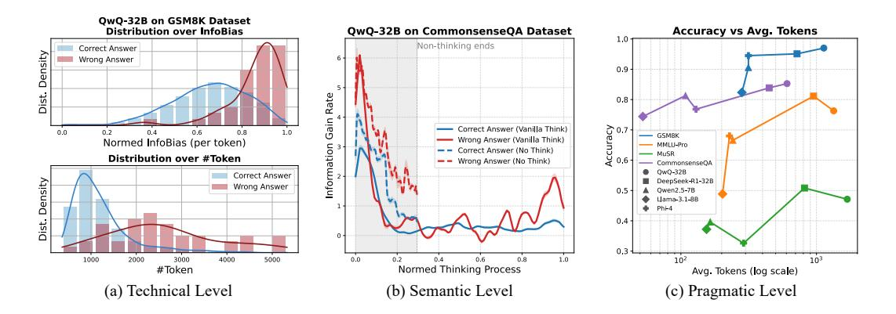

# 1 Introduction

With the paradigm of Large Language Models (LLMs) [\[Brown et al.,](#page-9-0) [2020\]](#page-9-0) extending from trainingtime scaling [\[Kaplan et al.,](#page-10-0) [2020\]](#page-10-0) to test-time scaling [\[Muennighoff et al.,](#page-10-1) [2025\]](#page-10-1), the emergence of Large Reasoning Models (LRMs) [\[Li et al.,](#page-10-2) [2025\]](#page-10-2)—such as OpenAI's o1 [\[OpenAI,](#page-10-3) [2024\]](#page-10-3), Deepseek's R1 [\[Guo et al.,](#page-9-1) [2025\]](#page-9-1), and QwQ-32B [\[Team,](#page-11-0) [2025b\]](#page-11-0)—has significantly advanced the frontier of model reasoning capabilities. However, we observe a noteworthy trend: in pursuit of better performance, these models increasingly rely on lengthy Chain-of-Thought (CoT) [\[Wei et al.,](#page-12-0) [2022\]](#page-12-0) reasoning, leading to quadratic growth in computational complexity. This prolonged internal or external "deep thinking" process contradicts the principle of cognitive economy observed in human reasoning, thereby undermining the efficiency of LRMs in practical applications [\[Su et al.,](#page-11-1) [2025\]](#page-11-1).

Inspired by Shannon's three-level model of communication [\[Shannon,](#page-11-2) [1948\]](#page-11-2), we revisit the phenomenon of excessively long reasoning chains in contemporary LRMs. At the technical level, extending the reasoning chain can be interpreted as injecting redundant bits into a noisy channel to

∗Corresponding authors.

> **[图片提取文字 (无描述)]:**
> QwQ-32B on GSM8K Dataset Distribution over InfoBias QwQ-32B on CommonsenseQA Dataset Accuracy vs Avg. Tokens 1.0 1 Non-thinking ends Correct Answer Density Wrong Answer 0.9 Dist. Rate 0.8 Gain Accuracy Correct Answer (Vanilla Think) 0.0 GSM8K Wrong Answer (Vanilla Think) Normed InfoBias (per token) MMLU-Pro Information Correct Answer (No Think) - MuSR Distribution over #Token Wrong Answer (No Think) CommonsenseOA QwQ-32B Correct Answer DeepSeek-R1-32B Density Wrong Answer ▲ Owen2.5-7B Ljama-3.1-88 Phi-4 Dist. 0.4 3000 4000 5000 0.0 0.2 0.8 1.0 103 2000 #Token Normed Thinking Process Avg. Tokens (log scale) (a) Technical Level (b) Semantic Level (c) Pragmatic Level

Figure 1: Understanding thinking inefficiency via Shannon & Weaver's Communication Model. (a) Technical Level: On the GSM8K dataset, incorrect answers exhibit higher InfoBias and longer token lengths, suggesting that longer reasoning does not necessarily lead to better outcomes. (b) Semantic Level: The InfoGain rate shows a nonlinear decline as the thinking progresses, indicating diminishing contribution to entropy reduction over the final answer space. (c) Pragmatic Level: Results across various models and benchmarks show longer reasoning yields diminishing returns and may even reduce final accuracy. Detailed calculation methods and analysis are provided in [§3.](#page-2-0)

enhance robustness against perturbations [\[Min et al.,](#page-10-4) [2022\]](#page-10-4). However, once the reasoning length exceeds the model's reasoning capacity—an analogue to channel capacity—additional redundancy ceases to improve accuracy and instead induces error accumulation and semantic drift [\(Figure 1\(](#page-1-0)a)). At the semantic level, as the number of reasoning steps increases, the information gain per step rapidly diminishes; excessive reasoning contributes little to uncertainty reduction and may even introduce semantic noise, revealing inefficiencies in the mapping between symbols and meanings [\(Figure 1\(](#page-1-0)b)). At the pragmatic level, while longer reasoning chains may improve interpretability, they impose higher computational and cognitive costs, often yielding diminishing returns [\[Sprague](#page-11-3) [et al.,](#page-11-3) [2025\]](#page-11-3)—or even performance degradation—on various tasks [\(Figure 1\(](#page-1-0)c)).

This multi-level inefficiency highlights a central contradiction in the current LRM reasoning paradigm: substantial compute investments do not consistently translate into semantic efficiency or downstream performance gains. Motivated by this insight, we pose a core question: Can we optimize the reasoning patterns of LRMs to substantially shorten reasoning chains while maintaining performance across diverse reasoning tasks?

To quantitatively assess the efficiency of a model's reasoning process, we adopt an informationtheoretic perspective and conduct in-depth analysis at two levels: (i) the response-level information bias, where we compute the mutual information between the model's generated response and the ground-truth reasoning trajectory to estimate InfoBias, capturing the overall semantic alignment across the full reasoning output [\(§3.2\)](#page-2-1); (ii) the step-level information gain, where we quantify InfoGain as the entropy reduction over the answer distribution induced by each reasoning step, reflecting how much new information is introduced at each stage of the reasoning process [\(§3.3\)](#page-3-0). Our empirical experiments [\(§3.4\)](#page-3-1) reveal a significant, nonlinear positive correlation between reasoning length and InfoBias. Notably, incorrect answers consistently exhibit higher InfoBias, and the lengths of their generated responses are often biased toward longer reasoning chains. Furthermore, step-wise analysis indicates that models often possess a degree of intuitive confidence about the correct answer even before any explicit reasoning occurs. As reasoning unfolds, the InfoGain over the answer space and the model's confidence in the correct answer evolve differently across various types of reasoning tasks. While non-reasoning modes yield higher InfoGain per step, they typically result in lower overall confidence in the final answer compared to their reasoning-enabled counterparts.

Based on these analyses, we propose an entropy-based Adaptive Think strategy that dynamically halts reasoning once the model's confidence—quantified via entropy over the answer space—exceeds a tunable threshold [\(§4\)](#page-5-0). We compare this approach against three alternative strategies: Vanilla Think, No-Think, and Gated Think. Extensive experiments [\(§5.2\)](#page-7-0) are conducted across five language models and six benchmarks covering diverse types of reasoning tasks. Experimental results demonstrate that our Adaptive Think improves both accuracy and reasoning efficiency across mathematical, factual, logical, and commonsense reasoning tasks. On two math benchmarks of varying difficulty, our method reduces token usage by 58.78% while preserving— and slightly improving— accuracy (average +0.95%). Beyond math, it boosts model accuracy by an average of 0.38% and reduces token usage by 42.39% across non-mathematical reasoning tasks. Finally, we conduct an in-depth analysis [\(§5.3\)](#page-8-0) of when and how much reasoning a model should perform.

