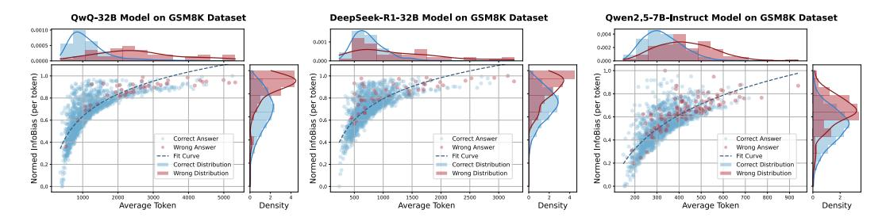

# 3.4.1 InfoBias and the Risks of Overgeneration

To examine the relationship between response length and semantic deviation, we compute InfoBias over samples drawn from both model generations and reformulated ground-truth rationales (see Appendix C.2 for details). Results on GSM8K (Figure 2) reveal two key observations:

**Findings 1: Cumulative InfoBias with Increased Reasoning Length.** We observe a consistent monotonic trend: longer reasoning chains tend to accumulate deviation from the correct reasoning path, suggesting that additional tokens often introduce noise rather than refinement. This pattern holds for both reasoning and non-reasoning models (see Appendix D.1 for more results). There is no

> **[图片提取文字 (无描述)]:**
> QwQ-32B Model on GSM8K Dataset DeepSeek-R1-32B Model on GSM8K Dataset Owen2.5-7B-Instruct Model on GSM8K Dataset 0.0010 0.001 0.0005 0.002 Normed InfoBias Correct Answer Correct Answer Correct Answer Wrong Answer Wrong Answer Wrong Answer --- Fit Curve --- Fit Curve --- Fit Curve Correct Distribution Correct Distribution Correct Distribution Wrong Distribution Wrong Distribution Wrong Distribution 1000 3000 5000 1500 3000 Average Token Average Token Average Token Density Density Density

Figure 2: Normalized InfoBias per token as a function of average reasoning length for different models on the GSM8K dataset. Blue and red points represent instances with correct and incorrect answers, respectively, with density estimates of tokens and InfoBias shown on the top and right.

sign of InfoBias saturation or decline—even strong models exhibit rising bias, implying that simply generating more tokens does not guarantee improved alignment or correctness.

Findings 2: Incorrect answers exhibit higher InfoBias and more variable response length. A pronounced separation is observed between correct and incorrect samples: incorrect answers show higher InfoBias and slightly longer reasoning chains, indicating that extended reasoning amplifies rather than corrects misalignment. Moreover, the length distribution of incorrect answers is broader, indicating greater variability and instability in how models diverge from the correct reasoning path.

