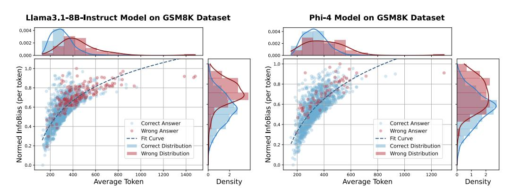

# D.1 InfoBias vs. Reasoning Length

[Figure 7](#page-20-2) broadens our evaluation by incorporating two additional models—Llama 3.1-8B-Instruct and Phi-4—and uncovers the same systematic pattern identified in [Figure 2.](#page-4-0) Specifically, as the length of the reasoning chain increases, the generated outputs progressively diverge from the ground-truth solution, highlighting a clear trade-off: each extra token tends to introduce cumulative noise. Quantitatively, we observe a steady rise in solution InfoBias metrics with longer inference trajectories. Crucially, this information drift is not confined to specialized reasoning architectures but also plagues general-purpose models, underscoring the pervasive challenge of semantic drift in current large-language systems. These results motivate the need for both output-level interventions—like adaptive chain-length control—and deeper, model-centric optimizations to mitigate drift at its source.

> **[图片提取文字 (无描述)]:**
> Liama3.1-8B-Instruct Model on GSM8K Dataset Phi-4 Model on GSM8K Dataset 0.004 0.004 0.002 0.002 -0,000 0,000 token) Normed InfoBias (per token) InfoBias Correct Answer Correct Answer Wrong Answer Wrong Answer Normed Fit Curve Fit Curve Correct Distribution Correct Distribution Wrong Distribution Wrong Distribution 0.0 200 400 600 800 1000 1200 1400 200 400 600 800 1000 1200 Density Average Token Average Token Density

Figure 7: Normalized InfoBias per token as a function of average reasoning length for Llama3.1- 8B-Instruct and Phi-4 on the GSM8K dataset. Blue and red points represent instances with correct and incorrect answers, respectively, with density estimates of tokens and InfoBias shown on the top and right. Each subplot illustrates the relationship between reasoning length and InfoBias.

