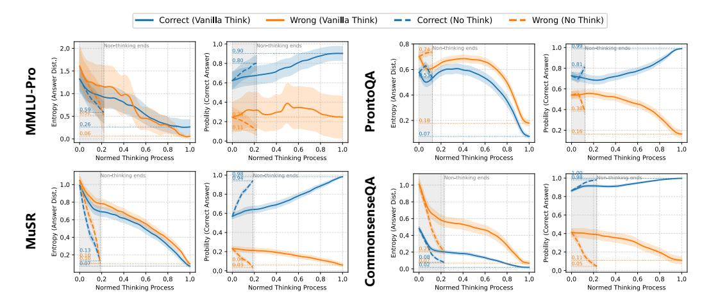

# D.2 InfoGain per Reasoning Step

Under the same experimental setup as QwQ-32B, [Figure 8](#page-20-3) plots how uncertainty-related metrics evolve throughout the reasoning process of eepSeek-R1-Distill-32B across four distinct types of reasoning tasks.

> **[图片提取文字 (无描述)]:**
> Wrong (No Think) Correct (Vanilla Think) Wrong (Vanilla Think) Correct (No Think) 0.8 Non-thinking ends Non-thinking ends M.99 ston-thinking ends 2,0 Non-thinking ends 0.90 Answer) Probility (Correct Answer) Entropy (Answer Dist.) Entropy (Answer Dist.) MMLU-Pro ProntoQA Probility (Correct 0.26 0.0 1.0 0.8 0.6 0.8 0.0 0.6 0.8 0.0 0.4 0.6 0.8 1.0 0.0 0.2 0.4 0.6 1.0 0.0 0.2 0.4 0.2 0.4 1.0 Normed Thinking Process Normed Thinking Process Normed Thinking Process Normed Thinking Process Non-thinking ends Non-thinking ends..... Non-thinking ends Won-thinking ands CommonsenseQA Answer) 8.0 Entropy (Answer Dist.)
> 7 0 0 0 0 0 0 0 0 0 0 0 0 0 0 0 0 0 0 0 (Correct Answer) Entropy (Answer Dist.) (Correct, 0.6 Probility Probility 0.2 0.0 0.0 0.4 0.6 0.8 1.0 0.0 0,2 0.4 0.6 0.8 1.0 0.6 0.8 1.0 0.4 0.6 0.8 1.0 0.0 0,4 0.0 Normed Thinking Process Normed Thinking Process Normed Thinking Process Normed Thinking Process

Figure 8: Uncertainty dynamics across different reasoning benchmarks for DeepSeek-R1- Distill-32B. It presents similar thinking dynamics on various benchmarks with QwQ-32B.

