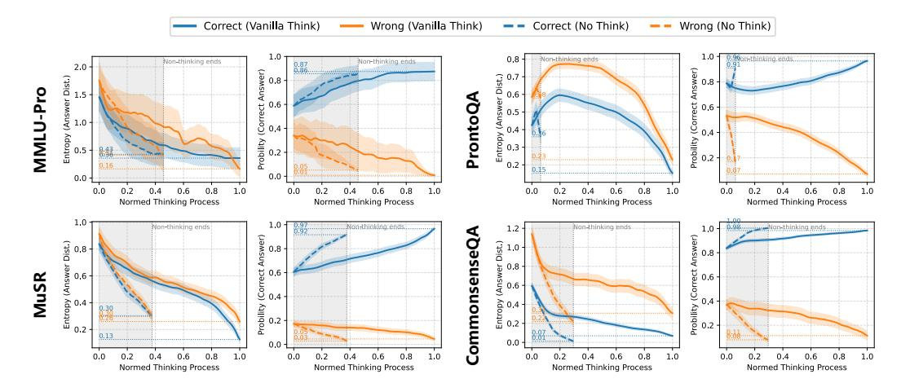

# 3.4.2 InfoGain and Step-Level Reasoning Quality

We next turn to the dynamics of reasoning steps. By segmenting rationales into paragraph-level units and measuring per-step InfoGain, we analyze how entropy and confidence evolve during inference across multiple benchmarks [\(Figure 3\)](#page-4-1). Based on further analysis, we draw the following findings.

> **[图片提取文字 (无描述)]:**
> Correct (Vanilla Think) Wrong (Vanilla Think) Wrong (No Think) Correct (No Think) 1.0 Non-thinking ends 0.90an-thinking ends, Non-thinking ends Non-thinking ends 0.87 2.0 Probility (Correct Answer) Answer) (Answer Dist.) Entropy (Answer Dist.) 0.0 12 MMLU-Pro ProntoQA Probility (Correct A Entropy -0.2 0.0 0.0 0.0 0.2 0.4 0.6 0.8 1.0 0.0 0.2 0.4 0.6 0.8 1.0 0.0 0.2 0.4 0.6 0.8 1.0 0.0 0.2 0.4 0.6 0.8 1.0 Normed Thinking Process Normed Thinking Process Normed Thinking Process Normed Thinking Process 1.0 Non-thinking ends Non-thinking ends Non-thinking ands Non-thinking ands 1.2 CommonsenseQA / (Correct Answer) Answer) (Answer Dist.) 0 0 0 1 Entropy (Answer Dist.) (Correct / 0.6 Eutropy 0.2 Probility 0.2 Probility 0.2 0.13 0.0 0.0 0.0 0.2 0.4 0.6 0.8 1.0 0.0 0.2 0.4 0.6 0.8 1.0 0.0 0.2 0.4 0.6 0.8 1.0 0.0 0.2 0.4 0.6 0.8 1.0 Normed Thinking Process Normed Thinking Process Normed Thinking Process Normed Thinking Process

Figure 3: Uncertainty dynamics across different reasoning benchmarks for QwQ-32B. Each set includes two subplots: (1) entropy of the answer distribution vs. normalized reasoning steps, and (2) model-predicted probability of the correct answer over the same steps. Blue/orange lines denote correct/incorrect predictions; solid/dashed lines correspond to Vanilla Think and No-Think. Shaded areas mark the average token proportion used in No-Think mode. Step-wise analysis shows that models often exhibit early intuitive confidence in correct answers, even before reasoning starts. As reasoning unfolds, uncertainty decreases and confidence grows in task-specific ways.

Findings 3: Reasoning Steps Consistently Reduce Uncertainty. We observe that reasoning traces leading to correct answers consistently exhibit a reduction in entropy over the answer space and a corresponding increase in confidence for the correct choice. This supports the notion that effective reasoning incrementally filters uncertainty and sharpens prediction. Moreover, while No-Think mode achieves higher information efficiency per step—rapidly lowering entropy—it typically converges to lower final confidence, limiting its reliability. By comparison,Vanilla Think involves longer and less efficient reasoning chains in terms of information gain per step, but ultimately yields more confident and accurate predictions, underscoring a trade-off between efficiency and robustness in reasoning.

**Findings 4: Reasoning Models Exhibit Initial Intuition.** Even before reasoning begins (step = 0), samples that eventually lead to correct answers already show lower entropy and higher confidence. This indicates that the models possess an initial bias or "intuitive prior" toward the correct answer even before engaging in multi-step reasoning. This effect is especially pronounced in knowledge-intensive tasks like MMLU-Pro and CommonsenseQA, suggesting that LRMs often start with strong inductive biases toward the correct choice, possibly due to extensive prior exposure during training.

**Findings 5: Task-Specific Reasoning Dynamics.** In CommonsenseQA, entropy drops rapidly at the early stages, suggesting that commonsense questions can often be resolved with minimal reasoning. Notably, No-Think mode yields higher final confidence than Vanilla Think, implying that the latter's intermediate reasoning steps may be redundant or inefficient. Meanwhile, MMLU-Pro and MuSR show smooth and monotonic entropy separation between correct and incorrect samples, reflecting tasks where gradual semantic integration is beneficial. In contrast, ProntoQA exhibits a non-monotonic pattern—entropy first rises, then falls—which may result from its binary format: early steps broaden the hypothesis space and reduce overconfidence before eventual convergence. Overall, these dynamics reflect how the task's type influence the utility of the reasoning process.

These findings highlight the potential of entropy-based signals as proxies for monitoring and controlling reasoning in LRMs. The steady accumulation of InfoBias with longer reasoning suggests that unregulated generation often leads to semantic drift, while InfoGain trends reveal diminishing returns from extended reasoning. Early confidence signals also suggest that further reasoning is often unnecessary. These insights motivate our approach: adaptively modulating reasoning depth based on entropy, allowing models to think when needed and stop when additional steps offer little value.

