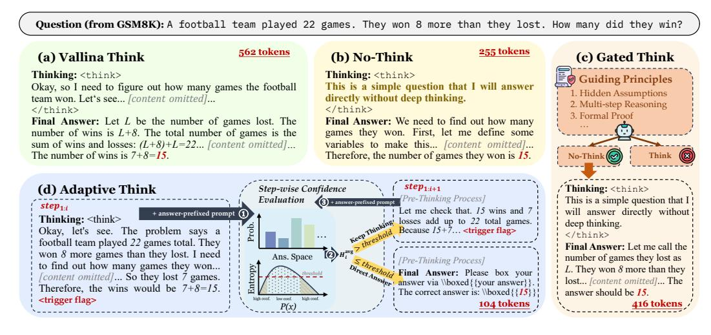

# <span id="page-5-0"></span>4 Entropy-Based Adaptive Thinking

Modern LRMs differ fundamentally from earlier non-reasoning models in both training and inference paradigms. Traditional models were typically trained with task-specific supervision to imitate step-by-step reasoning implicitly [Trung et al., 2024, Pang et al., 2025], while modern LRMs are increasingly trained via reinforcement learning to develop general-purpose reasoning capabilities [Guo et al., 2025]. At inference time, these models no longer rely solely on internal heuristics but instead generate explicit reasoning traces, often marked by structured tokens such as <think> and 
 and 
 think>. This shift enables more controllable and interpretable reasoning, opening new avenues for modulating the reasoning process dynamically. Based on this paradigm, we design and evaluate several distinct reasoning modes, as shown in Figure 4.

> **[图片提取文字 (无描述)]:**
> Question (from GSM8K): A football team played 22 games. They won 8 more than they lost. How many did they win? 562 tokens 255 tokens (a) Vallina Think (b) No-Think (c) Gated Think Guiding Principles Thinking: <think> Thinking: <think> This is a simple question that I will answer Okay, so I need to figure out how many games the football 1. Hidden Assumptions team won. Let's see... [content omitted]... directly without deep thinking. 2. Multi-step Reasoning </think> </think> 3. Formal Proof **Final Answer:** Let L be the number of games lost. The Final Answer: We need to find out how many number of wins is L+8. The total number of games is the games they won. First, let me define some sum of wins and losses: (L+8)+L=22... [content omitted]... variables to make this... [content omitted]... The number of wins is 7+8=15. Therefore, the number of games they won is 15. No-Think  $step_{1:i+1}$ Thinking: <think> (d) Adaptive Think Step-wise Confidence Pre-Thinking Process ] Evaluation This is a simple question that I! + answer-prefixed prompt step1: Let me check that, 15 wins and 7 will answer directly without + answer-prefixed prompt (1) Thinking: <think> losses add up to 22 total games. deep thinking. Because 15+7... <trigger flag> Okay, let's see. The problem says a </think> football team played 22 games total. They Final Answer: Let me call the won 8 more games than they lost. I need Ans. Space O Ha number of games they lost as [Pre-Thinking Process] to find out how many games they won... Entropy L. They won 8 more than they Final Answer: Please box your [content omitted]... So they lost 7 games. lost... [content omitted]... The answer via \\boxed{{your answer}}. Therefore, the wins would be 7+8=15. The correct answer is: \boxed{{15}}} answer should be 15. <trigger flag> 104 tokens P(x)


<span id="page-5-1"></span>Figure 4: An illustration of four thinking modes on a sample question from the GSM8K dataset.

- (a) Vanilla Think. It represents the model's default reasoning pattern, in which it first engages in an extended chain-of-thought process in response to a given question, generating intermediate reasoning steps before eventually producing a final answer based on the full context of its prior thinking.
- **(b) No-Think.** While most current reasoning models are designed to perform detailed reasoning before producing an answer, it is possible to steer the model toward bypassing this process by modifying the chat template. A common strategy involves forcing the thinking box to remain empty during decoding [Team, 2025a]. However, we find that using the following prompt more effectively encourages the model to adopt a non-reasoning mode when generating its response.

```
<think>
This is a simple question that I will answer directly without deep thinking.
</think>
```

- (c) Gated Think. This setting represents a hybrid of the Vanilla Think and No-Think modes. Given a question, the model is prompted to first assess whether deep thinking is necessary—typically performing this assessment in a no-think mode. To guide this process, we design a heuristic framework that considers several factors, such as whether the question requires inference beyond surface-level cues, involves multi-step reasoning or information synthesis, demands rigorous logical or mathematical justification, presents multiple plausible strategies, or calls for hypothesis-driven analysis. Based on this assessment, the model proceeds in either deep thinking or direct-answer mode. Detailed criteria and prompt are provided in the Appendix C.4.
- (d) Adaptive Think. Empirical results in §3.4 reveal that information bias with respect to the correct reasoning path tends to accumulate as the response length increases. Each reasoning step contributes to reducing entropy over the answer space and increasing confidence in the correct answer, forming clear trends. Since entropy reflects the model's uncertainty over the answer distribution, we propose an Adaptive Think strategy to dynamically decide when to terminate reasoning. After each intermediate reasoning step, the model computes the average entropy  $H_i^{\text{avg}} = \frac{1}{l} \sum_{i=1}^{l} H_i$  over the answer space. Reasoning is terminated early once the average entropy falls below a confidence threshold, which is parameterized by a hyperparameter  $\alpha \in [0,1]$ —with smaller values of  $\alpha$  corresponding to stricter entropy thresholds. To formalize this, we note that the entropy of a discrete distribution (i.e., the function  $-p\log_2 p$ ) is upper-bounded by  $1/e\ln 2$  when  $p \in (0,1]$ . Using this bound, we define the following stopping criterion at the i-th step:

$$\begin{cases} \text{Output the final answer directly} & \text{if } H_i^{\text{avg}} \leq \alpha \cdot \frac{1}{e \ln 2} \\ \text{Continue reasoning} & \text{otherwise} \end{cases} . \tag{6}$$

When the model is determined to have reached sufficient confidence and no further thinking is needed, we follow the approach introduced by Muennighoff et al. [2025], prompting the model to generate a final response by appending an 
 description of the model is still within the thinking phase—followed by an answer-prefixed prompt to elicit the final output.

