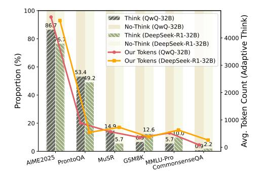

# 5.3 In-Depth Analysis

> **[图片提取文字 (无描述)]:**
> 100 OOO 000 000 (Adaptive Think) Think (QwQ-32B) 86.7 No-Think (QwQ-32B) Think (DeepSeek-R1-32B) 80 No-Think (DeepSeek-R1-32B) Our Tokens (QwQ-32B) Proportion (%) Our Tokens (DeepSeek-R1-32B) 60 53.4 2000 40 -1000 20 149 12.6 10.0 5.7 0.92.2 MMLU-Pro CommonsenseQA AIME2025 ProntoQA GSM8K MUSR

1000 (8) No 600 U Sylvino (9) 1000 (8) 1000 U Sylvino (9) 1000 U Sylvino (9) 1000 U Sylvino (1000 U Sylvino (1000 U Sylvino (1000 U Sylvino (1000 U Sylvino (1000 U Sylvino (1000 U Sylvino (1000 U Sylvino (1000 U Sylvino (1000 U Sylvino (1000 U Sylvino (1000 U Sylvino (1000 U Sylvino (1000 U Sylvino (1000 U Sylvino (1000 U Sylvino (1000 U Sylvino (1000 U Sylvino (1000 U Sylvino (1000 U Sylvino (1000 U Sylvino (1000 U Sylvino (1000 U Sylvino (1000 U Sylvino (1000 U Sylvino (1000 U Sylvino (1000 U Sylvino (1000 U Sylvino (1000 U Sylvino (1000 U Sylvino (1000 U Sylvino (1000 U Sylvino (1000 U Sylvino (1000 U Sylvino (1000 U Sylvino (1000 U Sylvino (1000 U Sylvino (1000 U Sylvino (1000 U Sylvino (1000 U Sylvino (1000 U Sylvino (1000 U Sylvino (1000 U Sylvino (1000 U Sylvino (1000 U Sylvino (1000 U Sylvino (1000 U Sylvino (1000 U Sylvino (1000 U Sylvino (1000 U Sylvino (1000 U Sylvino (1000 U Sylvino (1000 U Sylvino (1000 U Sylvino (1000 U Sylvino (1000 U Sylvino (1000 U Sylvino (1000 U Sylvino (1000 U Sylvino (1000 U Sylvino (1000 U Sylvino (1000 U Sylvino (1000 U Sylvino (1000 U Sylvino (1000 U Sylvino (1000 U Sylvino (1000 U Sylvino (1000 U Sylvino (1000 U Sylvino (1000 U Sylvino (1000 U Sylvino (1000 U Sylvino (1000 U Sylvino (1000 U Sylvino (1000 U Sylvino (1000 U Sylvino (1000 U Sylvino (1000 U Sylvino (1000 U Sylvino (1000 U Sylvino (1000 U Sylvino (1000 U Sylvino (1000 U Sylvino (1000 U Sylvino (1000 U Sylvino (1000 U Sylvino (1000 U Sylvino (1000 U Sylvino (1000 U Sylvino (1000 U Sylvino (1000 U Sylvino (1000 U Sylvino (1000 U Sylvino (1000 U Sylvino (1000 U Sylvino (1000 U Sylvino (1000 U Sylvino (1000 U Sylvino (1000 U Sylvino (1000 U Sylvino (1000 U Sylvino (1000 U Sylvino (1000 U Sylvino (1000 U Sylvino (1000 U Sylvino (1000 U Sylvino (1000 U Sylvino (1000 U Sylvino (1000 U Sylvino (1000 U Sylvino (1000 U Sylvino (1000 U Sylvino (1000 U Sylvino (1000 U Sylvino (1000 U Sylvino (1000 U Sylvino (1000 U Sylvino (1000 U Sylvino (1000 U Sylvino (1000 U Sylvino (1000 U Sylvino (1000 U Sylvino (1000 U Sylvino (1

Figure 5: Proportion of think vs. no-think samples in Gate Think mode and corresponding token usage under Adaptive Think.

Figure 6: Effect of parameter  $\alpha$  on accuracy and token count, showing the trade-off between reasoning performance and efficiency.

**To Think or Not to Think?** We analyze the "think" vs. "no-think" decisions under the *Gate Think* setting to assess the model's ability to adapt reasoning to task difficulty in Figure 5. On AIME2025, which requires strong mathematical reasoning, QwQ-32B and DeepSeek-R1-32B engage in "think" mode for 86.7% and 76.7% of samples, respectively. In contrast, for CommonsenseQA—dominated by superficial commonsense cues—these proportions drop to 0.9% and 2.2%. This demonstrates the models' ability to selectively allocate reasoning based on task complexity. Notably, the average token count under Adaptive Think mirrors this pattern, with more computation allocated to harder tasks. This reflects the core strength of *Adaptive Think*: it dynamically adjusts reasoning effort to match problem difficulty, improving efficiency without compromising performance.

How Much Thinking is Enough? We further examine how varying the confidence threshold coefficient  $\alpha$  in *Adaptive Think* impacts accuracy and token efficiency across tasks (Figure 6). Results show that optimal reasoning depth is task-dependent. For logic- and knowledge-intensive benchmarks such as ProntoQA and MMLU-Pro, higher thresholds are critical—premature stopping leads to significant accuracy drops (e.g., from 99.96% to 71.60% on ProntoQA and from 77.14% to 60.00% on MMLU-Pro). These tasks demand deeper reasoning to resolve ambiguity or recall fine-grained knowledge. In contrast, soft-reasoning tasks such as CommonsenseQA and MuSR exhibit greater robustness to early stopping. Due to their reliance on surface-level cues or redundant contextual

information, these tasks allow models to make confident decisions early in the reasoning process. As a result, increasing α leads to minimal accuracy degradation while significantly reducing token consumption, highlighting opportunities for efficiency gains in low-complexity scenarios.

