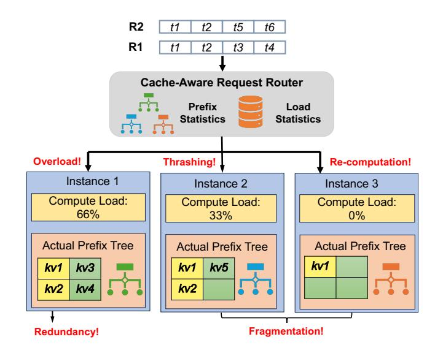

# 1 Introduction

With the advancements of Large Language Models (LLMs), the context lengths of LLMs are becoming increasingly longer to support more sophisticated tasks [\[10,](#page-11-0) [20,](#page-11-1) [38\]](#page-11-2). This trend is reflected in increasingly longer input prompts and a growing number of multi-turn interactions with users and external tools. For example, agent application Manus reports their average input-to-output ratio is 100:1 [\[41\]](#page-12-0), and the average number of turns per session on Character.AI is 180 turns [\[13\]](#page-11-3). To reduce the computation introduced by long context, a key strategy is prefix caching, specifically reusing previously computed KV cache, for requests with the shared prefix. Evidence from CharacterAI [\[13\]](#page-11-3) and Kimi [\[50\]](#page-12-1) reveals that the hit rate can reach up to 75% to 95% in production. As the

KV cache size increases linearly with the sequence length, efficiently managing such a large volume of KV cache to achieve a high cache hit rate has become a critical problem.

A popular approach to maximize cache utilization is to use cache-aware routing [\[31,](#page-11-4) [44,](#page-12-2) [56,](#page-12-3) [57,](#page-12-4) [73\]](#page-13-0). The prefix cache on each instance is organized as a local prefix tree. For each request, the router dispatches it to one instance based on the per-instance hit rates and load-balancing strategy.

However, it leads to the following issues. (1) For instances with high hit rates, the memory bandwidth is over-utilized, whereas for instances with low hit rates, the memory bandwidth is under-utilized, leading to the load imbalance. (2) To balance the computation across instances, requests with shared prefixes, such as system prompts and shared documents, are often replicated across instances, leading to severe redundancy. (3) Because the entire prefix requires residing in the same instance to form a prefix tree, available slots across instances cannot be used together, leading to fragmentation.

Meanwhile, to avoid interference between the prefill and decoding phase, PD disaggregation [\[27,](#page-11-5) [48,](#page-12-5) [74\]](#page-13-1) has been adopted to disaggregate these two phases on different instances. This further exacerbates the above problems. Specifically, instances in different phases have different demands on memory bandwidth [\[67\]](#page-13-2), leading to the load imbalance. In multi-turn scenarios, both prefill and decode instances must store the same prefix cache to avoid re-computation or repeated transfer, causing redundancy. Similarly, the prefix cache slots on prefill and decode instances are hard to share by existing caching systems, leading to fragmentation.

To fundamentally address these issues, GPU memory pooling is a promising solution. By aggregating all GPU memories into a unified pool and decoupling memory access from computation, it is possible to utilize all available GPU memory bandwidth to avoid load imbalance and all GPU memory as a single cache to eliminate redundancy and fragmentation, while supporting elastic scheduling to accommodate dynamic workloads without considering data locality.

However, existing prefix caching systems [\[3,](#page-11-6) [26,](#page-11-7) [50,](#page-12-1) [56,](#page-12-3) [57\]](#page-12-4) are not efficient for GPU memory pooling. Their interface, e.g., put, get, and transfer, requires the scheduler to consider cache management and can only imperatively transfer increasingly longer prefix cache across instances for computation. This architecture suffers from high communication overhead and binds two different and sometimes conflicting concerns together, i.e., cache management for high memory

efficiency and scheduling for high computation efficiency of dynamic workloads, leading to suboptimal performance.

For the above problems, we propose a declarative prefix cache interface and build a unified segment-level prefix cache pool, TokenLake, to decouple prefix cache management and scheduling by exposing query tensors, prefix caches, and cache-aware operations to TokenLake. This design allows TokenLake to achieve low-latency memory pooling by transparently optimizing transmission of query tensors and prefix cache together at finer granularity, while enabling the scheduler to elastically schedule requests' cache-free operations, such as self-attention and feed-forward network module, in a stateless way for better performance.

However, efficiently utilizing all GPU resources is still non-trivial. First, even if integrated query tensors and cacheaware operations into TokenLake, a simple pooling strategy does not guarantee efficient utilization of all memory bandwidth. For example, if using a strict locality-based policy that spills the prefix cache to other instances only when the local memory is insufficient, it still leads to load imbalance and frequent migration of prefix cache ([§4\)](#page-4-0). Second, finer-grained management dramatically expands the decision space of caching, making effective load balancing, duplication control, and communication optimization difficult.

To address these challenges, we introduce a heavy-hitteraware segment-level load balancing algorithm to effectively utilize memory and bandwidth. We also propose a bipartite matching-based dispatching algorithm to minimize the communication volume of query tensors and newly generated KV cache under the given scheduler's decision. Finally, we implement a goodput-optimized stateless elastic scheduling algorithm by using PD disaggregation, chunked prefill, and elastic sequence parallelism together to demonstrate its expressiveness and its potential to enable fine-grained scheduling. The complexity of these algorithms is polynomial to the number of instances, making them efficient and scalable.

Evaluations show that, compared to state-of-the-art cacheaware routing, SGLang-Router [\[73\]](#page-13-0) and cache-centric PDdisaggregation solutions, MoonCake [\[50\]](#page-12-1), TokenLake can improve throughput under a given SLO by up to 2.6× and 2.0×, and boost hit rate by up to 2.0× and 2.1×, respectively. In summary, our contributions are as follows:

- We propose a declarative prefix cache interface to decouple prefix cache management and request scheduling to achieve efficient memory pooling.
- We propose a heavy-hitter-aware segment-level load balancing algorithm and a bipartite matching-based dispatching algorithm to efficiently achieve load balance, lower redundancy, and less fragmentation of the prefix cache.
- We implement a goodput-optimized stateless elastic scheduling algorithm to demonstrate the expressiveness of the interface and conduct a comprehensive evaluation to show the effectiveness of TokenLake.

> **[图片提取文字 (无描述)]:**
> R2 t1 t2 t5 t6 R1 t2 t3 t1 t4 Cache-Aware Request Router Prefix Load **Statistics** Statistics Overload! Thrashing! Re-computation! Instance 1 Instance 2 Instance 3 Compute Load: Compute Load: Compute Load: 66% 33% 0% Actual Prefix Tree **Actual Prefix Tree** Actual Prefix Tree kv1 kv5 kv1 kv3 kv1 kv2 kv4 kv2 Fragmentation! Redundancy!

Figure 1. Limitations of cache-aware routing.

