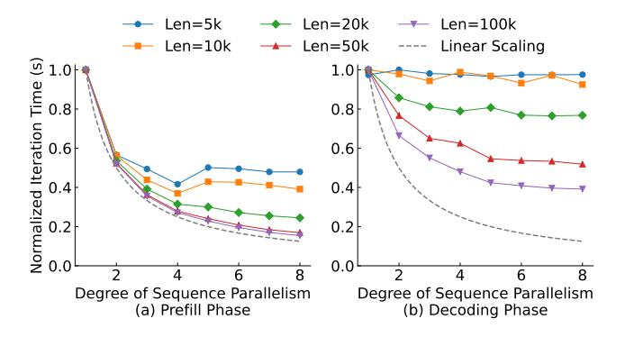

# 2.3 Motivations

Limitations of existing solutions. To motivate our design, we first analyze the limitations of existing solutions.

A primary limitation is the severe load imbalance inherent in the two mainstream scheduling policies. For cache-aware routing, this tight coupling makes instances with high hit rate attract more requests computation, more KV cache generation and storage on the same instance, which further increases the hit rate of the instance, while other instances are under-utilized, leading to load imbalance in terms of number of accessed prefix cache, as shown in overloaded instance 1 of Figure [1.](#page-1-0) For PD disaggregation, load imbalance is even more pronounced. As shown in Figure [2,](#page-2-0) in PD disaggregation, decode instances not only use prefix cache generated at the decoding phase, but also use prefix cache sent from the prefill phase, creating a fixed, asymmetric cache load that cannot be balanced between the two groups.

The second limitation is the data redundancy, which leads to inefficient cache utilization. For cache-aware routing, load balancing policy forces the caching system to replicate shared prefix caches across multiple instances (1, 2), and may introduce re-computation overhead to generate replicated prefix (e.g., dispatch 1 to instance 3 in Figure [1\)](#page-1-0). Similarly, PD disaggregation necessitates that the prefix cache generated by prefill instances is transferred to decode instances for subsequent computation, while caching them in prefill instances for incoming turns or requests, leading to redundancy (1, 2). In both scenarios, the redundancy is inevitable for existing imperative caching systems, otherwise it causes frequent transfer for increasingly longer prefix cache as the number of turns in sessions increases.

The last limitation is memory fragmentation. In the scenario depicted in Figure [1](#page-1-0) and Figure [2,](#page-2-0) the system has four free slots in aggregate, but a new request (e.g., R3) requiring this amount cannot be placed because the cache capacity on any instance is insufficient. It leads to thrashing, i.e., eviction of prefix caches that may be required in the future (5 in instance 2 of Figure [1\)](#page-1-0), introducing substantial overhead.

> **[图片提取文字 (无描述)]:**
> Len=5k Len=20k Len=100k Len=10k Len=50k Linear Scaling ි 1.0 1.0 Normalized Iteration Time 8.0 0.8 0.6 0.6 0.4 0.4 0.2 0.2 0.0 0.0 6 6 Degree of Sequence Parallelism Degree of Sequence Parallelism (a) Prefill Phase (b) Decoding Phase

Figure 3. Effectiveness of GPU pooling.

**Opportunities.** Recent advancements in communication hardware and software aspects have enabled the development of declarative cache designs.

- Hardware. A significant opportunity arises from the increasingly powerful interconnections and their inefficient usage. The scale-out links are narrowing the gap with PCIe [7, 43], and the scale-up links are even surpassing PCIe [46, 53], while GPUDirect RDMA is also maturing for low-latency communication. However, the bandwidth is often underutilized. For instance, in the attention module, inference traffic between instances is typically unidirectional, flowing from a prefill to a decode instance, while much of the interconnection is idle. It leaves a large optimization space to improve performance by unleashing the full potential of modern networking.
- Software. A further opportunity exists in optimizing the communication patterns of prefix cache management. Figure 3 shows an example. Rather than adhering to transmitting only prefix cache, by combining communication with Sequence Parallelism (SP) in the prefill phase or transmitting typically smaller query tensors in the decoding phase, the performance gains from pooling GPU resources across can often outweigh the communication overhead, because they enable less communication volume and overlap communication better with computation.

