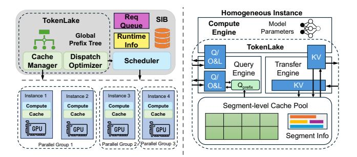

# 3 System Architecture

#### 3.1 Overview

To address these problems, as shown in Figure 4, we design and build a unified segment-level prefix cache pool, Token-Lake, across instances. Token-Lake first introduces a declarative prefix cache interface that abstracts cache-aware operations from request scheduling and exposes it to Token-Lake for better cache management (§3.2). Under the hood, prefix caches are split into segments to reduce fragmentation. Token-Lake uses a fully peer-to-peer asynchronous architecture (§3.3) to enable low-latency asynchronous communication of cache segments and query tensors (§3.4). With the global view, Token-Lake's cache manager uses a heavy-hitter-aware

<span id="page-3-1"></span>> **[图片提取文字 (无描述)]:**
> Homogeneous Instance Req SIB TokenLake Compute Model Queue Parameters Engine Global Runtime **Prefix Tree** Info TokenLake O/ Dispatch ΚV Cache Scheduler O&L Transfer Query Optimizer Manager Engine Engine ĸν Instance 1 Instance 2 Instance 3 Instance 4 Segment-level Cache Pool Compute Compute Compute Compute Cache Cache Cache Cache GPU GPU GPU GPU Segment Info -THE PERSON NAMED IN Parallel Group 2, Parallel Group 3, Parallel Group 1


Figure 4. System overview.

segment-level load balancing algorithm to achieve better load balance and conduct aggressive deduplication (§4) of existing prefix caches. For query tensors and newly generated prefix caches, TokenLake's dispatch optimizer minimizes their communication volume with a bipartite matching-based dispatching algorithm (§5). Finally, stateless elastic scheduling can be performed by the scheduler with minimal consideration of the underlying prefix cache (§6).

#### <span id="page-3-2"></span>3.2 Interfaces

Figure 5 shows the declarative interfaces of TokenLake. At the control plane, get\_prefix\_tree provides the global prefix tree to the scheduler. The Scheduler can leverage it to get caching information, e.g., hit rate of each request, slots utilization, distribution of cache segments, etc, similar to a local prefix tree in prior works [73]. get\_cache\_load provides the GPU load of TokenLake given a set of requests reqs with specified input lengths. The scheduler can use this information to avoid interference with TokenLake (§6). In each iteration, after the scheduler decides batching batches and their respective degree of parallelism DoPs, gen\_plans generates control flow query\_plans and transfer\_plans for the data plane and allocates DoP instances group to each batch for elastic parallel computing.

At the data plane, the compute engine in each instance can initialize the query engine and transfer engine with init\_query and init\_transfer by respective control flows to get the shared buffers q\_buf and kv\_buf in GPU memory. During inference, the compute engine prepares the query tensor in q\_buf and invokes query to get the attention output on the global prefix cache pool. Similarly, after the compute engine prepares the layer-wise newly generated KV cache in kv\_buf, it can invoke put to store them in TokenLake asynchronously. Due to the declarative nature of these interfaces, the compute engine does not need to know how to store and query the prefix cache. TokenLake automatically optimizes the prefix cache pool and query plans to achieve high performance. At the same time, the degree of parallelism, batching of requests, and splitting input sequences are still fully controlled by the scheduler, enabling elastic scheduling.

```
# Control Plane Interfaces
def get_prefix_tree()
  -> tree
def get_cache_load(reqs, tree)
  -> load
def gen_plans(batches, DoPs, tree)
  -> query_plans, transfer_plans, groups
# Data Plane Interfaces
def init_query(batch, group, query_plan)
  -> q_buf
def query(q_buf)
  -> out
def init_transfer(batch, transfer_plan)
  -> kv_buf
def put(kv_buf)
  -> None
```

Figure 5. Interfaces of TokenLake

