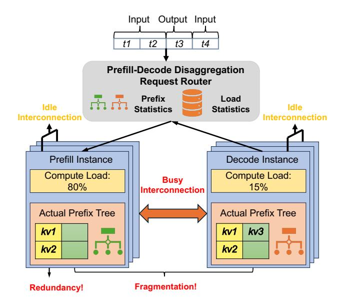

# 2 Background

## 2.1 LLM serving systems

The inference process of Large Language Models (LLMs) can be divided into two distinct phases: the prefill phase and the decoding phase. The prefill phase processes the entire input tokens in one iteration to generate the initial Key-Value (KV) cache, intermediate states for future iteration, while the decoding phase generates output tokens iteratively and stores newly generated KV cache in the prefix cache. For multi-turn sessions, they contain multiple turns of requests, each with its respective prefill and decoding phase. Especially, each turn also needs the KV cache of previous turns. In each iteration of the inference process, the prefix cache only involves the attention module. In each layer, query tensors generated from the input tokens use prefix attention and self-attention to interact with all preceding KV cache and KV cache of themselves, respectively, and then reduce the partial output tensors and normalizers to generate the final output tensors of the attention module. Therefore, except for the prefix attention, which is cache-aware, self-attention and all other operations, such as feed-forward network (FFN) and projection layer, are cache-free, i.e., computation only depends on the previous module's output and model parameters without directly using the prefix cache.

To support more applications, such as analyzing large codebases and stateful multi-turn agent interactions, the context length of LLMs has been significantly increased [\[10,](#page-11-0) [20,](#page-11-1) [38\]](#page-11-2). To accelerate the input processing speed of longcontext inference, prefix caching is proposed to further share KV caches across requests with the same prefix or multiple turns in a session [\[19,](#page-11-8) [28,](#page-11-9) [47,](#page-12-6) [64,](#page-13-3) [69,](#page-13-4) [73,](#page-13-0) [76\]](#page-13-5). To quickly retrieve the relevant prefix cache, prefix caches are typically organized as a prefix tree in each LLM instance [\[73\]](#page-13-0).

> **[图片提取文字 (无描述)]:**
> Input Output Input t1 t2 t3 t4 Prefill-Decode Disaggregation Request Router Prefix Load Idle Idle Statistics **Statistics** Interconnection Prefill Instance Decode Instance Compute Load: Compute Load: Busy 80% 15% Interconnection Actual Prefix Tree **Actual Prefix Tree** kv1 kv3 kv1 kv2 kv2 Fragmentation! Redundancy!

Figure 2. Limitations of cache-centric PD disaggregation.

At the same time, many scheduling algorithms have been proposed to accommodate the distinct characteristics of the prefill and decoding phases. On the instance level, chunked prefill [\[8,](#page-11-10) [24,](#page-11-11) [30\]](#page-11-12) is proposed to split the long context into smaller chunks and batch requests in two phases together to reduce the interference between them. On the cluster level, PD disaggregation [\[16,](#page-11-13) [18,](#page-11-14) [29,](#page-11-15) [49,](#page-12-7) [51,](#page-12-8) [60,](#page-12-9) [72\]](#page-13-6) is proposed to disaggregate the prefill and decoding phases into different instances to eliminate interference between the two phases. Elastic sequence parallelism (ESP) [\[62\]](#page-13-7) is further proposed to handle variable context lengths and frequent ratio changes between prefill and decoding phases by elastically setting the degree of parallelism (DoP) for requests with various context lengths in different phases.

## 2.2 LLM caching systems

To support prefix management on each instance and complex scheduling algorithms on the cluster level, LLM serving systems require efficient caching systems to manage the prefix cache. Existing caching systems typically expose an imperative interface, such as put, get, and transfer APIs, for LLM serving systems to imperatively cache and retrieve a prefix cache in the local prefix tree and transfer it to another instance [\[3,](#page-11-6) [26,](#page-11-7) [50,](#page-12-1) [56,](#page-12-3) [57\]](#page-12-4).

Because of the imperative nature, the caching system is tightly coupled with the scheduling algorithm. The scheduler of the LLM serving system has to consider the state of the prefix cache in each instance for maximizing cache efficiency while improving requests' computation performance, such as throughput and latency. The tight coupling between schedulers and their underlying imperative caching systems has given rise to two popular policies.

The first is cache-aware request routing. With the statistics collected from instances, the cache-aware router dispatches each incoming request to an instance by trading off between multiple potentially conflicting goals, such as maximizing cache hit rate and balancing computation across instances.

The other is cache-centric PD disaggregation. In this policy, the user decides the number of prefill and decode instances based on the computation and cache demands of the predicted workload. A PD disaggregation router is used to dispatch requests to prefill instances first, then imperatively invokes the transfer API to transfer the generated prefix cache to decode instances for subsequent decoding.

