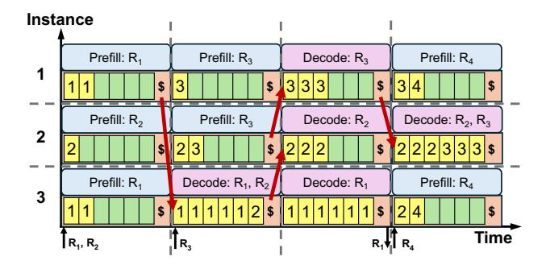
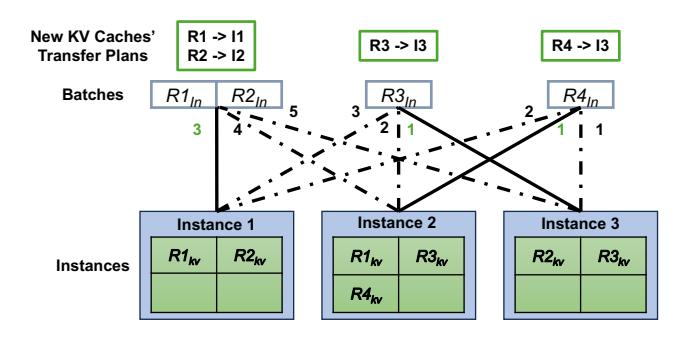

# 4 Segment-based Load Balancing

Because the declarative interface exposes query tensors and prefix attention to TokenLake, prefix cache segments are essentially independent of each other. Query tensors can attend to them independently, generate partial output tensors, and normalizers. The final output can be generated by combining them together [67]. Therefore, prefix cache segments can be split and distributed arbitrarily across instances in TokenLake. However, even with this flexibility, it is still challenging to efficiently utilize all GPU memories and memory bandwidth as a cache pool.

> **[图片提取文字 (无描述)]:**
> Instance Prefill: R1 Prefill: R3 Decode: R3 Prefill: R4 1 Prefill: R2 Prefill: R3 Decode: R2, R3 Decode: R2 2 Prefill: R1 Decode: R1, R2 Decode: R1 Prefill: R4 3 Time R, R, R3

Figure 7. Limitations of strict locality-based policy.

#### 4.1 Strawman solution: Strict locality-based policy

A straightforward solution is to maintain locality whenever possible, which we term a strict locality-based policy. It utilizes other instances only when the local cache capacity is exhausted. However, this strict locality-based policy suffers from two major drawbacks: severe load imbalance and frequent data migration.

First, it ignores memory bandwidth utilization across instances, leading to load imbalance. As shown in Figure 7, it makes prefix cache segments concentrate on a few instances (e.g., instance 3 in iterations 2 and 3, and instance 2 in iteration 4) with high memory bandwidth pressure, while other instances are under-utilized. This disparity becomes more pronounced as the variation of sequence lengths grows and shared prefix lengths become longer.

Second, the policy reacts poorly to the dynamic workload. Because sequence lengths and phases of requests change over time, the set of instances occupied by a request also needs to change accordingly to maximize overall performance [48, 62]. To enforce strict locality, TokenLake triggers frequent unnecessary migration to maintain locality. As shown in Figure 7, to leave computation resources for new requests (R1 and R2 in iteration 1) or to balance the computation (R1, R2, and R3 in iteration 2), segments need to be migrated frequently to keep strict locality, leading to high communication overhead.

#### 4.2 Segment size tradeoff: locality vs. load balance

In contrast, our key insight is that although locality is important to reduce communication volume, it is not strictly necessary for achieving high performance. As long as the segment size is larger than a certain threshold, the distributed query could achieve better performance than the local query. This is because the memory bandwidth and compute of multiple GPUs can be aggregated to process the prefix attention, and the communication overhead can be amortized over the entire segment and overlapped by local self-attention computation. Furthermore, it also avoids load imbalance and frequent data migration caused by strict locality.

Consider a prefix cache of sequence length *S* partitioned across *N* instances. In each decoding iteration, a single query

tensor q must attend to the entire prefix cache. The cache on each instance represents a data segment of size C, where N = S/C. The goal is that when the segment resides on a remote instance, the local computation latency saved is greater than or equal to the communication overhead incurred.

The saved computation latency to process a segment of size C is bound by either compute or memory bandwidth according to the Roofline model. Let F be the floating-point operations per second (FLOPS) of a single GPU,  $B_{mem}$  be the memory bandwidth, and d be the hidden dimension. The time to process a segment of size C is:  $T_{comp}(C) = \max(\frac{4Cd}{F}, \frac{4Cd}{B_{mem}}) = k_{comp}C$ , where  $k_{comp} = \max(\frac{4d}{F}, \frac{4d}{B_{mem}})$  is a constant for a given model and hardware.

The communication time consists of two phases, including sending query tensors and receiving partial output tensors and normalizers. In the whole process, the total communication latency is:  $T_{comm}(C) = 2\alpha_{net} + \frac{4d}{B_{net}}$ , where  $\alpha_{net}$  is the network latency, and  $B_{net}$  is the network bandwidth.

If a segment size can make computation latency saved greater than or equal to the communication latency, then we can derive:  $C \ge \frac{2\alpha_{net}}{k_{comp}} + \frac{4d}{k_{comp}B_{net}}$ . So if we set the segment size C to be larger than this threshold, it can harvest memory bandwidth and compute on remote instances without incurring significant communication overhead. When we instantiate this threshold using parameters from our experimental setup (§ 7), C is approximately equal to 568 tokens, enabling fine-grained segment-level cache pooling possible. Furthermore, even if the communication overhead can not be completely hidden, it is still negligible compared to the overall computation time. For example, based on the above analysis, when C is 568 tokens, the communication overhead of a short request in the decoding phase with 1000 prefix tokens is only 4.66 us per layer, a negligible time in practice.

## 4.3 Heavy-hitter-aware segment-level load balancing

After choosing a segment size larger than the threshold, the next challenge is how to distribute them to achieve a balanced load across instances. Highly skewed and dynamic access patterns make it challenging. Because a segment is accessed only when the prefix of this segment is accessed, the access pattern is inherently skewed, concentrating on segments closer to the root of the prefix tree. Furthermore, because the workload is dynamic, the access pattern changes over time. The rapid processing speed exacerbates this issue.

To address this problem, we propose a heavy-hitter-aware load-balancing algorithm that handles heavy hitters and normal segments differently. Heavy hitter is defined as frequently accessed segments. For normal segments, TokenLake employs a hash-based distribution strategy to spread them uniformly across all instances. A hash function is used to map each segment to an instance. Given that normal segments are numerous, this method typically achieves effective load balancing without migrations and aggressive deduplication.

> **[图片提取文字 (无描述)]:**
> New KV Caches' R1 -> 11 R3 -> 13 R4 -> 13 Transfer Plans R2 -> 12  $R1_{ln}$  $R2_{ln}$  $R4_{ln}$ **Batches**  $R3_{ln}$ 3 Instance 2 Instance 3 Instance 1 R1kv R2kv R1kv R3kv R2kv R3kv Instances R4kv

Figure 8. Example of dispatching problem.

As for heavy hitters, TokenLake employs a selective replication strategy to maintain load balance. If an instance is overloaded, it replicates heavy hitter segments on that instance to the least-loaded instances without its copy. Because heavy hitters reside closer to the prefix tree's root, Token-Lake can find them by using a breadth-first search (BFS) without traversing the entire prefix tree. To make the replication efficiently, our approach is informed by a well-established result from early front-end caching systems [17]: if a system can effectively absorb the traffic from the top  $O(N \log N)$  heavy hitters, the load across N storage servers is guaranteed to be balanced with high probability, regardless of the query distribution or the total number of objects. Therefore, the number of heavy hitters is set to  $O(N \log N)$  for quick replication.

