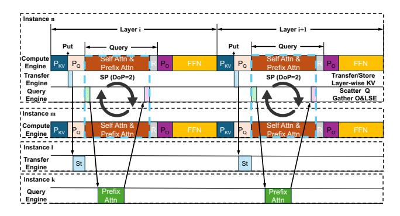

# 3.3 Fully peer-to-peer asynchronous architecture

To support fine-grained co-optimization of query tensors, prefix cache segments, and prefix attention, TokenLake employs a fully peer-to-peer (P2P) asynchronous architecture. As shown in Figure 4, the two main components of TokenLake: the query engine and the transfer engine, run as independent processes, colocated on the GPU with the compute engine. Powered by NVIDIA Multi-Process Service (MPS) [4], three engines can run asynchronously and concurrently. They can even handle different tasks for different batches concurrently for better performance.

Query and transfer engines themselves also support multitasking. Query engines are responsible for generating partial outputs and normalizers of the query on local prefix segments. They use multiple CUDA streams to concurrently send query tensors to other query engines and handle query tensors from other query engines concurrently. Similarly, transfer engines can concurrently transfer KV cache to or from different instances. This design maximizes the utilization of interconnect bandwidth.

#### 3.4 Low-latency asynchronous communication

Powered by the fully P2P asynchronous architecture, it is possible to achieve low-latency asynchronous communication for both query tensors and prefix caches.

First, TokenLake enables zero-copy data transfer between engines. q\_buf and kv\_buf are shared buffers allocated with CUDA IPC [45]. As long as the compute engine generates tensors directly in these buffers, no extra GPU memory copy is needed between engines. Furthermore, these buffers are also registered with ncclCommRegister as network buffers, minimizing memory copies during network transfers.

Second, communication can be overlapped with computation. As shown in Figure 6, layer-wise KV cache transfer (Put) can be overlapped with the subsequent computation of the entire layer after generation ( $P_{kv}$ ). Similarly, scattering query tensors and gathering query results, whose communication

> **[图片提取文字 (无描述)]:**
> Instance n Layer i Layer i+1 Put Put - Query Query Self Attn & Self Attn & Compute Pkv Po PKV Po Engine Prefix Attn Prefix Attn Transfer Transfer/Store SP (DoP=2) SP (DoP=2) Engine Layer-wise KV Scatter Q Query Gather O&LSE | Engine I Instance m Self Attn & Self Attn & Compute PKV Pa PKV P. Engine Prefix Attn Prefix Attn I Instance I Transfer St St Engine Instance k Prefix Query Prefix Engine Attn Attn

**Figure 6.** Interactions of instance *n* with remote engines.

volume is linear to the sequence length, can be overlapped with the self-attention (*Self Attn*), which is quadratic to the sequence length.

Third, the communication interference is minimized. Different engines are triggered at different times. The transfer engine is triggered after  $P_{kv}$ , while the query engine is triggered after  $P_Q$ . Furthermore, if the scheduler decides to use sequence parallelism (SP) to perform self-attention across instances, Query will use the pass-Q variant of SP [65] that swaps query tensors within the parallel group in the ring style and removes redundant transmission of query tensors for attending to the prefix cache in the SP group. Therefore, the destined instances of the query engine are different from the instances involving SP, reducing network contention.

Last but not least, the communication volume is small. For example, for a Llama-7B model in its decoding phase, the KV cache transfer at each layer is only 16 KB per request. The query tensor communication volume is also small, which is approximately equal to  $2dlN_p$ , where d is hidden size, l is the sequence length, and  $N_p$  is the number of instances hosting relevant segments. Compared to the communication in large-scale Expert Parallelism (EP) [71] that possibly occurs in FFN, whose volume is equal to  $2dlN_e$ , where  $N_e$  is the number of experts, the query engine's communication volumes are often comparable (§4), representing a widely accepted trade-off in practical deployments. The analysis also aligns with the experimental results in Figure 3.

