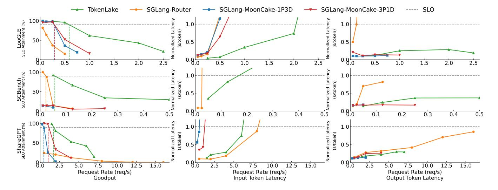
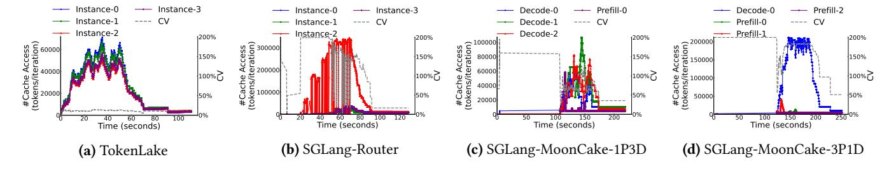
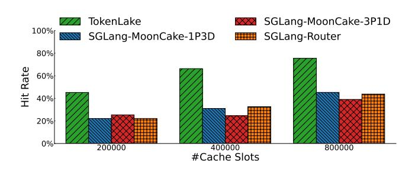
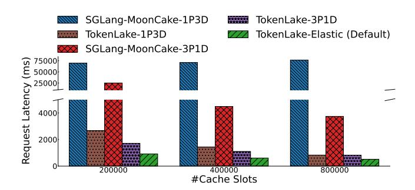

# 6 Stateless Elastic Scheduling

#### 6.1 Cache load isolation

With TokenLake, the scheduler can still serve for different objectives and combine various scheduling strategies, such as PD disaggregation [48], chunked prefill [24], and elastic

sequence parallelism [62], as usual, and does not need to manage prefix cache. The only difference is that TokenLake inevitably occupies some GPU resources for prefix cache management. But as long as the scheduler is aware of this load, it can adjust its scheduling accordingly to avoid interference. For example, it can reduce the batch size, split long sequences into chunks, or use sequence parallelism to reduce the load on each instance. Because the scheduling becomes stateless, these adjustments can be made efficiently.

In the end, TokenLake provides a get\_cache\_load API to expose its own resource consumption. Specifically, Token-Lake calculates the percentage of GPU resources consumed by TokenLake for requests (reqs) in the worst case. First, it estimates the minimum execution time of reqs,  $T_r$ , under an ideal scenario where all GPUs are fully utilized. This estimation is based on pre-profiled results and follows the quadratic curve fitting method as prior work [62]. Next, the memory bandwidth and computation consumption  $M_r$  and  $F_r$  of TokenLake are respectively calculated as follows:

$$M_r = \sum_{r \in regs} 4 \times d \times (r.prefix\_len + r.input\_len)$$

$$F_r = \sum_{r \in reqs} 2 \times d \times r.prefix\_len \times r.input\_len$$

Based on the roofline model, the percentage of GPU resources consumed by TokenLake is then calculated as:

$$L = \max(\frac{M_r}{M_r + N \times B_{mem} \times T_r}, \frac{F_r}{F_r + N \times F \times T_r})$$

Because the load of TokenLake is balanced ( $\S4$ ), L is independent of instances. With this information, the scheduler can factor the load of TokenLake into its scheduling decisions.

#### 6.2 Goodput-optimized stateless elastic scheduling

To showcase the flexibility and potential of elastic scheduling on TokenLake, we designed a goodput-optimized stateless elastic scheduling algorithm. To optimize the overall goodput for requests with varying lengths and in different phases, our optimization objective is to minimize the overall latency, subject to the constraint that the output token latency, a.k.a Time Between Tokens (TBT), meets a Service Level Objective (SLO). This objective first minimizes the overall processing time. Second, it allows more requests in the prefill phase to enter the decoding phase quickly. This, in turn, increases the batch size during the decoding phase, thereby improving overall GPU efficiency.

To tackle this optimization problem, in each iteration, following existing systems [24, 31, 73], we first use chunked prefill to split the long context to avoid overloading the whole cluster. Then it can be formulated as a dynamic programming (DP) problem to decide batching and DoP of each batch. Since requests with similar context lengths exhibit similar characteristics, we first sort all requests by their context length. Let f(i,k) represent the minimum overall latency for

the first i requests given k instances. The DP equation can be formulated as follows:

$$f(i,k) = \min_{\substack{0 \le j < l, 0 \le l < k, \\ SLO_{j+1...i} \le T(j+1,i,k-l,L)}} f(j,l) + (i-j) \times T(j+1,i,k-l,L)$$

where T(j+1,i,k-l) is the latency to batch requests from j+1 to i using k-l instances when cache load is L. The time is also estimated by the quadratic curve fitting method [62]. Then the scheduling plan is constructed by backtracking from  $\min_{k\leq N} f(M,k)$ , where M is the total number of requests. To ensure PD disaggregation, we constrain requests in a batch to be in the same phase. If the SLO actually cannot be met, the algorithm will fall back to throughput-oriented scheduling by ignoring the SLO constraint to mitigate head-of-line blocking. Because DoP of request in the decoding phase must be one, the algorithm complexity is  $O(M_p^2 \times N^2)$ , where  $M_p$  is the number of requests in the prefill phase.

#### 7 Evaluation

We implement TokenLake as a prototype based on FlashInfer [67], SGLang [73], ZMQ [6], Ray [42], and LoongServe [62] in 16k LoCs. TokenLake uses CUDA IPC to share GPU memory among engines and uses inter-process CUDA events and Python semaphores for interactions between the engines. In this section, we evaluate it with state-of-the-art systems on real-world workloads to show its effectiveness.

**Experimental Setup.** We conduct experiments on servers with 8 NVIDIA A100 80 GB GPUs and 128 CPUs. Most of the experiments are conducted on one server, and we evaluate multi-node performance in Section 7.5. The NVLink bandwidth is 400 GB/s. The servers are interconnected via four 200 Gbps InfiniBand NICs. We use CUDA 12.4 and NCCL 2.24.3. Similar to prior works [35, 62], we use the LWM-1M-Text, a long-context Llama-2-7B model [58] for experiments.

Workloads As prior works [31, 62, 74], the requests are sampled from the three real-world datasets with the arrival pattern generated by a Poisson process. *LooGLE* [33] is a popular dataset of requests with shared prefixes. The average sequence length is 24K. *SCBench* [34] is a dataset of long-context multi-turn sessions. The average sequence length is 227K, and the average number of turns is 5. *ShareGPT* [2] is a conversation dataset with short requests. The sequence length is less than 2.4K. To mimic the real-world scenario, we add a system prompt of OpenAI o3 [1] to each request.

**Baselines.** vLLM [31] and SGLang [73] are two state-of-the-art open-sourced LLM serving ecosystems without a significant difference. Because we reuse some components from SGLang, we choose solutions on top of it to ensure a fair comparison. Specifically, *SGLang-MoonCake-xPyD* is a cache-centric PD disaggregation solution based on Moon-Cake [50] and SGLang. Because the P:D ratio can affect performance, we evaluate two configurations, P:D = 1:3 and P:D = 3:1. *SGLang-Router* is a cache-aware routing solution by combining multiple SGLang instances and an SGL-router. It

> **[图片提取文字 (无描述)]:**
> SGLang-Router → SGLang-MoonCake-1P3D → SGLang-MoonCake-3P1D TokenLake (%) nalized Latenc (s/token) LooGLE SLO Attainment ( malized Late (s/token) 2.5 0.5 1.0 2.0 2.5 1.5 2.0 1.5 2.0 2.5 SCBench SLO Attainment (%) malized Laten (s/token) 50 0.5 0.2 0.4 0.1 0.3 0.4 0.5 0.1 0.2 0.3 0.4 ShareGPT SLO Attainment (%) Normalized Late (s/token) 0.8.0 7.5 12.5 15.0 2.5 10.0 12.5 15.0 10.0 12.5 15.0 5.0 10.0 7.5 7.5 Request Rate (reg/s) Request Rate (reg/s) Request Rate (req/s) Goodput Input Token Latency Output Token Latency

Figure 9. End-to-end performance.

considers both cache hit rate and load balancing to route requests. Similar to prior works [15, 62], tensor parallelism (TP) is set to 2, and chunked prefill with the same chunked prefill size is enabled.

**Metrics.** For prefill performance, we measure the input token latency [37, 62], i.e., time to first token (TTFT) normalized by the input length. For decoding performance, we measure the output token latency, i.e. the time between tokens (TBT). For the SLO attainment, we set the SLO to be that all input and output token latency is less than 10× the processing time when the batch size is 1. The P90 goodput is defined as the maximum throughput of the system when 90% of requests meet the SLO.

#### 7.1 End-to-end performance

We compare TokenLake against three distinct baselines across three different datasets on three key metrics. As shown in Figure 9, TokenLake outperforms the other baselines on nearly all datasets, particularly in SLO attainment.

The first row shows the results on LooGLE. For SGLang-Router, although it attempts to balance computation load, it still tends to direct requests to instances with related prefixes. Given the limited local cache size, this often results in cache thrashing and costly recomputation. Consequently, at the same input token latency, its throughput is 4.64× lower than that of TokenLake. Its output token latency is also high due to the interference from prefill requests. In contrast, SGLang-MoonCake-1P-3D and SGLang-MoonCake-3P-1D, although protecting the decoding phase, only 25% and 75% of prefix cache slots can be used during the prefill phase, respectively, leading to a lower cache hit rate. Furthermore, because only 75% and 25% of prefix cache slots can be used during the decoding phase, requests in the prefill phase have to wait for cache slots in decode instances to be released.

which also inflates the input token latency. By efficiently pooling GPU memories, TokenLake improves P90 goodput by 2.08× and 2.04× over SGLang-MoonCake-1P-3D and SGLang-MoonCake-3P-1D, respectively. At equivalent input token latencies, the throughput improvements are 4.46× and 3.32×.

On SCBench, because it contains multi-turn conversation, which involves multiple cycles of prefill and decoding phases, cache-centric PD disaggregation has to frequently transfer prefix caches between prefill and decode instances, creating substantial transfer overhead. Fragmentation between two phases also decreases the hit rate. Therefore, SGLang-MoonCake-1P-3D and SGLang-MoonCake-3P-1D can only serve about 20% of requests, essentially the first turn of a conversation, under the SLO. Although SGLang-Router does not suffer from this issue, it still causes a low hit rate due to inherent fragmentation and load imbalance across instances. Consequently, TokenLake achieves 2.55× higher P90 goodput than SGLang-Router. Moreover, because TokenLake employs PD disaggregation, its decoding phase latency is also significantly lower than SGLang-Router's.

Finally, on the ShareGPT dataset, TokenLake demonstrates the flexibility of its interfaces. Different from SGLang-Router, which sacrifices the SLO attainment, it prevents interference between the two phases as PD disaggregation does, while empowering the dynamic adjustments of the resources allocated to the two phases based on real-time workload. As a result, compared to SGLang-MoonCake-1P-3D and SGLang-MoonCake-3P-1D with the static partitioning, TokenLake improves the P90 goodput by 3.71× and 1.56× respectively.

#### 7.2 Load balancing comparison

To compare the load-balancing capability, we monitored the prefix cache accesses on each instance at a request rate approaching TokenLake's P90 SLO threshold. Figure 10 shows

> **[图片提取文字 (无描述)]:**
> Instance-0 Instance-3 Instance-3 -- Prefill-0 Decode-0 -- Prefill-2 Instance-0 Decode-0 Instance-1 ---- CV Decode-1 ---- CV Prefill-0 ---- CV Instance-1 Instance-2 Decode-2 Prefill-1 Instance-2 1200% 1200% 1200% #Cache Access (tokens/iteration) tion 300000 를 150000 150% 150% ⊕ 200000 100% 100% 100% (tokens Time (seconds) Time (seconds) Time (seconds) Time (seconds) (b) SGLang-Router (d) SGLang-MoonCake-3P1D (c) SGLang-MoonCake-1P3D (a) TokenLake

Figure 10. Load balancing of different systems.

> **[图片提取文字 (无描述)]:**
> TokenLake SGLang-MoonCake-3P1D 100% SGLang-MoonCake-1P3D SGLang-Router 80% Hit Rate 60% 40% 20% 200000 400000 800000 #Cache Slots

Figure 11. Hit rate under different cache sizes.

both the per-instance cache access pattern over time and the corresponding Coefficient of Variation (CV), which serves to quantify the degree of load imbalance across instances.

As shown in Figure 10a, the CV of TokenLake remains steadily below 15%, with an average value of just 11%. This result demonstrates the effectiveness of TokenLake's load-balancing mechanism over dynamic workloads.

As shown in Figure 10b, SGLang-Router exhibits significant shortcomings in load balancing. Although SGLang Router takes load conditions into account when routing requests, without memory pooling, it has to trade load balance for a higher hit rate. Therefore, its average CV reached 99%, substantially 9× higher than that of TokenLake.

As shown in Figure 10c and Figure 10d, due to disaggregation, both SGLang-MoonCake-1P3D and SGLang-MoonCake-3P1D exhibit significant load imbalance. Furthermore, the load imbalance also occurs across decode instances of SGLang-MoonCake-1P3D and across prefill instances of SGLang-MoonCake-3P1D. The figure also reveals that without memory pooling, they serve initial requests at a low hit rate. Ultimately, their average CV reaches 62% and 122%, respectively, 5.63× and 11.09× higher than that of TokenLake.

#### 7.3 Hit rate analysis

We then analyzed the hit rate of each system under varying cache sizes using the LooGLE dataset. As shown in Figure 11, the hit rate of TokenLake is the highest across all cache sizes and consistently improves as the capacity increases. In contrast, the SGLang-MoonCake-1P3D and SGLang-MoonCake-3P1D suffer from their isolated prefix caches for the prefill and decoding phases, so their hit rates are 1.67-2.14× and

> **[图片提取文字 (无描述)]:**
> SGLang-MoonCake-1P3D TokenLake-3P1D TokenLake-1P3D TokenLake-Elastic (Default) SGLang-MoonCake-3P1D (S 75000 E 50000 atency . Request 2000 200000 400000 800000 #Cache Slots

Figure 12. Effectiveness of pooling and elasticity.

1.78-2.70× lower than TokenLake's, respectively. SGLang-Router also exhibits a low hit rate due to the limitations of its isolated local caches, which lead to load imbalance, data redundancy, and memory fragmentation. Furthermore, the interference from the requests in the prefill phase slows down its decoding phase performance, which in turn diminishes cache utilization efficiency. Therefore, the hit rate of TokenLake is 1.72-2.04× higher than SGLang-Router's.

#### 7.4 Effectiveness of pooling and elasticity

To evaluate the respective effectiveness of the TokenLake interface to support elastic scheduling and prefix cache pooling, we implemented PD disaggregation (TokenLake-1P3D) and TokenLake-3P1D) on top of TokenLake to isolate their contributions. As shown in Figure 12, first, the latency of TokenLake-1P3D and TokenLake-3P1D is 26.62-86.05× and 2.18-39.48× lower than that of SGLang-MoonCake-1P3D and SGLang-MoonCake-3P1D, respectively, showing the effectiveness of prefix cache pooling. Second, our fully-featured system, TokenLake-Elastic, consistently outperforms other TokenLake variants across all cache sizes. The performance advantage becomes more pronounced as the cache size decreases, reducing latency by up to 5.22× and 2.82× compared to TokenLake-1P3D and TokenLake-3P1D, respectively. This result validates the effectiveness of the TokenLake interface to enable stateless elastic scheduling.

