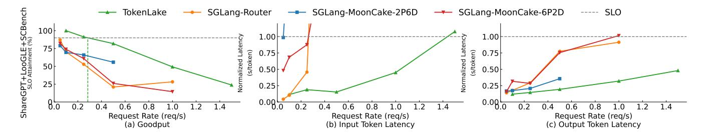

# 7.5 Multi-node performance

Finally, we also tested the multi-node performance of Token-Lake on 16 A800 80GB GPUs across two servers. We mixed

> **[图片提取文字 (无描述)]:**
> → TokenLake SGLang-Router SGLang-MoonCake-2P6D → SGLang-MoonCake-6P2D ---- SLO reGPT+LooGLE+SCBe SLO Attainment (%) 100 1.00⊦ 0.75 0.75 50 0.50 0.50 25 0.25 0.25 0.08.0 0.08.0 8.0 0.2 Request Rate (reg/s) Request Rate (reg/s) Request Rate (reg/s) (b) Input Token Latency (c) Output Token Latency (a) Goodput

Figure 13. Multi-node performance.

the three datasets in a 1:1:1 ratio as a more dynamic workload. The PD disaggregation baselines are adjusted to SGLang-MoonCake-6P2D and SGLang-MoonCake-2P6D to maintain the original PD ratios. As shown in Figure 13, TokenLake still outperforms the baselines in multi-node scenarios. Due to the increased variability in requests from the mixed dataset, the problem of load imbalance, redundancy, and fragmentation is more severe. Similar to Section 7.1, SGLang-MoonCake-6P2D and SGLang-MoonCake-2P6D struggle to handle multi-turn interactions, while SGLang-Router's attempt to improve hit rates leads to load imbalance and interference between the two phases. Ultimately, they fail to achieve 90% SLO attainment. Additionally, under the same input token latency, TokenLake's throughput is 5.47×, 28.49×, and 5.46× higher than that of SGLang-MoonCake-6P2D, SGLang-MoonCake-2P6D, and SGLang-Router, respectively. Furthermore, because only 25% of prefix cache slots in SGLang-MoonCake-6P2D is available to its decoding phase, it has to frequently trigger recomputation, leading to a substantial output token latency.

#### 8 Related Work

LLM serving. Modern LLM serving systems combine many techniques for better performance. Continuous batching [68] is proposed to batch different requests. To reduce interference between two phases, chunked prefill [8, 24, 30] is proposed to split the long context into smaller chunks, while PD disaggregation [27, 48, 74] is proposed to disaggregate two phases into different instances. Elastic sequence parallelism [62] is proposed to handle variable context lengths and frequent ratio changes between two phases by setting DoP elastically. Many recent works also explore dynamic PD instance reconfiguration [16, 18, 29, 49, 51, 60, 72] and multiplexing partial computation between two phases [15, 25, 35, 37, 52] to accommodate dynamic workloads. These works focus on computation optimizations, while TokenLake focuses on prefix cache pooling and provides declarative interfaces to support them. AF disaggregation [14, 22, 59, 63, 75] is proposed to disaggregate attention and FFN. Much research focuses on expert parallelism [21, 23, 32, 70, 71] and sequence parallelism [9, 11, 12, 39, 54, 65] to efficiently parallelize the computation of FFN and attention modules across multiple devices. They are orthogonal to TokenLake.

KV cache optimizations. Reusing KV caches is critical to accelerate LLM serving. PagedAttention [31] manages the KV cache as paged memory to reduce fragmentation. SGLang [73] manages prefix cache as radix tree to enable efficient prefix sharing in an instance. Many prefix caching systems, such as Mooncake [50], LMCache [3], Aibrix [57], Preble [56], and MemServe [26], explore cache reuse across instances, while suffering from load imbalance, redundancy, and fragmentation as discussed in Section 2. Infinite-LLM [36] borrows the KV cache slots from other instances when local memory is insufficient, but it does not support prefix sharing between requests, leading to redundancy, uses the strict locality-based policy, leading to load imbalance, tightly couples the cache-free computation scheduling, restricting the elasticity, and cannot concurrently handle prefix attention and cache-free computation in an instance. Many operators are developed to optimize prefix attention [55, 66, 67], and the cache policy is explored to optimize hit rate [61]. They are orthogonal to TokenLake. Many works also explore hierarchical KV cache management [19, 28, 47, 64, 69, 76]. Because GPU memory often has higher bandwidth than host memory, and cache typically needs to be swapped back to GPU memory when used, TokenLake can be used together with these solutions to further improve the performance.

#### 9 Conclusion

In this paper, we present TokenLake, a unified segment-level prefix cache pool for elastic long-context LLM serving. By designing a declarative interface to expose query tensors and prefix attention, TokenLake can manages prefix cache at the segment level to reduce fragmentation and enable fine-grained cache management. Based on it, we propose a heavy-hitter-aware segment-level load balancing algorithm to achieve better load balance and deduplication, and propose the bipartite matching-based dispatching algorithm to minimize the communication volume of query tensors and new prefix caches. Finally, TokenLake enables stateless elastic scheduling to accommodate dynamic workloads. The evaluation results on real-world workloads demonstrate that TokenLake significantly improves throughput and hit rate compared to existing cache-aware routing and cache-centric PD-disaggregation solutions.

