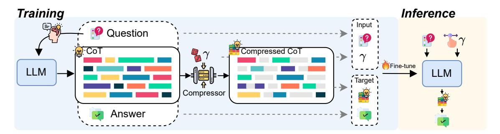
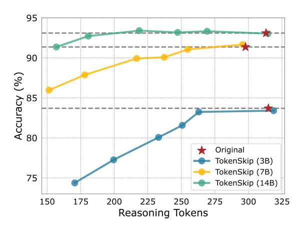
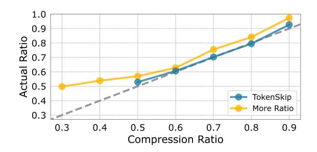
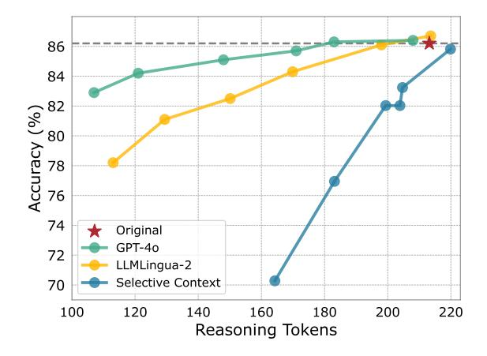
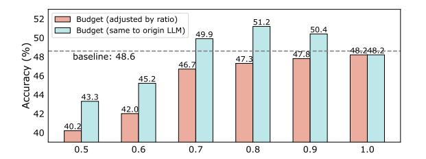

# 3 **TokenSkip**

We introduce TokenSkip, a simple yet effective approach that enables LLMs to skip less important tokens, enabling controllable CoT compression with adjustable ratios. This section demonstrates the details of our methodology, including token pruning ([§3.1\)](#page-3-0), training ([§3.2\)](#page-3-1), and inference ([§3.3\)](#page-3-2).

> **[图片提取文字 (无描述)]:**
> **Training** Inference Input Question Compressed CoT Fine-tune LLM LLM Target Compressor Answer

Figure 4: Illustration of TokenSkip. During training, TokenSkip first generates CoT trajectories from the target LLM. These CoTs are then compressed to various ratios sampled from the ratio set. TokenSkip fine-tunes the LLM using compressed CoTs with mixed ratios, enabling controllable CoT inference at any desired  $\gamma \in \{\gamma_0, \dots, \gamma_z\}$ .

### 3.1 Token Pruning

The key insight behind TokenSkip is that "each reasoning token contributes differently to deriving the answer." To enhance CoT efficiency, we propose to trim redundant CoT tokens from LLM outputs and fine-tune LLMs using these trimmed CoT trajectories. The token pruning process is guided by the concept of token importance, as detailed in Section 2.1.

Specifically, given a target LLM  $\mathcal{M}$ , one of its CoT trajectories  $c = \{c_i\}_{i=1}^m$ , and a specified compression ratio  $\gamma \in [0,1]$  for the current c, TokenSkip first calculates the semantic importance of each CoT token  $\{I(c_i)\}_{i=1}^m$ , as defined in Eq (2), and then ranks the resulting scores in descending order. The empirical  $\gamma$ -quantile of these importance values serves as the pruning threshold:

$$I_{\gamma} = Q_{\gamma}(I(c_1), ..., I(c_m)),$$
 (3)

where  $Q_{\gamma}$  denotes the  $\gamma$ -quantile (i.e. the  $\gamma$ -th percentile) of the multiset  $\{I(c_i)\}_{i=1}^m$ . All CoT tokens whose importance value meets or exceeds this threshold are retained, yielding the compressed CoT trajectory:

$$\widetilde{\boldsymbol{c}} = \{c_i \mid I(c_i) \ge I_{\gamma}, 1 \le i \le m\}. \tag{4}$$

### 3.2 Training

Given a training dataset  $\mathcal{D}$  with N samples and a target LLM  $\mathcal{M}$ , we first obtain N CoT trajectories with  $\mathcal{M}$ . Then, we filter out trajectories with incorrect answers to ensure data quality. For the remaining trajectories, we prune each CoT with a compression ratio  $\gamma$  sampled from the ratio set  $\{\gamma_0,\ldots,\gamma_z\}$ , as demonstrated in Section 3.1. For each  $\langle$ question, compressed CoT, answer $\rangle$ , we inserted the compression ratio  $\gamma$  after the question.

Each training sample is formatted as follows:

$$\mathcal{Q}$$
 [EOS]  $\gamma$  [EOS] Compressed CoT  $\mathcal{A}$ ,

where  $\langle \mathcal{Q}, \mathcal{A} \rangle$  indicates the  $\langle \text{question, answer} \rangle$  pair. Formally, given a question  $\boldsymbol{x}$ , a compression ratio  $\gamma$  randomly sampled from  $\{\gamma_0, \ldots, \gamma_z\}$ , and the output sequence  $\boldsymbol{y} = \{y_i\}_{i=1}^l$ , which includes the compressed CoT  $\widetilde{c}$  and the answer  $\boldsymbol{a}$ , we fine-tunes the target LLM  $\mathcal{M}$ , enabling it to perform chain-of-thought in a compressed pattern by minimizing

$$\mathcal{L} = \sum_{i=1}^{l} \log P(y_i \mid \boldsymbol{x}, \gamma, \boldsymbol{y}_{< i}; \boldsymbol{\theta}_{\mathcal{M}}), \quad (5)$$

where  $\mathbf{y} = \{\widetilde{c}_1, \cdots, \widetilde{c}_{m'}, a_1, \cdots, a_t\}$ . Note that the compression is performed solely on CoT sequences, and we keep the answer  $\mathbf{a} = \{a_i\}_{i=1}^t$  unchanged. To preserve LLMs' reasoning capabilities, we also include a portion of the original CoT trajectories in the training data, with  $\gamma$  set to 1.

### 3.3 Inference

The inference of TokenSkip follows autoregressive decoding. Compared to original CoT outputs that may contain redundancy, TokenSkip facilitates LLMs to skip *unimportant* CoT tokens, thereby enhancing reasoning efficiency. Formally, given a question  $\boldsymbol{x}$  and a desired compression ratio  $\gamma \in \{\gamma_0, \dots, \gamma_z\}$ , the input prompt of TokenSkip follows the same format adopted in fine-tuning, which is  $\mathcal{Q}$  [EOS]  $\gamma$  [EOS]. The LLM  $\mathcal{M}$  sequentially predicts the output sequence  $\hat{\boldsymbol{y}}$ :

$$\hat{\boldsymbol{y}} = \arg \max_{\boldsymbol{y}^*} \sum_{i=1}^{l'} \log P\left(y_j \mid \boldsymbol{x}, \gamma, \boldsymbol{y}_{< j}; \boldsymbol{\theta}_{\mathcal{M}}\right),$$

where  $\hat{y} = \{\hat{c}_1, \cdots, \hat{c}_{m''}, \hat{a}_1, \cdots, \hat{a}_{t'}\}$  denotes the output sequence, which includes CoT tokens  $\hat{c}$  and the answer  $\hat{a}$ . We illustrate the training and inference process of TokenSkip in Figure 4.

### 4 Experiments

### 4.1 Experimental Setup

Models and Datasets We primarily evaluate our method using LLaMA-3.1-8B-Instruct (Dubey et al., 2024) and Qwen2.5-Instruct series (Yang et al., 2024). The evaluation leverages two widely-used math reasoning benchmarks: GSM8K (Cobbe et al., 2021) and MATH (Hendrycks et al., 2021b). For training, we use the respective training sets from both datasets. Regarding the MATH dataset, due to the computation cost, we assess our method on a subset, MATH-500, which is identical to the test set used in Lightman et al. (2024).

Implementation Details We utilize LLMLingua-2 (Pan et al., 2024) as the token importance metric to generate our compressed CoT training data. The compression ratio  $\gamma$  is randomly selected from the ratio set  $\{0.5, 0.6, 0.7, 0.8, 0.9, 1.0\}$  for each training sample. We adopt LoRA (Hu et al., 2022) to train our models. TokenSkip is characterized by its low training cost, with training taking  $\sim$ 2 hours for the 7B model and  $\sim$ 2.5 hours for the 14B model on 3090 GPUs. We include more implementation details in Appendix B.1.

**Baselines** We compare TokenSkip to three baselines: 1) Token-efficient Prompts. Following Lee et al. (2025), we select three advanced prompts, instructing LLMs to perform CoT efficiently. These prompts, denoted as BeConcise, OnlyNumbers, and AbbreWords, are detailed in Appendix B.3; 2) Length-control Prompts. We instruct the LLM to reduce a fixed proportion of output tokens in the CoT process, denoted as LC-Prompt in Table 1; 3) Truncation. This method involves brute-force length truncation, where the maximum number of output tokens is restricted, compressing the CoT output to a fixed ratio.

**Evaluation Metrics** We evaluate TokenSkip using three widely used metrics: accuracy, the number of CoT tokens, and inference latency per sample. Model performance is assessed using scripts from DeepSeek-Math1. Greedy decoding is employed to generate the outputs from the target LLM. Inference latency is measured on a single NVIDIA 3090 GPU with a batch size of 1. In addition to these metrics, we report the actual compression ratio of the CoTs to assess whether the compression aligns with the specified ratio.

> **[图片提取文字 (无描述)]:**
> https://github.com/deepseek-ai/DeepSeek-Math

> **[图片提取文字 (无描述)]:**
> Accuracy (%) Original TokenSkip (3B) TokenSkip (7B) TokenSkip (14B) Reasoning Tokens

Figure 5: Compression performance of TokenSkip on Qwen2.5-Instruct models. Qwen2.5-14B-Instruct shows almost **no** performance drop with **40**% token trimming.

### 4.2 Main Results

The performance of TokenSkip on GSM8K using the Qwen2.5-Instruct series2 is illustrated in Figure 5. As the model scale increases, there is less performance degradation at higher compression ratios, indicating that larger LLMs are better at identifying shortcuts between critical reasoning tokens, enabling more efficient CoT generation. Notably, Qwen2.5-14B-Instruct exhibits almost **NO** performance drop (less than 0.4%) with 40% token trimming. Even at a compression ratio of 0.5, the model maintains strong reasoning capabilities, with only 2% performance degradation. These results highlight the substantial potential of TokenSkip to reduce CoT token usage and accelerate reasoning in large-scale LLMs.

Table 1 compares TokenSkip with three widely used baselines. As shown, prompting methods, including token-efficient prompts and length-control ones, fail to achieve desired compression ratios. Specifically, token-efficient prompts achieve only 0.94-0.97 compression ratios on MATH-500, with nearly no efficiency improvements; the actual ratio of LC-Prompt exceeds 0.89 even when the target is set to 0.5. While Truncation adheres to the specified ratio, it results in significant degradation in reasoning performance. Concretely, at a compression ratio of 0.5, Truncation causes a 79% accuracy drop on GSM8K and a 21% drop on MATH-500. In contrast, TokenSkip ensures adherence to various desired compression ratios (see Figure 6) while preserving strong reasoning capabilities. Notably, TokenSkip achieves an actual compression ratio of **0.53** on GSM8K with merely a 10% performance

&lt;sup>2For detailed results, please refer to Appendix B.2.

| Methods     | Ratio | GSM8K                                      |          |                      |                  | MATH-500                                   |          |                       |          |
|-------------|-------|--------------------------------------------|----------|----------------------|------------------|--------------------------------------------|----------|-----------------------|----------|
|             |       | Accuracy ↑                                 | Tokens ↓ | Latency (s) ↓        | <i>Act</i> Ratio | Accuracy ↑                                 | Tokens ↓ | Latency (s) ↓         | ActRatio |
| Original    | -     | 86.2 (0.0↓)                     | 213.17   | 5.96 1.0× | -                | 48.6 (0.0↓)                     | 502.60   | 16.37 1.0× | -        |
| BeConcise   | -     | 82.9 (3.3↓)                     | 161.32   | 4.73 1.3× | 0.76             | 47.4 (1.2↓)                     | 471.34   | 15.54 1.1× | 0.94     |
| OnlyNumbers | -     | 83.2 (3.0↓)                     | 165.27   | $4.95_{1.2\times}$   | 0.78             | 46.4 (2.2↓)                     | 487.00   | $15.93_{1.0\times}$   | 0.97     |
| AbbreWords  | -     | $83.7_{(2.5\downarrow)}^{(0.5\downarrow)}$ | 170.33   | $5.15_{1.2\times}$   | 0.80             | $47.6_{(1.0\downarrow)}^{(2.2\downarrow)}$ | 489.07   | 15.94 1.0× | 0.97     |
| LC-Prompt   | 0.9   | 84.1 (2.1↓)                     | 226.37   | 6.12 1.0× | 1.06             | 48.6 (0.0↓)                     | 468.04   | 15.39 1.1× | 0.93     |
|             | 0.7   | $84.9_{(1.3\downarrow)}$                   | 209.39   | $5.51_{1.1\times}$   | 0.98             | $48.4_{(0.4\downarrow)}$                   | 472.13   | $15.55_{1.1\times}$   | 0.94     |
|             | 0.5   | $83.7_{(2.5\downarrow)}$                   | 188.82   | $4.97_{1.2 \times}$  | 0.89             | $47.8_{(0.4\downarrow)}$                   | 471.11   | $15.48_{1.1\times}$   | 0.94     |
| Truncation  | 0.9   | 70.2 (26.0↓)                    | 202.06   | 5.29 1.1× | 0.95             | 47.8 (0.8↓)                     | 440.33   | 14.56 1.1× | 0.88     |
|             | 0.7   | $25.9_{(60.3\downarrow)}$                  | 149.99   | $3.97_{1.5\times}$   | 0.70             | $45.0_{(3.6\downarrow)}$                   | 386.89   | $12.85_{1.3\times}$   | 0.77     |
|             | 0.5   | $7.0_{(79.2\downarrow)}$                   | 103.69   | $2.95_{2.0 \times}$  | 0.49             | $27.4_{(21.2\downarrow)}$                  | 283.70   | $9.40_{1.7 \times}$   | 0.56     |
| TokenSkip   | 1.0   | 86.7 (0.5↑)                     | 213.60   | 5.98 1.0× | 1.00             | 48.2 (0.4↓)                     | 504.79   | 16.43 1.0× | 1.00     |
|             | 0.9   | $86.1_{(0.1\downarrow)}$                   | 198.01   | $5.65_{1.1\times}$   | 0.93             | 47.8 (0.8↓)                     | 448.31   | $15.26_{1.1\times}$   | 0.89     |
|             | 0.8   | 84.3 (1.9\psi)                  | 169.89   | $5.13_{1.2\times}$   | 0.80             | $47.3_{(1.3\downarrow)}$                   | 398.94   | $13.39_{1.2\times}$   | 0.79     |
|             | 0.7   | $82.5_{(3.7\downarrow)}$                   | 150.12   | 4.36 1.4× | 0.70             | $46.7_{(1.9\downarrow)}^{(1.9\downarrow)}$ | 349.13   | 11.55 1.4× | 0.69     |
|             | 0.6   | $81.1_{(5.1\downarrow)}$                   | 129.38   | $3.81_{1.6\times}$   | 0.61             | $42.0_{(6.6\downarrow)}$                   | 318.36   | $10.58_{1.6\times}$   | 0.63     |
|             | 0.5   | $78.2_{(8.0\downarrow)}^{(8.1\downarrow)}$ | 113.05   | $3.40_{1.8\times}$   | 0.53             | $40.2_{(8.4\downarrow)}$                   | 292.17   | $9.67_{1.7\times}$    | 0.58     |

Table 1: Experimental results of TokenSkip on LLaMA-3.1-8B-Instruct. We report accuracy, average CoT token count (Tokens), average latency per sample, and actual compression ratio (*Act*Ratio) for comparison.

> **[图片提取文字 (无描述)]:**
> TokenSkip More Ratio 0.3 0.6 0.8 Compression Ratio

Figure 6: Comparison of ratio adherence across different compression ratio settings. The experimental results are obtained with LLaMA-3.1-8B-Instruct on GSM8K.

drop, resulting in a  $1.8\times$  speedup in average latency. On MATH-500, TokenSkip effectively reduces CoT token usage by 30% with a performance drop of less than 4%. These results validate the effectiveness of TokenSkip.

In Appendix C, we illustrate additional experiments to evaluate the out-of-domain performance of TokenSkip and validate its generalizability beyond mathematical reasoning.

### 4.3 Analysis

**Compression Ratio** In our main results, we focus on compression ratios greater than 0.5. To further investigate the performance of TokenSkip at lower compression ratios, we train an additional variant, denoted as More Ratio, with extra compression ratios of 0.3 and 0.4. As shown in Figure 6, the ratio adherence of models largely degrades at these lower ratios. We attribute this de-

> **[图片提取文字 (无描述)]:**
> Skipped Tokens Retained Tokens 0.010 0.008 Density 0.006 0.004 0.002 0.000 0.0 0.2 0.4 0.6 0.8 1.0 Importance Score

Figure 7: Distribution of token importance for skipped versus retained tokens. The LLM effectively learns to skip low-importance tokens and retain critical ones.

cline to the excessive trimming of reasoning tokens, which likely causes a loss of critical information in the completions, hindering the effective training of LLMs to learn CoT compression. Furthermore, we observe that the overall adherence of More Ratio is not as good as TokenSkip with the default settings, which further supports our hypothesis.

**Importance Distribution** To validate that the LLM learns to skip less important tokens, we analyzed the distribution of the number of tokens with various token importance. Specifically, we instructed TokenSkip with Qwen2.5-14B-Instruct to generate full CoTs ( $\gamma=1.0$ ) and compressed CoTs ( $\gamma=0.7$ ) on the GSM8K test set. CoT Tokens appearing exclusively in full CoTs but not in compressed ones were identified as "skipped"

> **[图片提取文字 (无描述)]:**
> Accuracy (%) 82 82 84 84 86 86 Original GPT-40 LLMLingua-2 Selective Context Reasoning Tokens

Figure 8: Performance comparison of TokenSkip using different token importance metrics, evaluated with LLaMA-3.1-8B-Instruct on GSM8K.

while those present in compressed CoTs were considered "retained". As illustrated in Figure 7, the importance distribution of skipped tokens skews towards lower values, whereas retained tokens predominantly exhibit higher importance. This demonstrates that TokenSkip effectively enables LLMs to discard less critical CoT tokens during inference.

**Importance Metric** Figure 8 presents a comparison of TokenSkip across different importance metrics. In addition to the metrics discussed in Section 2.1, we include GPT-403 as a token importance upperbound for comparison. Specifically, for a given CoT trajectory, we prompt GPT-40 to trim redundant tokens according to a specified compression ratio, without adding any additional tokens. As shown in Figure 8, TokenSkip utilizing LLMLingua-2 (Pan et al., 2024) outperforms the variant with Selective Context (Li et al., 2023), which aligns with our demonstrations in Section 2.1. Additionally, the results of GPT-40 suggest that the capabilities of effective token importance metrics (beyond LLMLingua-2) could be further improved. However, the API costs associated with GPT-40 make it impractical for processing largescale datasets. In contrast, LLMLingua-2, which includes a BERT-size model, offers a cost-effective and efficient alternative for training TokenSkip.

**Length Budget** As outlined in Section 4.1, we adjust the maximum length budget to  $\max_{len} \times \gamma$  when evaluating TokenSkip on MATH-500, ensuring a fair comparison of compression ratios. However, this brute-force length truncation inevitably impacts the reasoning performance of LLMs, as

> **[图片提取文字 (无描述)]:**
> 52 Budget (adjusted by ratio) 51.2 Budget (same to origin LLM) 50.4 49.9 50 € 48 48,248,2 47.8 baseline: 48.6 47.3 46.7 Accuracy 4 4 94 45.2 43.3 42.0 42 40.2 40 0.5 0.6 0.7 0.8 0.9

Figure 9: Performance comparison of TokenSkip with varying maximum length constraints, evaluated with LLaMA-3.1-8B-Instruct on the MATH-500 dataset.

LLMs are unable to complete the full generation. In this analysis, we explore whether LLMs can "think" more effectively using a compressed CoT format. Specifically, we evaluate TokenSkip under the same length budget as the original LLM (e.g., 1024 for MATH-500). The experimental results, shown in Figure 9, demonstrate a significant performance improvement of TokenSkip under this length budget, compared to those adjusted by compression ratios. Notably, with compression ratios of 0.7, 0.8, and 0.9, TokenSkip outperforms the original LLM, yielding an absolute performance increase of 1.3 to 2.6 points. These findings highlight TokenSkip's potential to enhance the reasoning capabilities of LLMs within the same length budget.

Case Study Figure 10 presents several examples of TokenSkip, derived from the test sets of GSM8K and MATH-500. These examples clearly illustrate that TokenSkip allows LLMs to learn shortcuts between critical reasoning tokens, rather than generating shorter CoTs from scratch. For instance, in the first case, TokenSkip facilitates LLaMA-3.1-8B-Instruct to skip semantic connectors such as "of" and "the", as well as expressions that contribute minimally to the reasoning, such as the first sentence. Notably, we observe that numeric values and mathematical equations are prioritized for retention in most cases. This finding aligns with recent research (Ma et al., 2024), which suggests that mathematical expressions may contribute more significantly to reasoning than CoT in natural language. Furthermore, we find that TokenSkip does not reduce the number of reasoning steps but instead trims redundant tokens within those steps.

### 5 Related Work

**Efficient CoT** While Chain-of-Thought (CoT) enhances the reasoning performance of LLMs, it introduces significant computational overhead. Researchers have sought methods to reduce this over-

&lt;sup>3We use the gpt-4o-2024-08-06 version for experiments.

#### **LLaMA-3.1-8B-Instruct**

#### **Question:**

Toula went to the bakery and bought various types of pastries. She bought 3 dozen donuts which cost \$68 per dozen, 2 dozen mini cupcakes which cost \$80 per dozen, and 6 dozen mini cheesecakes for \$55 per dozen. How much was the total cost?

#### **Original CoT (180 tokens):**

To find the total cost, we need to calculate the cost of each type of pastry and then add them together.\n\nStep 1: Calculate the cost of the donuts\n3 dozen donuts cost \$68 per dozen, so the total cost of the donuts is:\n3 x \$68 = \$204\n\nStep 2: Calculate the cost of the mini cupcakes\n2 dozen mini cupcakes cost \$80 per dozen, so the total cost of the mini cupcakes is:\n2 x \$80 = \$160…Step 4: Add the costs of all the pastries together to find the total cost\n\$204 + \$160 + \$330 = \$694

#### **Compressed CoT (115 tokens):**

Step 1: Calculate cost donuts Toula bought 3 dozen donuts \$68 per dozen cost 3 \* \$68 = \$204 Step 2: Calculate cost mini cupcakes bought 2 dozen cupcakes \$80 per dozen cost 2 \* \$80 = \$160 Step 3: Calculate cost mini cheesecakes bought 6 dozen cheesecakes \$55 per dozen cost 6 \* \$55 = \$330 Step 4: Calculate total cost add cost donuts cupcakes cheesecakes total cost \$204 + \$160 + \$330 = \$694.

#### **Qwen2.5-14B-Instruct**

#### **Question:**

Janet's ducks lay 16 eggs per day. She eats three for breakfast every morning and bakes muffins for her friends every day with four. She sells the remainder at the farmers' market daily for \$2 per fresh duck egg. How much in dollars does she make every day at the farmers' market?

#### **Original CoT (248 tokens):**

To determine how much Janet makes every day at the farmers' market, we need to follow these steps:\n\n1. \*\*Calculate the total number of eggs laid per day:\*\*\n Janet's ducks lay 16 eggs per day.\n\n2. \*\*Determine the number of eggs Janet uses each day:\*\*\n - Janet eats 3 eggs for breakfast every day.\n - Janet bakes muffins using 4 eggs every day.\n - Total eggs used per day = 3 (for breakfast) + 4 (for baking) = 7 eggs.\n\n…, Janet makes \\(\\boxed{18}\\) dollars every day at the farmers' market.

#### **Compressed CoT (138 tokens):**

determine Janet makes selling duck eggs at farmers' market follow steps 1. \*\*Calculate total number eggs laid per day Janet's ducks lay 16 eggs per day \*\*Determine number eggs used each day Janet eats 3 eggs breakfast bakes muffins uses 4 eggs eggs used per day 3 + 4 = 7 …4. \*\*Calculate revenue from selling eggs Janet sells each egg for \$2 revenue per day 9 2 = 18 Janet makes {18} dollars every day at farmers' market.

#### **LLaMA-3.1-8B-Instruct**

#### **Question:**

Simplify \$\\sqrt{242}\$.

#### **Original CoT (252 tokens):**

Step 1: To simplify \$\\sqrt{242}\$, we need to find the largest perfect square that divides \$242\$.\nStep 2: We start by finding the prime factorization of \$242\$. This involves breaking down \$242\$ into its prime factors.\nStep 3: The prime factorization of \$242\$ is \$2 \\cdot 11^2\$. This means that \$242\$ can be expressed as the product of \$2\$ and \$11\$ squared.\nStep 4: Now, we can simplify the square root of \$242\$ by taking the square root of the perfect square factor, which is \$11^2\$.\nStep 5: Taking the square root of \$11^2\$ gives us \$11\$, as the square root of a number squared is …Step 7: So, the simplified form of \$\\sqrt{242}\$ is \$\\boxed{11\\sqrt{2}}\$.

#### **Compressed CoT (142 tokens):**

Step 1: simplify \$\\sqrt{242}\$ find perfect square factor Step 2: prime factorization \$242\$ \$2 11^2\$ Step 3: perfect square factor \$\\sqrt{242}\$ \$\\sqrt{2 11^2}\$ Step 4: property square root multiply separate Step 5: \$\\sqrt{2 11^2} = \\sqrt{2} \\sqrt{11^2}\$ Step 6: \$\\sqrt{11^2} = 11\$ Step 7: \$\\sqrt{242} = \\sqrt{2} 11\$ Step 8: simplify \$\\sqrt{242}\$ \$\\boxed{11\\sqrt{2}}\$

Figure 10: Three CoT compression examples from TokenSkip. For each sample, we list the question, original CoT outputs from corresponding LLMs, and the compressed CoT by TokenSkip. The tokens that appear in both the original CoT and the compressed CoT are highlighted in red.

head while retaining the benefits of CoT. One intuitive approach is to simplify [\(Marconato et al.,](#page-9-13) [2024\)](#page-9-13), skip [\(Ding et al.,](#page-8-1) [2024;](#page-8-1) [Liu et al.,](#page-9-1) [2024\)](#page-9-1), or generate reasoning steps in parallel [\(Ning et al.,](#page-10-13) [2023\)](#page-10-13). Another research direction involves compressing CoTs into latent representations [\(Goyal](#page-9-14) [et al.,](#page-9-14) [2024;](#page-9-14) [Deng et al.,](#page-8-6) [2024;](#page-8-6) [Hao et al.,](#page-9-15) [2024;](#page-9-15) [Cheng and Van Durme,](#page-8-7) [2024\)](#page-8-7), allowing LLMs to reason without explicitly generating discrete tokens. To mitigate CoT redundancy, [Han et al.](#page-9-16) [\(2024\)](#page-9-16) guides token consumption through dynamic token budget estimation. [Kang et al.](#page-9-17) [\(2024\)](#page-9-17) prompts GPT-4 to shorten CoT trajectories, and then fine-tunes LLMs using compressed CoTs. In contrast, this work focuses on pruning CoT tokens based on their semantic importance. Moreover, TokenSkip leverages a small LM for token pruning, significantly reducing computational overhead.

Prompt Compression The growing demand for long-context prompts has led to substantial computational and memory challenges. To address this, researchers have explored various prompt compression techniques. One intuitive approach involves using a lightweight LM to generate more concise prompts [\(Chuang et al.,](#page-8-8) [2024\)](#page-8-8). Considering that natural language formats inevitably contain redundancy, some studies have introduced implicit continuous tokens to represent long-context

inputs [\(Chevalier et al.,](#page-8-9) [2023;](#page-8-9) [Ge et al.,](#page-8-10) [2024;](#page-8-10) [Mo](#page-10-14)[htashami and Jaggi,](#page-10-14) [2023\)](#page-10-14). Another line of research focuses on directly compressing prompts by filtering low-informative tokens [\(Li et al.,](#page-9-6) [2023;](#page-9-6) [Jiang et al.,](#page-9-7) [2023;](#page-9-7) [Pan et al.,](#page-10-10) [2024\)](#page-10-10). For instance, Selective Context uses the perplexity of LLMs to measure token importance and removes less important tokens. LLMLingua-2 [\(Pan et al.,](#page-10-10) [2024\)](#page-10-10) introduces a small bidirectional language model for token importance measurement and trains this LM with GPT-4 compression data, which serves as the token importance metric in this work.

