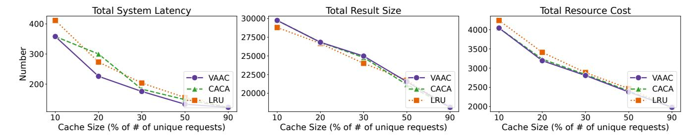

# 4.1 Semantic Features

Determining whether a tool-calling request in LLM applications is cacheable is fundamentally a semantic question. Unlike traditional web caching, where cacheability can often be inferred from static resource types or HTTP metadata, LLM tool-calling workloads are driven by dynamically generated context-rich requests with varying degrees of features. We select the following features and explain the reasons.

Request Type: Tool-calling extends the capabilities of LLMs by enabling interaction with external APIs that can serve fundamentally different purposes. A single tool may support both information retrieval and command/action semantics. For example, a messaging tool can be invoked to send a message: message(send;Mike;"Hello") or to read the latest message: message(read;last message).

This distinction is critical for caching: retrieval-type requests are generally side-effect-free and thus suitable for reuse when repeated, whereas command-type requests often induce irreversible state changes, making their results unsafe or meaningless to cache. We therefore categorize tool-calling requests into two broad classes: INFORMATIONAL (e.g., weather lookup, knowledge base search) and COMMAND (e.g., sending a message, initiating a transaction). To avoid harmful side effects, COMMAND requests are excluded from caching, while INFORMATIONAL requests serve as candidates for reuse. Accurately identifying the request type thus becomes a key feature for determining cacheability and is directly incorporated into ToolCaching's admission control.

Parameter Category: This feature captures the grouping of tool-calling requests based on their input parameters. For example, in a weather query tool, requests can be organized by attributes such as location or date (e.g., location=London, date=2024-05-01), which later serve as the basis for request grouping and make caching management adaptive (discussed in [Section 5\)](#page-4-0).

In this work, we adopt a practical heuristic: for multi-parameter tool calls, the first parameter is treated as the primary category for grouping; for single-parameter functions, no further parameterbased grouping is applied. Although we adopt a simple heuristic in this paper, the parameter-based categorization is not fixed; grouping rules can be customized when registering each tool in the cache system to better reflect its semantics and usage patterns.

TTL (Time-to-Live): In traditional caching systems, TTL is a fundamental mechanism for controlling data staleness and ensuring the validity of cached content. We adopt the same concept for LLM tool-calling, where TTL specifies the suggested lifetime of a toolcalling result and directly drives cache expiration policies.

Tool calls with short TTLs (e.g., real-time sensor readings) are less suitable for caching due to rapid staleness, whereas those with longer TTLs (e.g., static knowledge queries) are strong candidates for reuse. In ToolCaching, we define indicative default values: 0s for COMMAND requests, 60s for real-time data, 300s for computational results, and 3600s for static knowledge. These values reflect common temporal patterns and can be customized per tool or dynamically adapted to workload characteristics.

Considering all these attributes, the corresponding feature set can be obtained by prompting the LLM with each tool-calling request. An example of the prompting template used for feature collection is shown in [Appendix A.](#page-8-24)

In practice, we find that prompt engineering with clear instructions and representative examples, effectively leverages the LLM's semantic analysis capability and produces accurate and consistent feature extraction results, achieving nearly 90% accuracy as evaluated in [Table 2,](#page-5-0) which forms a solid basis for downstream caching management.

### 4.2 System Features

Once a tool-calling request is identified as cacheable, ToolCaching evaluates the potential benefit of retaining its result by collecting a set of system-level features. These features serve two purposes: (i) estimating the caching value of each entry and (ii) driving adaptive admission and eviction policies under dynamic workloads.

We distinguish two categories of system features:

In-cache statistics, maintained directly by the caching system with minimal overhead:

Associated Users: This feature records the set of users who have accessed each request. In LLM tool-calling scenarios, different users often exhibit distinct patterns of accessing particular tools or queries. By tracking associated users, ToolCaching can effectively group requests based on user interest, as users may repeatedly invoke similar or identical tool calls. For example, a particular user might frequently request personalized movie recommendations, while another consistently queries financial data. Using user-based grouping significantly improves cache hit ratio by ensuring cached results align closely with user-specific request patterns.

Access Count: The total number of cache hits for each cached tool-calling result. This common caching metric helps ToolCaching quickly identify frequently requested entries (e.g., popular specific knowledge queries), directly informing prioritization in cache admission.

Result Size: The size of the cached tool-calling response. In LLM tool-calling scenarios, some requests (such as retrieving large datasets) produce much larger results than others. Tracking result size helps ToolCaching avoid allowing oversized entries to consume disproportionate cache space, ensuring a balanced trade-off between hit ratio and overall cache efficiency.

System Latency: The end-to-end time required to fulfill a toolcalling request, including both network transfer and tool execution delay. ToolCaching directly measures this latency within the cache system, allowing it to identify high-latency operations as prime candidates for caching. Prioritizing results with higher observed latency improves user-perceived responsiveness by minimizing repeated slow calls.

System-level indicators, obtained via application-level measurement or low-level monitoring:

Observed Resource Cost: The measured execution cost of each tool-calling request, either in terms of CPU consumption for local computations or billing price for external API calls. In LLM tool-calling, different tools have significantly varied resource costs; expensive local computations (e.g., personalized recommendation rankings) or costly third-party APIs (e.g., legal document retrieval) clearly justify higher caching value. ToolCaching leverages this feature to prioritize retention of results that yield substantial savings in computation or API billing costs.

For features that are difficult or costly to collect at the application layer, such as CPU usage of local APIs, we leverage light-weight system observability tools like eBPF (extended Berkeley Packet Filter)[2], which is widely used for kernel-level performance tracing [27, 37]. These allow per-request resource profiling with minimal runtime overhead. If needed, additional low-level metrics (e.g., memory usage, disk I/O, function calling) can also be captured through similar techniques to further inform caching decisions.

### 5 Efficient Caching Management

In this section, we discuss how to design efficient caching management policies based on the collected features.

### 5.1 Cache Structure Design

We begin by describing the design of the cache structure, which encompasses both cache key construction and value storage. This foundational design supports feature-aware admission and value-driven prioritization, laying the groundwork for the adaptive management policies discussed in subsequent sections.

Cache Key Construction: To ensure efficient and accurate cache lookups, we construct a unique key for each tool-calling request by combining the tool name with a serialized representation of its input parameters. The serialization process is designed to be order-invariant and supports complex, nested parameter structures (e.g., JSON objects), ensuring that logically equivalent requests yield identical keys. This composite string is then hashed to produce a compact, collision-resistant identifier. For example, a request to retrieve the weather for New York on May 1, 2024, would result in a key such as hash(weather:location=NewYork, date=2024-05-01). This approach enables fast lookups, accurate request distinction, and robust cache management in diverse LLM tool-calling scenarios.

**Cache Value Storage:** Each cache entry stores both the result of the tool call and its associated metadata. The metadata includes the relevant semantic and system features described in Section 4, as well as a value score used to guide cache management decisions. The details of how this value score is computed are discussed later.

### 5.2 Cacheability Analysis

Before caching a tool-calling request, it is essential to determine whether the request is cacheable. We leverage a set of semantic features including request type, parameter category, and TTL to evaluate cacheability. Specifically, we adopt the following rules: (1) requests of type COMMAND are not cacheable; (2) requests with short TTL ( $\leq$  60 seconds) are not cacheable.

Although these criteria are based on structured semantic features generated by the LLM, we deliberately avoid allowing the LLM itself to decide cacheability. Rule-based judgments over well-defined features ensure determinism, interpretability, and efficiency, whereas delegating this decision to the LLM could introduce uncertainty and potential errors. Overly complex or ambiguous LLM-driven analysis risks inconsistent cache states and degraded performance. Our approach therefore combines the LLM's semantic extraction capability with transparent, rule-based cacheability assessment to maximize both expressiveness and reliability.

### 5.3 Caching Value Model

In addition to request access count, which is a standard metric in caching systems, we explicitly account for the overall cost of fulfilling each request in LLM tool-calling scenarios. This includes result size, system latency, and resource cost. By integrating these dimensions, our caching value model better reflects the real performance benefit of caching in complex, heterogeneous environments.

To ensure that these features are comparable and do not dominate the caching value due to scale differences, we apply min-max normalization to each metric. The normalization process rescales each feature j of request  $r_i$  as:

NormFeaturei(j) = 
$$\frac{Feature_{i}^{(j)} - Feature_{min}^{(j)}}{Feature_{max}^{(j)} - Feature_{min}^{(j)}}$$
(1)

where  $Feature_i^{(j)}$  denotes the value of feature j (e.g., latency, size, or cost) for request  $r_i$ , and  $Feature_{min}^{(j)}$ ,  $Feature_{max}^{(j)}$  are the minimum and maximum observed values of that feature, respectively.

Then, we can define the caching value  $v_i$  of a request  $r_i$  as follows:

$$v_i = \lambda_1 \cdot \text{NormLatency}_i + \lambda_2 \cdot \frac{\text{NormCost}_i}{\text{NormSize}_i} - \lambda_3 \cdot e^{-\frac{\text{TTL}_i}{\tau}}$$
 (2)

where  $\lambda_1$ ,  $\lambda_2$ , and  $\lambda_3$  are tunable weights controlling the relative importance of latency, cost-to-size ratio, and TTL-based risk in the caching value model.  $\tau$  is a smoothing parameter that represents the average lifetime of cached entries. A smaller TTL $_i$  leads to a larger exponential term, indicating a higher risk of staleness, whereas a larger TTL $_i$  results in a smaller risk value, reflecting greater temporal stability.

Intuitively, the model prioritizes requests with high latency, large cost, and small result size (since they save system resources), while de-emphasizing those with short TTLs that are prone to rapid invalidation. This balance between performance gain and temporal stability allows ToolCaching to cache entries that are both frequently accessed and sustainably valuable over time.

#### 5.4 Cache Admission

Cache admission determines which requests enter the cache. In ToolCaching, we leverage the features collected in Section 4 to design a reinforcement learning-based admission policy, inspired by the CACA framework [18], which adaptively adjusts to workload changes.

CACA first partitions requests into groups based on content features, then applies a reinforcement learning approach, which is specifically a multi-armed bandit algorithm, to dynamically tune admission policies for each group. By tracking frequency and hit ratio for each group, CACA selectively admits only the top-performing groups, focusing limited cache resources on requests with the greatest potential for reuse and system benefit. This approach is well-suited to the highly dynamic and diverse nature of LLM tool-calling workloads.

However, the original CACA only considers request frequency and hit ratio, overlooking fulfillment cost, a key factor in LLM toolcalling scenarios. We extend CACA to v-CACA by incorporating our caching value model into the reward function of the multiarmed bandit, so that both request patterns and execution cost guide cache admission.

Therefore, the cache admission policy in ToolCaching can be summarized as follows:

**Initial States:** In the initial phase, all cacheable tool-calling requests are admitted if space is available. For every request, features are collected and updated, especially upon cache hit or reuse.

**Feature Grouping:** To manage the diverse and dynamic nature of tool-calling requests, ToolCaching organizes requests into feature-based groups using a fixed three-level feature set: (1) tool type, (2) parameter category, and (3) user identity. Requests are first partitioned by tool type, then (when needed) subdivided by parameter category, and finally by user identity to capture fine-grained locality patterns. The hierarchy is constructed adaptively: a group is split only when its access frequency exceeds a threshold  $T_1$  while its hit ratio is below  $H^r$ ; otherwise it remains at its current level.

Each resulting group  $g_i$  in the group list  $\mathcal{G}$  maintains its own aggregate statistics including its cache hit ratio  $H_i$  and the average caching value  $V_i$ . This hierarchical feature grouping improves the stability of reinforcement learning decisions and allows the cache to respond adaptively to changing workloads. The full grouping logic, the corresponding hierarchy illustration and pseudo-code are provided in Appendix B.

**Admission Control:** Now, we have a set of feature groups  $\mathcal{G}$ , each with its own average caching value  $V_i$  and hit ratio  $H_i$ . The next step is to determine which feature groups should be admitted into the cache.

This problem can be formulated as a multi-armed bandit problem, where each feature group  $g_i$  is an arm, and the goal is to maximize the cumulative reward over time. Like CACA, we consider hit ratio  $H_i$ , node level  $L_i$  and the number of times the group has been admitted to the cache  $C_i$ , but we also consider the average caching value  $V_i$  of the requests in the group for the nature of tool-calling requests. Therefore, the reward function for each feature group  $g_i$  is defined as follows:

$$F_i = \frac{\log(H_i + \delta_1) \cdot \log(L_i + \delta_2) \cdot \log(V_i + \delta_3)}{\log(C_i + \delta_4)}$$
(3)

where  $\delta_1$ ,  $\delta_2$ ,  $\delta_3$ , and  $\delta_4$  are small constants to avoid division by zero and logarithm of zero.

To address this multi-armed bandit problem, we adopt UCB1 algorithm [12], which balances exploration and exploitation by selecting the arm with the highest upper confidence bound. The details of UCB1-based admission control are provided in Appendix B.

#### 5.5 Cache Eviction

Cache eviction determines which entries are removed when space is needed. In ToolCaching, we build on the classic LRU (Least Recently Used) policy and introduce v-LRU, a multi-factor eviction policy

that jointly considers recency and the caching value defined in Eq. (2).

The procedure of v-LRU is as follows:

**TTL Expiration:** Entries whose TTLs have explicitly expired are immediately invalidated. Although TTL-based staleness risk is already incorporated into the caching value  $v_i$ , explicit expiration handling ensures correctness and prevents outdated results from being accessed.

**Item Eviction:** When eviction is required, we identify the bottom 10% of cache entries by recency (i.e., those least recently used). From this subset, we remove the entry with the lowest eviction score  $e_i$ , defined as:

$$e_i = \log \left( v_i + h_i + \delta_5 \right) \tag{4}$$

where  $v_i$  is the caching value,  $h_i$  is the hit ratio, and  $\delta_5$  is a small constant to ensure numerical stability.

Our strategy combines the caching value model with adaptive admission (v-CACA) and multi-factor eviction (v-LRU) to provide effective cache management for LLM tool-calling, together forming Value-Aware Adaptive Caching (VAAC) algorithm.

#### 6 Evaluation

In this section, we evaluate the effectiveness of our feature collection and caching management algorithms in ToolCaching. We first assess the accuracy of the LLM in extracting semantic features from tool-calling requests, and then we evaluate the performance of our caching management algorithms using simulated workloads and public LLM tool-calling datasets. For the public dataset experiments, we implement our cache evaluation on top of the LLM Compiler framework. The cache server runs on a single machine with 16GB RAM and 8 CPUs, and the LLM used for semantic feature extraction and LLM Compiler is the cloud-based DeepSeek V3 [22, 38].

### 6.1 Semantic Feature Accuracy

While semantic features are extracted using LLMs, a critical question arises: How accurate is the LLM in extracting the semantic features of tool-calling requests?

To answer this question, we conducted an evaluation of the LLM's semantic feature extraction capabilities on a set of tool-calling requests. Specifically, we extracted 50 tool-calling requests from the BFCL\_v3\_simple subset of the Berkeley Function Calling Leaderboard (BFCL) dataset [23]. Each request in our validation set was manually annotated with its corresponding request type (COMMAND or INFORMATIONAL) and an estimated TTL. These annotations serve as the ground truth for evaluating the accuracy of the LLM's automatic classification and TTL prediction. To avoid confounding errors due to misparsed or malformed tool calls, we

Table 2: LLM semantic feature extraction accuracy on tool-calling requests.

| Features           | Accuracy | Precision | Recall | F1    |
|--------------------|----------|-----------|--------|-------|
| Request Type       | 0.980    | 0.968     | 1.000  | 0.984 |
| TTL                | 0.920    | 0.864     | 0.864  | 0.864 |
| Parameter Category | 1        | 1         | 1      | 1     |

> **[图片提取文字 (无描述)]:**
> Zipf Distribution Dynamic Hotspot Shifting Uniform Distribution 0.80 0.8 0.8 Hit Ratio 0.75 0.6 0.70 Cache | 0.65 0.4 --- VAAC -●- VAAC --- VAAC 0.60 -A- CACA -A- CACA -A- CACA 0.2 ·- LRU LRU -- LRU 0.55 0.5 90 Cache Size (% of # of unique requests) Cache Size (% of # of unique requests) Cache Size (% of # of unique requests)

Figure 3: Cache hit ratio under different cache sizes and workloads

> **[图片提取文字 (无描述)]:**
> Total System Latency Total Result Size Total Resource Cost 30000 400 4000 27500 3500 g 300-25000 3000 22500 −●− VAAC - VAAC --- VAAC 200-2500--A- CACA -A- CACA CACA 20000-LRU - LRU LRU 2000 90 90 Cache Size (% of # of unique requests) Cache Size (% of # of unique requests) Cache Size (% of # of unique requests)

Figure 4: Total latency, result size and resource cost of requests under different cache sizes in Zipf distribution

restrict our evaluation to only those cases where the LLM produces the correct tool call format. Therefore, since our system uses the first parameter of each tool call as the primary category, the correctness of parameter grouping is always 1.

We use the same prompt template as shown in Appendix A, and we compute standard classification metrics—including accuracy, precision, recall, and F1-score—for each semantic attribute.

As shown in Table 2, the LLM achieves very high accuracy in extracting semantic features from tool-calling requests. The request type classification is nearly perfect, while TTL prediction also demonstrates strong accuracy. These results indicate that the LLM provides reliable semantic annotations for downstream caching management.

### 6.2 Caching Management

Due to the lack of publicly available datasets that accurately reflect real-world LLM tool-calling workload patterns, we construct a synthetic dataset to evaluate the performance of our caching management algorithms.

To comprehensively evaluate the effectiveness of our caching management algorithms, we construct three types of synthetic workloads, each consisting of 1,000 requests covering 6 different tools, which are designed to cover a diverse range of parameter

Table 3: Comparison of cache hit ratio and latency with/without user-based grouping.

| Cache Size   | 10%           | 20%           | 30%           |
|--------------|---------------|---------------|---------------|
| With User    | 18.8 / 563.28 | 32.2 / 465.60 | 52.1 / 346.32 |
| Without User | 15.5 / 568.88 | 30.2 / 501.04 | 51.2 / 363.62 |

types, response sizes, TTLs, and resource costs, ensuring broad coverage of typical tool-calling scenarios:

- **Zipf distribution:** Requests are sampled according to a Zipf distribution ( $\alpha = 1.1$ ), mimicking real-world workload locality [9, 13, 14, 18].
- Dynamic hotspot shifting: The workload periodically switches between different hotspot regions. In each phase, request frequencies within the active hotspot follow a Zipf distribution, while other requests are distributed among the remaining tools.
- Uniform distribution: Requests are generated uniformly at random across all tool and parameter combinations, serving as a baseline to evaluate cache policy performance under minimal locality.

We implement the cache server for simulated workloads using Python with ~1400 lines of code and evaluate the performance of cache hit ratio under 5 different cache sizes: 10% of all unique requests, 20%, 35%, 50% and 90%. We set  $\lambda_1 = 0.8$ ,  $\lambda_2 = 0.2$ ,  $\lambda_3 = 0.2$ ,  $T_1 = 20$  and  $H_r = 0.5$ .

For each cache size, we compare the performance of our VAAC algorithm against two baseline algorithms: CACA (admits requests without consideration of value and LRU eviction policy) and LRU (admits all requests into the cache). The results are shown in Fig. 3. As depicted, VAAC consistently outperforms both CACA and LRU across most cache sizes and workloads by up to 11%. This demonstrates the effectiveness of our caching value model and multi-factor eviction policy in optimizing cache performance.

Specifically, we present the total system latency, result size and resource cost of requests under different cache sizes in the Zipf distribution workload in Fig. 4. As shown, VAAC achieves the lowest total latency and resource cost compared to CACA and LRU with

| Dataset              | Cache Size (of calls' #) | Cache Hit Ratio | Latency(s) | Improvement |
|----------------------|--------------------------|-----------------|------------|-------------|
| Movie Recommendation | 0%                       | —               | 16.2       | —           |
|                      | 20%                      | 0.3781          | 13.81      | 1.14×       |
|                      | 50%                      | 0.503           | 11.88      | 1.26×       |
|                      | 100%                     | 0.514           | 10.7       | 1.34×       |
| ParallelQA           | 0%                       | —               | 15.9       | —           |
|                      | 20%                      | 0.232           | 13.08      | 1.17×       |
|                      | 50%                      | 0.265           | 12.99      | 1.18×       |
|                      | 100%                     | 0.2866          | 12.18      | 1.23×       |

Table 4: Effectiveness of ToolCaching in LLM Compiler

up to 17.3% and 6.4% reduction, respectively. For the total result size, due to our cache value model penalizing large result sizes in [2,](#page-4-1) VAAC achieves the highest result because high-value requests are more likely to be refused and evicted, which is consistent with our design goal of maximizing cache utility.

