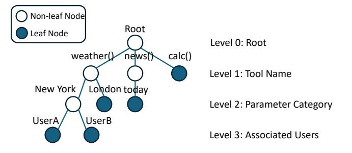

# 6.4 End-to-End Evaluation in LLM Tool-calling Systems

The development of tool-calling has enabled LLMs to solve increasingly complex problems by selecting and coordinating multiple functions based on context. To further support such applications, frameworks like LLM Compiler [\[20\]](#page-8-5) provide optimization for multistep reasoning and tool orchestration.

To evaluate the real-world effectiveness of ToolCaching in advanced LLM tool-calling scenarios, we integrate our caching management system into the LLM Compiler framework and conduct an end-to-end evaluation. We use the following dataset provided by LLM Compiler:

- Movie Recommendation: This dataset contains 500 examples, each asking for the most similar movie among four options compared to a reference set of four movies. The task exhibits an 8-way embarrassingly parallel execution pattern, where each candidate can be evaluated separately.
- ParallelQA: ParallelQA is a custom benchmark for evaluating tool-calling scenarios with complex dependencies. It includes 113 math-related questions about factual attributes, where each task requires sequential use of two tools (such as search followed by math) with the second tool's input

depending on the first tool's output. All required information is contained within the first paragraph of relevant Wikipedia articles.

We compare the performance of ToolCaching with the baseline LLM Compiler framework without caching. The results are summarized in [Table 4.](#page-7-5) As shown in the table, ToolCaching consistently reduces end-to-end latency as the cache size increases. In the Movie Recommendation dataset, ToolCaching achieves up to a 34% reduction in latency. Similarly, for ParallelQA, the latency is reduced by up to 23%. These results demonstrate that ToolCaching can effectively reduce redundant tool calls and significantly improve system efficiency in complex LLM tool-calling scenarios.

### 6.5 Overhead

We also measure the overhead of ToolCaching in the scenario of LLM Compiler. The CPU overhead of ToolCaching is ∼ 15% and the memory overhead is ∼ 10% compared to the baseline LLM Compiler framework without caching. The CPU overhead mainly comes from the calculation of VAAC algorithm, while the memory overhead is due to the storage of cached entries and their associated metadata. These overheads are acceptable given the significant performance improvements achieved through caching.

### 7 Conclusion

In this paper, we present ToolCaching, an efficient caching framework for LLM tool-calling systems. At its core, ToolCaching employs VAAC algorithm, which integrates semantic and system-level features, dynamically partitions requests into groups, and utilizes a bandit-based admission policy together with value-aware LRU eviction. Through extensive experiments, we demonstrate that Tool-Caching with VAAC achieves higher cache hit ratios and lower latency than conventional static and frequency-based policies. Our results further show that ToolCaching adapts effectively to dynamic workloads and varying result validity, underscoring the value of caching in complex LLM environments.

### References

- <span id="page-7-1"></span>[1] [n. d.]. Cursor - The AI Code Editor. https://cursor.com/.
- <span id="page-7-4"></span><span id="page-7-2"></span>[2] [n. d.]. eBPF. https://ebpf.io.
- [3] [n. d.]. GitHub Copilot. https://github.com/features/copilot.
- <span id="page-7-0"></span>[4] 2025. ChatGPT. https://chatgpt.com/.
- <span id="page-7-3"></span>[5] 2025. Google Custom Search JSON API. https://developers.google.com/customsearch/v1/overview?hl=zh-cn.

- <span id="page-8-16"></span>[6] 2025. Google Maps Platform Pricing. https://developers.google.com/maps/billingand-pricing/pricing.
- <span id="page-8-17"></span>[7] 2025. Pricing - OpenWeatherMap. https://openweathermap.org/price.
- <span id="page-8-15"></span>[8] 2025. Wikimedia APIs. https://api.wikimedia.org.
- <span id="page-8-32"></span>[9] Bahman Abolhassani, John Tadrous, and Atilla Eryilmaz. 2023. Optimal Load-Splitting and Distributed-Caching for Dynamic Content Over the Wireless Edge. IEEE/ACM Transactions on Networking 31, 5 (October 2023), 2178–2190. doi:10. 1109/TNET.2023.3244039
- <span id="page-8-12"></span>[10] Josh Achiam, Steven Adler, Sandhini Agarwal, Lama Ahmad, Ilge Akkaya, Florencia Leoni Aleman, Diogo Almeida, Janko Altenschmidt, Sam Altman, Shyamal Anadkat, et al. 2023. Gpt-4 Technical Report. arXiv preprint arXiv:2303.08774 (2023). arXiv:2303.08774
- <span id="page-8-0"></span>[11] Daniel Adiwardana, Minh-Thang Luong, David R. So, Jamie Hall, Noah Fiedel, Romal Thoppilan, Zi Yang, Apoorv Kulshreshtha, Gaurav Nemade, Yifeng Lu, and Quoc V. Le. 2020. Towards a Human-like Open-Domain Chatbot. arXiv:2001.09977 [cs] doi:10.48550/arXiv.2001.09977
- <span id="page-8-28"></span>[12] Peter Auer, Nicolò Cesa-Bianchi, and Paul Fischer. 2002. Finite-Time Analysis of the Multiarmed Bandit Problem. Machine Learning 47, 2-3 (May 2002), 235–256. doi:10.1023/a:1013689704352
- <span id="page-8-33"></span>[13] L. Breslau, Pei Cao, Li Fan, G. Phillips, and S. Shenker. 1999. Web Caching and Zipf-like Distributions: Evidence and Implications. In IEEE INFOCOM Joint Conference on Computer Communications. Proceedings. Eighteenth Annual Joint Conference of the IEEE Computer and Communications Societies. The Future Is Now (Cat. No.99CH36320), Vol. 1. 126–134 vol. 1. doi:10.1109/INFCOM.1999.749260
- <span id="page-8-34"></span>[14] Yong Deng and Min Dong. 2022. Fundamental Structure of Optimal Cache Placement for Coded Caching With Nonuniform Demands. *IEEE Transactions on Information Theory* 68, 10 (October 2022), 6528–6547. doi:10.1109/TIT.2022. 3179266
- <span id="page-8-18"></span>[15] Gil Einziger, Roy Friedman, and Ben Manes. 2017. TinyLFU: A Highly Efficient Cache Admission Policy. ACM Trans. Storage 13, 4 (November 2017), 35:1–35:31. doi:10.1145/3149371
- <span id="page-8-19"></span>[16] Christine Fricker, Philippe Robert, and James Roberts. 2012. A Versatile and Accurate Approximation for LRU Cache Performance. In 2012 24th International Teletraffic Congress (ITC 24). 1–8.
- <span id="page-8-6"></span>[17] In Gim, Seung-Seob Lee, and Lin Zhong. 2024. Asynchronous LLM Function Calling. CoRR (January 2024).
- <span id="page-8-21"></span>[18] Yu Guan, Xinggong Zhang, and Zongming Guo. 2019. CACA: Learning-Based Content-Aware Cache Admission for Video Content in Edge Caching. In Proceedings of the 27th ACM International Conference on Multimedia (MM '19). Association for Computing Machinery, New York, NY, USA, 456–464. doi:10.1145/3343031.3350890
- <span id="page-8-35"></span>[19] Xinyi Hou, Yanjie Zhao, Shenao Wang, and Haoyu Wang. 2025. Model Context Protocol (MCP): Landscape, Security Threats, and Future Research Directions. arXiv:2503.23278 [cs] doi:10.48550/arXiv.2503.23278
- <span id="page-8-5"></span>[20] Sehoon Kim, Suhong Moon, Ryan Tabrizi, Nicholas Lee, Michael W. Mahoney, Kurt Keutzer, and Amir Gholami. 2024. An Llm Compiler for Parallel Function Calling. In Forty-First International Conference on Machine Learning.
- <span id="page-8-8"></span>[21] Woosuk Kwon, Zhuohan Li, Siyuan Zhuang, Ying Sheng, Lianmin Zheng, Cody Hao Yu, Joseph Gonzalez, Hao Zhang, and Ion Stoica. 2023. Efficient Memory Management for Large Language Model Serving with PagedAttention. In Proceedings of the 29th Symposium on Operating Systems Principles. ACM, Koblenz Germany, 611–626. doi:10.1145/3600006.3613165
- <span id="page-8-29"></span>[22] Aixin Liu, Bei Feng, Bing Xue, Bingxuan Wang, Bochao Wu, Chengda Lu, Chenggang Zhao, Chengqi Deng, Chenyu Zhang, Chong Ruan, et al. 2024. Deepseek-v3 Technical Report. arXiv preprint arXiv:2412.19437 (2024). arXiv:2412.19437
- <span id="page-8-31"></span>[23] Shishir G. Patil, Huanzhi Mao, Charlie Cheng-Jie Ji, Fanjia Yan, Vishnu Suresh, Ion Stoica, and Joseph E. Gonzalez. 2025. The Berkeley Function Calling Leaderboard (BFCL): From Tool Use to Agentic Evaluation of Large Language Models. In Forty-Second International Conference on Machine Learning.
- <span id="page-8-1"></span>[24] Shishir G. Patil, Tianjun Zhang, Xin Wang, and Joseph E. Gonzalez. 2024. Gorilla: Large Language Model Connected with Massive Apis. Advances in Neural Information Processing Systems 37 (2024), 126544–126565.
- <span id="page-8-9"></span>[25] Ramya Prabhu, Ajay Nayak, Jayashree Mohan, Ramachandran Ramjee, and Ashish Panwar. 2025. vAttention: Dynamic Memory Management for Serving LLMs without PagedAttention. In Proceedings of the 30th ACM International Conference on Architectural Support for Programming Languages and Operating Systems, Volume 1 (ASPLOS '25). Association for Computing Machinery, New York, NY, USA, 1133–1150. doi:10.1145/3669940.3707256
- <span id="page-8-2"></span>[26] Timo Schick, Jane Dwivedi-Yu, Roberto Dessi, Roberta Raileanu, Maria Lomeli, Eric Hambro, Luke Zettlemoyer, Nicola Cancedda, and Thomas Scialom. 2023. Toolformer: Language Models Can Teach Themselves to Use Tools. Advances in Neural Information Processing Systems 36 (December 2023), 68539–68551.
- <span id="page-8-25"></span>[27] Junxian Shen, Han Zhang, Yang Xiang, Xingang Shi, Xinrui Li, Yunxi Shen, Zijian Zhang, Yongxiang Wu, Xia Yin, and Jilong Wang. 2023. Network-Centric Distributed Tracing with DeepFlow: Troubleshooting Your Microservices in Zero Code. In Proceedings of the ACM SIGCOMM 2023 Conference. 420–437.
- <span id="page-8-11"></span>[28] Simranjit Singh, Michael Fore, Andreas Karatzas, Chaehong Lee, Yanan Jian, Longfei Shangguan, Fuxun Yu, Iraklis Anagnostopoulos, and Dimitrios Stamoulis.

- 2024. LLM-dCache: Improving Tool-Augmented LLMs with GPT-Driven Localized Data Caching. In 2024 31st IEEE International Conference on Electronics, Circuits and Systems (ICECS). 1–4. doi:10.1109/ICECS61496.2024.10848749
- <span id="page-8-3"></span>[29] Yifan Song, Weimin Xiong, Dawei Zhu, Wenhao Wu, Han Qian, Mingbo Song, Hailiang Huang, Cheng Li, Ke Wang, Rong Yao, Ye Tian, and Sujian Li. 2023. RestGPT: Connecting Large Language Models with Real-World RESTful APIs. arXiv:2306.06624 [cs] doi:10.48550/arXiv.2306.06624
- <span id="page-8-14"></span>[30] Aarohi Srivastava, Abhinav Rastogi, Abhishek Rao, Abu Awal Shoeb, Abubakar Abid, Adam Fisch, Adam R Brown, Adam Santoro, Aditya Gupta, Adri Garriga-Alonso, et al. 2023. Beyond the Imitation Game: Quantifying and Extrapolating the Capabilities of Language Models. Transactions on machine learning research (2023).
- <span id="page-8-13"></span>[31] Hugo Touvron, Louis Martin, Kevin Stone, Peter Albert, Amjad Almahairi, Yasmine Babaei, Nikolay Bashlykov, Soumya Batra, Prajjwal Bhargava, Shruti Bhosale, et al. 2023. Llama 2: Open Foundation and Fine-Tuned Chat Models. arXiv preprint arXiv:2307.09288 (2023). arXiv:2307.09288
- <span id="page-8-7"></span>[32] Yechen Xu, Xinhao Kong, Tingjun Chen, and Danyang Zhuo. 2024. Conveyor: Efficient Tool-Aware LLM Serving with Tool Partial Execution. (October 2024).
- <span id="page-8-22"></span>[33] Juncheng Yang, Ziming Mao, Yao Yue, and K. V. Rashmi. 2023. {GL-Cache}: Group-Level Learning for Efficient and High-Performance Caching. In 21st USENIX Conference on File and Storage Technologies (FAST 23). 115–134.
- <span id="page-8-23"></span>[34] Juncheng Yang, Yao Yue, and Rashmi Vinayak. 2021. Segcache: A Memory-Efficient and Scalable in-Memory Key-Value Cache for Small Objects. In 18th USENIX Symposium on Networked Systems Design and Implementation (NSDI 21). 503-518.
- <span id="page-8-4"></span>[35] Shunyu Yao, Jeffrey Zhao, Dian Yu, Nan Du, Izhak Shafran, Karthik R. Narasimhan, and Yuan Cao. 2022. ReAct: Synergizing Reasoning and Acting in Language Models. In The Eleventh International Conference on Learning Representations.
- <span id="page-8-10"></span>[36] Gyeong-In Yu, Joo Seong Jeong, Geon-Woo Kim, Soojeong Kim, and Byung-Gon Chun. 2022. Orca: A Distributed Serving System for {Transformer-Based} Generative Models. In 16th USENIX Symposium on Operating Systems Design and Implementation (OSDI 22), 521–538.
- <span id="page-8-26"></span>[37] Yi Zhai, Junzhou Luo, and Jianrui Liu. 2025. NRCAC: Non-Intrusive Microservice Root Cause Analysis Framework for Cloud Providers. In IEEE IN-FOCOM 2025 - IEEE Conference on Computer Communications. 1–10. doi:10.1109/ INFOCOM55648.2025.11044716
- <span id="page-8-30"></span>[38] Chenggang Zhao, Chengqi Deng, Chong Ruan, Damai Dai, Huazuo Gao, Jiashi Li, Liyue Zhang, Panpan Huang, Shangyan Zhou, Shirong Ma, Wenfeng Liang, Ying He, Yuqing Wang, Yuxuan Liu, and Y.X. Wei. 2025. Insights into DeepSeek-V3: Scaling Challenges and Reflections on Hardware for AI Architectures. In Proceedings of the 52nd Annual International Symposium on Computer Architecture. ACM, Tokyo Japan, 1731–1745. doi:10.1145/3695053.3731412
- <span id="page-8-20"></span>[39] Yikai Zhao, Wenrui Liu, Fenghao Dong, Tong Yang, Yuanpeng Li, Kaicheng Yang, Zirui Liu, Zhengyi Jia, and Yongqiang Yang. 2023. P4LRU: Towards An LRU Cache Entirely in Programmable Data Plane. In Proceedings of the ACM SIGCOMM 2023 Conference (ACM SIGCOMM '23). Association for Computing Machinery, New York, NY, USA, 967–980. doi:10.1145/3603269.3604813

### <span id="page-8-24"></span>**A Semantic Feature Extraction Details**

We provide the detailed prompt template used for LLM-based feature extraction in Fig. 5.

### <span id="page-8-27"></span>**B** Cache Admission Details

### **B.1** Hierarchical Feature Grouping

We adopt a hierarchical and adaptive grouping strategy. Requests are initially partitioned by tool type. For each tool group, we continuously track aggregate statistics such as access count and cache hit ratio. If a group has high frequency (request access count  $\geq T_1$ ) but low hit ratio ( $\leq H^r$ ), which suggests substantial diversity, we further subdivide by parameter category. If parameter-based grouping is still insufficient to capture homogeneity, we refine the grouping by user ID. This is especially useful in multi-user environments where access patterns can differ significantly.

Through this recursive process, requests are organized into a tree structure (Fig. 6), with each layer corresponding to a specific feature dimension. The leaf nodes represent homogeneous request clusters managed by the cache. For example, a leaf like

```
# Prompt Type: SYSTEM
# Input:
<Other system Input>
 • When using tools, please respond in the following format:
     CACHE_ANALYSIS: {{
       "request_type": "INFORMATIONAL or COMMAND",
      "parameter_categories": string,
      "suggested_ttl_seconds": number

    Analyze caching based on these principles:

   request_type (Request Type):
     - INFORMATIONAL: Query or information retrieval operations
     (like calculations, translations, weather checks)
     - COMMAND: State-changing operations (like sending emails,
     deleting files, money transfers)
   parameter_category (Parameter Category):
      Return the primary parameter of tools, or 'none' for single-
     parameter tools
   suggested_ttl_seconds (TTL):
     - Based on information timeliness and request type
     - 0 seconds for COMMAND, 60 seconds for real-time data,
     300 seconds for calculations, and 3600 seconds for static
```

Figure 5: Prompt template for LLM semantic feature extraction.

Please intelligently analyze the caching characteristics of each

tool call based on your understanding of the request content.

knowledge.

<span id="page-9-1"></span>> **[图片提取文字 (无描述)]:**
> Non-leaf Node Root Leaf Node Level 0: Root weather( calc() news Level 1: Tool Name London today New York Level 2: Parameter Category UserA UserB Level 3: Associated Users


Figure 6: Hierarchical feature grouping for tool-calling requests.

root/weather()/New York/UserA represents a group for "weather" tool with the parameter "New York" and user "UserA". To prevent over-fragmentation, groups with too few requests are merged with their parent group.

This dynamic refinement process, guided by frequency and hit ratio, allows the system to maximize cache utility by adaptively aligning group granularity with real-world workload patterns. At the same time, it helps control system complexity.

After feature grouping, a list of feature groups is formed:

$$\mathcal{G} = \{g_1, g_2, \dots, g_n\} \tag{5}$$

where each group  $g_i$  contains requests with similar features. For each group  $g_i$ , we maintain a set of statistics, including the average caching value of the requests  $V_i = \frac{1}{|g_i|} \sum_{r_j \in g_i} v_j$ , and the cache hit ratio  $H_i$ .

If there are too few requests ( $< S_{min}$ ) in a group, we merge it with its parent group to reduce the number of groups. Also, the

group will be periodically reset after *B* requests to adapt to changing workloads.

We provide the detailed algorithm for periodic hierarchical feature grouping in Algorithm 1.

### <span id="page-9-2"></span>Algorithm 1 Periodic Hierarchical Feature Grouping for Toolcalling Requests

```
Input: Request stream \mathcal{R}, feature dimensions \mathcal{F}, thresholds T_1
     (freq), H^r (hit ratio), min group size S_{\min}, regroup interval B
Output: Leaf feature groups G
  1: Initialize \mathcal{G} \leftarrow \emptyset
  2: Initialize request buffer \mathcal{R}_{\text{all}} \leftarrow \emptyset, counter cnt \leftarrow 0
     procedure: PeriodicGrouping(\mathcal{F}, B)
         for each incoming request r do
            Add r to \mathcal{R}_{\text{all}}, cnt \leftarrow cnt + 1
  5:
            if cnt \mod B == 0 then
  6:
  7:
                \mathcal{G} \leftarrow \emptyset
  8:
                HierarchicalGrouping(\mathcal{R}_{all}, \mathcal{F}, 1)
                // Now G stores the latest grouping result
     procedure: HierarchicalGrouping(\mathcal{R}, \mathcal{F}, level)
         if level > |\mathcal{F}| or |\mathcal{R}| < S_{\min} then
            Add \mathcal{R} as a group to \mathcal{G}
13:
            return
         Partition \mathcal{R} into subgroups \{\mathcal{R}_1, \mathcal{R}_2, \ldots\} by feature \mathcal{F}[\text{level}]
14:
15:
         for each subgroup \mathcal{R}_i do
            Compute access count f_i, hit ratio H_i
16:
            if f_i \geq T_1 and H_i \leq H^r then
17:
                HierarchicalGrouping(\mathcal{R}_i, \mathcal{F}, level + 1)
18:
19:
            else if |\mathcal{R}_j| < S_{\min} then
20:
                Add \mathcal{R}_j to parent group (skip splitting)
21:
                Add \mathcal{R}_i as a leaf group to \mathcal{G}
23: output: Latest leaf feature groups \mathcal{G} (regrouped every B re-
```

