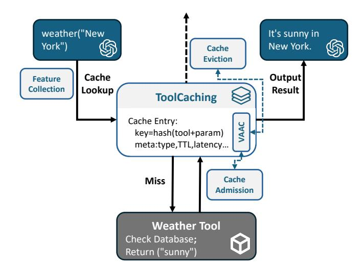

# **CCS Concepts**

• Computing methodologies  $\to$  Artificial intelligence; • Information systems  $\to$  Information systems applications.

### **Keywords**

Caching, LLM System, Tool-calling

### 1 Introduction

Due to their impressive capabilities, Large Language Models (LLMs) have been widely used in the web ecosystem, not only giving rise to new web applications such as chatbots[4, 11] and code assistants[1, 3], but also empowering traditional web services like search, recommendation, and e-commerce with advanced AI capabilities. To further extend the functionality of LLMs in these settings, tool-calling[24, 26, 29] has been introduced, allowing LLMs to interact with external tools and APIs. This capability significantly enhances the versatility and utility of LLM-based applications, unlocking their potential to perform complex tasks, such as data retrieval, computation, and manipulation of external systems.

With the advent of tool-calling, increasingly complex tool-chaining workflows have emerged in modern web applications powered by

> **[图片提取文字 (无描述)]:**
> Generate Execute Compose App Request Tool Call Serving Tool Response LLM Tool LLM User App (a) Tool Call Latency LLM Inference LLM Inference

Figure 1: Tool-calling workflow and the corresponding time-

LLMs, where a single model orchestrates multiple external functions in multi-step pipelines to perform sophisticated tasks. For example, ReAct[35] pioneered the integration of reasoning and acting, enabling LLMs to perform sequential tool invocations interleaved with dynamic reasoning steps. To optimize the performance of these workflows, recent works have focused on improving the efficiency of tool-calling execution, such as parallelizing tool calls[20], allowing asynchronous tool calls[17], and partially executing tools concurrently with LLM decoding[32].

These techniques borrow strategies from traditional computer systems, such as parallel execution and asynchronous scheduling, and have shown performance gains. However, a common phenomenon observed in LLM inference, redundant or repeated processing of similar requests [21, 25, 36], also frequently arises in tool-calling workflows [28], which these approaches do not fully address. This motivates us to revisit another classic optimization strategy widely adopted in web applications: caching the results of tool calls to eliminate redundant executions. Nevertheless, the unique characteristics of LLM tool-calling, such as semantic variations in requests, heterogeneous tool costs, and the need for lightweight integration with inference systems, pose challenges that traditional caching strategies cannot effectively handle.

Firstly, the cacheability of tool calls is highly uncertain: LLMs dynamically generate heterogeneous requests, ranging from information retrieval to state-changing actions, making indiscriminate caching infeasible. Secondly, freshness requirements vary widely; a single TTL policy is either unsafe or inefficient. Thirdly, workloads are highly dynamic: request patterns and popular tools shift rapidly, rendering static strategies ineffective. Hence, robust caching requires adaptive admission and eviction policies that continuously respond to workload characteristics in real time.

To tackle these complexities, we recognize two core technical challenges:

- Understanding LLM tool-calling requests. Tool invocations are highly diverse and context-dependent, making cacheability hard to assess with traditional heuristics. Extracting both semantic and system-level features from dynamic requests is essential yet non-trivial.
- Designing adaptive caching policies. Classic criteria such as hit ratio or recency are insufficient for workloads with heterogeneous costs and reuse patterns. Effective policies must integrate richer features to guide admission and eviction decisions.

These two challenges form the foundation of our approach. We introduce ToolCaching, a caching framework that integrates request semantics with system-level signals to optimize tool-calling in LLM applications. ToolCaching combines semantic analysis of requests with lightweight observability and in-cache statistics, enabling adaptive admission and eviction policies that are tailored to the unique characteristics of tool-calling workloads. To the best of our knowledge, this is the first work to address caching for LLM tool-calling.

We evaluate ToolCaching on both synthetic datasets and public tool-calling workloads. The results show that ToolCaching improves cache hit ratio by up to 11% over baseline strategies, and reduces end-to-end latency by up to 34%, demonstrating its effectiveness in accelerating LLM-based web applications.

Our contributions are summarized as follows: (i) we conduct a comprehensive analysis of the challenges in applying caching to LLM tool-calling and propose ToolCaching, the first framework that integrates semantic and system features for adaptive cache management; (ii) we identify essential features for understanding tool-calling requests and design lightweight mechanisms to collect them; (iii) we develop an efficient cache management algorithm, VAAC, which leverages semantic and system-level signals to guide admission and eviction decisions; (iv) we implement and evaluate ToolCaching on synthetic and public workloads, demonstrating its effectiveness in improving the performance of LLM tool-calling systems.

### 2 Background And Motivation

This section provides an overview of the background and motivation of our work. We begin by introducing the concept of toolcalling in LLMs, followed by the inherent complexities associated with applying caching in LLM tool-calling scenarios and the importance of cache admission and eviction.

### 2.1 Tool-calling in LLMs

Tool-calling is a mechanism that allows LLMs to interact with external tools and APIs, enabling them to perform tasks beyond their inherent capabilities. This feature has been integrated into various LLMs, such as OpenAI's GPT-4 [\[10\]](#page-8-12) and Meta's Llama 2 [\[31\]](#page-8-13), allowing these models to retrieve remote data sources, execute computations, and manipulate external systems. Beyond simple single-step invocations, tool-calling also enables the construction of complex multi-step workflows. For example, ReAct[\[35\]](#page-8-4) demonstrates how LLMs can interleave chain-of-thought reasoning with tool usage, dynamically planning and executing sequences of actions to accomplish sophisticated tasks.

Regardless of task complexity, tool-calling workflows follow a consistent pattern: as shown in [Fig. 1a](#page-0-0), the LLM parses the user's request, generates a structured tool call, and sends it to the tool's API. The returned result is fed back as additional context for response composition, which is finally delivered to the application serving layer.

As depicted in [Fig. 1b](#page-0-0), tool calls are inserted between two stages of LLM inference, and their execution time can be a dominant contributor to end-to-end latency, particularly when invoking remote APIs over the network [\[24,](#page-8-1) [29\]](#page-8-3). Previous works studies [\[17,](#page-8-6) [20,](#page-8-5) [32\]](#page-8-7) focus on optimizing tool-calling performance by adjusting the scheduling between LLM inference and tool execution, enabling parallel processing, and designing more efficient pipelines.

Besides these execution-level optimizations, our empirical analysis reveals substantial redundancy in tool-calling workloads. In the movie recommendation dataset [\[20,](#page-8-5) [30\]](#page-8-14), we found that over 40% of tool invocations are repeated, indicating significant potential for reusing previous results. Redundancy also frequently arises within a single user session—for instance, a user may first request "top 5 movies," prompting the system to retrieve and describe a list of titles, and then follow up with "top 5 sci-fi movies," where overlapping entries lead to duplicate calls for the same movie details. Such repeated invocations not only prolong response time but also amplify the financial and resource costs associated with API usage, since many tools charge per call or consume limited quotas. In [Table 1,](#page-1-0) we summarizes representative tool tasks with their typical latency and cost per 1,000 calls, highlighting the potential benefits of eliminating redundant calls through caching the results of tool-calling requests.

### 2.2 Caching in LLM Tool-calling

Caching has long been an effective strategy in traditional web applications to mitigate redundant computation and network overhead. Recent advances such as the KV-Cache in LLM inference [\[21,](#page-8-8) [25,](#page-8-9) [36\]](#page-8-10) further demonstrate its power in accelerating system performance. Inspired by these successes, we extend this paradigm to LLM tool-calling: by storing the results of tool invocations in a cache and serving subsequent identical requests directly from cached entries, our approach can substantially reduce repeated tool execution, lower external communication costs, and improve overall end-to-end efficiency.

However, the unique characteristics of LLMs and their toolcalling mechanisms introduce inherent complexities, making the design of caching systems fundamentally different from those in traditional web applications:

Table 1: Representative tool tasks with typical latency and cost.

| Task Type           | Latency (ms) | Cost (\$/1k calls) |  |
|---------------------|--------------|--------------------|--|
| Search [5]          | 700–2000     | ∼5.0               |  |
| Wikipedia Fetch [8] | 200–1000     | 0                  |  |
| Map Planning [6]    | 50–1000      | 5.0                |  |
| Weather Query [7]   | ∼200         | 1.6                |  |

Uncertain Cacheability of Tool Calls: LLMs dynamically generate tool calls—ranging from local function executions to remote API invocations—that serve heterogeneous purposes, such as information retrieval or state-changing actions. Some calls require real-time data, while others may trigger irreversible side effects (e.g., sending messages or performing transactions). Caching all tool calls is clearly infeasible: results may rapidly become outdated, and indiscriminate caching of commands can lead to incorrect or unsafe behavior. Accurately determining whether a tool call is safe and beneficial to cache thus demands a deep understanding of each request.

Highly Variable Result Freshness: The freshness requirements of tool-calling results vary dramatically—encyclopedia queries may remain valid for weeks, while financial data or sensor readings may expire in seconds. Applying a uniform cache expiration (TTL) is either wasteful or unsafe. Effectively managing cache staleness requires fine-grained, adaptive TTL assignment that reflects the specific validity of each result, which is especially challenging under diverse and shifting workloads.

Rapidly Changing and Unpredictable Workloads: LLM toolcalling systems routinely face rapidly shifting workloads—request frequencies, popular tools, and user access patterns all fluctuate in response to user behavior or external events. Such volatility makes static cache partitioning and fixed replacement strategies ineffective: what is hot now may soon become cold, and cache resources must be dynamically reallocated. Robust caching management must therefore continuously monitor workload characteristics and adapt cache policies in real time.

### 2.3 Caching Management Policy

Given the characteristics of LLM tool-calling workloads, the design of caching management policy, including admission and eviction mechanisms, plays a crucial role in achieving effective caching. Admission control determines which tool-calling results are admitted into the cache, while eviction policies dictate which entries to replace when capacity is constrained.

Traditional approaches such as LRU (Least Recently Used) and LFU (Least Frequently Used) have been extensively applied in many systems [\[15,](#page-8-18) [16,](#page-8-19) [39\]](#page-8-20), but they are inadequate for LLM tool-calling scenarios, where the execution cost and latency of each tool call are non-negligible and vary widely. These policies primarily rely on access recency or frequency, without explicitly accounting for the high and uneven cost of tool execution. Recent studies show that adaptive, workload-aware admission and eviction strategies can achieve substantial improvements in hit ratio, resource utilization, and end-to-end performance [\[18,](#page-8-21) [33,](#page-8-22) [34\]](#page-8-23).

This highlights the need for an effective, workload-aware caching management policy that can adaptively incorporate both the execution cost and latency characteristics of tool calls into its admission and eviction decisions.

In response to these complexities and difficulties, drawing inspiration from the recent advances in caching, we propose a novel caching system for LLM tool-calling called Tool-Caching.

> **[图片提取文字 (无描述)]:**
> weather("New It's sunny in York") New York. Cache **Eviction** Cache Output Feature Collection Lookup Result **ToolCaching** Cache Entry: VAAC key=hash(tool+param) meta:type,TTL,latency... Cache Miss Admission **Weather Tool** Check Database; Return ("sunny")

Figure 2: The workflow of ToolCaching.

