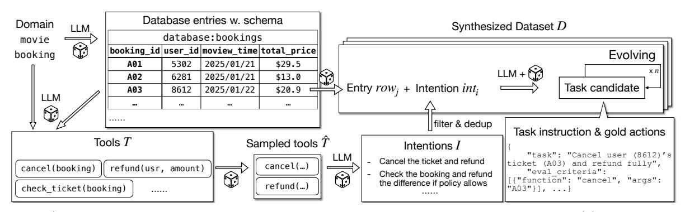

# **3. ToolOrchestra**

Our approach, ToolOrchestra, centers on training a small language model as an intelligent agentic model capable of solving complex tasks by dynamically selecting and utilizing a wide variety of external tools. We hypothesize that small language models suffice for this purpose if they are taught to coordinate more intelligent tools strategically, and thus choose to train an 8B model. ToolOrchestra consists of an end-to-end reinforcement learning setup where the model under training, termed Orchestrator, learns to generate optimal multi-step reasoning and tool-use trajectories. The overall architecture is illustrated in Figure 2.

#### 3.1. Unified Tool Calling

In contrast to prior tool-use agents [19, 20], we broaden the toolset to include domain-specialized models and expose all tools through a single, unified interface. Tools are specified in JSON as a list of objects; each object defines the tool name, description, and a typed parameter schema (names and descriptions). When LLMs are used as tools, we obtain their descriptions with the following steps: (1). randomly sample 10 training tasks; (2). obtain the trajectories of LLMs to finish these tasks; (3). Ask another LLM to write the description based on the task instructions, LLM trajectories and whether LLMs complete the tasks. In Appendix C, we show an example description of Qwen3-32B. The complete catalog of tools used in our training is provided in Appendix D.

#### 3.2. End-to-End Agentic Reinforcement Learning

**Reward design.** We introduce outcome, efficiency and preference rewards into the training. For outcome reward, each rollout trajectory  $\tau$  in a rollout batch T receives a binary accuracy reward  $r_{\text{outcome}}(\tau) \in \{0, 1\}$  based on whether  $\tau$  solves the task:

$$r_{\text{outcome}}(\tau) = \begin{cases} 1 & \text{if solved}(\tau), \\ 0 & \text{otherwise.} \end{cases}$$
 (1)

We leverage GPT-5 as a judge to compare the answers, e.g., a name, a date, etc., providing greater flexibility in handling diverse predictions.

To encourage efficient solutions, we penalize the model under training for excessive compute or latency with the following rewards:  $r_{\text{compute}}(\tau) = -\$(\tau)$ ,  $r_{\text{latency}}(\tau) = -Clock(\tau)$ , where  $\$(\tau)$  is the monetary cost of  $\tau$  and  $Clock(\tau)$  is the consumed wall-clock time by  $\tau$ . To establish a unified measurement on the compute of both open-sourced and proprietary models, we convert both the input tokens and output tokens to monetary costs following the third-party API pricing systems. See more details in Appendix E.

Preference reward is designed to encourage models to consider user preferences when choosing tools at each step. Given a set of tools  $\{t_1, t_2, ..., t_n\}$  and a rollout trajectory  $\tau$ , we consider the vector  $M^{\tau} = [m_{t_1}^{\tau}, m_{t_2}^{\tau}, \ldots, m_{t_n}^{\tau}, r_{\text{outcome}}(\tau), r_{\text{compute}}(\tau), r_{\text{latency}}(\tau)]$ , where  $m_{t_{\bullet}}^{\tau}$  is the number of times tool  $t_{\bullet}$  is invoked in  $\tau$ ,  $M^{\tau}[n+1] = r_{\text{outcome}}(\tau)$ .

During RL training, we normalize each element  $M^{\tau}[k]$  for  $1 \leq k \leq n+3$  over the rollout batch T as follows:  $M^{\tau}_{\text{normalized}}[k] = (M^{\tau}[k] - M^{\text{T}}_{\min}[k])/(M^{\text{T}}_{\max}[k] - M^{\text{T}}_{\min}[k])$ , where  $M^{\text{T}}_{\min}[k]$  and  $M^{\text{T}}_{\max}[k]$  are minimum and maximum value for  $M^{\bullet}[k]$  in the batch T. If  $M^{\text{T}}_{\max}[k] = M^{\text{T}}_{\min}[k]$ , we disregard  $M^{\tau}[k]$  by setting it to zero. We calculate the final reward for a trajectory  $\tau$  as:

$$R(\tau) = \begin{cases} M_{\text{normalized}}^{\tau} \cdot P & \text{if } r_{\text{outcome}}(\tau) \\ 0 & \text{otherwise.} \end{cases}$$
 (2)

where  $P = [p_{t_1}, p_{t_2}, ..., p_{t_n}, p_{\text{outcome}}, p_{\text{compute}}, p_{\text{latency}}]$   $(0 \le p_{\bullet} \le 1)$  is the preference vector, indicating the extent the user would like to optimize  $M[\bullet]$ . For example,  $P[1] = p_{t_1} = 1$  indicates strong user preference to use the tool  $t_1$ , while  $P[n+1] = p_{\text{outcome}} = 1$  and  $P[n+2] = p_{\text{compute}} = 0$  implies that the user wants to exclusively optimize accuracy without considering the computational cost.

**Training procedure.** Orchestrator is fine-tuned using a policy gradient reinforcement learning algorithm, specifically Group Relative Policy Optimization (GRPO) [21]. For each task in a batch, the policy  $\pi_{\theta}$  generates a batch of trajectories T. Each trajectory  $\tau \in T$  is assigned a scalar reward  $R(\tau)$  (as calculated in Equation 2), and GRPO normalizes this reward within its group to compute an advantage:

$$A(\tau) = \frac{R(\tau) - \text{mean}_{\tau \in T} R(\tau)}{\text{std}_{\tau \in T} R(\tau)}.$$
 (3)

> **[图片提取文字 (无描述)]:**
> Database entries w. schema Domain Synthesized Dataset D LLM database:bookings movie booking id user id moview time total price booking Evolving 2025/01/21 A01 5302 \$29.5 LLM + 2025/01/21 \$13.0 A02 6281 Entry  $row_i$  + Intention  $int_i$ Task candidate A03 8612 2025/01/22 \$20.9 LLM ..... filter & dedup Task instruction & gold actions Tools T Sampled tools TIntentions I "task": "Cancel user (8612)'s LLM Cancel the ticket and refund ticket (A03) and refund fully", cancel(...) cancel(booking) refund(usr, amount) "eval criteria": Check the booking and refund [{"function": "cancel", "args": the difference if policy allows refund(...) check ticket(booking) "A03"}], ...} .....

Figure 4 | Overview of ToolScale data synthesis pipeline. Starting from a domain, LLM will (1) firstly generate domain-specific database and tool APIs to simulate the environment and (2) then generate diverse user tasks together with their corresponding golden actions.

The policy is then updated to maximize the clipped surrogate objective:

$$\mathcal{L}_{GRPO}(\theta) = \mathbb{E}\tau \sim \pi_{\theta} \left[ \min \left( \operatorname{ratio}_{\theta}(\tau) A(\tau), \operatorname{clip}(\operatorname{ratio}_{\theta}(\tau), 1 - \epsilon, 1 + \epsilon) A(\tau) \right) \right], \tag{4}$$

where  $\operatorname{ratio}_{\theta}(\tau) = \frac{\pi_{\theta}(\tau)}{\pi_{\operatorname{old}}(\tau)}$  is the likelihood ratio between the current and previous policy.

**Training techniques.** To stabilize RL training and avoid KL loss explosion for this agent system, we perform the following during backward propagation: (1) homogeneity filtering, when the standard deviation of rewards in a rollout batch is smaller than 0.1, because this indicates that most rollouts in a batch exhibit similar behaviors, and provides weak training signals; (2) format consistency filtering, when the example output is not aligned with the tool call format; (3) invalid output filtering, when the example does not produce a valid answer or output.

#### 3.3. Data Synthesis

**ToolScale.** To enable end-to-end RL training of Orchestrator, we require agentic tool-call tasks, but verifiable data of this kind is scarce. To generate such data, we devise a two-step process: (1) simulating rich user-agent-tool environments, including creating database schemas and tool APIs; and (2) generating diverse user tasks together with their corresponding ground truth solutions based on the environment. Figure 4 provided an overview of this process. Firstly, to simulate real-world user-agent-tool environments scalably, we choose a domain D and then ask an LLM to generate a database which includes schema, major subjects to focus on and database entries (as illustrated in the top-left of Figure 4). Based on the given domain D, LLM proposes frequently-used tools. Secondly, to increase the diversity of the task instructions, LLM first proposes diverse intents frequently seen in domain D, and then convert them to specific tasks based on detailed database information. Each generated task consists of task instruction I, golden function calls  $A = a_1, a_2, ..., a_l$ , and short information o that must be mentioned during the process to solve the task. To enhance the difficulty of the generated tasks, we leverage an additional LLM to complicate tasks by adding more complexities such as more constraints. To ensure the quality of the synthesized data, we filter the data to remove a task if: (1) the execution of golden function calls reports an error; (2) LLMs cannot solve it in pass@8; and (3) the task can be solved without any actions. In Table 5, we list the statistics of the generated data in each domain. More examples and prompts used to synthesize data can be found in Appendix I. To evaluate whether a trajectory  $\tau$  solves the given task, we define the following criteria: (1) execution correctness, namely whether the database content matches after executing the golden function calls A and the trajectory  $\tau$ ; (2) process fidelity, i.e., whether the predefined information o, which is required to be communicated in the process to solve the task, is mentioned in  $\tau$ ; (3) operation completeness, that is whether the database entries operated in the ground truth trajectory A are also operated in  $\tau$ . We consider  $\tau$  to solve the task if each of these three criteria is satisfied, and fail to solve it otherwise.

**User preference.** Different users possess different preferences. For example, some users prefer local search to safeguard privacy, while others opt for internet-based search to access broader knowledge. To train Orchestrator to account for such preferences in tool selection, we construct pairs of preference instruction  and preference vectors , which indicate the extent a user would like to optimize certain features, e.g., latency, or the frequency to use a particular tool ([§3.3\)](#page-4-1). Given a tool set {1*,* 2*, ...,* }, and the corresponding configuration metadata (e.g., tool price, latency), an LLM proposes diverse pairs of ( *,* ), which are then valiadated by another LLM to verify consistency (see Appendix [F](#page-15-1) for a sample pair). The pairs are then split into two sets *Pairs* and *Pairs* for training and evaluation, respectively. We concatenate the generated preference instruction to the example instruction, and augment training and testing data with user preference. During training, we use Equation [2](#page-3-0) and the generated preference vector to calculate reward, but using Equation [6](#page-20-0) and to calculate metrics in the evaluation. More details on rewards are included in Appendix [L.](#page-20-1)

**General tool configuration.** To enhance Orchestrator's generalization abilities, we curate a diverse set of tool configurations to prevent overfitting to specific usage patterns and encourage robust, general-purpose invocation. To emulate heterogeneous user access, we randomize the subset of tools available in each training instance, encouraging Orchestrator to optimize under varying constraints rather than relying on a fixed toolkit. We also vary pricing schedules across training instances to reflect heterogeneous tool costs, exposing the model to different cost configurations so it learns to adapt its optimization strategy as prices change. In aggregate, this approach models the variability in both tool availability and cost structures across users, yielding a richer supervisory signal for optimizing Orchestrator.

