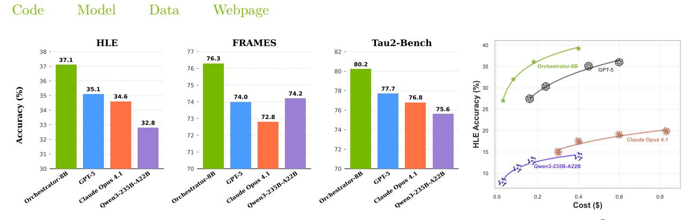
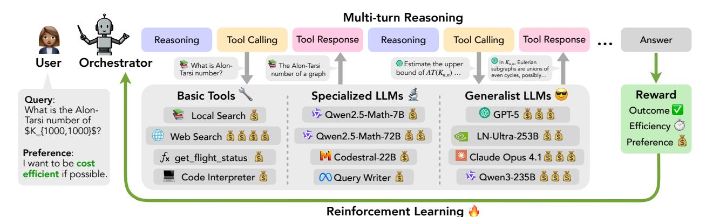

# ToolOrchestra: Elevating Intelligence via Efficient Model and Tool Orchestration

Hongjin Su\*1,2 Shizhe Diao\*1  $Ximing Lu^1$ Xin Dong1 Mingjie Liu1 Jiacheng Xu1 Yonggan Fu1 Peter Belcak1 Hanrong Ye1 Hongxu Yin1 Yi Dong1 Evelina Bakhturina1 Tao Yu2 Yejin Choi1 Jan Kautz1 Pavlo Molchanov1 1NVIDIA, 2University of Hong Kong

Abstract: Large language models are powerful generalists, yet solving deep and complex problems such as those of the Humanity's Last Exam (HLE) remains both conceptually challenging and computationally expensive. We show that small orchestrators managing other models and a variety of tools can both push the upper bound of intelligence and improve efficiency in solving difficult agentic tasks. We introduce ToolOrchestra, a method for training small orchestrators that coordinate intelligent tools. ToolOrchestra explicitly uses reinforcement learning with outcome-, efficiency-, and user-preference-aware rewards. Using ToolOrchestra, we produce Orchestrator, an 8B model that achieves higher accuracy at lower cost than previous tool-use agents while aligning with user preferences on which tools are to be used for a given query. On HLE, Orchestrator achieves a score of 37.1%, outperforming GPT-5 (35.1%) while being 2.5x more efficient. On  $\tau^2$ -Bench and FRAMES, Orchestrator surpasses GPT-5 by a wide margin while using only about 30% of the cost. Extensive analysis shows that Orchestrator achieves the best trade-off between performance and cost under multiple metrics, and generalizes robustly to unseen tools. These results demonstrate that composing diverse tools with a lightweight orchestration model is both more efficient and more effective than existing methods, paving the way for practical and scalable tool-augmented reasoning systems.

> **[图片提取文字 (无描述)]:**
> Model Webpage Data HLE FRAMES Tau2-Bench 76.3 37.1 80.2 37 -35 Orchestrator-8B 76 -80 -36 -75 -77.7 35.1 78 -74.2 35 -34.6 74.0 76.8 74 -75.6 34 -76 -72.8 73 -33 -32.8 74 -72 -32 -Claude Opus 4.1 72 -31 -71 -15 Qwen3-235B-A22B 10 0.0 0.6 0.8 0.2 0.4 Cost (\$)

Figure 1 | ToolOrchestra shows consistently strong performance on HLE, FRAMES, and  $\tau^2$ -Bench with superior cost efficiency.

#### 1. Introduction

Large language models (LLMs) have been reported to have made remarkable strides towards superhuman intelligence but remain of limited utility in complex agentic tasks such as those posed by the Humanity's Last Exam (HLE) [1]. Tool use is a promising avenue for the extension of their capabilities beyond what can be learned from the training data. By calling on external resources through search engines and code interpreters, tool use has been shown to enhance accuracy and reduce hallucinations [2, 3, 4, 5, 6, 7, 8, 9, 10].

Prior research on tool-use agents has primarily focused on equipping a single powerful model with utility tools such as web search or calculators. While effective in many scenarios, this approach underutilizes the potential of tools: humans, when reasoning, routinely extend themselves by calling upon resources of greater-than-human intelligence, from domain experts to sophisticated processes and software systems. Motivated by this observation, we propose the *orchestration paradigm*. Under this paradigm, intelligence emerges not from a monolith but from a composite system. At the center of the system lies an *orchestrator* model, whose

 $^\dagger$  Equal Contribution. Work done during Hongjin's internship at NVIDIA. © 2025 NVIDIA. All rights reserved.

> **[图片提取文字 (无描述)]:**
> Multi-turn Reasoning Tool Calling Tool Response Reasoning Reasoning Tool Calling Tool Response Answer Orchestrator User In K. ... Eulerian Estimate the upper What is Alon-The Alon-Tarsi subgraphs are unions of Tarsi number? bound of  $AT(K_{n,n})$  ... number of a graph even cycles, possibly... Specialized LLMs 💆 Basic Tools Generalist LLMs 🤝 Reward Query: What is the Alon-Outcome V ⑤ GPT-5 Š Š Š Qwen2.5-Math-7B Local Search Tarsi number of Efficiency (2) \$K {1000,1000}\$? V Qwen2.5-Math-72B 6 6 Web Search (§) (§) (§) LN-Ultra-253B (§) Preference (\$) Preference: Codestral-22B Claude Opus 4.1 
> Š
> Š fx get\_flight\_status (§) I want to be cost efficient if possible. Code Interpreter 💍 ₩ Qwen3-235B 🐧 🐧 Ouery Writer Reinforcement Learning 🤚

Figure 2 | Overview of Orchestrator. Given a task, Orchestrator alternates between reasoning and tool calling in multiple turns to solve it. Orchestrator interacts with a diverse tool set, including basic tools (web search, functions such as get\_flight\_status, etc.), specialized LLMs (coding models, math models, etc.) and generalist LLMs (GPT-5, Claude Opus 4.1, etc.). In training under ToolOrchestra, Orchestrator is jointly optimized by outcome, efficiency and preference rewards via reinforcement learning.

responsibility is to invoke the right tools for the given task, and to do so in the right order to accomplish the task. The crucial difference to the standard monolithic setup featuring a single powerful model is that in addition to deterministic utilities such as web search functions and code interpreters, models of various capabilities are made available to the orchestrator as *intelligent tools*. The use of tools of different levels of intelligence comes at varying costs, and the challenge for the orchestrator is then to dynamically decide on which tools to invoke in order to solve the task while respecting user preferences for various tools and minimizing the cost. By delegating narrowed-down sub-problems of a larger effort requiring intelligence to intelligent tools instead of handling the entire effort by a single generalist, orchestration teems with the promise of exhibiting higher intelligence than any of the system's tools and leading monolithic solutions alike.

One approach to implementing the orchestrator paradigm is to employ a language model as the orchestrator and allow it to invoke stronger models only when it deems it necessary. This can be done naively by prompting an off-the-shelf language model or by training a general-purpose orchestrator. For the former, we find that relying on straightforward model prompting is brittle and introduces systemic biases. As shown in Figure 3 (left and middle), GPT-5 disproportionately delegates tasks to GPT-5-mini, while Qwen3-8B defers to GPT-5 at a markedly higher rate. This illustrates two present issues of prompting in the context of complex tool orchestration: (i) the overuse of developmentally-related variants of oneself, i.e., self-enhancement bias [11], and (ii) defaulting to the strongest available tool regardless of the cost or relative utility (see Appendix A for more details and §4 for a thorough comparison to baselines). As such, we conclude that the scenarios in which an orchestrating model may call on models and tools of capabilities both inferior and superior to its own are idiosyncratic in the context of model tool calling and warrant their own approach to training. In addition, controllability in tool-use agents remains underexplored along two axes: cost-efficiency and user preferences (cf. §7).

We address these shortcomings by proposing ToolOrchestra (shown in Figure 2), a novel method for training a small language model to act as the orchestrator – the "brain" of a heterogeneous tool-use agent. Using ToolOrchestra, we produce the Orchestrator, an 8B-parameter model trained end-to-end with reinforcement learning (RL) to decide when and how to invoke more intelligent language models and various tools such as web search or code interpreters, and how to combine them in multi-turn reasoning. Our reward design balances three objectives – correctness of the final outcome, efficiency in resource usage, and alignment with user preferences – to yield a cost-effective and user-controllable tool-use policy. To aid RL training, we build an automatic data synthesis pipeline that generates thousands of verifiable multi-turn tool-use training examples with complex environments across 10 domains. We

> **[图片提取文字 (无描述)]:**
> Qwen3-32B GPT-5 80 Percentage of model calls GPT-5-mini73% Owen2.5-Coder-32B 70 66% 60 50 40 33%33% 32% 30 27% 20 16% 10 6% 5% 5% 0%\_2% Owen3-8B Orchestrator-8B GPT-5 Prompted orchestrator RL-trained orchestrator

Figure 3 | Tool-calling preferences exhibited by a prompted off-the-shelf or RL-trained model. GPT-5 tends to call GPT-5-mini most of the time, while Qwen3-8B relies heavily on GPT-5.

will make the resulting dataset, ToolScale, publicly available to facilitate further research on tool-use agent training.

In our experiments, we rigorously evaluate the merits of our approach on three challenging tasks. On HLE [\[1\]](#page-10-0), a benchmark consisting of difficult questions across many disciplines, we find that Orchestrator substantially outperforms prior methods with far lower computational cost. We also test on 2 -Bench [\[12\]](#page-10-11), a function-calling benchmark, where Orchestrator demonstrates the ability to schedule a variety of tools effectively, calling a large model (GPT-5) in only ∼40% of the steps and utilizing cheaper models or tools for the rest, yet still exceeding the performance of an agent that uses the large model for every step. Finally, additional evaluations on the FRAMES [\[13\]](#page-10-12), a factuality reasoning benchmark, provide further evidence of the versatility and robustness of our approach. We observe that even though the training and testing tasks differ markedly, the RL-trained Orchestrator adapts its tool-use policy to new challenges, indicating a high degree of general reasoning ability.

Our contributions can be summarized as follows: (1) We introduce ToolOrchestra, a method for training a small language model to serve as the orchestrator of a diverse toolkit, including classical tools and more intelligent models. This dovetails with recent developments in the field testifying that small language models are often sufficiently powerful and far more economical in agentic systems [\[14,](#page-10-13) [15\]](#page-10-14). (2) We develop a novel reward training design that goes beyond accuracy. The resulting Orchestrator is trained end-to-end to balance task outcome correctness, efficiency in cost and latency, and alignment with user cost and tool preferences. (3) We demonstrate that Orchestrator trained by ToolOrchestra achieves state-of-the-art performance on challenging reasoning benchmarks, surpassing frontier models while using only a fraction of their compute and wall-clock time, and that it generalizes robustly to unseen tasks and tools.

