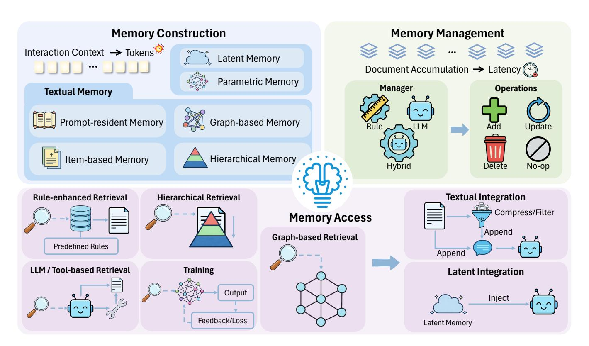

# **Contents**

| 1 |     | Introduction                              | 4  |
|---|-----|-------------------------------------------|----|
| 2 |     | Preliminaries                             | 6  |
|   | 2.1 | Agent Formulation                      | 6  |
|   | 2.2 | From Pure LLMs to Agents               | 6  |
| 3 |     | Efficient Memory                          | 7  |
|   | 3.1 | Memory Construction                    | 8  |
|   |     | 3.1.1 Latent and Parametric Memory  | 8  |
|   |     | 3.1.2 Textual Memory                | 11 |
|   | 3.2 | Memory Management                      | 14 |
|   |     | 3.2.1 Rule-based Management         | 14 |
|   |     | 3.2.2 LLM-based Management          | 15 |
|   |     | 3.2.3 Hybrid Management             | 16 |
|   | 3.3 | Memory Access                          | 17 |
|   |     | 3.3.1 Memory Selection              | 17 |
|   |     | 3.3.2 Memory Integration            | 19 |
|   | 3.4 | Procedural Reuse via Skills            | 20 |
|   | 3.5 | Multi-Agent Memory                     | 22 |
|   | 3.6 | Discussion                             | 24 |
| 4 |     | Efficient Tool Use                        | 25 |
|   | 4.1 | Tool Selection                         | 26 |
|   | 4.2 | Tool Calling                           | 29 |
|   | 4.3 | Tool-Integrated Reasoning              | 31 |
|   | 4.4 | Discussion                             | 32 |
| 5 |     | Efficient Planning                        | 33 |
|   | 5.1 | Single-Agent Planning Efficiency       | 34 |
|   | 5.2 | Multi-Agent Collaborative Efficiency   | 37 |
|   | 5.3 | Discussion                             | 38 |

| 6 | Benchmarks                          | 39 |
|---|-------------------------------------|----|
|   | 6.1 Effectiveness Benchmarks  | 39 |
|   | 6.2 Efficiency Measurements   | 41 |
| 7 | Challenges and Future Directions    | 42 |
| 8 | Conclusion                          | 44 |

#### 1. Introduction

> **[图片提取文字 (无描述)]:**
> **Efficient Memory Efficient Tool Use Efficient Planning Benchmarks** Computation Time Selection Calling Reasoning Construct Manage Access **Budgeting Search** Learning Interaction 2026 W&D InfoSeeker Ares RF-Mem SimpleMem Evo-Memory TPS-Bench I SWIRL ToolRL A-MEM CodeAgents Budget-Aware MARS SMART AutoTIR CostBench LMU LightMem 2025 Memory-R1 MemOS G-Memory MemBench ToolOrchestra GAP **Toward Efficiency** 00 CATS StoryBench ToolGen **Planning Tool Use Smarter Memory** MemAgent UCLA UltraTool Zep QLASS **6** HiAgent **t**-bench AriGraph **Chain of Agents** 2024 LoCoMo TinyAgent **Memory Sharing** BTP **Effectiveness First ETO** Memory-aware Alita ProTIP **SwiftSage** ReadAgent SWE-Bench Toolformer Memory **Benchmark** Expel WebArena 2023 MemGPT WebShop MemoryBank

**Figure** 1: The evolutionary trajectory of efficient agent research. The diagram is organized into four principal branches: Memory, Tool Use, Planning, and Benchmarks. Key works and their institutional affiliations are mapped chronologically to illustrate the field's development and categorization from 2023 to 2026.

The landscape of Artificial Intelligence has undergone a paradigm shift, evolving from the era of Convolutional Neural Networks (CNNs) and Recurrent Neural Networks (RNNs) to the advent of Large Language Models (LLMs), and the emergence of LLM-based Agents currently [63, 31, 130, 52, 204, 41]. Unlike their predecessors, which primarily focused on perception or static text generation, agentic systems do not merely process information; they actively interact with external environments to execute complex, multi-step workflows across diverse domains, such as autonomous software engineering [218, 195] and accelerated scientific discovery [189, 92, 33].

However, this shift toward autonomous action has introduced a critical bottleneck: **efficiency**. While the deployment of LLMs is already resource-intensive, this challenge is **significantly exacerbated** in agentic systems. Unlike a standard LLM that typically operates in a linear, single-turn query-response format, an agent consumes exponentially more resources due to its recursive nature. To automate intricate real-world tasks [42, 38, 103, 195], agents must perform extensive memory management, iterative tool usage, and complex planning over multiple steps. This multi-step execution leads to prohibitive latency, context window saturation, and excessive token consumption, raising profound concerns regarding the long-term sustainability and equitable accessibility of these increasingly capable systems.

To understand the urgency of agent efficiency, one must examine the typical agentic workflow. Upon receiving a user instruction, an agent engages in a recursive loop that heavily uses the following key

components: memory, planning, and tool use to observe output and provide the final solution.

$$\operatorname{Input} \to \left[ \underbrace{\operatorname{Memory}}_{\operatorname{Context}} \to \underbrace{\operatorname{Planning}}_{\operatorname{Decision}} \to \underbrace{\operatorname{Tool Use}}_{\operatorname{Action}} \to \underbrace{\operatorname{Observation}}_{\operatorname{Feedback}} \right]_n \to \operatorname{Solution}.$$

In each iteration *n*, the system must first retrieve relevant context from memory, reason over the current state to formulate a plan, execute a specific tool-incorporated action, and process the resulting observation. This cycle creates a compounding accumulation of tokens, where the output of step *n* becomes the input cost of step *n* + 1, resulting in high inference costs and slow response times. Consequently, mere model compression is insufficient. We therefore define an efficient agent as follows:

**Efficient agent** is not a smaller model, but as an agentic system optimized to maximize task success rates while minimizing resource consumption, including token usage, inference latency, and computational cost across memory, tool usage, and planning modules.

Existing surveys have provided comprehensive views of individual agent components. Memory-oriented surveys [\[228,](#page-61-0) [19,](#page-44-0) [46\]](#page-46-3) mainly summarize memory taxonomies, storage and retrieval mechanisms, update operations, and memory evaluation. Tool use surveys [\[119,](#page-52-0) [184\]](#page-58-2) focus on how LLMs select, invoke, and learn to use external tools. Planning and reasoning surveys [\[49,](#page-47-1) [163,](#page-56-0) [231\]](#page-61-1) organize studies on task decomposition, plan generation, reasoning frameworks, reflection, and decision-making. However, these component-centric perspectives do not directly answer a system-level efficiency question: under comparable task performance, how can an agent reduce token usage, latency, tool calls, planning steps, memory overhead, and computational cost?

Figure [1](#page-3-1) summarizes the emerging research landscape of efficient agents. Existing studies cluster around memory, tool use, planning, and benchmarks, suggesting that agent efficiency is not only a model-level problem but also a system-level problem across the agent workflow.

Our survey aims to systematize the numerous efforts in this emerging field from an efficiency-centered perspective. While efficient LLM surveys mainly focus on reducing the cost of the underlying model [\[183,](#page-58-3) [241,](#page-62-0) [147\]](#page-55-0), efficient agents require optimization at the system level. To bridge this gap, we categorize existing works into three strategic directions: 1) Efficient Memory: techniques for compressing historical context, managing memory storage, and optimizing context retrieval; 2) Efficient Tool Use: strategies to reduce unnecessary tool calls, lower external interaction latency, and improve tool-use decisions; and 3) Efficient Planning: strategies to reduce redundant reasoning steps, shorten execution trajectories, and decrease the number of API calls required to solve a problem.

It is important to note that these categories are analytical rather than mutually exclusive. In a deployed agent, memory, tool use, and planning are tightly coupled: memory can store tool-use experience and reusable plans; planning decides when to retrieve memory or invoke tools; tool observations become new memory and may reshape subsequent plans. When a method touches multiple components, we assign it to the category corresponding to its primary efficiency motivation or the main bottleneck it is designed to reduce. We then discuss cross-component effects throughout the paper, since a method's system-level efficiency often comes from how it changes costs in other modules rather than from its local module alone.

The remainder of this survey is organized as follows: Section [2](#page-5-0) introduces the preliminaries and highlights the efficiency gap between agents and LLMs. Sections [3](#page-6-0) through [5](#page-32-0) explore component-level efficiency, with a focus on memory, tool use, and planning optimizations. Subsequently, Section [6](#page-38-0) addresses the quantification of efficiency. The survey concludes with a discussion on open challenges and future research directions.

#### 2. Preliminaries

#### 2.1. Agent Formulation

We model an LLM-based agent interacting with an environment as a partially observable Markov decision process (POMDP) augmented with an external tool interface and an explicit memory component. Formally, we define the overall model as

$$\mathcal{M} = (\mathcal{S}, \mathcal{O}, \mathcal{A}, P, R, \gamma; \mathcal{T}, \Psi; \mathcal{M}_{mem}, U, \rho).$$

Here S denotes the latent environment state space, O the observation space, and A the agent action space. The environment dynamics are given by the transition kernel P, the reward function R, and the discount factor  $\gamma \in [0,1)$ .

The agent is additionally equipped with a set of external tools  $\mathcal{T}$  and a tool interface  $\Psi$ , which specifies how tool calls are executed and what tool outputs are returned to the agent. Finally, we model explicit agent memory with memory state space  $\mathcal{M}_{mem}$ , an update rule U that maps the current memory and available information to the next memory state, and an initialization distribution  $\rho$  over the initial memory.

#### 2.2. From Pure LLMs to Agents

We define efficiency through a cost–performance trade-off: achieving comparable performance with lower cost, or achieving higher performance under a similar cost budget.

We acknowledge that many efficiency techniques used in LLM-based agents overlap with those for standalone LLMs (e.g., model compression and inference acceleration). In agents, however, these techniques mainly serve as foundational enablers rather than addressing the agent-specific sources of inefficiency. As summarized by Wang et al. [150], compared to pure LLMs, LLM-based agents exhibit more human-like decision-making by augmenting a base model with cognitive components such as planning and memory.

Accordingly, in this subsection we focus on what differentiates agent efficiency from LLM efficiency. From a functional perspective, an agent is characterized by its ability to (i) plan and act over multiple steps, (ii) invoke external tools or environment com-

> **[图片提取文字 (无描述)]:**
> Agents Memory Tool Learning Panning Office of the second Pure LLMs Toll Learning \* Planting

**Figure 2:** From LLMs to agents: standalone reasoning to trajectory-level reasoning with memory, planning, and tool use, while introducing additional cost sources.

mands to acquire information and execute operations, and (iii) condition subsequent decisions on retrieved or updated memory.

As illustrated in Figure 2, agentic systems introduce additional cost sources beyond generation. For a pure LLM, the inference cost is often dominated by token generation and can be approximated as:

 $Cost_{LLM} \approx \alpha N_{tok}$ 

> **[图片提取文字 (无描述)]:**
> **Memory Construction Memory Management** Interaction Context → Tokens **Latent Memory** Document Accumulation → Latency Parametric Memory Manager Operations **Textual Memory Prompt-resident Memory Graph-based Memory** Hierarchical Memory Item-based Memory No-op **Textual Integration** Rule-enhanced Retrieval Hierarchical Retrieval Compress/Filter **Memory Access** Append **Graph-based Retrieval** Predefined Rules Append LLM / Tool-based Retrieval **Training Latent Integration** Output Inject Feedback/Loss Latent Memory

**Figure 3**: Efficient memory overview. This figure summarizes the agent-memory lifecycle in three phases: **Memory Construction**, which represents experience as textual memory or latent and parametric memory to mitigate token explosion and repeated context processing; **Memory Management**, which curates and updates an accumulating memory store via rule-based, LLM-based, or hybrid strategies to control latency; and **Memory Access**, which determines what memories to retrieve and how to integrate them into the model.

where  $N_{\text{tok}}$  is the number of generated reasoning tokens and  $\alpha$  captures the per-token cost (e.g., time or monetary cost). In contrast, an agent may incur additional overhead from tools, memory, and retries as needed:

$$Cost_{agent} \approx \alpha N_{tok} + \mathbb{I}_{tool} \cdot Cost_{tool} + \mathbb{I}_{mem} \cdot Cost_{mem} + \mathbb{I}_{retry} \cdot Cost_{retry}$$

where  $\mathbb{I}_{tool}$ ,  $\mathbb{I}_{mem}$ ,  $\mathbb{I}_{retry} \in \{0,1\}$  are indicator variables that equal 1 if the agent invokes tools, accesses memory, or performs retries, respectively, and 0 otherwise. Therefore, improving agent efficiency is not only about reducing language generation, but also about reducing the frequency and improving the selectivity of tool or memory invocations and retries along a trajectory, to achieve a better cost–performance trade-off.

