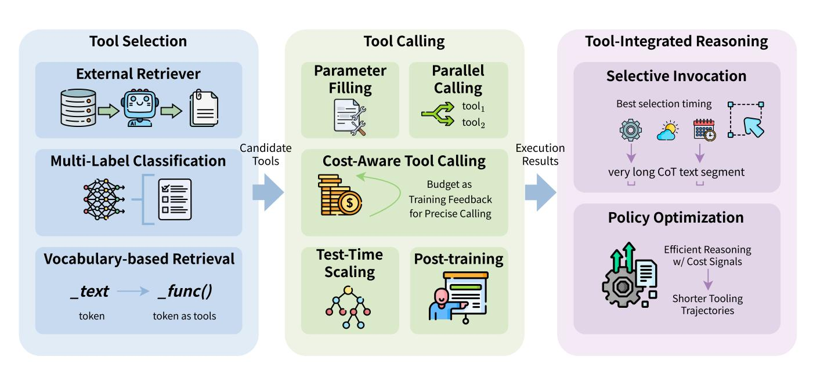

# **4. Efficient Tool Use**

Tool use provides an interface for LLMs to interact with the physical world and virtual environment. In general, tools refer to search, code sandbox (interpreter), and many other general API endpoints. To call these tools, a basic solution is to provide several candidates to the prompt, and let the LLM think and select the most suitable one with parameters filled [\[204\]](#page-59-0). However, as the task become more complex, there would be much more tool calls. For example, LLMs may call the search API for 600 times to resolve a deep research problem [\[144\]](#page-54-4). Such long trajectories extremely challenge the models' long context comprehension ability and brings enormous costs. To this end, it is crucial to explore efficient tool use strategies.

Overall, there are two types of efficiency in tool use: (1) Tool use itself is efficient for solving complex problems. Comparing with a task with very long CoT, tool use could efficiently optimize the length of trajectories and show the efficient reasoning process. (2) Tool use could be optimized to call fewer tools, which reduces the cost of tool use itself. For a complex task with hundreds of tool calls, an optimal method could significantly reduces the number of tool calls. So the overall process would be even more efficient.

Figure [4](#page-25-1) presents a taxonomy of efficient tool use, which consists of three major categories: *Tool Selection*, *Tool Calling*, and *Tool-Integrated Reasoning*. Representative methods under each category are summarized

> **[图片提取文字 (无描述)]:**
> **Tool Selection Tool Calling Tool-Integrated Reasoning** Parallel Parameter **External Retriever** Selective Invocation Calling Filling Best selection timing Candidate Execution **Multi-Label Classification Cost-Aware Tool Calling** Tools Results very long CoT text segment Budget as Training Feedback for Precise Calling **Policy Optimization** Efficient Reasoning Test-Time **Vocabulary-based Retrieval Post-training** w/ Cost Signals Scaling \_func() \_text **Shorter Tooling** Trajectories token token as tools

**Figure** 4: Efficient tool use comprises three stages: Tool Selection identifies candidate tools via retrieval or classification; Tool Calling handles parameter filling and execution with a focus on cost-aware constraints and budget feedback and Tool-Integrated Reasoning optimizes efficient reasoning trajectories through selective invocation and policy optimization.

in Table [3.](#page-26-0) In a typical tool-use pipeline, candidate tools are first selected to determine when and what to invoke, and the resulting outputs are subsequently integrated into reasoning trajectories and final responses.

## **4.1. Tool Selection**

For massive tool candidates from a very large pool, it is nearly impossible to stuff the prompt with thousands of tool descriptions. To this end, it is crucial to efficiently select the most relevant tools for user queries. We organize current tool retrieval literature into three categories: (1) **External Retriever**: a independent retriever model which embeds user queries and tool descriptions and calculates the affinity scores (e.g. cosine similarity) to select top-*k* relevant tools as candidates; (2) **Multi-Label Classification**: for a fixed size of tool sets, the tool selection process could be formulated as a multi-label classification problem, which directly predicts relevant tools; and (3) **Vocabulary-based Retrieval**: tools are embedded as special tokens into the model's vocabulary, and the model would enter a tool call mode when generating such tool tokens. We introduce the above three categories of tool selection strategies in this section as below.

**External Retriever.** Instead of including the entire tool set, many approaches rely on an external retriever for tool selection. External tool retrieval can be improved from retriever-side advances that redesign the retrieval pipeline or strengthen retrievers and rerankers, and from tool-side enhancements that refine tool descriptions and documentation to make the retrieval corpus easier to match, boosting both accuracy and efficiency.

On the retriever side, ProTIP [\[4\]](#page-43-2) utilizes a contrastive learning-based method to embed user queries and tool descriptions into the semantic space. After a tool is selected, ProTIP subtracts the query embedding by the selected tool's representation and selects tools on other subtasks. Such a progressive design makes ProTIP efficient to avoid explicit task decomposition overhead. In AnyTool [\[20\]](#page-44-3), retrieval is organized hierarchically

Table 3: A summary of representative efficient tooling methods. We categorize them by tool selection, tool calling, and tool-integrated reasoning.

| Method                            | Category                   | Core Mechanism                                          | Resource Link |  |  |
|-----------------------------------|----------------------------|---------------------------------------------------------|---------------|--|--|
| Efficient Tool Selection          |                            |                                                         |               |  |  |
| ProTIP [4]                        | External Retriever         | Contrastive learning to correlate queries with tools    | N/A           |  |  |
| TinyAgent [21]                    | Multi-Label Classification | Implement a small model to select appropriate tools     | GitHub        |  |  |
| Tool2Vec [101]                    | Multi-Label Classification | Align tools with synthetic usage examples               | GitHub        |  |  |
| ToolkenGPT [37]                   | Vocabulary-based Retrieval | Train tools as a special token                          | GitHub        |  |  |
| Toolken+ [188]                    | Vocabulary-based Retrieval | Rerank top-k tools and reject if no one is selected     | N/A           |  |  |
| Chain-of-Tools [174]              | Vocabulary-based Retrieval | Leverage CoT with a huge tool pool                      | GitHub        |  |  |
| ToolGen [152]                     | Vocabulary-based Retrieval | Encode each tool as a separate token                    | GitHub        |  |  |
|                                   |                            | Efficient Tool Calling                                  |               |  |  |
| Toolformer [129]                  | In-Place Parameter Filling | Leverage CoT to invoke tool calls                       | N/A           |  |  |
| CoA [29]                          | In-Place Parameter Filling | Uses symbolic abstractions for intermediate steps       | N/A           |  |  |
| LLMCompiler [61]                  | Parallel Tool Calling      | A compiler-inspired framework enabling parallel tooling | GitHub        |  |  |
| LLM-Tool Compiler [135]           | Parallel Tool Calling      | Fusing similar tools and parallel tooling               | N/A           |  |  |
| CATP-LLM [170]                    | Parallel Tool Calling      | Include cost-awareness into planning                    | GitHub        |  |  |
| BTP [233]                         | Cost-Aware Tool Calling    | Formulates tool calling as a knapsack problem           | GitHub        |  |  |
| TROVE [162]                       | Cost-Aware Tool Calling    | Introduce compact reusable tools.                       | GitHub        |  |  |
| ToolCoder [17]                    | Cost-Aware Tool Calling    | Treat tool as code generation                           | GitHub        |  |  |
| ToolChain* [243]                  | Test-Time Scaling          | Utilizes A* search to prune unproductive branches       | N/A           |  |  |
| OTC-PO [149]                      | Post-training / RL         | Integrates tool-use penalty into RL objective           | N/A           |  |  |
| ToolOrchestra [138]               | Post-training / RL         | Efficiency-aware rewards for specialized orchestrators  | GitHub        |  |  |
| Tool-Integrated Reasoning (TIR)   |                            |                                                         |               |  |  |
| TableMind [53]                    | Adaptive Search            | Plan-action-reflect loop with Rank-Aware Optimization   | GitHub        |  |  |
| SMART [115]                       | Boundary Awareness         | CoT-based dataset to decide parametric vs. tool use     | GitHub        |  |  |
| ARTIST [134]                      | Policy Optimization        | Unified agentic reasoning with outcome-based RL         | N/A           |  |  |
| AutoTIR [167] Policy Optimization |                            | Hybrid reward for correctness and format adherence      | GitHub        |  |  |
| ReTool [24]                       | Code-Integrated Reasoning  | Dynamic NL-code interleaving with verifiable rewards    | GitHub        |  |  |
| ToolRL [114]                      | Structured Rewards         | Combines format reward with tool parameter correctness  | GitHub        |  |  |
| PORTool [171]                     | Step-wise Planning         | Uses fork-relative advantages and decay factors         | N/A           |  |  |
| Agent-FLAN [14]                   | Data Efficiency            | Decomposes agent data into capability-specific subsets  | GitHub        |  |  |

and inspired by a divide-and-conquer strategy, narrowing the search space and thereby improving retrieval efficiency.

On the tool side, DRAFT [120] refines tool documents via self-driven interactions to improve external tool retrieval, while boosting efficiency by reducing token overhead and stopping refinement at convergence.

In addition, some recent systems combine both directions. Toolshed [94] stores enriched tool representations in a tool knowledge base and uses RAG-tool fusion before, during, and after retrieval to scale external tool selection, while controlling top-k to curb token growth and improve efficiency. Similarly, ToolScope [86] uses ToolScopeMerger with Auto-Correction to compress tool descriptions and reduce input tokens, and ToolScopeRetriever to hybrid-retrieve top-k tools that fit the LLM context window, improving tool-use quality while boosting efficiency and scalability.

**Multi-Label Classification (MLC).** Instead of ranking-based retrieval, MLC-based methods treat tool selection as a classification task. TinyAgent [21] is designed to conduct tool calling on edge devices which pursue extreme efficiency, and it formulates the tool selection task as a multi-label classification problem. For a user query, TinyAgent applies the DeBERTa-v3 small model as the encoder and output the probability

distribution for all available tools. Tools with a probability higher than 50% are recognized as relevant ones and will be selected accordingly. Since only a small fraction of tool descriptions are put into the prompt, it efficiently reduces nearly half of the prompt size. Similar to TinyAgent, Moon et al. [\[101\]](#page-51-8) find MLC-based tool retrieval efficient, but such a task formulation could not handle the growing number of tools, and any updates would require a model re-training. Therefore, they propose Tool2Vec, a two-stage retrieval with a reranker for analyzing fine-grained tool-query interactions. To fill in the semantic gap where natural user queries may not directly align with tool descriptions, the authors generate tool embeddings based on synthetic usage examples rather than static description.

**Vocabulary-based Retrieval.** Besides direct retrieving from candidates by external retriever and MLC, tool selection could also be formulated as a token prediction task, where tools are stored in the vocabulary as special tokens.

ToolkenGPT [\[37\]](#page-46-8) regards massive external tools as learnable token embeddings (aka. "toolken"), so that the target tool could be selected as a normal next token prediction process. Compared with Toolformer [\[129\]](#page-53-7) that selects tools by predicting a whole trajectory with special characters, this approach is highly efficient since it only trains the added tool embeddings and keeps other model parameters frozen. Furthermore, it bypasses the window constraint of in-context tool selection and retains a shorter prompt. Building on this foundation, Toolken+ [\[188\]](#page-58-8) enhances ToolkenGPT by introducing an extra reranking step and a rejection toolken, which improves the overall performance and reduces the hallucination rate. Toolken+ also demonstrates a tradeoff between efficiency and efficacy, which could be simply tuned from the number of reranking candidates. Although "toolkens" are efficient for massive tool selection, it requires constructing data samples for supervised fine-tuning and suffers from generalization problems on unseen tools. Similarly, ToolGen [\[152\]](#page-55-5) assigns each tool a unique tool token and trains the model to turn tool retrieval and calling into a unified generation task. By representing a tool with a single token, it is claimed to shorten generation and potentially reduce inference overhead but may be costly at training phase. From a different perspective on efficiency, Xu et al. [\[186\]](#page-58-9) proposes selective compression and block compression for tool use: they preserve key information (e.g., tool and parameter names) as raw text while compressing the remaining documentation into fixed-length soft tokens per block. The soft tokens can be precomputed and cached offline, reducing prompt length and improving token efficiency at inference. To tackle the generalization problem, CoTools [\[174\]](#page-57-3) shrinks the number of toolkens to only one and applies a retriever to calculate the similarities between current toolken's representation and all the candidates.

From these literature, we find vocabulary-based methods are an efficient option for tool selection. However, it may suffer from inaccurate invocation timing and poor generalization to unseen new tools, which is less functional for extensive tool updating scenarios.

#### **Tool Selection**

- **Pros**: Narrows a large tool pool before generation, reducing prompt length, decoding ambiguity, and unnecessary tool exploration; retriever-based selection can also generalize to newly added tools.
- **Cons**: External retrievers may introduce their own inference cost, while MLC- or vocabulary-based selection usually requires fine-tuning and can be less flexible when tools change.
- **Suitable situations**: External retrievers fit dynamic or very large tool collections; MLC and vocabbased tool retrieval fit relatively fixed tool sets where low-latency selection is more important.
- **Trade-offs**: Broad selection preserves tool coverage but increases prompt and planning cost, while aggressive selection improves efficiency but may filter out necessary tools. Tiered selection can balance low-latency access to frequent tools with retrieval flexibility for rare or new tools.

#### **4.2. Tool Calling**

Once candidates are selected, the efficiency of the invocation process becomes critical for real-time agentic interactions. Here, efficiency is better understood at the trajectory level rather than by the cost of an isolated call, since planning, verification, and orchestration may reduce failed calls, retries, and unnecessary environment interactions.

**In-Place Parameter Filling.** In-place tool calling is a paradigm where the model directly fills the tool's parameters during the response generation process. Toolformer [\[129\]](#page-53-7) incorporates tool calling within the CoT path, and fills parameters during the response generation process. It is efficient to obtain the final results once the closure of the tool call is reached. Gao et al. [\[29\]](#page-45-6) proposes CoA, which shares the similar idea but reduces the response time by providing more accurate tool call results. Instead of directly calculating the final results, CoA introduces symbolic abstractions to represent the intermediate steps, which are later substituted with the actual results during the response generation process. From the experimental results, CoA performs better while reducing more than 30% inference time than Toolformer.

**Parallel Tool Calling.** For a complex tasks that incorporates multiple tools, traditional sequential style calling may hurt efficiency since LLMs have to wait for the latest tool call's response. However, there are multiple tasks that could be done in parallel [\[224\]](#page-61-8). For example, when collecting weather information for all cities in a province, an agent does not need to invoke a weather-query tool sequentially for each city. Instead, these independent tool calls can be executed in parallel, which significantly reduces the overall task-solving time. LLMCompiler [\[61\]](#page-48-5) introduces a compiler-inspired framework that formulates execution plans, dispatches tasks, and executes functions in parallel. This achieves improvements in latency, cost, and overall accuracy against the traditional sequential tool execution approach. Building on this parallelization paradigm, LLM-Tool Compiler [\[135\]](#page-54-5) further optimizes efficiency by selectively fusing similar tool operations at runtime, which increases parallel tool calls while reducing token consumption and latency. W&D [\[79\]](#page-49-2) extends this idea to deep research agents by scaling width through parallel tool calling, allowing multiple tools to be invoked within a single reasoning step to improve information-gathering efficiency and reduce interaction turns. Complementing with the above methods, CATP-LLM [\[170\]](#page-56-1) addresses the execution cost by incorporating cost-awareness into the planning process. It designs a multi-branch planning language and employs cost-aware offline reinforcement learning to fine-tune models, enabling high-quality generation with economic constraints.

**Cost-Aware Tool Calling.** Like we have introduced about CATP-LLM in the above paragraph, cost could be a special reward for training efficient tool calling models. Budget-Constrained Tool Use with Planning (BTP) [\[233\]](#page-61-7) first formulates tool calling as a knapsack problem, which utilizes dynamic programming to pre-compute how often each tool would be invoked under a hard budget, thereby turning cost control into a forward-looking plan. Building on this planning strategy, Xu et al. [\[182\]](#page-57-5) estimates LLM confidence via consistency-based sampling strategy to let the model trigger a tool under a certainty-cost optimal condition. This method could reduces the number of tool calls, thereby boosting the overall improvements. From a broader system perspective, Wu et al. [\[168\]](#page-56-4) reduces redundant calls by jointly updating prompt strategy and tool documentations. It complements the above cost-aware planning and confidence-based gating with context-level efficiency.

Beyond directly constraining invocation budgets, recent research also explores improving efficiency through alternative paradigms, such as function induction, code generation, and model distillation. TROVE [\[162\]](#page-56-2) introduces a training-free paradigm that incrementally builds and trims a compact toolbox of reusable functions, showing that online induction can improves the accuracy without extra training data. ToolCoder [\[17\]](#page-44-5) extends this idea by formulating tool use as an end-to-end code generation task, which converts tasks in natural languages into Python code. This method boosts the success rates while keeping small API usage cost. Focusing on the deployment cost, Kang et al. [\[60\]](#page-48-6) proposes to distill LLM's knowledge into small language models with retrieval and code interpreter tools, which enables small models competitive with larger ones.

**Efficient Test-Time Scaling.** For effective tool calling, a viable solution is tree search-based strategies, where the model may plan a tree of tool calls and select the most promising path [\[175\]](#page-57-6). However, such methods are computationally expensive since they may need trail-and-error to explore the entire tree. Instead of extensive tree traversal, ToolChain\* [\[243\]](#page-62-5) utilizes the A\* search strategy to efficiently navigate complex action spaces. This method boosts the efficiency by employing task-specific cost functions to prune wrong branches earlier and only requires single-step node expansions.

Recent work further optimizes tool-use trajectories through explicit orchestration and search. Utility-Guided Agent Orchestration [\[81\]](#page-49-3) formulates tool use as a quality-cost decision problem, selecting among responding, retrieving, invoking tools, verifying intermediate results, and stopping according to estimated gain, step cost, uncertainty, and redundancy. ToolTree [\[197\]](#page-59-6) instead casts multi-step tool use as an MCTSinspired search over executable tool-use trajectories, using dual-stage LLM feedback and bidirectional pruning to allocate exploration to promising tool paths. These methods show that efficient tool calling requires controlling not only which tool to call, but also when to stop, verify, or search over alternative tool-use trajectories.

**Efficient Tool Calling with Post-training.** To mitigate the latency, computational overhead, and training cost associated with multi-step tool interactions, recent research has increasingly focused on optimizing tool-calling efficiency through post-training. Specifically, reinforcement learning has emerged as a primary mechanism for teaching models to strategically balance task success with resource parsimony. OTC-PO [\[149\]](#page-55-6) promotes action-level efficiency by integrating a tool-use penalty into the reinforcement learning objective, effectively training models to minimize redundant tool calls without sacrificing answer correctness. Building on the optimization of agentic workflows, ToolOrchestra [\[138\]](#page-54-6) leverages efficiency-aware rewards within an RL framework to train specialized orchestrators that achieve superior task performance at a fraction of the computational cost of general-purpose large language models. Beyond optimizing the learned tool-use policy, Liu et al. [\[89\]](#page-50-8) improve the efficiency of RL-based tool-calling training itself by filtering low-signal

prompts and down-sampling less informative rollouts, reducing training cost while preserving tool-calling performance. Complementing these optimization-oriented approaches, ToolRM [\[1\]](#page-43-3) uses outcome-based reward models to support data-efficient fine-tuning and inference-time scaling, encouraging models to favor effective and concise tool-calling trajectories.

#### **Tool Calling**

- **Pros**: Improves trajectory-level efficiency by making tool use more selective, coordinated, and cost-aware, reducing unnecessary calls, redundant interactions, and avoidable retries.
- **Cons**: Some methods introduce additional reasoning, sampling, orchestration, or verification overhead; parallel and search-based calling may also become inefficient when dependency analysis or task decomposition is inaccurate.
- **Suitable situations**: Most useful for agents that repeatedly interact with external tools, especially when tool calls are expensive, latency-sensitive, or dependent on previous observations.
- **Trade-offs**: More control over tool calling can reduce wasted actions and improve success, but excessive control may shift cost from tool execution to planning, routing, or verification.

#### **4.3. Tool-Integrated Reasoning**

The emergence of agents marks a crucial shift from reliance on static internal knowledge toward adaptive, multi-turn reasoning, which is necessary for achieving both high accuracy and computational efficiency in complex problem-solving [\[95,](#page-51-9) [124,](#page-53-9) [121\]](#page-53-10). Traditional, rigid programmatic workflows or purely text-based methods often fail on tasks requiring numerical precision or dynamic adaptation, thereby constraining the development of truly autonomous reasoning capabilities.

**Selective Invocation.** The quest for efficient agents begins with establishing a robust capability to invoke tools only when strictly necessary, thereby minimizing redundant computations. Traditional rigid workflows often lead to excessive interactions. The TableMind framework [\[53\]](#page-47-6) addresses this by presenting an autonomous programmatic agent specifically tailored for tool-augmented table reasoning. Architecturally, TableMind utilizes an iterative plan-action-reflect loop, where the agent first decomposes a problem, then generates and executes precise code within a secure sandbox environment. TableMind employs a two-stage training paradigm: Supervised Fine-Tuning (SFT) serves as a vital warm-up phase to establish foundational tool usage patterns and master the necessary syntax for the iterative cycle, thereby mitigating the instability associated with starting subsequent Reinforcement Learning from a cold policy. To further refine the efficiency of tool invocation, Qian et al. [\[115\]](#page-52-4) first constructs a dataset called SMART with CoT detailing the necessity of each tool call, and they use the dataset to fine-tune a model that efficiently decides whether to use their parametric knowledge or external tools. Agent-FLAN [\[14\]](#page-44-6) separates format-following agent data from general reasoning data and further decomposes agent data into capability-specific subsets, which improves performance with fewer training tokens. Tool-Star [\[18\]](#page-44-7) further improves tool-use selectivity through curated tool-integrated reasoning data. Its synthesis and filtering pipeline reduces low-quality or redundant tool-use demonstrations, encouraging agents to invoke tools only when they are likely to be useful.

**Cost-Aware Policy Optimization.** After supervised warm-up, Reinforcement Learning (RL) becomes important for optimizing complex multi-step tool-use policies, especially when the agent must maintain reasoning quality, valid tool formats, and efficient execution trajectories. To prioritize high-quality trajectories, TableMind [\[53\]](#page-47-6) employs Rank-Aware Policy Optimization (RAPO), which identifies misaligned trajectories and applies rank-aware advantage weighting to guide the model toward consistent answers. ARTIST [\[134\]](#page-54-7) tightly couples agentic reasoning with outcome-based RL, enabling models to learn tool-use strategies without restrictive step-level supervision. Similarly, ReTool [\[24\]](#page-45-7) integrates a code interpreter into the reasoning loop, allowing the model to interleave natural language reasoning with executable code and discover strategies through verifiable rewards. ToolRL [\[114\]](#page-52-5) further introduces structured rewards for tool calls by combining format validity, correctness, and parameter matching, improving the reliability of each tool invocation.

A central efficiency objective in this line of work is to reduce unnecessary tool use and shorten tool-use trajectories. Methods such as A2FM [\[12\]](#page-44-8) and IKEA [\[51\]](#page-47-7) balance internal knowledge with external retrieval. A 2FM uses Adaptive Policy Optimization (APO) with a self-adaptive router to decide whether to answer directly or invoke tools, while IKEA trains an adaptive search agent to rely on internal knowledge first and call search APIs only when necessary. Other methods encode tool-use efficiency more explicitly into reward design or trajectory construction. AutoTIR [\[167\]](#page-56-3) discourages unnecessary tool usage through reward penalties, and OTC-PO [\[149\]](#page-55-6) encourages trajectories that produce correct answers with fewer tool calls. SWiRL [\[32\]](#page-45-8) filters redundant actions during parallel trajectory generation, while PORTool [\[171\]](#page-57-4) assigns step-wise importance with a decay factor *γ*, giving higher weight to decisions closer to the final outcome and favoring solutions with fewer tool-call steps.

Recent methods further refine this trajectory-level optimization by localizing which part of the tool-use process should be updated. EvoTool [\[198\]](#page-59-7) decomposes the tool-use policy into Planner, Selector, Caller, and Synthesizer modules, and uses blame-aware mutation to update the module most responsible for a failed trajectory. ELPO [\[75\]](#page-49-4) localizes the first irrecoverable error with binary-search rollout trees and turns it into step-level learning signals. These methods complement earlier reward- and trajectory-level optimization by targeting the specific module or step that causes inefficient or unsuccessful tool use, rather than treating the whole trajectory as a monolithic success or failure.

#### **Tool-Integrated Reasoning**

- **Pros**: Improves tool-augmented reasoning by teaching agents when to invoke tools, how to produce valid tool calls, and how to avoid redundant or ineffective tool-use trajectories.
- **Cons**: Requires high-quality tool-use data, reliable feedback signals, reward design, or rollout-based optimization. Poorly designed objectives may lead to tool overuse, tool underuse, format overfitting, or shorter but less reliable trajectories.
- **Suitable situations**: Best for tasks where the agent must learn a nontrivial tool-use policy, including when to use tools, how to format calls, how to interpret observations, and how to balance task success with tool-call cost.
- **Trade-offs**: Tool-integrated optimization can improve selectivity, correctness, and trajectory efficiency, but shifts cost to data synthesis, sandboxed execution, RL rollouts, and fine-grained credit or blame assignment.

#### **4.4. Discussion**

Efficient tool use is not equivalent to using fewer tools in all cases. Instead, the central problem is to decide which external actions are worth their cost. Tool selection reduces the action space before generation, tool calling optimizes the execution trajectory, and tool-integrated reasoning decides when external evidence or computation should enter the reasoning loop. Together, these directions show a shift from merely enabling tool use to optimizing the full interaction loop under latency, token, and monetary budgets.

**From Tool Availability to Tool Utility.** A large tool library can improve coverage but also increases selection difficulty, prompt length, and the risk of invoking irrelevant tools. Thus, the efficiency bottleneck is not only the cost of a single API call, but also the cost of representing, searching, and deciding among tools. Retrievalbased selectors preserve flexibility for dynamic tool sets, while MLC- or vocabulary-based approaches reduce latency for stable tool inventories. This suggests a useful design principle: frequent and high-utility tools can be internalized into faster specialized selectors, whereas long-tail or volatile tools should remain accessible through an elastic retrieval layer.

**Knowing When Not to Call Tools.** A deeper issue is calibration. Tool-integrated agents must learn the boundary between what the model can reliably answer internally and what requires external execution or verification. Over-triggering tools wastes latency and money, while under-triggering tools risks hallucination or invalid actions. Cost-aware tool training and selective invocation methods therefore point toward a broader objective: optimize the accuracy-per-cost frontier rather than raw task accuracy. In this view, an efficient tool user is not the agent that calls the fewest tools, but the agent that calls tools only when the expected reduction in uncertainty or error justifies the cost.

**Parallelism and Dependency Awareness.** Parallel tool calling reduces wall-clock latency, but it is not automatically efficient. When subtasks are independent, parallelism can turn sequential waiting time into concurrent execution. When dependencies are misidentified, however, parallel branches may generate inconsistent intermediate results that require additional reconciliation. Therefore, parallel tool use should be paired with dependency-aware planning: the agent must distinguish actions that can be safely executed in parallel from those that require sequential evidence accumulation.

**Interaction with Memory and Planning.** Tool efficiency is closely tied to memory and planning. Memory can store successful tool-use templates, API constraints, parameter choices, and failure cases, reducing future selection and calling cost. Planning determines whether a task should be solved through direct reasoning, tool execution, or a decomposed multi-step workflow. Conversely, tools can externalize parts of reasoning, allowing the planner to rely on calculators, search engines, code interpreters, or databases rather than expanding the internal chain of thought. Tool observations also become memory candidates: useful outputs may be cached for reuse, while failed calls can inform future avoidance. Therefore, a method categorized as efficient tool use may obtain its end-to-end efficiency by reducing planning search or improving memory quality. This interaction suggests that future tool-using agents should jointly optimize tool choice, memory reuse, and planning depth, rather than treating tool calls as isolated actions.

