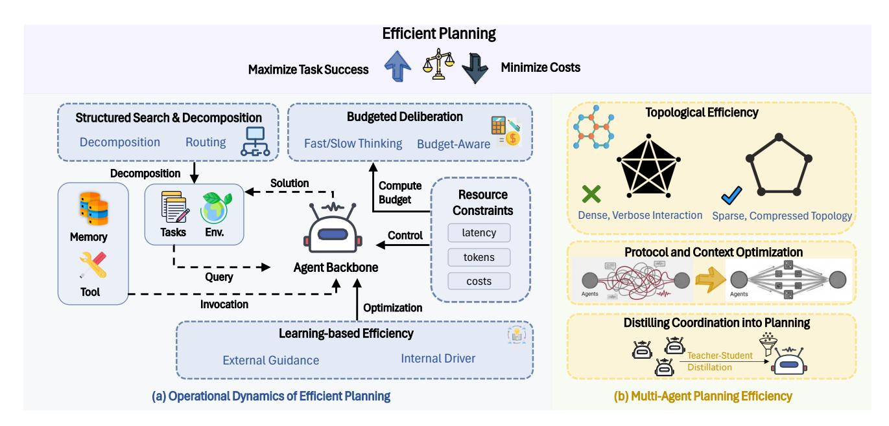

# **5. Efficient Planning**

Efficient planning studies how agents allocate limited reasoning resources during task solving. Unlike classical planning, which often abstracts away the cost of search or optimization, LLM-based agents expose planning costs through token usage, latency, tool calls, environment interactions, and communication overhead. Thus, planning is not only about generating a valid action sequence, but also about deciding how much reasoning, search, verification, and coordination should be spent before acting.

From this perspective, planning becomes a form of online compute allocation. Deeper reasoning or broader collaboration may improve task success, but it can also introduce extra search, longer contexts, redundant communication, and delayed execution. Efficient planning therefore aims to balance the benefit

Table 4: A summary of representative efficient planning methods. We categorize Single-Agent methods into **Inference-Time Strategy** (Adaptive Control, Search, Decomposition) and **Learning-based Evolution** (Policy, Memory), alongside **Multi-Agent Collaborative Efficiency**.

| Method                                                   | Category            | Core Mechanism                                           | Resource Link |  |  |
|----------------------------------------------------------|---------------------|----------------------------------------------------------|---------------|--|--|
| Single-Agent: Inference-Time Strategy (Search & Control) |                     |                                                          |               |  |  |
| SwiftSage [76]                                           | Adaptive Control    | Fast/Slow Dual-process (System 1 + 2)                    | § GitHub   |  |  |
| Budget-Aware [88]                                        | Adaptive Control    | Budget-constrained tool policy allocation                | N/A           |  |  |
| Reflexion [133]                                          | Adaptive Control    | Verbal reinforcement from prior failures                 | § GitHub   |  |  |
| LATS [235]                                               | Tree Search         | MCTS with self-reflection                                | § GitHub   |  |  |
| ToolChain* [243]                                         | Tree Search         | A* search with learned cost pruning                      | N/A           |  |  |
| CATS [229]                                               | Tree Search         | Cost-aware pruning in tree search                        | N/A           |  |  |
| ReWOO [178]                                              | Decomposition       | Planner-Worker-Solver separation                         | § GitHub   |  |  |
| HuggingGPT [132]                                         | Decomposition       | Routing tasks to specialized models                      | § GitHub   |  |  |
| Alita [118]                                              | Decomposition       | MCP brainstorming & subtasking                           | § GitHub   |  |  |
|                                                          |                     | Single-Agent: Learning-based Evolution (Policy & Memory) |               |  |  |
| QLASS [80]                                               | Policy Optimization | Q-Value critic for search guidance                       | N/A           |  |  |
| ETO [137]                                                | Policy Optimization | Trial-and-error preference learning (DPO)                | § GitHub   |  |  |
| VOYAGER [148]                                            | Memory & Skill      | Iterative skill library construction                     | § GitHub   |  |  |
| GAP [172]                                                | Memory & Skill      | Graph-based decomposition & parallelism                  | § GitHub   |  |  |
| RLTR [73]                                                | Policy Optimization | Process-level reward training                            | N/A           |  |  |
| Planning w/o Search [40]                                 | Policy Optimization | Offline goal-conditioned critic                          | € Website  |  |  |
| Multi-Agent: Collaborative Efficiency                    |                     |                                                          |               |  |  |
| Chain-of-Agents [227]                                    | Topology            | Sequential context passing (Linear complexity)           | § GitHub   |  |  |
| MacNet [113]                                             | Topology            | DAG-based topological ordering                           | § GitHub   |  |  |
| AgentPrune [212]                                         | Topology            | Learned pruning of communication edges                   | § GitHub   |  |  |
| MARS [153]                                               | Topology            | Reviewer-Meta-Reviewer pipeline (No debate)              | § GitHub   |  |  |
| CodeAgents [191]                                         | Protocol            | Structured pseudocode interaction                        | § GitHub   |  |  |
| Free-MAD [16]                                            | Protocol            | Prompt-optimized critical reasoning                      | N/A           |  |  |
| MAGDI [10]                                               | Distillation        | Distilling interaction graphs into student               | § GitHub   |  |  |
| D&R [239]                                                | Distillation        | Distilling debate traces via DPO                         | N/A           |  |  |

of further deliberation against its computational and interaction cost. As illustrated in Figure [5,](#page-34-0) efficient planning can be broadly divided into **Single-Agent Planning**, which optimizes individual deliberation through inference-time strategies and learning-based evolution, and **Multi-Agent Collaborative Planning**, which reduces coordination overhead in distributed systems. Representative methods in each category are summarized in Table [4.](#page-33-1) In the remainder of this section, we review efficient planning from these two perspectives.

#### **5.1. Single-Agent Planning Efficiency**

Single-agent efficiency focuses on minimizing the computational cost, measured in tokens, latency, or search steps, required to reach a valid solution. We categorize these methods into *inference-time strategies*, which optimize the planning process on-the-fly, and *learning-based evolution*, which improves the agent's intrinsic planning capabilities.

For single agents, efficient planning is less about always producing shorter reasoning traces and more

> **[图片提取文字 (无描述)]:**
> **Efficient Planning** Minimize Costs **Maximize Task Success** Topological Efficiency **Budgeted Deliberation** Structured Search & Decomposition Routing Decomposition Fast/Slow Thinking Budget-Aware Decomposition Solution Compute Resource Budget Constraints Dense, Verbose Interaction Sparse, Compressed Topology Tasks Env. latency Control Memory Protocol and Context Optimization tokens Agent Backbone Query costs Tool Invocation Optimization Distilling Coordination into Planning Learning-based Efficiency Internal Driver External Guidance (a) Operational Dynamics of Efficient Planning (b) Multi-Agent Planning Efficiency

**Figure** 5: **Overview of Efficient Planning.** It aims to maximize task success while minimizing costs. **(a)** Singleagent methods optimize inference strategies (control, search, decomposition) or evolve via learning (policy, memory). **(b)** Multi-agent methods reduce overhead via topological optimization, context optimization, and coordination distillation.

about deciding when additional deliberation is worth paying for. Some tasks benefit from deeper search because it avoids costly retries, while others are better handled by fast heuristics or cached skills. This makes adaptive compute allocation a central design principle across the methods below.

**Inference Strategy I: Adaptive Budgeting and Control.** A key strategy is *selective deliberation*, allocating computational effort non-uniformly. Architectures like SwiftSage [\[76\]](#page-49-5) separate fast behaviors from slower planning, defaulting to heuristics unless structured reasoning is required. This can be framed as learning when to invoke a costly planner versus a reactive policy [\[107\]](#page-52-8), or dynamically adjusting tool strategies based on budget constraints [\[88\]](#page-50-9).

Recent work further makes this control more fine-grained by treating reasoning depth as a step-level decision. Ares [\[194\]](#page-58-11) trains a lightweight router to select the lowest sufficient reasoning effort for each agent step, while Think Fast and Slow [\[196\]](#page-59-8) learns to switch among multiple cognitive depths, ranging from instinctive responses to strategic planning. These methods extend fast/slow agent designs by reserving expensive reasoning for difficult decisions rather than applying deep deliberation uniformly across the whole trajectory.

Efficiency is also gained by preventing redundant failures; methods like Reflexion [\[133\]](#page-54-8) and ReST [\[2\]](#page-43-4) use verbal reinforcement or iterative refinement to amortize failure analysis, lowering cumulative interaction costs.

**Inference Strategy II: Structured Search.** The combinatorial explosion of action spaces presents a significant bottleneck. To address this, methods adapt formal search algorithms to prune feasible trajectories. Language Agent Tree Search (LATS) [\[235\]](#page-62-6) reframes agent rollouts as Monte Carlo Tree Search, enabling self-reflection to guide exploration. Building on this, CATS [\[229\]](#page-61-9) integrates cost-awareness directly into the search tree, pruning expensive branches early. In tool-rich environments, ToolChain\* [\[243\]](#page-62-5) applies A\* search to navigate the action space, while retrieval-based approaches like ProTIP [\[4\]](#page-43-2) reduce decision complexity by only surfacing relevant tools during the planning phase.

**Inference Strategy III: Task Decomposition.** Explicitly breaking down complex tasks can reduce redundant reasoning over long trajectories. ReWOO [\[178\]](#page-57-7) and Alita [\[118\]](#page-52-6) decouple planning from execution by generating intermediate blueprints, while Task-Decoupled Planning [\[71\]](#page-49-8) further decomposes long-horizon tasks into DAG-structured sub-goals and restricts planning or replanning to scoped subtask contexts. These designs reduce token overhead and recovery cost by avoiding repeated reasoning over a monolithic trajectory.

Task decomposition also facilitates routing. HuggingGPT [\[132\]](#page-53-11) and ReSo [\[236\]](#page-62-8) dispatch sub-tasks to specialized models, while BudgetMLAgent [\[27\]](#page-45-9) optimizes agent routing under cost considerations. In embodied settings, AutoGPT+P [\[8\]](#page-43-5) grounds decomposition in environmental affordances to improve feasibility.

**Learning-Based Evolution: Policy Optimization.** Agents can learn to internalize planning logic. This is driven by external critics, such as QLASS [\[80\]](#page-49-6) or offline value functions [\[40\]](#page-46-9), that guide the planner toward high-value actions. Alternatively, learning acts as an *internal driver*: ETO [\[137\]](#page-54-9) refines policies via trial-and-error preference learning (DPO). To improve sample efficiency, methods like RLTR [\[73\]](#page-49-7) and Planner-R1 [\[242\]](#page-62-9) utilize process-level rewards, providing feedback on the reasoning sequence rather than just the final outcome. In long-horizon web reasoning, WebAnchor [\[209\]](#page-60-11) further emphasizes the importance of early planning decisions by optimizing the first-step plan with dense rubric-based rewards and then aligning execution with the anchored plan using sparse rewards. Together, these methods reduce inefficient exploration by making planning policies more sensitive to intermediate progress, early decision quality, and downstream execution cost.

**Learning-Based Evolution: Memory and Skill Acquisition.** Efficiency can be amortized by externalizing successful plans. VOYAGER [\[148\]](#page-55-7) builds a library of reusable skills to avoid re-planning. Graph-based representations also support this: GraphReader [\[70\]](#page-49-0) and other graph-enhanced models [\[77\]](#page-49-9) leverage structured memory for long-context retrieval, while GAP [\[172\]](#page-57-8) identifies parallelizable actions. Ultimately, frameworks like Sibyl [\[159\]](#page-55-9) demonstrate that efficiency is an emergent property, where improved memory structure directly reduces the cognitive load of future planning.

#### **Single-Agent Strategies**

- **Pros**: Adaptive control reduces unnecessary deliberation, structured search improves exploration, decomposition limits repeated context processing, and learning-based evolution amortizes planning cost over future tasks.
- **Cons**: Control policies can misfire, search adds branching overhead, decomposition may propagate early errors, and learning or memory components require training and maintenance.
- **Suitable situations**: Best when one agent must solve long-horizon tasks under a limited compute or interaction budget, especially when the task can be decomposed or guided by reusable experience.
- **Trade-offs**: More planning depth usually improves robustness, but the marginal benefit decreases once search, reflection, or decomposition costs exceed the value of the refined plan.

#### **5.2. Multi-Agent Collaborative Efficiency**

Multi-agent systems (MAS) extend planning from individual deliberation to collaborative problem solving. Compared with single-agent planning, where efficiency mainly depends on how much reasoning, search, reflection, or decomposition one agent performs before acting, MAS introduces an additional coordination cost: agents must decide who should participate, what information should be exchanged, and when interaction should stop. Thus, the efficiency bottleneck shifts from controlling planning depth alone to jointly controlling depth and breadth.

This shift makes collaboration a double-edged sword. More agents or debate rounds can improve coverage and robustness, but they can also amplify message passing, lengthen contexts, and trigger redundant clarification or verification. Therefore, efficient MAS planning should not assume that larger teams or longer discussions always improve outcomes. Instead, it needs mechanisms that structure communication, compress exchanged information, route messages to relevant agents, and terminate interaction when the marginal benefit becomes low.

In this subsection, we review efficient MAS planning from three perspectives: **topological efficiency**, which reduces communication complexity by organizing agent interaction structures; **protocol optimization**, which controls the content and format of exchanged messages; and **distillation**, which transfers collaborative reasoning into cheaper single-agent or smaller-model execution.

**Topological Efficiency and Sparsification.** Topological efficiency optimizes the communication graph to mitigate quadratic message costs, often reducing message complexity from O(*N*2 ) toward O(*N*) through structured topologies such as chains or DAGs. *Structured topologies* like Chain-of-Agents [\[227\]](#page-61-10) and Mac-Net [\[113\]](#page-52-7) restrict context growth to near-linear complexity, while GroupDebate [\[90\]](#page-50-10) alternates between dense debate and sparse summaries. *Selective interaction* protocols further filter turns; MARS [\[153\]](#page-55-8) and S 2 -MAD [\[211\]](#page-60-12) reduce peer-to-peer noise by triggering debates only when viewpoints diverge. More adaptive methods, such as AgentPrune [\[212\]](#page-60-10), AgentDropout [\[161\]](#page-56-5), and SafeSieve [\[222\]](#page-61-11), dynamically prune low-utility agents or edges during inference. Beyond sparsification, InfoSeeker [\[64\]](#page-48-7) uses a hierarchical Host– Manager–Worker structure for web information seeking, isolating context across layers while parallelizing independent evidence-gathering subtasks. These methods suggest that efficient MAS design should jointly control communication topology, context scope, and execution parallelism.

**Protocol and Context Optimization.** Protocol optimization improves efficiency by compressing what is communicated, using concise representations such as pseudocode and prompt-driven constraints to reduce interaction context. CodeAgents [\[191\]](#page-58-10) encodes reasoning in concise pseudocode, while Smurfs [\[9\]](#page-43-6) discards failed search branches to prevent context bloat. In parallel, prompt-level control accelerates convergence; Free-MAD [\[16\]](#page-44-9) and ConsensAgent [\[112\]](#page-52-9) engineer prompts to encourage critical reasoning, while supervisors like SMAS [\[78\]](#page-49-10) terminate redundant loops early.

**Distilling Coordination into Planning.** The most radical approach internalizes coordination by distilling collective intelligence into a single-agent model, bypassing runtime coordination costs. Methods like MAGDI [\[10\]](#page-44-10) and SMAGDi [\[3\]](#page-43-7) distill complex interaction graphs or "Socratic" decomposition into a single student model. Similarly, D&R [\[239\]](#page-62-7) uses a teacher-student debate to generate preference trees for DPO. These approaches retain the quality benefits of diverse perspectives while reverting to the lower inference cost of a single agent.

#### **Multi-Agent Collaborative Efficiency**

- **Pros**: Turns collaboration into controlled coordination, allowing agents to benefit from complementary expertise, parallel exploration, and mutual verification while limiting unnecessary communication.
- **Cons**: Over-controlling collaboration may suppress useful disagreement, discard task-relevant context, or make the system too dependent on a fixed coordination pattern.
- **Suitable situations**: Most useful when a task benefits from multiple perspectives or specialized agents, but unrestricted discussion would cause excessive token use, latency, or context growth.
- **Trade-offs**: Multi-agent efficiency depends on the marginal value of communication: more agents and messages can improve coverage, but they also increase coordination cost, redundancy, and context pressure.

## **5.3. Discussion**

Efficient agent planning reframes reasoning from an unbounded generation process into a budget-aware control problem. In the **single-agent** regime, inference-time strategies decide how much computation to spend on the current problem, while learning-based evolution amortizes planning cost across future problems. In the **multi-agent** regime, efficiency depends on controlling the communication topology and protocol so that collaboration improves solution quality without turning coordination into the dominant cost. Across both settings, the unifying trend is the migration of computation from expensive *online search* to cheaper *offline learning*, reusable memory, or structured retrieval.

**Planning as Meta-Control.** A deeper way to view efficient planning is as meta-control: the planner must decide not only what action to take, but also how much reasoning, search, tool use, or communication should precede that action. This makes planning efficiency fundamentally different from simply shortening the generated reasoning trace. A short plan can be inefficient if it causes repeated failures, while a longer deliberation can be efficient if it prevents costly environment interactions or tool calls. Thus, the right unit of analysis is end-to-end cost, including tokens, wall-clock time, external actions, retries, and coordination overhead.

**Depth, Breadth, and Amortization.** The methods surveyed in this section expose three recurring efficiency axes. First, **depth control** decides how far a single agent should search, reflect, or decompose before acting. Second, **breadth control** decides how many agents, branches, or candidate plans should be explored in parallel. Third, **amortization** shifts useful planning knowledge into policies, skills, or memories so that future tasks require less online deliberation. These axes are complementary but also compete for budget: deeper single-agent search may reduce the need for multi-agent debate, while stronger memory or skill reuse may reduce both search depth and communication breadth.

**When More Planning Becomes Inefficient.** A key open question is how to identify the stopping point of planning. Additional search, reflection, or debate has diminishing returns: early deliberation may eliminate obvious errors, but later deliberation may mostly rephrase existing ideas or introduce new inconsistency. This is especially important in multi-agent systems, where additional agents can improve diversity but also create redundant messages and longer consensus processes. Efficient planners therefore need progress signals that estimate the marginal value of continued reasoning, rather than relying on fixed numbers of steps, agents, or debate rounds.

**Coupling Planning with Memory and Tools.** Planning sits between memory and tool use. Memory reduces planning cost by storing reusable subgoals, plans, failures, and skills; tools reduce planning burden by externalizing computation or verification. At the same time, planning determines when to retrieve memory, when to update memory, and when to call tools. This makes planning the controller of cross-component cost allocation: an efficient planner may spend more tokens upfront if doing so avoids repeated retrieval, unnecessary tool calls, or failed environment interactions. Conversely, better memory and tools can shorten planning by providing reusable evidence and executable operations. A planner should therefore be evaluated by whether it reduces total agent cost: fewer unnecessary tool calls, fewer repeated memory retrievals, fewer environment steps, and fewer multi-agent messages, while preserving task success.

