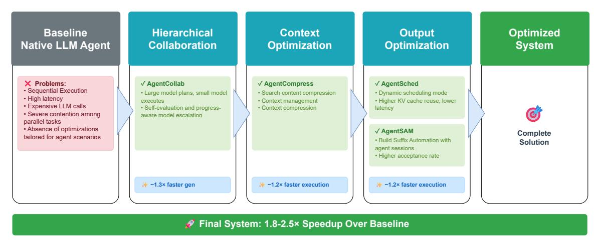
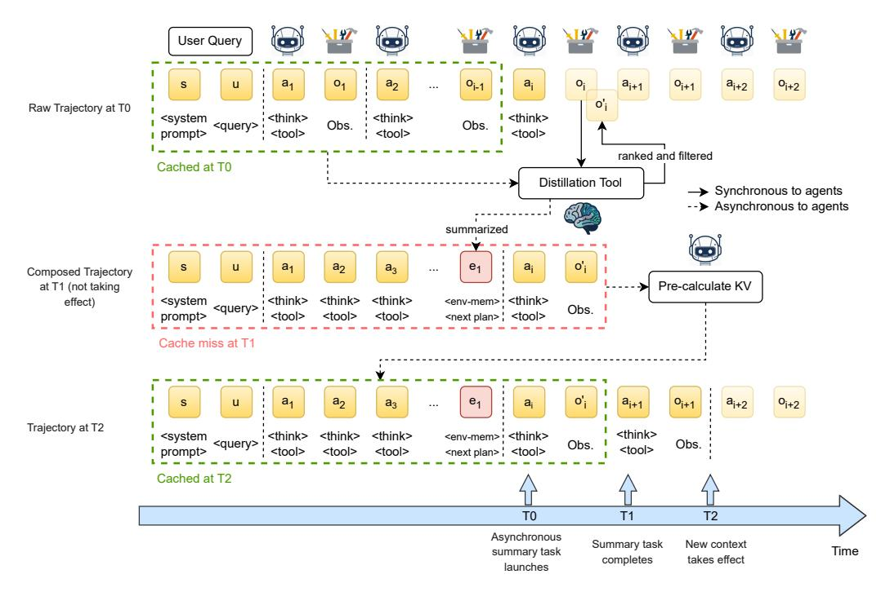
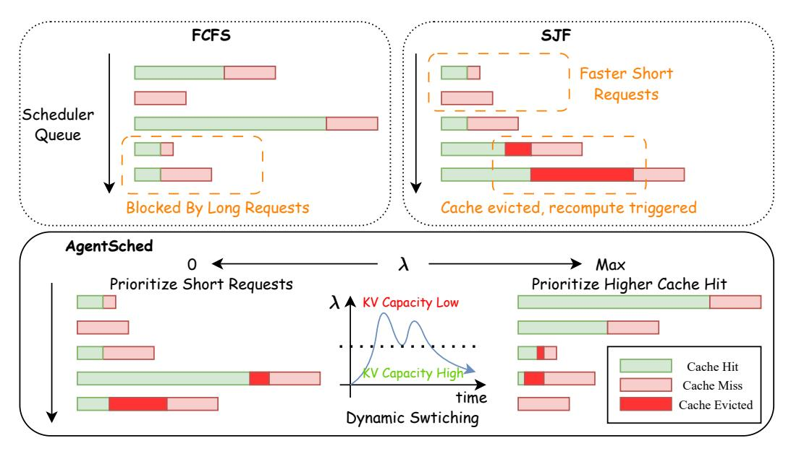
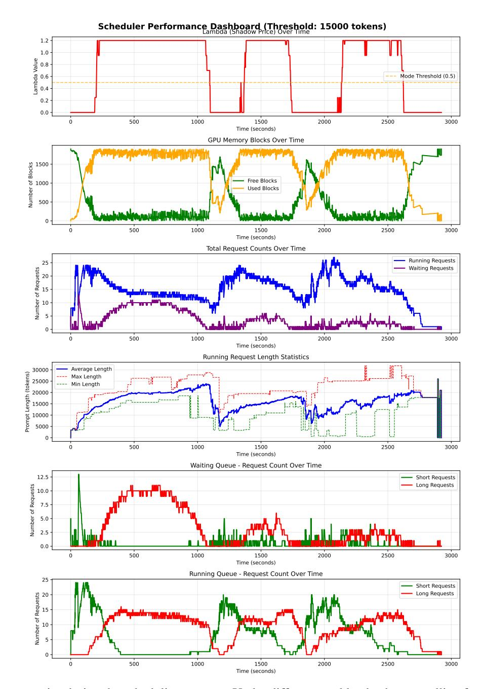
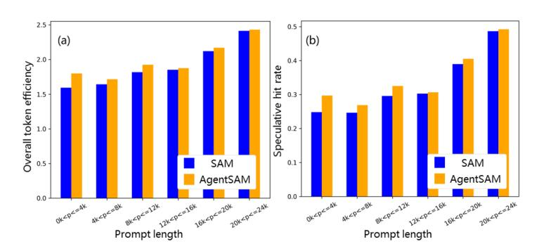

# 5 AgentInfer: Framework for Efficient Agent

<span id="page-4-1"></span>> **[图片提取文字 (无描述)]:**
> Baseline Hierarchical Context Output Optimized Native LLM Agent Collaboration Optimization Optimization System X Problems: √ AgentCollab √ AgentCompress √ AgentSched Sequential Execution · Large model plans, small model · Search content compression . Dynamic scheduling mode · High latency executes · Context management · Higher KV cache reuse, lower · Expensive LLM calls · Self-evaluation and progress-· Context compression latency · Severe contention among aware model escalation parallel tasks Absence of optimizations √ AgentSAM Complete tailored for agent scenarios . Build Suffix Automation with Solution agent sessions · Higher acceptance rate → ~1.3× faster gen → ~1.2× faster execution \* ~1.2× faster execution Final System: 1.8-2.5× Speedup Over Baseline


Figure 1: Overview of modules in AgentInfer.

In this technical report, we propose a progressive optimization framework for LLM agents, as illustrated in Figure [1.](#page-4-1) The framework decomposes the end-to-end reasoning and execution pathway into a sequence of cooperative acceleration modules, each designed to mitigate a specific latency or inefficiency source across the agent lifecycle. The pipeline begins with a naïve baseline agent that performs sequential reasoning and synchronous tool invocations, resulting in high latency and cost.

Stage 1 (Difficulty-Aware Collaboration) introduces *AgentCollab*, a dual-model collaboration mechanism in which a larger model performs a high-level planning and problem decomposition, and a smaller model then takes over most routine reasoning and tool calls; whenever the searching trajectory is stagnating, the session is temporarily escalated to the large model until progress resumes, thereby concentrating expensive large-model usage on genuinely hard segments while keeping overall inference cost under control.

Stage 2 (Context Optimization) employs *AgentCompress*, a lightweight self-compression and filtering layer that prunes invalid or redundant search results, compresses context, reduces context length, and enhances overall compute efficiency.

Stage 3 (Execution Acceleration) incorporates two complementary modules: *AgentSAM*, an improved speculative decoding algorithm that accelerates token generation using cross-session agent memory; and *AgentSched*, a hybrid, KVaware scheduling mechanism that dynamically balances short-job responsiveness and cache reuse efficiency. Together, these modules enhance real-time concurrency while minimizing context eviction and redundant recomputation.

Finally, the optimized system forms a closed-loop design that hierarchically integrates cognitive guidance, predictive token speculation, dynamic scheduling, and adaptive compression. Compared with conventional LLM acceleration techniques that focus primarily on isolated kernel or quantization improvements, our framework introduces a hierarchy of optimizations tailored specifically for agentic workloads. Each module contributes complementary gains under different operational conditions. These enhancements accumulate in a compositional manner, yielding consistent, scalable benefits across agentic workloads, and ultimately achieving more than 50% token usage reduction and 1.8–2.5× end-to-end latency acceleration.

#### 5.1 AgentCollab: Self-Evaluation-Driven Multi-Agent Collaboration

#### 5.1.1 Methodology

Deep-research-style agents require both strong reasoning ability and strict control over inference cost. To reconcile these goals, we propose *AgentCollab*, a self-evaluation-driven collaboration framework that coordinates a large model and a small model through dynamic escalation and de-escalation.

The large model (ML) acts as a high-capability reasoner responsible for initial task framing and for rescuing trajectories that become stuck. At the beginning of a session, M<sup>L</sup> executes a small number of 'Think' steps to: (1) assess user intent and task difficulty, (2) outline a high-level solution strategy, and (3) decompose the problem into intermediate objectives and tool-usage plans. After this warm-up phase, the controller switches to the small model (MS), which executes the majority of subsequent 'Think' steps and tool calls, benefiting from much lower per-token cost.

At the core of AgentCollab is a self-evaluation subroutine, instantiated as a structured *Progress Check* block. After each 'Think' step, the currently active model is required to emit a PROGRESS block in the following canonical format:

```
===PROGRESS===
<reason> ...rationale... </reason>
<value> TRUE or FALSE </value>
===END_PROGRESS===
```

Here, <reason> provides a concise meta-cognitive justification of whether the latest actions have meaningfully advanced the trajectory toward the final goal, and <value> encodes a binary judgment of *significant progress*. When the active model is M<sup>S</sup> and <value> is TRUE, the controller continues using the small model; simple or wellstructured tasks are therefore handled almost entirely by MS. When <value> is FALSE, this self-diagnostic signal is interpreted as a sign of difficulty (e.g., oscillation, redundant probing, or failure to unlock new information), and the session is *escalated* to ML.

During escalation, M<sup>L</sup> takes over subsequent 'Think' steps, re-analyzing the current context, correcting potential reasoning errors, and—if necessary—reframing the plan. The same self-evaluation protocol is applied to the large model's 'Think' steps: each step yields a Progress Check block that assesses whether the trajectory has exited the "stuck" region. Once M<sup>L</sup> produces one or more 'Think' steps whose Progress Check returns TRUE, indicating that the trajectory has resumed meaningful progress, the controller *de-escalates* back to MS. This cycle may repeat multiple times within a single trajectory.

This self-evaluation-driven collaboration paradigm preserves the efficiency of small models on easy or moderately difficult segments while selectively leveraging the semantic robustness of large models only when needed. Difficultyaware escalation prevents the agent from wasting tokens on fruitless local search, while avoiding the overhead of invoking the large model at every reasoning step.

#### 5.1.2 Algorithm Design

We now formalize the AgentCollab controller as a *Self-Evaluation-Driven Escalation Architecture*, summarized in Algorithm [1.](#page-6-0) The core insight is that multi-step reasoning can be viewed as a sequence of 'Think'–'Evaluate' cycles, where each cycle is assessed for *incremental progress* rather than only final correctness. AgentCollab exploits this trajectory-level self-evaluation to decide when to switch between M<sup>L</sup> and MS.

#### Algorithm 1: AgentCollab with Self-Evaluation-Driven Escalation

```
Input: User query Q, Large model ML, Small model MS, Initial large-model budget KL, Maximum consecutive large-model
      steps per escalation BL
Output: Final answer A
// Phase 0: Initialization
ctx ← init_context(Q);
mode ← LARGE;
large_steps_used ← 0;
// Phase 1: Initial Planning with Large Model
while large_steps_used < KL do
   think_out ← ML.THINK(ctx);
   ctx ← ctx ∪ {think_out};
   prog ← ML.PROGRESS_CHECK(ctx);
   large_steps_used ← large_steps_used + 1;
   if prog.value = TRUE then
      // Early exit if task is already solved
      if is_final_answer(ctx) then
          A ← extract_answer(ctx);
          return A;
mode ← SMALL;
// Phase 2: Collaborative Reasoning with Self-Evaluation-Driven Escalation
while not is_final_answer(ctx) do
   if mode = SMALL then
      think_out ← MS.THINK_AND_TOOLS(ctx);
      ctx ← ctx ∪ {think_out};
      prog ← MS.PROGRESS_CHECK(ctx);
      if prog.value = TRUE then
          // Small model is making progress; keep using it
          continue;
      else
          // Self-evaluation indicates stagnation; escalate to large model
          mode ← LARGE;
          large_steps_used ← 0;
          continue;
   else if mode = LARGE then
      think_out ← ML.THINK_AND_TOOLS(ctx);
      ctx ← ctx ∪ {think_out};
      prog ← ML.PROGRESS_CHECK(ctx);
      large_steps_used ← large_steps_used + 1;
      if prog.value = TRUE then
          // Large model successfully unblocks reasoning
          if is_final_answer(ctx) then
             A ← extract_answer(ctx);
             return A;
          // De-escalate back to small model once progress is restored
          mode ← SMALL;
      else if large_steps_used ≥ BL then
          // Budget guardrail: avoid unbounded large-model usage
          mode ← SMALL;
// Phase 3: Finalization
A ← extract_answer(ctx);
return A;
```

The controller in Algorithm [1](#page-6-0) exposes several desirable properties:

Asymmetric Resource Allocation. The large model is invoked only for the initial warm-up (K<sup>L</sup> 'Think' steps) and for bounded bursts of escalation (at most B<sup>L</sup> 'Think' steps per escalation event). In contrast, the small model handles the majority of 'Think' steps and tool calls. For typical long-horizon tasks with sparse stagnation regions, this yields a substantial reduction in large-model usage compared to architectures that rely on the large model at every step.

Self-Evaluation-Driven Adaptivity. The Progress Check block provides a concrete, model-generated self-diagnostic signal of whether the trajectory is moving forward. AgentCollab uses this signal to adaptively steer computation: easy tasks and straightforward sub-problems remain on MS, while hard or stuck segments are automatically upgraded to M<sup>L</sup> until meaningful progress is restored.

Robustness to Stagnation. Even if the small model frequently fails to make progress, the system can fall back to repeated large-model escalations, trading efficiency for reliability. Conversely, once the large model has re-established a promising direction (indicated by prog.value = TRUE), the controller automatically returns to the small model to keep costs under control.

Minimal Computational Overhead. The self-evaluation progress check is issued immediately after each THINK call and fully reuses the KV cache of the preceding sequence. The generated reason/value fields are typically only 10–20 words, incurring negligible additional decoding latency compared to the substantial savings from avoiding large-model execution on the entire trajectory.

Overall, AgentCollab turns the agent's own trajectory-level self-evaluation into a *self-governed routing signal* for collaborative inference. By tightly coupling 'Think' steps with structured self-evaluation, the system achieves a better balance between end-to-end performance and reasoning quality: simple instances are handled efficiently by the small model, while complex or ill-conditioned cases are elevated to the large model in a targeted, difficulty-aware manner.

#### 5.2 AgentCompress: Semantic Agent Compression

This strategy elevates the summarization concept from our case study into a formal, loop-level process. We observed that in the workflow of the Information Seeker Agent, the reasoning process typically follows a recurring loop of "think → batch\_web\_search → url\_crawl → document\_qa" until the agent determines that the goal has been achieved, at which point it invokes other tools to record results and returns the final conclusion to the Planner Agent. Through profiling and analysis, we identified two major performance bottlenecks:

#### 1. Parallel overhead in web search and document processing.

- During the batch web search phase, multiple URLs are returned. For each URL, the agent sequentially invokes the url\_crawler tool to fetch webpage content and then calls the document\_QA module to extract task-relevant information. This introduces a large amount of parallel operations—the combined latency of web-search tools and large-model QA calls significantly slows down and blocks the agent's workflow.
- 2. Context bloat during iterative search. As the search process continues, the accumulated web search results can occupy more than 50% of the total context, with the total sequence length often growing beyond 80K tokens. Such expansion drastically degrades the reasoning efficiency of the main agent.

To address these issues, we designed and deployed two complementary modules, as shown in Algorithm [2:](#page-8-0)

Search-Enhanced Compression Module. After each batch web search, this module invokes a fast lightweight model to filter and rank the retrieved search results. Since the returned results only include snippets and titles, the model can complete ranking and filtering within 5–10 seconds. Irrelevant URLs are pruned and will not proceed to the subsequent url\_crawler or document\_QA stages, effectively reducing tool-level concurrency and improving overall end-to-end performance.

Asynchronous Memory Compression and Distillation Module. We divide the agent's *context memory* into two components: *reasoning memory* (from the Think and Act steps) and *environment-interaction memory* (results returned by tools). When the total sequence length exceeds 5K tokens and one search loop is completed, a small model is asynchronously triggered to summarize and distill the current context memory. The goal of this distillation is to transform the existing memory into a structured representation that remains close to the original model's reasoning process.

After distillation, the reasoning memory is retained, and the distilled context memory is inserted as a new think step immediately following the last compressed step. Since this process is asynchronous, the agent continues reasoning forward during compression. Once the replacement is complete, the next reasoning step adopts the compressed context, allowing compression and reasoning to run in parallel, thereby minimizing end-to-end latency impact.

A notable finding is that retaining reasoning memory is crucial. When only the compressed context memory was kept, the agent experienced cognitive confusion: it lost awareness of its reasoning trajectory and current progress, failed to stop the search loop autonomously, and consequently doubled the number of search iterations. This led to an approximately 1.8× increase in end-to-end latency, despite the shorter context. In contrast, preserving the reasoning memory maintained the agent's continuity of thought and situational awareness, effectively preventing reasoning-loop explosion and ensuring stable overall performance.

<span id="page-8-1"></span>> **[图片提取文字 (无描述)]:**
> User Query 01  $a_2$ O; 0<sub>i+1</sub> a<sub>i+2</sub> a<sub>1</sub> O<sub>j-1</sub>  $a_i$ a<sub>i+1</sub> 0<sub>i+2</sub> S u ... o'i Raw Trajectory at T0 <system <query> <think> <think> <think> Obs. Obs. prompt> <tool> <tool> <tool> ranked and filtered Cached at T0 Distillation Tool Synchronous to agents --> Asynchronous to agents summarized o'i a<sub>1</sub>  $a_2$ e<sub>1</sub>  $a_3$ Composed Trajectory at T1 (not taking Pre-calculate KV <think> <env-mem> <think> <system <think> <think> effect) <query> Obs. <tool> <tool> <tool> <next plan> ; <tool> Cache miss at T1 o'i a<sub>i+2</sub> 0<sub>i+1</sub> o<sub>i+2</sub>  $a_1$  $a_2$  $a_3$ \*\*\* Trajectory at T2 <think> <system <think> <env-mem> <think> <think> <think> Obs. <auerv> Obs. <tool> <tool> <next plan> : <tool> prompt> <tool> <tool> Cached at T2 T<sub>0</sub> T1 T2 Asynchronous Summary task New context Time summary task completes takes effect launches


Figure 2: The AgentCompress Framework for Asynchronous Semantic Summarization and Compression.

#### **Algorithm 2:** AgentCompress

```
Input: User query Q, Agent memory M, Search threshold \theta_{\text{search}}, Context threshold \theta_{\text{ctx}}
Output: Task result R
// Initialize working memory
M_{\rm reason} \leftarrow \emptyset // Reasoning memory (think/act steps)
M_{\rm env} \leftarrow \emptyset // Environment interaction memory (tool results)
loop_count \leftarrow 0;
while goal not achieved do
     // Core reasoning loop
     M_{\text{reason}} \leftarrow M_{\text{reason}} \cup \text{Think}(Q, M_{\text{reason}}, M_{\text{env}});
     urls \leftarrow batch\_web\_search(Q, M_{reason});
     // Search-Enhanced Compression
     urls_{filtered} \leftarrow LightweightRank(urls, Q, \theta_{search});
     M_{\text{env}} \leftarrow M_{\text{env}} \cup \text{ParallelProcess(urls}_{\text{filtered}});
     // Asynchronous Context Compression
     if |M_{reason} + M_{env}| > \theta_{ctx} and loop completed then
          // Trigger async compression (non-blocking)
          \hat{M}_{\text{env}} \leftarrow \text{AsyncDistill}(M_{\text{env}});
          M_{\rm env} \leftarrow \hat{M}_{\rm env} // Replace after completion
     loop count \leftarrow loop count +1;
// Generate final result
R \leftarrow \text{SynthesizeResult}(M_{\text{reason}}, M_{\text{env}});
return R:
```

As shown in Figure 2, the summary task runs asynchronously with the agent iteration while the ranking and filtering of search content blocks the agent until it finishes, so that the following tasks of  $url\_crawl$  and document\_qa task will receive more related search results. The KV of the reconstructed context is calculated asynchronously after T1 before it takes effect in the agent's iteration, to avoid KV (re-)computation cost due to prefix changes of many originally cached tokens as well as the summarized content.

#### 5.3 AgentSched: Advanced Agent Scheduler

Agentic AI inference introduces several distinctive challenges that traditional LLM serving systems are not designed to handle effectively:

- Multi-turn Conversation Patterns: Agentic workflows typically involve extended multi-turn interactions where context preservation across turns is critical for maintaining coherent dialogue state and agent memory.
- Extreme Context Length Variance: Unlike traditional serving with relatively uniform prompt lengths, agentic systems experience orders-of-magnitude variance in context lengths—from short queries (<4K tokens) to extended long sequences (32-128K tokens).
- Prefix Recomputation Overhead: When long-context agents are evicted from the KV cache, the cost of recomputing their extensive prefixes creates significant computational overhead and latency spikes.

Therefore, agent inference involves a mixture of long and short sequences. Scheduling must consider both the latency and efficiency of short requests, and the KV cache hit rate and throughput of long, multi-turn conversations. A popular First-Come-First-Served (FCFS) scheduler is ill-suited for this environment, as it can lead to blocking, where a long, computationally heavy request at the front of the queue stalls numerous short, latency-sensitive requests behind it. Furthermore, indiscriminate scheduling can thrash the KV cache, evicting valuable context from long-running agents and forcing costly recomputation of their prefixes in subsequent turns.

> **[图片提取文字 (无描述)]:**
> **FCFS** SJF Faster Short Requests Scheduler Queue Blocked By Long Requests Cache evicted, recompute triggered **AgentSched** Max Prioritize Higher Cache Hit Prioritize Short Requests ∧ KV Capacity Low Cache Hit KV Capacity High Cache Miss time Cache Evicted Dynamic Swtiching


Figure 3: Overview of AgentSched. AgentSched uses a controller signal λ to dynamically switch between a Shortest-Job-First (SJF) mode and a KV-aware mode that prioritizes higher cache-hit sequences, achieving a better trade-off between latency and cache reuse in agent scheduling scenarios with a mix of very long and short sequences.

A more proactive strategy is Shortest-Job-First (SJF), a classic scheduling algorithm that prioritizes requests with the smallest estimated processing time. In the context of LLM inference, "job length" can be approximated by the number of tokens in the prompt (for prefill). SJF is effective at reducing average job latency; by running short jobs first, it clears the queue rapidly, reducing the average TTFT. Shorter requests, which are usually tool agents (such as document\_qa), can be scheduled earlier by SJF to keep the workflow running and avoid blocking their parent executor agents.

However, a pure SJF policy can be detrimental in agentic scenarios. It may consistently deprioritize long-running agents, leading to starvation. More critically, it ignores the KV cache state. Scheduling a short, new request with no KV cache hits over a long, cached agent can evict the agent's context, resulting in a high "KV cache miss" penalty when that agent is next scheduled, undermining overall system efficiency.

#### Algorithm 3: Agent Scheduler

```
Input: Free KV blocks N, request queue Q
Output: Selected request picked
// Step 0: Initialize parameter
Shadow price λ, integral state I;
Parameters (λmax, k, ε, kP , kI , β);
Block size tpb;
// Step 1: Preprocess
Periodically refresh per-request blocks hit and new blocks needed;
hiti, needi;
// Step 2: Update Shadow Price λ
// Compute effective capacity
H ←
     P
       i∈Q hiti;
U ← max(0, N − H);
D ←
     P
       i∈Q needi;
gap∗ ← D − U;
z ← D
    U+ε
        ;
// Soft mapping of pressure to λ
λ ← λmax · σ(k(z − 1));
// Step 3: Compute Score for Each Request
foreach i ∈ Q do
   prompt_tok ← len(prompt of i);
   need_tok ← prompt_tok/tpb;
   sjf _mix ← clamp(1 − λ/λmax, 0, 1);
   need_eff i ← sjf _mix · need_tok + (1 − sjf _mix ) · needi;
   // Score = hit reward - KV demand penalty + wait reward
   scorei ← a · hiti − (b + λ) · need_eff i + c · waiti;
candidates ← sort_by_descending_score(Q);
// Step 4: Find Feasible Primary Candidate
picked ← first_feasible(candidates);
return picked;
```

Hybrid Scheduling. To capture the benefits of SJF while protecting system efficiency, we employ a hybrid, adaptive approach: AgentSched. Its core innovation is a shadow-price (λ) mechanism that dynamically measures the pressure on the KV cache capacity and adjusts the scheduling policy.

The scheduler continuously monitors two key quantities: Effective Usable Capacity (U): The number of free KV cache blocks, adjusted for blocks that are "reserved" because they can be reused (hit) by requests in the queue. Total New Demand (D): The sum of new KV cache blocks required by all requests in the queue.

The relationship between D and U defines the system's state. When D ≤ U (loose capacity), the system can comfortably accommodate all new demand. When D > U (tight capacity), demand exceeds capacity, and scheduling decisions critically impact which requests' cached contexts get evicted.

The shadow-price λ translates this binary state into a continuous control signal. It is computed using a smooth function (e.g., a sigmoid) of the ratio D/U:

Loose KV Cache (λ → 0): The scheduler behaves like a standard SJF policy, prioritizing requests with short prompts to minimize average latency.

Tight KV Cache (λ → high): The scheduler smoothly transitions to a KV-aware mode. The score function used to sort requests increasingly penalizes the allocation of *new* cache blocks (*need*) and rewards requests with high cache *hit* counts.

This results in a priority score for each request i of the form: score<sup>i</sup> = a × hit<sup>i</sup> − (b + λ) × need\_eff<sup>i</sup> + c × wait<sup>i</sup> . Here, need\_eff<sup>i</sup> is a blend of token-based and block-based need, controlled by λ, ensuring a smooth transition between SJF and KV-aware behavior. c × wait<sup>i</sup> is a term that prioritizes sequences that have waited for long.

In summary, advanced scheduling for Agentic AI moves beyond simple policies to adaptive, hybrid algorithms. By dynamically balancing the competing goals of low latency and high cache efficiency, systems can achieve robust performance across the diverse workload mix characteristic of agentic inference.

#### 5.4 AgentSAM: Context Memory Enhanced SAM Speculative Decoding

#### 5.4.1 Methodology

In agent inference, requests derived from the same user query—as well as those from different users with similar intents—exhibit strong correlations among the planner agent, executor agents, and tool agents. In deep research settings, retrieved search content is frequently revisited during the model's reasoning process, making such environments well-suited for lightweight n-gram–based speculative decoding algorithms. We employ suffix automaton (SAM) [\[10\]](#page-19-9) as a lightweight, hot-swappable speculative mechanism designed to provide lossless acceleration for small-batch and long-tail tasks.

### 5.4.2 Algorithm design

SAM speculative decoding proposes indexing and looking up all substrings of the context in a suffix automaton (SAM). The request prompt is first used to build the SAM. During decoding, after verifying the tokens with the LLM, given the current verified suffix, the decoder follows SAM transitions to retrieve a matching continuation with a specified length, which is emitted as a batch of speculative tokens. Verified tokens are then inserted into the SAM to keep the index consistent with the growing context, while any mismatches trigger fallback to standard decoding. This design provides an efficient, n-gram-style mechanism for low-overhead speculation and validation.

To further enhance the effectiveness of SAM in agent inference scenarios, we propose AgentSAM, which leverages both user/session-level context memory and cross-session context memory to improve speculative hit rates. AgentSAM maintains a centralized repository of contextual memory—comprising prompts and corresponding LLM responses from past agent interactions across all users and sessions. When processing a new request, the system constructs a composite suffix automaton by integrating two sources of contextual information: (1) the context associated with the current user session (i.e., prior turns with planner agents and other executor agents in the same session), and (2) the top-K most semantically similar historical contexts retrieved via dense and/or sparse retrieval methods based on similarity scores between the incoming query and stored queries of other sessions. Finally, the SAM structures from these selected contexts are merged to form a unified SAM, to which the current prompt is appended. The similarity scores determine the weights of each SAM during the merge. This enriched automaton then guides the drafting phase of speculative decoding. By initializing SAM with contextually relevant tokens drawn from prior agent interactions that exhibit strong semantic affinity to the current query, AgentSAM achieves a higher speculative hit rate, thereby improving the overall efficiency and end-to-end performance of speculative decoding.

#### 5.4.3 System design

In order to optimize the inference performance, we developed a system design for speculative decoding in agentic inference.

Asynchronous SAM construction. Suffix automaton is constructed incrementally token by token; consequently, the computation cost of building a SAM scales linearly with prompt length. For long prompts in agentic tasks (up to 128k tokens), the construction latency can reach on the order of one second. The construction of the SAM before decoding stage will substantially increase TTFT, compromising the time cost saved from speculative decoding. To address this, we offload the SAM construction to a child thread. Upon receiving a new request, the runtime attempts to retrieve the corresponding SAM; if the SAM is not yet available, the prompt or any generated tokens are put into a waiting queue, and speculative drafting is temporarily disabled for that request. The child thread continuously examines the waiting queue and constructs SAM on demand according to the queue entries. By decoupling SAM construction from the main inference thread, this design prevents SAM construction from blocking the low-latency decoding path and preserves the responsiveness required for effective speculative decoding.

Adaptive switch for speculative decoding. Speculative decoding leverages the excessive compute available by performing drafting and then validating additional speculative tokens; the realized performance improvement therefore depends critically on (1) the validation overhead for each speculative token being small relative to the savings from avoiding full-model decoding, and (2) a sufficiently high speculative hit rate. Because the likelihood of repeated context patterns—and hence the effectiveness of lightweight, n-gram–based drafting model such as SAM—varies substantially across application scenarios, the achievable hit rate for such methods is highly workload-dependent. Consequently, for any given deployment there exist practical thresholds on context length and batch size beyond which speculative decoding ceases to provide net benefit. To address this, we implement an adaptive speculative decoding switch: the runtime monitors context length and batch size and disables speculative decoding (falling back to standard, non-speculative inference) whenever those parameters exceed empirically determined, system-specific thresholds, thereby avoiding wasted validation effort in regimes where speculation is unlikely to pay off.

```
Algorithm 4: AgentSAM
Input: Incoming request q, session context Csession, global memory Mglobal
Output: Generated response y
// 1. Retrieve and prepare context
Ssession ← BuildSAM(Csession);
Scross ← RetrieveTopK(q, Mglobal);
Smerged ← MergeSAM(Ssession, Scross, weights);
// 2. Asynchronous SAM construction
Launch background thread to incrementally extend Smerged with streamed tokens;
// 3. Speculative decoding loop
while not done do
    xt ← current verified suffix;
    xˆt:t+k ← FollowTransitions(Smerged, xt);
    Emit speculative tokens xˆt:t+k;
   Validate with main LLM; commit matched prefix;
    if mismatch detected then
       Fallback to standard decoding;
// 4. Adaptive controller
if context length > threshold ∨ batch size > threshold then
    Disable speculation; use normal decoding;
else
    Continue SAM-based speculation;
```

## 6 Experimental Evaluation

#### 6.1 Experimental Setup

return y;

- Tasks: Experiments were conducted on the BrowseComp-zh (Chinese version) [\[38\]](#page-21-4) benchmark, which involves multi-step tasks requiring web searches.
- Models: The primary model used was openPangu-DeepDiverV2-7B [\[37\]](#page-21-3), with openPangu-7B [\[39\]](#page-21-5) used for context compression in AgentCompress and openPangu-DeepDiverV2-38B [\[37\]](#page-21-3) used for the large model in AgentCollab.
- Infrastructure: vLLM-Ascend v0.9.1 [\[40\]](#page-21-6) on Ascend 910B3 NPUs.

#### 6.2 Evaluation on AgentCollab

<span id="page-12-0"></span>We first evaluate AgentCollab on the BrowseComp-zh benchmark, comparing it with a large-model-only agent and a small-model-only agent. Table [4](#page-12-0) reports task accuracy and normalized end-to-end performance (larger is better, large-model-only set to 1.0×).

|  | Table 4: Overall accuracy and normalized end-to-end performance on BROWSECOMP-ZH. |  |
|--|-----------------------------------------------------------------------------------|--|
|  |                                                                                   |  |

| Method                         | Acc. (%) | Speedup |
|--------------------------------|----------|---------|
| Large-model only               | 34.6     | 1.00×   |
| Small-model only               | 18.3     | 1.54×   |
| - w/ large-model as Planner    | 24.6     | 1.39×   |
| - w/ large-model as InfoSeeker | 27.3     | 1.24×   |
| AgentCollab                    | 33.8     | 1.32×   |

From an accuracy perspective, the small-model-only agent suffers a substantial degradation: its accuracy drops to 18.3%, losing nearly half of the large model's performance. In contrast, AgentCollab attains 33.8% accuracy, recovering most of the large-model-only performance while using the large model only when its self-evaluation signal indicates difficulty. In other words, relative to the small model, AgentCollab delivers almost a 85% gain in accuracy (33.8% vs. 18.3%) without reverting to a fully large-model pipeline.

On the efficiency side, the small-model-only agent achieves a 1.54× end-to-end speedup over the large-model-only baseline, but at the expense of severe quality loss. AgentCollab provides a 1.32× end-to-end speedup while maintaining near-identical accuracy to the large model. This demonstrates that self-evaluation-driven escalation can move the operating point of the agent closer to the Pareto frontier of accuracy–efficiency trade-offs.

<span id="page-13-0"></span>Table 5: Comparison of key THINK steps across three reasoning modes: small-model-only, AgentCollab, and large-

| Small Model                                                                                                                                                                                                                                                                                                                                       | AgentCollab                                                                                                                                                                                                                                                                                                                                                                                                      | Large Model                                                                                                                                                                                                                                                                              |
|---------------------------------------------------------------------------------------------------------------------------------------------------------------------------------------------------------------------------------------------------------------------------------------------------------------------------------------------------|------------------------------------------------------------------------------------------------------------------------------------------------------------------------------------------------------------------------------------------------------------------------------------------------------------------------------------------------------------------------------------------------------------------|------------------------------------------------------------------------------------------------------------------------------------------------------------------------------------------------------------------------------------------------------------------------------------------|
| Let me analyze this task: The task re<br>quires searching for a historically signif<br>icant document jointly signed by multi<br>ple national representatives, with a fo<br>cus on the English copy stored in a Chi<br>nese museum.<br>I should begin with a<br>web search.<br>large model planning to compare them in a more fair configuration. | Let me analyze this task:<br>I need to<br>search for a multi-nation jointly signed<br>historical document, stored in a Chinese<br>museum, in English.<br>Possible candi<br>dates include the UN Charter, Treaty<br>of Versailles, etc. I need both Chinese<br>and English keywords.<br>Analysis: All three systems begin with high-quality reasoning from the large model. The Small Model mode also starts with | Let me analyze this task: Find an En<br>glish document jointly signed by multi<br>ple national representatives with major<br>historical significance, and stored in a<br>Chinese museum. I should focus on in<br>ternational treaties, UN documents, and<br>museum collections in China. |
|                                                                                                                                                                                                                                                                                                                                                   |                                                                                                                                                                                                                                                                                                                                                                                                                  |                                                                                                                                                                                                                                                                                          |
|                                                                                                                                                                                                                                                                                                                                                   |                                                                                                                                                                                                                                                                                                                                                                                                                  |                                                                                                                                                                                                                                                                                          |

...... ...... ......

...... ...... ......

From the second round of search results, I did not find other documents that clearly meet the requirements. . . Let me search the UN Charter or other international treaties.

Great! I found the "UN Conference Memorial Album": stored in the Museum of Overseas Chinese History, involving 50 nations, containing bilingual UN Charter texts, fully meeting the task requirements. [Restore to small model.]

Summary of findings: English UN Charter, UN Conference Memorial Album, "Records of Liberated Areas of China," and other relevant documents.

Analysis: This is where collaborative reasoning shows its clear advantage: the left system fails to find the key document; the middle system, after escalation, finds the exact same crucial evidence as the large-model-only system.

Now I have enough information to complete the task: Cairo Declaration, UN Charter (museum collection unclear).

I found three classes of documents: the UN Conference Memorial Album; UN documents stored in the National Library of China; and international convention files stored through UN depository library systems (including English versions).

Let me reorganize all findings: English UN Charter, UN Conference Memorial Album, Records of Liberated Areas of China, and UN Charter drafting documents — ready to finish the task.

Analysis: The right system maintains maximal coverage at high cost; the middle system reaches nearly the same breadth and accuracy through collaboration; the left system misses the core target and yields the lowest final quality.

A trajectory-level case study in Table [5](#page-13-0) further illustrates how these aggregate numbers arise in practice. In the small-model-only setting, the agent easily falls into local search loops (e.g., repeatedly exploring variants of the *Cairo Declaration*) and fails to locate the key document. Under AgentCollab, the self-evaluation (*Progress Check*) correctly flags such segments as non-progressive, triggering escalation to the large model, which broadens the search space and quickly recovers the crucial evidence (e.g., the "UN Conference Memorial Album"). After progress is restored, control returns to the small model to complete the remaining reasoning and summarization. The large-model-only agent follows a similarly strong trajectory but pays a higher computational cost throughout. Taken together, these results show that AgentCollab can match the reasoning quality of a large-model agent on web-heavy tasks, while delivering substantially better end-to-end efficiency through self-evaluation-driven collaboration.

#### 6.3 Evaluation on AgentCompress

<span id="page-14-0"></span>We evaluate Search Compression and Context Compression of AgentCompress on BrowseComp-zh. As shown in Tables [6](#page-14-0) and [8,](#page-15-0) AgentCompress achieves substantial token reduction—compressing context from over 40K tokens to around 20K—while preserving task accuracy and significantly lowering end-to-end latency.

Table 6: Accuracy (%) of AgentCompress. AgentCompress preserves the end-to-end accuracy.

| Method                                |       | Accuracy (%) |
|---------------------------------------|-------|--------------|
| Baseline (Google Search)              |       | 18.30        |
| + AgentCompress (Search Compression)  | 21.80 | (↑3.50%)     |
| + AgentCompress (Context Compression) | 19.03 | (↑0.73%)     |

<span id="page-14-1"></span>Table 7: Comparison of tool call average count and latency in one session with Search Compression. (count/average latency(s))

| Tool Call        | Baseline     | Search Compression |
|------------------|--------------|--------------------|
| Batch Web Search | 19.59 / 3.27 | 20.142 / 12.77     |
| Url Crawler      | 6.86 / 10.37 | 6.44 / 9.20        |
| Document QA      | 6.47 / 17.55 | 5.89 / 10.88       |

Search Compression. Experimental statistics reveal that token counts from search content constitute 50% or more of the final agent trajectory context. Re-ranking and filtering search content can eliminate irrelevant materials (e.g., advertisements) in user query scenarios, accounting for approximately 20% of search content tokens. This reduces context length despite introducing around 10 seconds of processing overhead per search function call. The refined, higher-quality search results minimize content processing in downstream url\_crawl and document\_qa stages while maximizing avoidance of irrelevant content extraction. Table [6](#page-14-0) shows that Search Compression leads to an accuracy increase of 3.50% when using the Google Serper API, suggesting that the filtering process could potentially improve the end-to-end accuracy of the system. Experiments in Table [7](#page-14-1) demonstrate average latency reductions of 11.2% and 38.0% for url\_crawler and document\_qa respectively compared to baseline, with invocation counts decreasing by 6.12% and 8.9%. The batch-web-search tool call latency includes LLM call time, which is around 10s. Moreover, as this compression method preserves historical context integrity, it avoids cache miss issues. We conclude that the Search Compression module enhances overall system performance in terms of latency, without compromising accuracy.

Context Compression. Table [6](#page-14-0) shows that Context Compression yields a slight improvement (+0.73%) with Google Search due to noise reduction in retrieved context. This confirms that well-designed summarization can enhance system performance without sacrificing fidelity.

As demonstrated in Table [8,](#page-15-0) AgentCompress consistently reduces end-to-end execution time across diverse tensorparallelism and batching configurations. The most dramatic speedup (42.1%) occurs under high-batch, single-tensorparallelism settings (TP=1, Nparallel=8), where memory pressure is highest—highlighting AgentCompress's role in alleviating HBM bottlenecks. Even in low-latency regimes (e.g., TP=2, Nparallel=1), we observe 6–12% improvements.

Context Compression is triggered at the conclusion of each search round, identified by a "search function call" from the agent. To maintain coherence, summaries retain both recent tool responses and the agent's reasoning traces; ablation studies in Table [9](#page-15-1) confirm that omitting either increases dialogue turns by up to 26%. The proposed composition achieves a 6.4% reduction in end-to-end latency while maintaining a comparable number of conversational turns, indicating improved efficiency without compromising interaction quality. In contrast, removing key contextual elements such as reasoning traces, summaries, or recent tool responses leads to substantial latency increases (ranging from +21.32% to +31.98%) and higher turn counts, suggesting that these components are essential for preserving reasoning continuity and reducing redundant dialogue iterations. These results highlight that effective compression is not solely about minimizing context length but about selectively retaining semantically rich information that supports coherent reasoning and efficient task completion.

Summaries are generated asynchronously (≈20 s latency) using a concise prompt template aligned with the agent's native reasoning format, ensuring minimal interference with ongoing inference. The updated context only takes effect at the end of a subsequent round after computation completes. From initiating the summary request to generating the summary and precomputing the new KV cache, the agent typically progresses through 2 or 3 rounds. Subsequent

Table 8: Latency reduction and turn count with AgentCompress

<span id="page-15-0"></span>

| Model Configuration                    | Latency Reduction | # Turns |
|----------------------------------------|-------------------|---------|
| Baseline (TP=1, Nparallel=1)           | 0%                | 1.0×    |
| w/ AgentCompress (Search Compression)  | -9.8%             | 1.02×   |
| w/ AgentCompress (Context Compression) | –6.1%             | 1.04×   |
| Baseline (TP=1, Nparallel=4)           | 0%                | 1.0×    |
| w/ AgentCompress (Search Compression)  | -22.1%            | 0.97×   |
| w/ AgentCompress (Context Compression) | –23.4%            | 1.03×   |
| Baseline (TP=1, Nparallel=8)           | 0%                | 1.0×    |
| w/ AgentCompress (Search Compression)  | -13.2%            | 1.01×   |
| w/ AgentCompress (Context Compression) | –42.1%            | 1.08×   |
| Baseline (TP=2, Nparallel=1)           | 0%                | 1.0×    |
| w/ AgentCompress (Search Compression)  | -12.6%            | 1.03×   |
| w/ AgentCompress (Context Compression) | –6.4%             | 1.03×   |
| Baseline (TP=2, Nparallel=4)           | 0%                | 1.0×    |
| w/ AgentCompress (Search Compression)  | -12.1%            | 0.98×   |
| w/ AgentCompress (Context Compression) | –7.0%             | 1.07×   |
| Baseline (TP=2, Nparallel=8)           | 0%                | 1.0×    |
| w/ AgentCompress (Search Compression)  | -8.5%             | 0.96×   |
| w/ AgentCompress (Context Compression) | –9.0%             | 1.06×   |

Table 9: Ablation study on context components after context compression.

<span id="page-15-1"></span>

| Composition Variations  | End-to-End Latency | Number of Turns |
|-------------------------|--------------------|-----------------|
| Baseline                | 0%                 | 1.0×            |
| Proposed Composition    | -6.4%              | 1.07×           |
| - reasoning traces      | +31.98%            | 1.12×           |
| - summary               | +21.32%            | 1.09×           |
| - recent tool responses | +29.50%            | 1.26×           |

LLM inference latency benefits from the shorter context with almost no cache miss. On the other hand, Table [8](#page-15-0) shows compression strategies slightly increase agent trajectory turns, reducing potential performance gains. This turn increase may stem from information loss in summaries or distribution shifts between training and inference data. However, a noticeable decrease in end-to-end latency is still observed, primarily resulting from the reduction in context length.

In summary, AgentCompress delivers a favorable trade-off: it reduces token consumption by over 50%, cuts end-to-end latency by 6–42% depending on system load, and maintains or slightly improves task accuracy—all while operating transparently within the agent's cognitive loop.

#### 6.4 Evaluation on AgentSched

We evaluate AgentSched against standard scheduling baselines on three key performance metrics: average LLM call latency, end-to-end latency, and average KV cache hit rate. The test configuration is: a 7B model deployed with Tensor Parallel (TP) = 2. Max sequence length is 128K, and the number of parallel agent sessions is 4. Under this setting, the KV Cache will become insufficient when agent sessions start processing information seeking tasks that requires 10-30 iterations.

Table 10: Performance comparison of scheduling strategies

<span id="page-15-2"></span>

| Scheduling Method | Avg. LLM Call Latency | End-to-End Latency | Avg. KV Cache Hit Rate |
|-------------------|-----------------------|--------------------|------------------------|
| FCFS (Baseline)   | 1.0×                  | 1.0×               | 63%                    |
| SJF               | 0.948×                | 0.952×             | 58%                    |
| AgentSched        | 0.902×                | 0.904×             | 72%                    |

<span id="page-16-0"></span>> **[图片提取文字 (无描述)]:**
> Scheduler Performance Dashboard (Threshold: 15000 tokens) 1.2 1.0 8.0 Page 1.0 Page 1.0 Page 1.0 Page 1.0 Page 1.0 Page 1.0 Page 1.0 Page 1.0 Page 1.0 Page 1.0 Page 1.0 Page 1.0 Page 1.0 Page 1.0 Page 1.0 Page 1.0 Page 1.0 Page 1.0 Page 1.0 Page 1.0 Page 1.0 Page 1.0 Page 1.0 Page 1.0 Page 1.0 Page 1.0 Page 1.0 Page 1.0 Page 1.0 Page 1.0 Page 1.0 Page 1.0 Page 1.0 Page 1.0 Page 1.0 Page 1.0 Page 1.0 Page 1.0 Page 1.0 Page 1.0 Page 1.0 Page 1.0 Page 1.0 Page 1.0 Page 1.0 Page 1.0 Page 1.0 Page 1.0 Page 1.0 Page 1.0 Page 1.0 Page 1.0 Page 1.0 Page 1.0 Page 1.0 Page 1.0 Page 1.0 Page 1.0 Page 1.0 Page 1.0 Page 1.0 Page 1.0 Page 1.0 Page 1.0 Page 1.0 Page 1.0 Page 1.0 Page 1.0 Page 1.0 Page 1.0 Page 1.0 Page 1.0 Page 1.0 Page 1.0 Page 1.0 Page 1.0 Page 1.0 Page 1.0 Page 1.0 Page 1.0 Page 1.0 Page 1.0 Page 1.0 Page 1.0 Page 1.0 Page 1.0 Page 1.0 Page 1.0 Page 1.0 Page 1.0 Page 1.0 Page 1.0 Page 1.0 Page 1.0 Page 1.0 Page 1.0 Page 1.0 Page 1.0 Page 1.0 Page 1.0 Page 1.0 Page 1.0 Page 1.0 Page 1.0 Page 1.0 Page 1.0 Page 1.0 Page 1.0 Page 1.0 Page 1.0 Page 1.0 Page 1.0 Page 1.0 Page 1.0 Page 1.0 Page 1.0 Page 1.0 Page 1.0 Page 1.0 Page 1.0 Page 1.0 Page 1.0 Page 1.0 Page 1.0 Page 1.0 Page 1.0 Page 1.0 Page 1.0 Page 1.0 Page 1.0 Page 1.0 Page 1.0 Page 1.0 Page 1.0 Page 1.0 Page 1.0 Page 1.0 Page 1.0 Page 1.0 Page 1.0 Page 1.0 Page 1.0 Page 1.0 Page 1.0 Page 1.0 Page 1.0 Page 1.0 Page 1.0 Page 1.0 Page 1.0 Page 1.0 Page 1.0 Page 1.0 Page 1.0 Page 1.0 Page 1.0 Page 1.0 Page 1.0 Page 1.0 Page 1.0 Page 1.0 Page 1.0 Page 1.0 Page 1.0 Page 1.0 Page 1.0 Page 1.0 Page 1.0 Page 1.0 Page 1.0 Page 1.0 Page 1.0 Page 1.0 Page 1.0 Page 1.0 Page 1.0 Page 1.0 Page 1.0 Page 1.0 Page 1.0 Page 1.0 Page 1.0 Page 1.0 Page 1.0 Page 1.0 Page 1.0 Page 1.0 Page 1.0 Page 1.0 Page 1.0 Page 1.0 Page 1.0 Page 1.0 Page 1.0 Page 1.0 Page 1.0 Page 1.0 Page 1.0 Page 1.0 Page 1.0 Page 1.0 Page 1.0 Page 1.0 Page 1.0 Page 1.0 Page 1.0 Page 1.0 Page 1.0 Page 1.0 Page 1.0 Page 1.0 Page 1.0 Page 1.0 Page 1.0 Page 1.0 Page 1.0 Page 1.0 Page 1.0 Page 1.0 Page 1.0 Page 1.0 Page 1.0 Page 1.0 Page 1.0 Page 1.0 Page 1.0 Page 1.0 Mode Threshold (0.5) 0.2 500 1000 1500 2000 2500 3000 Time (seconds) GPU Memory Blocks Over Time Number of Blocks 1000 500 Free Blocks **Used Blocks** 0 500 1000 1500 2000 2500 3000 Time (seconds) Total Request Counts Over Time Running Requests 25 Waiting Requests Number of Requests 10 0 1500 ò 500 1000 2000 2500 3000 Time (seconds) Running Request Length Statistics Average Length 30000 Prompt Length (tokens) Max Length 25000 Min Length 20000 15000 10000 5000 1500 2500 500 1000 2000 3000 Time (seconds) Waiting Queue - Request Count Over Time 12.5 Short Requests Long Requests Number of Requests 10.0 7.5 5.0 2.5 0.0 500 1000 1500 2000 2500 3000 Time (seconds) Running Queue - Request Count Over Time 25 Short Requests Long Requests Number of Requests 20 10 5 500 1000 1500 2000 2500 3000 Time (seconds)


Figure 4: System metrics during the scheduling process. Under different workloads, the controlling factor  $\lambda$  smoothly transists between two modes, leading to dynamic scheduling mode that balances request throughput and KV cache hit rate.

**Discussion.** For better visualization, all incoming requests are categorized into either *long requests* or *short requests*, based on whether the prompt length exceeds 10k tokens. The results in Figure 4 demonstrate that:

- When  $\lambda$  is small ( $\lambda < 0.5$ ), a greater number of short requests are admitted into the running queue for execution. As a result, the total number of requests in the running queue increases.
- When  $\lambda$  is large ( $\lambda > 0.5$ ), more long requests are scheduled into the running queue, which consequently reduces the overall number of requests in the queue due to their longer execution times.

This classification and scheduling mechanism ensures that system throughput and responsiveness are optimized according to current resource availability.

The results in Table [10](#page-15-2) demonstrate that AgentSched achieves consistent improvements across both latency and cache efficiency dimensions. Specifically, AgentSched reduces average LLM call latency to 0.902× and end-to-end latency to 0.904× of the FCFS baseline—corresponding to approximately 9.8% and 9.6% reductions, respectively—while simultaneously increasing the average KV cache hit rate from 63% to 72%, a relative improvement of 14.3%.

In contrast, SJF yields only marginal latency benefits (4.8–5.2% reduction) but degrades cache performance, lowering the hit rate to 58%. This reflects SJF's tendency to prioritize short requests at the expense of context continuity, leading to more frequent KV cache evictions for longer or multi-turn agent sessions.

AgentSched avoids this trade-off by integrating context-aware scheduling decisions that preserve active agent states while still accelerating interactive turns. The concurrent reduction in latency and increase in cache hit rate underscore the effectiveness of its adaptive mechanism in aligning scheduling priorities with the memory-access patterns of agentic workloads. These results confirm that AgentSched not only outperforms traditional policies in isolation but also reconciles objectives that are typically in tension—namely, low latency and high cache reuse.

#### 6.5 Evaluation on AgentSAM

At each decoding step, AgentSAM generates a proposal set of Npropose = 4 tokens: one token produced by standard autoregressive decoding and three additional tokens predicted speculatively using AgentSAM. We construct crosssession trajectories by leveraging generated sequences from all other questions in BrowseComp-zh, excluding the current one.

To quantify acceleration effectiveness, we consider three metrics:

- End-to-End Latency (E2E): the end-to-end time cost for completing each session.
- Overall Token Efficiency (OTE): the ratio of total generated tokens to the number of actual model forward passes during decoding. This reflects the end-to-end computational efficiency across the entire generation session.
- Speculative Hit Rate (SHR): the proportion of accepted speculative tokens among the Npropose − 1 proposed tokens (excluding the base token), conditioned on AgentSAM issuing a non-empty speculative proposal. This measures the accuracy and utility of the speculative predictions when they are attempted.

Table 11: Ablation study of end-to-end latency reduction after applying AgentSAM, TP=2.

| Model Configuration                | End-to-End Latency | LLM Latency |
|------------------------------------|--------------------|-------------|
| Baseline (No speculative decoding) | 0 %                | 0 %         |
| SAM speculative decoding           | -16.3 %            | -20.7 %     |
| AgentSAM speculative decoding      | -21.2 %            | -26.0 %     |

OTE captures the holistic speedup achieved by the system, while SHR isolates the quality of AgentSAM's speculative proposals independent of scheduling or fallback behavior.

End-to-End Latency Discussion. Our experiments show that speculative decoding integrated into the agent's LLM inference pipeline yields substantial end-to-end performance benefits. Under a configuration of tensor parallelism = 2 and batch size = 4, employing SAM-based speculative decoding built from the request's contextual tokens reduces the LLM latency by approximately 20.7%. When accounting for non-LLM components of the agent workflow—such as tool calls, retrieval steps, and environment interactions—the overall end-to-end latency reduces by about 16.3%. Furthermore, by leveraging AgentSAM, the speculative hit rate increases noticeably. This improvement translates to an LLM latency reduction of up to 26%, ultimately yielding an end-to-end latency reduction of roughly 21.2%. These results highlight that speculative decoding not only accelerates the core inference loop but also provides tangible gains at the full agent-system level, where cumulative latencies amplify the value of each millisecond saved during generation.

Effectiveness of Memory. OTE and SHR results consistently show that as the length of the model input increases, both the speculative hit rate and Overall Token Efficiency improve—an outcome that aligns with our expectation that longer contexts provide more repeated sub-sequences for the suffix automaton to exploit. As AgentSAM integrates session-level memory and cross-session memory into the SAM corpus, both metrics are further improved: the memory supplies additional matching subsequences that the SAM can retrieve as speculative tokens, raising hit rates and

> **[图片提取文字 (无描述)]:**
> 2.5 0.5 (b) (a) Overall token efficiency 0.4 -Speculative hit rate 0.3 0.2 SAM SAM 0.1 AgentSAM AgentSAM 0.0 0.0 Prompt length Prompt length


Figure 5: OTE and SHR of SAM and AgentSAM evaluated from BrowseComp-zh dataset.

reducing the number of tokens that must be verified by full decoding. These improvements translate into measurable gains in OTE.

Table 12: TTFT and TPOT with AgentSAM on Ascend

| Model Configuration                | TTFT (ms) | TPOT (ms) |
|------------------------------------|-----------|-----------|
| Baseline (No speculative decoding) | 347       | 15.5      |
| Synchronous SAM construction       | 1752      | 8.5       |
| Asynchronous SAM construction      | 364       | 10.4      |

Effectiveness of Asynchronous SAM Construction. We evaluated three configurations—no speculation, synchronous SAM construction, and asynchronous (background-thread) SAM construction with a continuously repetitive prompt of 30k tokens, measuring Time-to-First-Token (TTFT) and per-token processing time (TPOT). Synchronous SAM construction consistently increased TTFT by more than 1.0 second relative to the baseline configuration, while asynchronous construction produced TTFT values statistically indistinguishable from the baseline, confirming that moving SAM building into a background thread removes the blocking impact on initial latency. For decoding-stage throughput, the synchronous construction yielded the lowest TPOT (∼8 ms), the asynchronous construction was slightly higher (∼10 ms), and the baseline case was highest (∼15 ms). The reason is straightforward: synchronous speculation is available from the first speculative step, minimizing per-token cost; asynchronous construction, however, incurs a mixture of non-speculative and speculative steps until the SAM is ready, so its observed TPOT lies between synchronous and no-speculation. Taken together, these results indicate that background-thread SAM construction provides the best practical trade-off for agent deployments: it preserves first-token latency while still delivering most of the per-token performance benefit of speculative decoding.

#### 6.6 Evaluation on the Entire System

<span id="page-18-0"></span>Table 13: Overall QPS (Queries Per Second) improvement of different optimization stages under different parallel agent sessions.

| Method                                                | Overall QPS Improvement |                   |
|-------------------------------------------------------|-------------------------|-------------------|
|                                                       | Nparallel<br>= 4        | Nparallel<br>= 16 |
| Baseline                                              | 1.00×                   | 1.00×             |
| + AgentCollab                                         | 1.32×                   | 1.52×             |
| + AgentCollab + AgentCompress                         | 1.57×                   | 2.01×             |
| + AgentCollab + AgentCompress + AgentSched            | 1.71×                   | 2.25×             |
| + AgentCollab + AgentCompress + AgentSched + AgentSAM | 1.97×                   | 2.52×             |

We integrate all proposed components into a single serving stack and evaluate its end-to-end QPS using DeepDiverV2- 38B deployed with TP8, with the 7B variant deployed with TP2 as the collaborative model in AgentCollab. As shown in Table [13,](#page-18-0) each module brings consistent and cumulative gains over the baseline.

When Nparallel = 4, introducing AgentCollab alone improves overall QPS by 1.32×, and adding AgentCompress and AgentSched further boosts the speedup to 1.57× and 1.71×, respectively. With all four components enabled (including AgentSAM), the system achieves a 1.97× improvement. Under higher concurrency (Nparallel = 16), the benefits are amplified: QPS improves from 1.52× with only AgentCollab to 2.01× with AgentCompress, 2.25× with AgentSched, and finally 2.52× when AgentSAM is also enabled. The marginal speedup of AgentSAM is reduced at high concurrency because speculative decoding is often deactivated for very large batches to avoid slowing down overall inference.

These results highlight that our optimizations are complementary at the system level: collaboration reduces redundant computation across agents, compression and scheduling improve cache and GPU utilization under load, and speculative decoding further accelerates token generation for long-tail tasks. Overall, the full-stack design more than halves the end-to-end latency in realistic agent applications, demonstrating that careful, system-wide co-design is crucial for scaling multi-agent LLM applications in practice.

