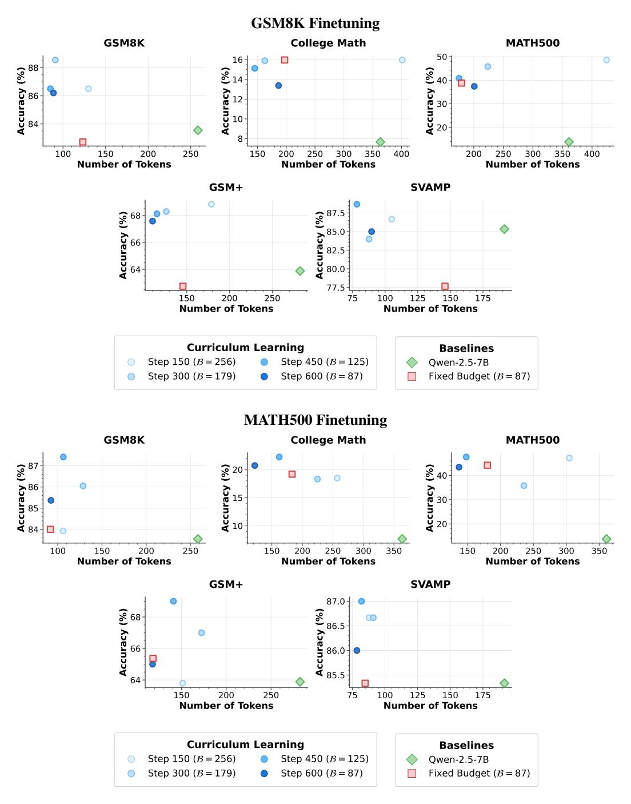
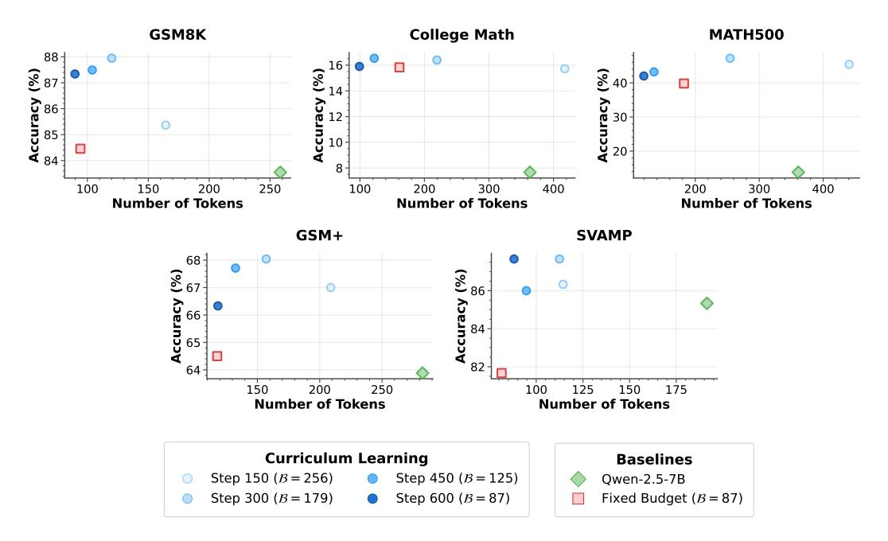
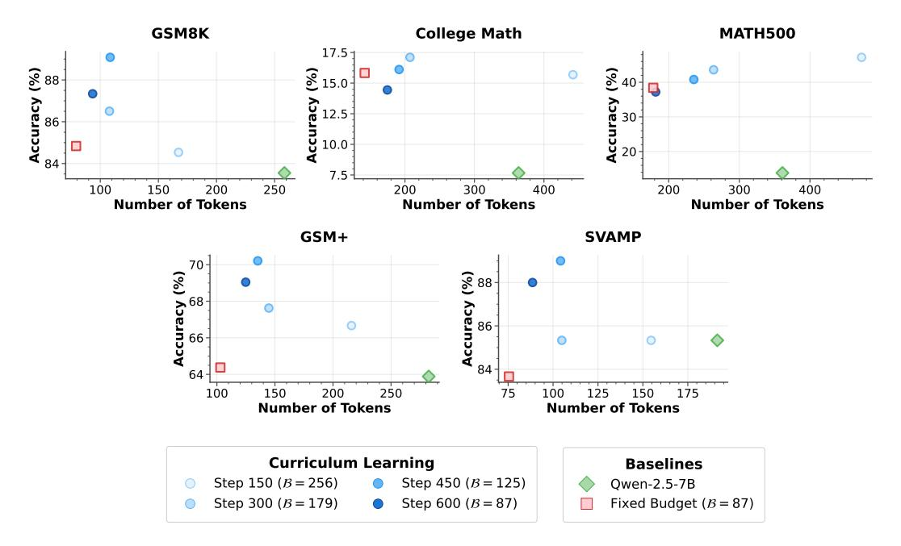
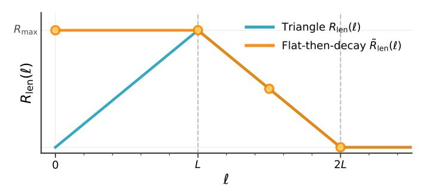
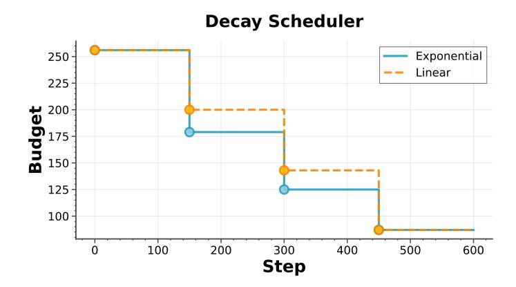

# 4 EXPERIMENTS

To evaluate the efficacy of our curriculum learning approach, we train models on math-reasoning data and measure accuracy, token efficiency, and robustness to training hyperparameters. Our experiments address six key questions:

- Q1: Does curriculum learning improve reasoning performance compared to fixed-budget training when both finish at the same token budget?
- Q2: Are the gains consistent across training datasets of different complexity (the easier GSM8K vs. the harder MATH500)?
- Q3: How sensitive is performance to reward weighting, i.e., how do different correctnessversus-length reward weights affect the accuracy–efficiency tradeoff?
- Q4: How does the shape of the decay schedule impact the final accuracy–efficiency tradeoff?
- Q5: How does the choice of *length reward function* (triangular vs. flat-band) influence the balance between output compression and accuracy?
- Q6: How does the *budget decay schedule type* (exponential vs. linear) affect final performance and efficiency across tasks of varying difficulty?

### 4.1 SETUP

Model. We use QWEN-2.5-7B in all experiments, fine-tuned via GRPO using group size G = 8. Baselines. We compare models trained using three different approaches:

- 1. Base model: the original QWEN-2.5-7B without further training; this isolates the benefit of any budget-aware RL fine-tuning.
- 2. Fixed-budget GRPO: the same model fine-tuned with GRPO while enforcing a constant 87-token limit; this matches the final budget but isolates our proposed curriculum.
- 3. Our Curriculum GRPO: GRPO training with an exponential budget schedule that decays from 256 to 87 tokens.

Training Data. For each baseline, we train two checkpoints. One uses all 7,473 GSM8K gradeschool problems, whose solutions are usually concise. The other uses MATH500, which represents 500 hard competition-level problems from the MATH dataset; these questions typically require longer chains of reasoning.

Budget range. We start the curriculum at 256 tokens, which is more than sufficient to solve most GSM8K problems and only just sufficient for many MATH500 problems. We then decay it exponentially to 87 tokens. This schedule tests whether gradual tightening compresses the chain-of-thought without reducing accuracy.

Evaluation Datasets. We evaluate zero-shot on five benchmarks: GSM8K (grade-school arithmetic), SVAMP (perturbed variants of GSM8K problems), and GSM+ (adversarial GSM8K problems), as well as MATH500 (competition-level math) and College Math (university-level math).

### 4.2 CURRICULUM LEARNING VS. FIXED BUDGET

We first test whether curriculum learning yields better token efficiency than the base model and higher accuracy than fixed-budget GRPO, in a setting where the curriculum and fixed-budget models finish training with the same 87-token limit. We train on either GSM8K (Figure [2](#page-7-0) Top) or MATH500 (Figure [2](#page-7-0) Bottom), and evaluate on both in-distribution datasets and out-of-distribution benchmarks. Across both training datasets and all evaluation benchmarks, curriculum learning improves accuracy while matching the token efficiency of fixed-budget GRPO at the same final budget and significantly reducing token usage relative to the base model.

GSM8K-trained models. As shown in Figure [2](#page-7-0) top, when trained on GSM8K, curriculum learning improves ID accuracy from 82.71% (fixed-budget GRPO) to 86.20%, with nearly identical average token usage (88.8 vs. 87.0). In comparison, the base model uses 258.4 tokens to reach only 83.55% accuracy, highlighting both the accuracy and efficiency benefits of curriculum training. For OOD evaluation on datasets derived from GSM8K, curriculum learning boosts accuracy from 77.67% to 85.00% on SVAMP (perturbed word problems) and from 62.75% to 67.58% on GSM+ (adversarial variants), again with token counts closely matching the fixed-budget baseline.

MATH500-trained models. On the harder MATH500 dataset (Figure [2](#page-7-0) bottom), curriculum learning raises accuracy from 38.80% (fixed-budget) to 43.40% while compressing average reasoning length from 179.3 to 137.1 tokens. This shows that the model can shorten even long-form solutions without sacrificing correctness. Similar to GSM8K training, we observe some OOD gains here too.

Conclusion for Q1 & Q2. In both easy (GSM8K) and hard (MATH500) reasoning tasks, curriculum learning consistently outperforms fixed-budget training in accuracy, while maintaining its token efficiency. In addition, it generalizes better to related perturbed or adversarial benchmarks.

### 4.3 REWARD WEIGHT ABLATIONS: CORRECTNESS VS. LENGTH

We next explore how varying reward weights impacts the tradeoff between solution quality and length. Figures [3](#page-8-0) and [4](#page-8-1) show two regimes: one prioritizing length (λc = 0.3, λℓ = 0.6) and one prioritizing correctness (λc = 0.6, λℓ = 0.3).

Length-Heavy Setting (Figure [3\)](#page-8-0). At 600 steps (final budget), GSM8K accuracy reaches 85.37% with an average length of 92.3 tokens, compared to the base model's 83.55% at 258.4 tokens. This shows that emphasizing the length reward produces highly compressed reasoning traces while maintaining accuracy gains over the base.

Correctness-Heavy Setting (Figure [4\)](#page-8-1). Shifting emphasis toward correctness improves GSM8K accuracy to 87.34%, with a modest increase in average length to 93.5 tokens, still far below the base model. On SVAMP and GSM+, correctness-heavy training consistently outperforms the lengthheavy setting by 1–2 points, confirming that higher accuracy comes at a small token cost.

Conclusion for Q3. Adjusting reward weights provides a controllable mechanism to trade accuracy for efficiency: heavier length weighting yields more compressed outputs with a slight accuracy drop, while heavier correctness weighting maximizes accuracy at a marginal increase in tokens.

### 4.4 EFFECT OF CURRICULUM SCHEDULE

We now turn to investigate how the *shape* of the curriculum—i.e., the rate at which the token budget decays—impacts final performance. While all schedules begin at the same initial budget (S0 = 256) and end at the same final budget (Sf = 87), we vary the number of decay points n, which determines how rapidly or gradually the model is constrained.

Step-wise Exponential Schedule. To ensure flexibility and principled control, we define a budget schedule updated every I = T /(n + 1) steps, where T is the total number of training steps. The

> **[图片提取文字 (无描述)]:**
> **GSM8K Finetuning** College Math **GSM8K** MATH500 0 16 0 0 Accuracy (%)
> 88
> 88
> 88 **Accuracy (%) Accuracy** (%) 14 12 10 10 0 8 100 200 250 200 350 200 250 300 150 250 300 400 350 150 400 **Number of Tokens Number of Tokens** Number of Tokens GSM+ SVAMP 0 **Accuracy** (%) 85.00 85.00 80.00 87.5 68 Accuracy (%) 77.5 150 200 250 75 100 125 150 175 **Number of Tokens** Number of Tokens **Curriculum Learning Baselines** Step 150 (B = 256) Step 450 (B = 125) Qwen-2.5-7B Step 300 (B = 179) Step 600 (B = 87) Fixed Budget (B = 87) **MATH500 Finetuning** College Math GSM8K MATH500 0 **Accuracy (%)** 87 88 85 85 84 **Accuracy (%)** 15 10 **Accuracy (%)** 0 0 0 100 150 200 250 200 250 150 300 350 150 200 250 300 350 Number of Tokens Number of Tokens Number of Tokens GSM+ SVAMP 87.0-Accuracy (%) 86.5-86.0-85.5-Accuracy (%) 00 0 64 200 75 100 125 150 150 250 175 Number of Tokens Number of Tokens Curriculum Learning Baselines Step 150 (B = 256) Step 450 (B = 125) Qwen-2.5-7B Step 300 (B = 179) Step 600 (B = 87) Fixed Budget (B = 87)

Figure 2: Curriculum vs. fixed-budget training on GSM8K and MATH500. For GSM8K (top), models trained with our curriculum ( $256 \rightarrow 87$  tokens) achieve higher in-distribution accuracy than fixed-budget GRPO at the same final budget, while using fewer tokens. For MATH500 (bottom), even for harder, longer-form problems, curriculum learning improves accuracy while reducing average reasoning length, showing that progressive budget tightening can compress solutions while maintaining high accuracy.

budget after decay index k (k = 0, ..., n) is

$$S_k = S_0 \cdot d^k$$
, with  $d = \left(\frac{S_f}{S_0}\right)^{1/n}$ ,

> **[图片提取文字 (无描述)]:**
> GSM8K College Math MATH500 88 900 16 (%) 14 12 12 10 10 10 10 10 10 10 10 10 10 10 10 10 0 0 **Accuracy (%)** 87-88-88-88 0 **Accuracy (%)** 0 8 100 200 250 100 200 300 400 200 150 300 400 **Number of Tokens Number of Tokens Number of Tokens** GSM+ SVAMP 68-Accuracy (%) Accuracy (%) 0 0 82-64 150 200 250 100 125 150 175 **Number of Tokens Number of Tokens Curriculum Learning Baselines** Step 150 (B = 256) Step 450 (B = 125) Qwen-2.5-7B Step 300 (B = 179) Step 600 (B = 87) Fixed Budget (B = 87)

Figure 3: Length-heavy reward weighting. Increasing the weight on the length reward ( $\lambda_c = 0.3, \ \lambda_\ell = 0.6$ ) yields highly compressed reasoning traces while retaining accuracy gains over the base model.

> **[图片提取文字 (无描述)]:**
> GSM8K College Math MATH500 17.5 -0 Accuracy (%) **Accuracy** (%) 15.0 **Accuracy (%)** 0 0 7.5 150 200 200 300 200 100 250 400 300 400 **Number of Tokens Number of Tokens Number of Tokens** GSM+ SVAMP Accuracy (%) **Accuracy (%)**88
> 88
> 88 0 0 0 0 64 150 200 250 100 125 150 175 100 75 **Number of Tokens Number of Tokens Curriculum Learning Baselines** Step 150 (B = 256) Step 450 (B = 125) Qwen-2.5-7B Step 300 (B = 179) Step 600 (B = 87) Fixed Budget (B = 87)

Figure 4: Correctness-heavy reward weighting. Prioritizing correctness ( $\lambda_c = 0.6, \ \lambda_\ell = 0.3$ ) produces slightly longer outputs than the length-heavy setting but improves accuracy on both indistribution and out-of-distribution benchmarks.

applied at step  $t_k = k \cdot I$ . This ensures all schedules reach  $S_f$  at the same endpoint while varying the decay trajectory. For example:

- $n = 1, d \approx 0.340$ : single large, abrupt decay halfway through training.
- $n=3, d\approx 0.700$ : moderate decay every 150 steps (T=600).

• n = 7, d ≈ 0.857: gentle, gradual decay every 75 steps.

Results. Table [1](#page-9-0) shows that decay trajectory substantially influences the final accuracy–efficiency trade-off, even with identical start and end budgets. On average across all datasets, fast (I = 75) and moderate (I = 150) decays achieve the highest mean accuracy (57.9%) while keeping token usage low (115 and 135 tokens, respectively). Slow decay (I = 300) maintains higher token counts (248 average) and matches or slightly exceeds the best accuracies on easier datasets like GSM8K (86.8%) and SVAMP (88.0%), but is far less efficient, and is less performant on hard datasets. A notable example is MATH500, where slow decay yields only 9.8% accuracy, suggesting that very late decay harms performance on harder, long-form reasoning tasks.

Table 1: Decay rate ablation (exponential schedules). Fast and moderate decays deliver the highest average accuracy at substantially lower token budgets, while slow decay attains the best results on easier datasets (GSM8K, SVAMP) but performs poorly on harder tasks (MATH500) and is least efficient; start and end budgets are fixed across settings.

| Dataset      | Decay | Interval | Avg. Token Count | Accuracy (%) |
|--------------|-------|----------|------------------|--------------|
| GSM8K        | 0.340 | 300      | 178              | 86.8         |
|              | 0.700 | 150      | 89               | 86.2         |
|              | 0.857 | 75       | 103              | 84.7         |
| College Math | 0.340 | 300      | 357              | 10.1         |
|              | 0.700 | 150      | 187              | 13.4         |
|              | 0.857 | 75       | 119              | 15.3         |
| GSM+         | 0.340 | 300      | 204              | 67.5         |
|              | 0.700 | 150      | 110              | 67.6         |
|              | 0.857 | 75       | 124              | 66.6         |
| SVAMP        | 0.340 | 300      | 167              | 88.0         |
|              | 0.700 | 150      | 90               | 85.0         |
|              | 0.857 | 75       | 96               | 84.3         |
| MATH500      | 0.340 | 300      | 336              | 9.8          |
|              | 0.700 | 150      | 201              | 37.4         |
|              | 0.857 | 75       | 132              | 38.4         |
| Average      | 0.340 | 300      | 248              | 52.4         |
|              | 0.700 | 150      | 135              | 57.9         |
|              | 0.857 | 75       | 115              | 57.9         |

Conclusion for Q4. The curriculum trajectory, not just the endpoint, matters. Faster decays favor efficiency and robustness on challenging tasks, while slower decays allow more exploration early, benefiting easier datasets. Our step-wise exponential framework provides a single tunable parameter n to control this trade-off.

### 4.5 EFFECT OF LENGTH REWARD FUNCTION

In our main experiments, the length component of the reward function is implemented as a *triangular* shape (Section [3\)](#page-2-0), which linearly increases from 0 at length 0 to a maximum at the target budget (L = 87), then linearly decreases to 0 at 2L. This structure encourages the model to explore the full budgeted reasoning length, since using tokens up to L yields progressively higher reward.

As an alternative, we evaluate a *band* reward function, where the length reward remains at a fixed maximum for all outputs up to L tokens, and then decreases linearly to 0 at 2L. This variant removes the ramp-up phase and gives maximal reward even for very short completions, which may encourage the model to settle on shorter-than-necessary reasoning traces if they already solve the task correctly.

Results. Figure [5](#page-10-0) and Table [2](#page-10-1) summarize the comparison. Across all datasets, we observe a clear trade-off: the band reward consistently produces shorter outputs (average 94 tokens vs. 135), but the

#### **Length Reward: Triangle vs Flat-then-decay**

> **[图片提取文字 (无描述)]:**
> Triangle  $R_{len}^{\perp}(\ell)$  $R_{\text{max}}$ Flat-then-decay  $\tilde{R}_{len}(\ell)$  $R_{\mathsf{len}}(\ell)$

Figure 5: Triangular vs. Band length reward. The triangular shape encourages exploration up to the budget L before compression, whereas the band shape gives maximum reward immediately for any output ≤ L, often leading to shorter but less accurate reasoning traces. We refer to 'band' here as 'flat-then-decay'.

triangular reward always achieves higher accuracy. The accuracy drop is especially noticeable on hard datasets such as MATH500 (30.8% vs. 37.4%) and GSM+ (64.6% vs. 67.6%). The triangular reward, by contrast, preserves accuracy while still achieving large efficiency gains over the base model, suggesting that incentivizing gradual length exploration before compression is beneficial.

Table 2: Length reward shape comparison. Triangular rewards encourage full-budget exploration before compression, yielding higher accuracy at similar efficiency, whereas band rewards often overcompress and lose performance.

| Dataset      | Reward Function | Avg. Token Count | Accuracy (%) |
|--------------|-----------------|------------------|--------------|
| GSM8K        | Triangular      | 89               | 86.2         |
|              | Band            | 70               | 84.6         |
| College Math | Triangular      | 187              | 13.4         |
|              | Band            | 132              | 13.1         |
| GSM+         | Triangular      | 110              | 67.6         |
|              | Band            | 98               | 64.6         |
| SVAMP        | Triangular      | 90               | 85.0         |
|              | Band            | 61               | 82.0         |
| MATH500      | Triangular      | 201              | 37.4         |
|              | Band            | 112              | 30.8         |
| Average      | Triangular      | 135              | 57.9         |
|              | Band            | 94               | 55.0         |

Conclusion for Q5. The triangular reward balances exploration and compression, achieving higher accuracy at similar efficiency to the band reward, which tends to over-compress and harm performance on harder tasks requiring longer-form reasoning (e.g., −6.6 points on MATH500).

### 4.6 EFFECT OF DECAY SCHEDULE SHAPE

In addition to the reward shape, the *schedule* by which we decay the token budget may influence learning dynamics. Our default setting uses an *exponential* decay, where the budget is multiplied by a constant factor at fixed intervals (e.g., every 150 steps) until the final target length is reached. This produces a steep budget drop early on and increasingly smaller changes later.

As a comparison, we experiment with a *linear* decay schedule that reduces the budget in equal steps from the initial 256 tokens to the final 87 over the same total training duration. In our implementation, we perform roughly three equal budget drops to cover this range.

> **[图片提取文字 (无描述)]:**
> **Decay Scheduler** Exponential Linear 150-Step

Figure 6: **Exponential vs. Linear decay schedules.** Linear decay reduces the budget in equal steps, leading to slightly longer outputs but improved performance on harder reasoning tasks.

Figure 6 and Table 3 report the results. The linear schedule generally yields slightly longer outputs (average 140 tokens vs. 135 for exponential), but improves average accuracy from 57.9% to 60.0%. Gains are most pronounced on harder datasets like MATH500 (42.8% vs. 37.4%) and College Math (17.2% vs. 13.4%), suggesting that a gentler, more uniform reduction in budget may help models retain complex reasoning strategies while still learning to compress them.

Table 3: **Decay scheduler type comparison.** Exponential decay favors efficiency by front-loading compression, while linear decay provides steadier budget reduction, often improving performance on complex reasoning tasks.

| Dataset      | Decay Scheduler       | Avg. Token Count | Accuracy (%)        |
|--------------|-----------------------|------------------|---------------------|
| GSM8K        | Exponential           | 89               | 86.2                |
|              | Linear                | 107              | <b>86.3</b>         |
| College Math | Exponential           | 187              | 13.4                |
|              | Linear                | 154              | <b>17.2</b>         |
| GSM+         | Exponential Linear | 110 143       | <b>67.6</b> 66.4    |
| SVAMP        | Exponential           | 90               | 85.0                |
|              | Linear                | 97               | <b>87.3</b>         |
| MATH500      | Exponential           | 201              | 37.4                |
|              | Linear                | 198              | <b>42.8</b>         |
| Average      | Exponential Linear | <b>135</b> 140   | 57.9 <b>60.0</b> |

**Conclusion for Q6.** While exponential decay favors shorter outputs and slightly better average efficiency, it can remove reasoning capacity too quickly. In contrast, linear decay provides a steadier compression trajectory, yielding notable accuracy improvements on complex reasoning tasks.

### 5 LIMITATIONS

Our study is limited in several respects due to computational constraints. First, all training was conducted with relatively short context windows and token budgets capped at 256 tokens. Although this suffices for datasets like GSM8K, it may restrict performance on tasks that require more extended reasoning. Extending curriculum learning to larger context windows could yield further gains.

Second, we conduct all experiments using the QWEN-2.5-7B model. While this model size provides a strong trade-off between capability and cost, it remains an open question how curriculum-based

length control behaves at both larger (e.g., 13B, 70B) and smaller (e.g., 1.3B, 3B) scales. Scaling analyses and evaluations on open-ended generation tasks are promising directions for future work.

