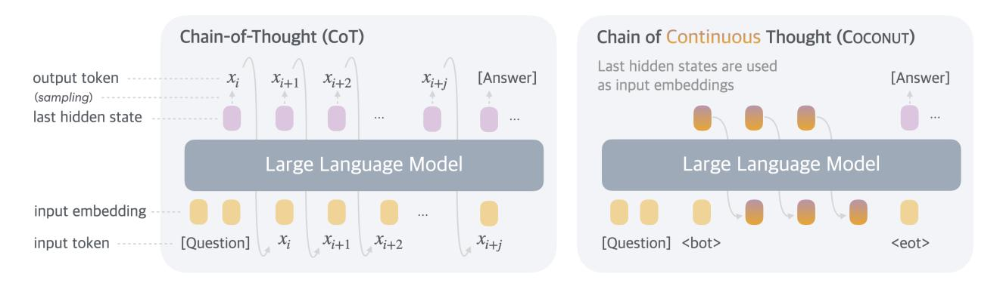

# 1 Introduction

Large language models (LLMs) have demonstrated remarkable reasoning abilities, emerging from extensive pretraining on human languages [\(Dubey et al.,](#page-11-0) [2024;](#page-11-0) [Achiam et al.,](#page-11-1) [2023\)](#page-11-1). While next token prediction is an effective training objective, it imposes a fundamental constraint on the LLM as a reasoning machine: the explicit reasoning process of LLMs must be generated in word tokens. For example, a prevalent approach, known as chain-of-thought (CoT) reasoning [\(Wei et al.,](#page-13-0) [2022\)](#page-13-0), involves prompting or training LLMs to generate solutions step-by-step using natural language. However, this is in stark contrast to certain human cognition results. Neuroimaging studies have consistently shown that the language network – a set of brain regions responsible for language comprehension and production – remains largely inactive during various reasoning tasks [\(Amalric and Dehaene,](#page-11-2) [2019;](#page-11-2) [Monti et al.,](#page-12-0) [2012,](#page-12-0) [2007,](#page-12-1) [2009;](#page-12-2) [Fedorenko et al.,](#page-11-3) [2011\)](#page-11-3). Further evidence indicates that human language is optimized for communication rather than reasoning [\(Fedorenko](#page-11-4) [et al.,](#page-11-4) [2024\)](#page-11-4).

A significant issue arises when LLMs use language for reasoning: the amount of reasoning required for each particular token varies greatly, yet current LLM architectures allocate nearly the same computing budget for predicting every token. Most tokens in a reasoning chain are generated solely for fluency, contributing little to the actual reasoning process. By contrast, some critical tokens require complex planning and pose huge challenges to LLMs. While previous work has attempted to fix these problems by prompting LLMs to generate succinct reasoning chains [\(Madaan and Yazdanbakhsh,](#page-12-3) [2022\)](#page-12-3), or performing additional reasoning before generating some critical tokens [\(Zelikman et al.,](#page-13-1) [2024\)](#page-13-1), these solutions remain constrained within the language space and do not solve the fundamental problems. On the contrary, it would be ideal for LLMs to have the freedom to reason without any language constraints, and then translate their findings into language only when necessary.

1FAIR at Meta, 2UC San Diego

∗Work done at Meta

> **[图片提取文字 (无描述)]:**
> Chain of Continuous Thought (COCONUT) Chain-of-Thought (CoT) Last hidden states are used [Answer] output token [Answer] as input embeddings (sampling) last hidden state ... ... Large Language Model Large Language Model input embedding [Question]  $x_{i+j}$ input token [Ouestion] <bot> <eot>

Figure 1 A comparison of Chain of Continuous Thought (Coconut) with Chain-of-Thought (CoT). In CoT, the model generates the reasoning process as a word token sequence (e.g., [xi, xi+1, ..., xi+j ] in the figure). Coconut regards the last hidden state as a representation of the reasoning state (termed "continuous thought"), and directly uses it as the next input embedding. This allows the LLM to reason in an unrestricted latent space instead of a language space.

In this work we instead explore LLM reasoning in a latent space by introducing a novel paradigm, Coconut (Chain of Continuous Thought). It involves a simple modification to the traditional CoT process: instead of mapping between hidden states and language tokens using the language model head and embedding layer, Coconut directly feeds the last hidden state (a continuous thought) as the input embedding for the next token (Figure [1\)](#page-1-0). This modification frees the reasoning from being within the language space, and the system can be optimized end-to-end by gradient descent, as continuous thoughts are fully differentiable. To enhance the training of latent reasoning, we employ a multi-stage training strategy inspired by [Deng et al.](#page-11-5) [\(2024\)](#page-11-5), which effectively utilizes language reasoning chains to guide the training process.

Interestingly, our proposed paradigm leads to an efficient reasoning pattern. Unlike language-based reasoning, continuous thoughts in Coconut can encode multiple potential next steps simultaneously, allowing for a reasoning process akin to breadth-first search (BFS). While the model may not initially make the correct decision, it can maintain many possible options within the continuous thoughts and progressively eliminate incorrect paths through reasoning, guided by some implicit value functions. This advanced reasoning mechanism surpasses traditional CoT, even though the model is not explicitly trained or instructed to operate in this manner, as seen in previous works [\(Yao et al.,](#page-13-2) [2023;](#page-13-2) [Hao et al.,](#page-12-4) [2023\)](#page-12-4).

Experimentally, Coconut successfully enhances the reasoning capabilities of LLMs. For math reasoning (GSM8k, [Cobbe et al.,](#page-11-6) [2021\)](#page-11-6), using continuous thoughts is shown to be beneficial to reasoning accuracy, mirroring the effects of language reasoning chains. This indicates the potential to scale and solve increasingly challenging problems by chaining more continuous thoughts. On logical reasoning including ProntoQA [\(Saparov](#page-12-5) [and He,](#page-12-5) [2022\)](#page-12-5), and our newly proposed ProsQA (Section [4\)](#page-4-0) which requires stronger planning ability, Coconut and some of its variants even surpasses language-based CoT methods, while generating significantly fewer tokens during inference. We believe that these findings underscore the potential of latent reasoning and could provide valuable insights for future research.

