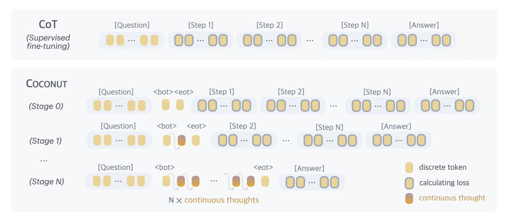

# 3 Coconut: Chain of Continuous Thought

In this section, we introduce our new paradigm Coconut (Chain of Continuous Thought) for reasoning in an unconstrained latent space. We begin by introducing the background and notation we use for language models. For an input sequence x = (x1, ..., xT ), the standard large language model M can be described as:

$$H_t = \text{Transformer}(E_t)$$
  
 $\mathcal{M}(x_{t+1} \mid x_{\leq t}) = \text{softmax}(Wh_t)$ 

where Et = [e(x1), e(x2), ..., e(xt)] is the sequence of token embeddings up to position t; Ht ∈ R t×d is the matrix of the last hidden states for all tokens up to position t; ht is the last hidden state of position t, i.e., ht = Ht[t, :]; e(·) is the token embedding function; W is the parameter of the language model head.

Method Overview. In the proposed Coconut method, the LLM switches between the "language mode" and "latent mode" (Figure [1\)](#page-1-0). In language mode, the model operates as a standard language model, autoregressively

> **[图片提取文字 (无描述)]:**
> CoT [Question] [Step 1] [Step 2] [Step N] [Answer] (Supervised fine-tuning) COCONUT [Step 1] [Step 2] [Answer] [Question] <bot><eot> [Step N] (Stage 0) [Question] <bot> [Step 2] [Answer] <eot> [Step N] (Stage 1) ... discrete token [Question] <bot> <eot> [Answer] (Stage N) calculating loss continuous thought N x continuous thoughts

Figure 2 Training procedure of Chain of Continuous Thought (Coconut). Given training data with language reasoning steps, at each training stage we integrate c additional continuous thoughts (c = 1 in this example), and remove one language reasoning step. The cross-entropy loss is then used on the remaining tokens after continuous thoughts.

generating the next token. In latent mode, it directly utilizes the last hidden state as the next input embedding. This last hidden state represents the current reasoning state, termed as a "continuous thought".

Special tokens <bot> and <eot> are employed to mark the beginning and end of the latent thought mode, respectively. As an example, we assume latent reasoning occurs between positions i and j, i.e., xi = <bot> and xj = <eot>. When the model is in the latent mode (i < t < j), we use the last hidden state from the previous token to replace the input embedding, i.e., Et = [e(x1), e(x2), ..., e(xi), hi , hi+1, ..., ht−1]. After the latent mode finishes (t ≥ j), the input reverts to using the token embedding, i.e., Et = [e(x1), e(x2), ..., e(xi), hi , hi+1, ..., hj−1, e(xj ), ..., e(xt)]. It is worth noting that the last hidden states have been processed by the final normalization layer, so they are not too large in magnitude. M(xt+1 | x≤t) is not defined when i < t < j, since the latent thought is not intended to be mapped back to language space. However, softmax(W ht) can still be calculated for probing purposes (see Section [5\)](#page-7-0).

Training Procedure. In this work, we focus on a problem-solving setting where the model receives a question as input and is expected to generate an answer through a reasoning process. We leverage language CoT data to supervise continuous thought by implementing a multi-stage training curriculum inspired by [Deng et al.](#page-11-5) [\(2024\)](#page-11-5). As shown in Figure [2,](#page-3-0) in the initial stage, the model is trained on regular CoT instances. In the subsequent stages, at the k-th stage, the first k reasoning steps in the CoT are replaced with k × c continuous thoughts[1](#page-3-1) , where c is a hyperparameter controlling the number of latent thoughts replacing a single language reasoning step. Following [Deng et al.](#page-11-5) [\(2024\)](#page-11-5), we also reset the optimizer state when training stages switch. We insert <bot> and <eot> tokens (which are not counted towards c) to encapsulate the continuous thoughts.

During the training process, we optimize the normal negative log-likelihood loss, but mask the loss on questions and latent thoughts. It is important to note that the objective does not encourage the continuous thought to compress the removed language thought, but rather to facilitate the prediction of future reasoning. Therefore, it's possible for the LLM to learn more effective representations of reasoning steps compared to human language.

Training Details. Our proposed continuous thoughts are fully differentiable and allow for back-propagation. We perform n + 1 forward passes when n latent thoughts are scheduled in the current training stage, computing a new latent thought with each pass and finally conducting an additional forward pass to obtain a loss on the remaining text sequence. While we can save any repetitive computing by using a KV cache, the sequential nature of the multiple forward passes poses challenges for parallelism. Further optimizing the

1 If a language reasoning chain is shorter than k steps, then all the language thoughts will be removed.

training efficiency of Coconut remains an important direction for future research.

Inference Process. The inference process for Coconut is analogous to standard language model decoding, except that in latent mode, we directly feed the last hidden state as the next input embedding. A challenge lies in determining when to switch between latent and language modes. As we focus on the problem-solving setting, we insert a <bot> token immediately following the question tokens. For <eot>, we consider two potential strategies: a) train a binary classifier on latent thoughts to enable the model to autonomously decide when to terminate the latent reasoning, or b) always pad the latent thoughts to a constant length. We found that both approaches work comparably well. Therefore, we use the second option in our experiment for simplicity, unless specified otherwise.

