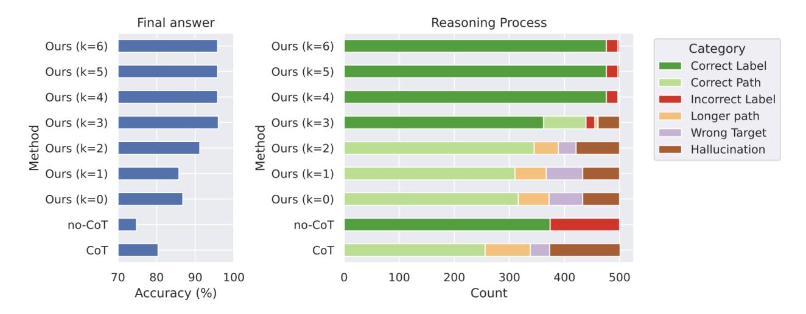
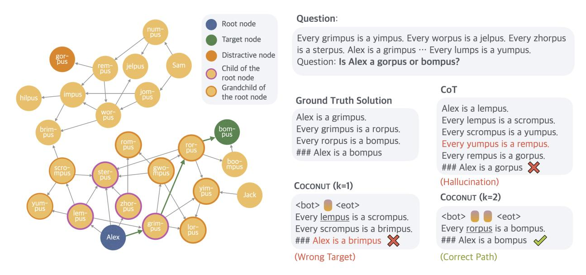
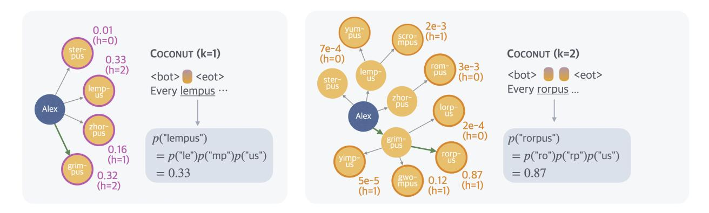
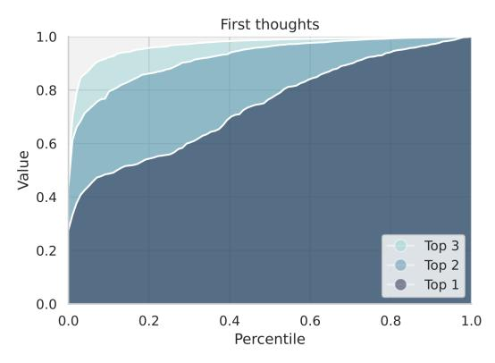
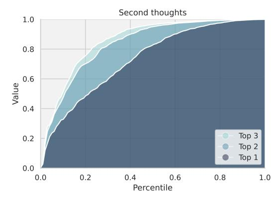

# 4 Continuous Space Enables Latent Tree Search

In this section, we provide a proof of concept of the advantage of continuous latent space reasoning. On ProsQA, a new dataset that requires extensive planning ability, Coconut outperforms language space CoT reasoning. Interestingly, our analysis indicates that the continuous representation of reasoning can encode multiple alternative next reasoning steps. This allows the model to perform a breadth-first search (BFS) to solve the problem, instead of prematurely committing to a single deterministic path like language CoT.

We start by introducing the experimental setup (Section [4.1\)](#page-4-1). By leveraging Coconut's ability to switch between language and latent space reasoning, we are able to control the model to interpolate between fully latent reasoning and fully language reasoning and test their performance (Section [4.2\)](#page-5-0). This also enables us to interpret the latent reasoning process as tree search (Section [4.3\)](#page-5-1). Based on this perspective, we explain why latent reasoning can help LLMs make better decisions (Section [4.4\)](#page-7-1).

#### 4.1 Experimental Setup

Dataset. We introduce ProsQA (Proof with Search Question-Answering), a new logical reasoning dataset. A visualized example is shown in Figure [4.](#page-6-0) Each instance in ProsQA consists of a directed acyclic graph (DAG) of logical relationships between concepts, presented as natural language statements. The task requires models to determine logical relationships by finding valid paths through this graph, demanding sophisticated planning and search strategies. Unlike previous logical reasoning datasets like ProntoQA [\(Saparov and He,](#page-12-5) [2022\)](#page-12-5), ProsQA's DAG structure introduces complex exploration paths, making it particularly challenging for models to identify the correct reasoning chain. More comprehensive details about the dataset construction and characteristics can be found in Appendix [A.](#page-14-0)

Setup. We use a pre-trained GPT-2 model as the base model for all experiments. The learning rate is set to 1 × 10−4 while the effective batch size is 128. We train a Coconut model following the training procedure in Section [3.](#page-2-0) Since the maximum reasoning steps in ProsQA is 6, we set the number of training stages to N = 6 in the training procedure. In each stage, we train the model for 5 epochs, and stay in the last stage until the 50 epochs. The checkpoint with the best accuracy in the last stage is used for evaluation. As reference, we report the performance of (1) CoT: the model is trained with CoT data, and during inference, the model will generate a complete reasoning chain to solve the problem. (2) no-CoT: the model is trained with only the question and answer pairs, without any reasoning steps. During inference, the model will output the final answer directly.

To understand the properties of latent and language reasoning space, we manipulate the model to switch between fully latent reasoning and fully language reasoning, by manually setting the position of the <eot> token during inference. When we enforce Coconut to use k continuous thoughts, the model is expected to output the remaining reasoning chain in language, starting from the k + 1 step. In our experiments, we test variants of Coconut on ProsQA with k ∈ {0, 1, 2, 3, 4, 5, 6}. Note that all these variants only differ in inference time while sharing the same model weights.

Metrics. We apply two sets of evaluation metrics. One of them is based on the correctness of the final answer, regardless of the reasoning process. It is also the main metric used in the later sections (Section [5.3\)](#page-9-0). To enable fine-grained analysis on ProsQA, we define another metric on the reasoning process. We classify a reasoning chain into (1) Correct Path: The output is one of the shortest paths to the correct answer. (2)

> **[图片提取文字 (无描述)]:**
> Final answer Reasoning Process Ours (k=6) Ours (k=6) Category Correct Label Ours (k=5) Ours (k=5)Correct Path Ours (k=4) Ours (k=4) Incorrect Label Longer path Ours (k=3)
> 
> Ours (k=2) Ours (k=3)
> 
> Ours (k=1) Wrong Target Hallucination Ours (k=1) Ours (k=1) Ours (k=0) Ours (k=0)no-CoT no-CoT CoT CoT 70 80 90 100 0 100 200 300 400 500 Accuracy (%) Count

Figure 3 The accuracy of final answer (left) and reasoning process (right) of multiple variants of Coconut and baselines on ProsQA.

Longer Path: A valid path that correctly answers the question but is longer than the shortest path. (3) Hallucination: The path includes nonexistent edges or is disconnected. (4) Wrong Target: A valid path in the graph, but the destination node is not the one being asked. These four categories naturally apply to the output from Coconut (k = 0) and CoT, which generate the full path. For Coconut with k > 0 that outputs only partial paths in language (with the initial steps in continuous reasoning), we classify the reasoning as a Correct Path if a valid explanation can complete it. Also, we define Longer Path and Wrong Target for partial paths similarly. If no valid explanation completes the path, it's classified as Hallucination. In no-CoT and Coconut with larger k, the model may only output the final answer without any partial path, and it falls into (5) Correct Label or (6) Incorrect Label. These six categories cover all cases without overlap.

#### 4.2 Overall Results

Figure [3](#page-5-2) presents a comparative analysis of various reasoning methods evaluated on ProsQA. The model trained using CoT frequently hallucinates non-existent edges or outputs paths leading to incorrect targets, resulting in lower answer accuracy. In contrast, Coconut, which leverages continuous space reasoning, demonstrates improved accuracy as it utilizes an increasing number of continuous thoughts. Additionally, the rate of correct reasoning processes (indicated by "Correct Label" and "Correct Path") significantly increases. At the same time, there is a notable reduction in instances of "Hallucination" and "Wrong Target," issues that typically emerge when the model makes mistakes early in the reasoning process.

An intuitive demonstration of the limitations of reasoning in language space is provided by the case study depicted in Figure [4.](#page-6-0) As shown, models operating in language space often fail to plan ahead or backtrack. Once they commit to an incorrect path, they either hallucinate unsupported edges or terminate with irrelevant conclusions. In contrast, latent reasoning avoids such premature commitments by enabling the model to iteratively refine its decisions across multiple reasoning steps. This flexibility allows the model to progressively eliminate incorrect options and converge on the correct answer, ultimately resulting in higher accuracy.

## 4.3 Interpreting the Latent Reasoning as Tree Search

To better understand Coconut, we probe the latent reasoning process by forcing the model to explicitly generate language reasoning steps following intermediate continuous thoughts (Figure [5\)](#page-6-0). Using the example presented in Figure [4,](#page-6-0) at the initial reasoning step, the model must select which immediate child node of "Alex" to consider next, specifically from the set {"lempus", "sterpus", "zhorpus", "grimpus"}. The distribution over these candidate next steps is visualized in Figure [5,](#page-6-0) left. In the subsequent reasoning step, these nodes expand further into an extended set of potential paths, including all grandchildren of "Alex" (Figure [5,](#page-6-0) right).

> **[图片提取文字 (无描述)]:**
> Ouestion: Root node Every grimpus is a yimpus. Every worpus is a jelpus. Every zhorpus Target node is a sterpus. Alex is a grimpus ··· Every lumps is a yumpus. Distractive node gor-pus Question: Is Alex a gorpus or bompus? Child of the root node Grandchild of CoT the root node Ground Truth Solution Alex is a lempus. Alex is a grimpus. Every lempus is a scrompus. Every grimpus is a rorpus. bom-Every scrompus is a yumpus. DUS Every rorpus is a bompus. Every yumpus is a rempus. ### Alex is a bompus Every rempus is a gorpus. ### Alex is a gorpus 💢 (Hallucination) COCONUT (k=1) Coconut (k=2) <bot> <bot> Every lempus is a scrompus. <eot> <bot> Every rorpus is a bompus. Every scrompus is a brimpus. Alex ### Alex is a brimpus 💢 ### Alex is a bompus 🥠 (Correct Path) (Wrong Target)

Figure 4 A case study of ProsQA. The model trained with CoT hallucinates an edge (Every yumpus is a rempus) after getting stuck in a dead end. Coconut (k=1) outputs a path that ends with an irrelevant node. Coconut (k=2) solves the problem correctly.

> **[图片提取文字 (无描述)]:**
> 2e-3 0.01 (h=1) (h=0)7e-4 COCONUT (k=1) COCONUT (k=2) (h=0)0.33 (h=2) 3e-3 <bot> <bot> eot> (h=0)Every rorpus ... Every lempus ··· Alex Alex 2e-4 (h=0) p("lempus") p("rorpus") 0.16 =p("le")p("mp")p("us")=p("ro")p("rp")p("us")(h=1) = 0.33= 0.870.87 0.32 5e-5 (h=2)(h=1)(h=1) (h=1)

Figure 5 An illustration of the latent search trees. The example is the same test case as in Figure [4.](#page-6-0) The height of a node (denoted as h in the figure) is defined as the longest distance to any leaf nodes in the graph. We show the probability of the first concept predicted by the model following latent thoughts (e.g., "lempus" in the left figure). It is calculated as the multiplication of the probability of all tokens within the concept conditioned on previous context (omitted in the figure for brevity). This metric can be interpreted as an implicit value function estimated by the model, assessing the potential of each node leading to the correct answer.

We define the predicted probability of a concept following continuous thoughts as a value function (Figure [5\)](#page-6-0), estimating each node's potential for reaching the correct target. Interestingly, the reasoning strategy employed by Coconut is not greedy search: while "lempus" initially has the highest value (0.33) at the first reasoning step (Figure [5,](#page-6-0) left), the model subsequently assigns the highest value (0.87) to "rorpus," a child of "grimpus," rather than following "lempus" (Figure [5,](#page-6-0) right). This characteristic resembles a breadth-first search (BFS) approach, contrasting sharply with the greedy decoding typical of traditional CoT methods. The inherent capability of continuous representations to encode multiple candidate paths enables the model to avoid making immediate deterministic decisions. Importantly, this tree search pattern is not limited to the illustrated example, but constitutes a fundamental mechanism underlying the consistent improvement observed with larger values of k in Coconut.

Figure [6](#page-7-2) presents an analysis of the parallelism in the model's latent reasoning across the first and second thoughts. For the first thoughts (left panel), the cumulative values of the top-1, top-2, and top-3 candidate nodes are computed and plotted against their respective percentiles across the test set. The noticeable gaps between the three lines indicate that the model maintains significant diversity in its reasoning paths at this

> **[图片提取文字 (无描述)]:**
> First thoughts 1.0 0.8 0.6 Value 0.4 Top 3 0.2 Top 2 Top 1 0.0 0.0 0.2 0.4 0.6 0.8 1.0 Percentile

> **[图片提取文字 (无描述)]:**
> Second thoughts 1.0 8.0 Value 9.0 0.4 Top 3 0.2 Top 2 Top 1 0.0 0.4 0.0 0.2 0.6 0.8 1.0 Percentile

Figure 6 Analysis of parallelism in the first two steps of the latent tree search. The three curves in each panel depict the cumulative value of the top-1, top-2, and top-3 candidate nodes.

stage, suggesting a broad exploration of alternative possibilities. In contrast, the second thoughts (right panel) show a narrowing of these gaps. This trend suggests that the model transitions from parallel exploration to more focused reasoning in the second latent reasoning step, likely as it gains more certainty about the most promising paths.

## 4.4 Why is Latent Space Better for Planning?

Building upon the tree search perspective, we further examine why latent reasoning benefits planning tasks—specifically, why maintaining multiple candidate paths and postponing deterministic decisions enhances reasoning performance. Our hypothesis is that nodes explored in the early reasoning stages are inherently more challenging to evaluate accurately because they are farther from the final target nodes. In contrast, nodes positioned closer to potential targets, having fewer subsequent exploration possibilities, can be assessed accurately with higher confidence.

To systematically test this, we define the height of a node as its shortest distance to any leaf node and analyze the relationship between node height and the model's estimated value. Ideally, a correct node—one that can lead to the target node—should receive a high estimated value, whereas an incorrect node—one that cannot lead to the target node—should receive a low value. Empirical results across the test set (Figure [7\)](#page-7-3) support our hypothesis: nodes with lower heights consistently receive more accurate and definitive probability evaluations. Conversely, nodes with greater heights exhibit more ambiguous evaluations, reflecting increased uncertainty.

These findings underscore the advantage of latent space reasoning. By delaying deterministic decisions and allowing exploration to proceed toward terminal states, latent reasoning significantly enhances the model's ability to differentiate correct paths from incorrect ones, thereby improving performance on complex, planning-intensive tasks compared to traditional greedy methods.

