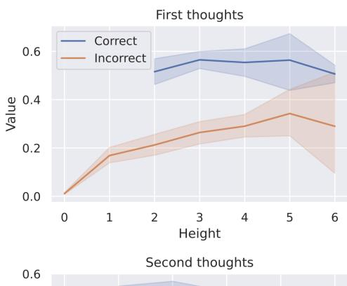
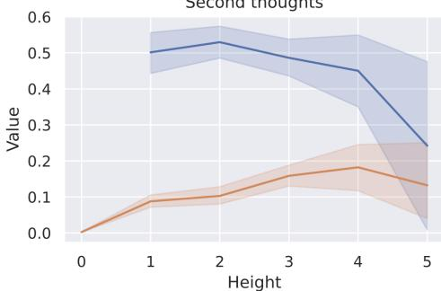
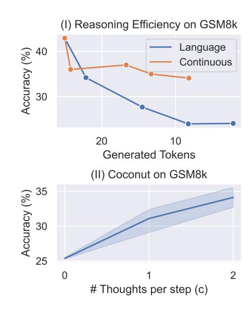
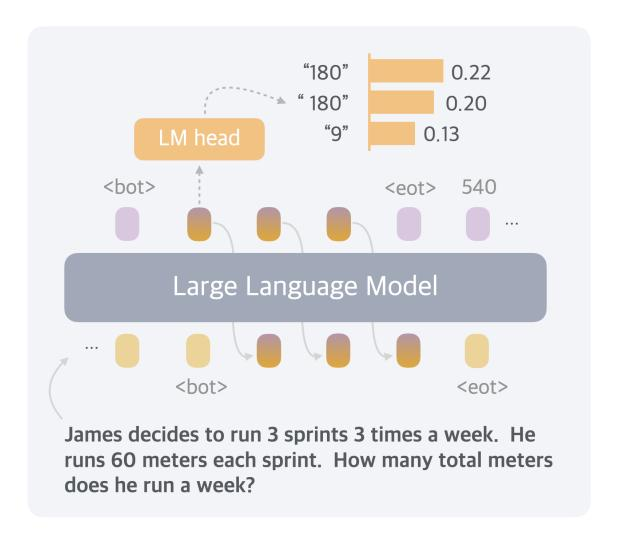

# 5 Empirical Results with Coconut

After analyzing the promising parallel search pattern of Coconut, we validate the feasibility of LLM reasoning in a continuous latent space through more comprehensive experiments, highlighting its better reasoning efficiency over language space,

> **[图片提取文字 (无描述)]:**
> First thoughts Correct 0.6 Incorrect Value 0.4 0.2 0.0 5 Height Second thoughts 0.6

> **[图片提取文字 (无描述)]:**
> Second thoughts 0.6 0.5 0.4 0.3 0.2 0.1 0.0 Height

Figure 7 The correlation between the predicted value of correct/incorrect nodes and their heights.

| Method                                                                       | GSM8k                                            |                          | ProntoQA                                          |                          | ProsQA                                           |                            |
|------------------------------------------------------------------------------|--------------------------------------------------|--------------------------|---------------------------------------------------|--------------------------|--------------------------------------------------|----------------------------|
|                                                                              | Acc. (%)                                         | # Tokens                 | Acc. (%)                                          | # Tokens                 | Acc. (%)                                         | # Tokens                   |
| CoT                                                                          | 42.9 ±0.2                                        | 25.0                     | 98.8 ±0.8                                         | 92.5                     | 77.5 ±1.9                                        | 49.4                       |
| No-CoT iCoT Pause Token                                                | 16.5 ±0.5 30.0∗ 16.4 ±1.8                  | 2.2 2.2 2.2        | 93.8 ±0.7 99.8 ±0.3 77.7 ±21.0              | 3.0 3.0 3.0        | 76.7 ±1.0 98.2 ±0.3 75.9 ±0.7              | 8.2 8.2 8.2          |
| Coconut (Ours) - w/o curriculum - w/o thought - pause as thought | 34.1 ±1.5 14.4 ±0.8 21.6 ±0.5 24.1 ±0.7 | 8.2 8.2 2.3 2.2 | 99.8 ±0.2 52.4 ±0.4 99.9 ±0.1 100.0 ±0.1 | 9.0 9.0 3.0 3.0 | 97.0 ±0.3 76.1 ±0.2 95.5 ±1.1 96.6 ±0.8 | 14.2 14.2 8.2 8.2 |

Table 1 Results on three datasets: GSM8k, ProntoQA and ProsQA. Higher accuracy indicates stronger reasoning ability, while generating fewer tokens indicates better efficiency. ∗The result is from [Deng et al.](#page-11-5) [\(2024\)](#page-11-5).

as well as its potential to enhance the model's expressivity with test-time scaling.

## 5.1 Experimental Setup

Math Reasoning. We use GSM8k [\(Cobbe et al.,](#page-11-6) [2021\)](#page-11-6) as the dataset for math reasoning. It consists of grade school-level math problems. To train the model, we use a synthetic dataset generated by [Deng et al.](#page-11-11) [\(2023\)](#page-11-11). We use two continuous thoughts for each reasoning step (i.e., c = 2). The model goes through 3 stages besides the initial stage. We then include an additional stage where still 3 × c continuous thoughts are used as in the previous stage, but with all the remaining language reasoning chain removed. This handles the long-tail distribution of reasoning chains longer than 3 steps. We train the model for 6 epochs in the initial stage, and 3 epochs in each remaining stage.

Logical Reasoning. Logical reasoning involves the proper application of known conditions to prove or disprove a conclusion using logical rules. We use the ProntoQA [\(Saparov and He,](#page-12-5) [2022\)](#page-12-5) dataset, and our newly proposed ProsQA dataset, which is more challenging due to more distracting branches. We use one continuous thought for every reasoning step (i.e., c = 1). The model goes through 6 training stages in addition to the initial stage, because the maximum number of reasoning steps is 6 in these two datasets. The model then fully reasons with continuous thoughts to solve the problems in the last stage. We train the model for 5 epochs per stage.

For all datasets, after the standard schedule, the model stays in the final training stage, until reaching 50 epochs. We select the checkpoint based on the accuracy on the validation set. For inference, we manually set the number of continuous thoughts to be consistent with their final training stage. We use greedy decoding for all experiments.

#### 5.2 Baselines and Variants of Coconut

We consider the following baselines: (1) CoT, and (2) No-CoT, which were introduced in Section [4.](#page-4-0) (3) iCoT [\(Deng et al.,](#page-11-5) [2024\)](#page-11-5): The model is trained with language reasoning chains and follows a carefully designed schedule that "internalizes" CoT. As the training goes on, tokens at the beginning of the reasoning chain are gradually removed until only the answer remains. During inference, the model directly predicts the answer. (4) Pause token [\(Goyal et al.,](#page-11-10) [2023\)](#page-11-10): The model is trained using only the question and answer without a reasoning chain. However, different from No-CoT, special <pause> tokens are inserted between the question and answer, which provides the model with additional computational capacity to derive the answer. The number of <pause> tokens is set the same as continuous thoughts in Coconut.

We also evaluate some variants of Coconut: (1) w/o curriculum, which directly trains the model in the last stage. The model uses continuous thoughts to solve the whole problem. (2) w/o thought: We keep the multi-stage training, but don't add any continuous latent thoughts. While this is similar to iCoT in the high-level idea, the exact training schedule is set to be consistent with Coconut, instead of iCoT, for a strict comparison. (3) Pause as thought: We use special pause> tokens to replace the continuous thoughts, and apply the same multi-stage training curriculum as COCONUT.

#### 5.3 Results and Discussion

We show the overall results in Table 1. Using continuous thoughts effectively enhances LLM reasoning over the No-CoT baseline. For example, by using 6 continuous thoughts, COCONUT achieves 34.1% accuracy on GSM8k, which significantly outperforms No-CoT (16.5%). We highlight several key findings below.

"Chaining" continuous thoughts enhances reasoning. Language CoT proves to increase the effective depth of LLMs and enhance their expressiveness (Feng et al., 2023). Thus, generating more tokens serves as a way to inference-time scaling for reasoning (Guo et al., 2025; Snell et al., 2024). This desirable property holds naturally for Coconut too. On GSM8k, Coconut outperformed other architectures trained with similar strategies, including Coconut (pause as thought) and Coconut (w/o thought). Particularly, it surpasses the latest baseline iCoT (Deng et al., 2024), which requires a more carefully designed training schedule.

Additionally, we experimented with adjusting the hyperparameter c, which controls the number of latent thoughts corresponding to one language reasoning step (Figure 8, II). As we increased c from 0 to 1 to 2, the model's performance steadily improved. This further validates the potential of continuous thoughts to scale up to harder problems. In two other synthetic tasks, we found that the variants of Coconut (w/o thoughts or pause as thought), and the iCoT baseline also achieve impressive accuracy. This indicates that the model's computational capacity may not be the bottleneck in these tasks. In contrast, GSM8k involves more complex contextual understanding and modeling, placing higher demands on computational capability.

Continuous thoughts are efficient representations of reasoning. Compared to traditional CoT, COCONUT generates fewer tokens while achieving higher accuracy on ProntoQA and ProsQA (Table 1). Although Co-CONUT does not surpass CoT on GSM8k, it offers a superior trade-off between reasoning efficiency and accuracy (Figure 8, I). To illustrate this, we train a series of CoT models that progressively "internalize" (Deng et al., 2024) the initial  $m = \{0, 1, 2, 3, ALL\}$  reasoning steps, and plot their accuracy versus the number of generated tokens (labeled as "language" in the figure). These models quickly lose accuracy as more reasoning steps are skipped. In contrast, by applying Coconut training strategy—replacing each language reasoning step with two continuous thoughts—the accuracy drop is substantially mitigated, maintaining higher performance even when fewer tokens are generated. Another interesting observation is that, when we decode the first continuous thought, it often corresponds to possible intermediate variables in the calculation (Figure 9). This also suggests that the continuous thoughts are more efficient representations of reasoning.

> **[图片提取文字 (无描述)]:**
> (I) Reasoning Efficiency on GSM8k Language 40 Accuracy (%) Continuous 30 20 10 Generated Tokens (II) Coconut on GSM8k 35 Accuracy (%) 30 # Thoughts per step (c)

**Figure 8** Efficiency comparison of reasoning space and COCONUT with different c.

> **[图片提取文字 (无描述)]:**
> "180" 0.22 " 180" 0.20 "9" 0.13 <bot> 540 <eot> Large Language Model <bot> <eot> James decides to run 3 sprints 3 times a week. He runs 60 meters each sprint. How many total meters does he run a week?

**Figure 9** Decoding a continuous thought into language tokens in a math word problem. The decoded tokens correspond to intermediate variables that help solve the problem.

 $^2$ We discuss the case of larger c in Appendix C.1.

The LLM still needs guidance to learn latent reasoning. In the ideal case, the model should learn the most effective continuous thoughts automatically through gradient descent on questions and answers (i.e., COCONUT w/o curriculum). However, from the experimental results, we found the models trained this way do not perform any better than no-CoT.

On the contrary, with the multi-stage curriculum, COCONUT is able to achieve top performance across various tasks. The multi-stage training also integrates well with pause tokens (COCONUT- pause as thought). Despite using the same architecture and similar multi-stage training objectives, we observed a small gap between the performance of iCoT and COCONUT (w/o thoughts). The finer-grained removal schedule (token by token) and a few other tricks in iCoT may ease the training process. We leave combining iCoT and COCONUT as future work. While the multi-stage training used for COCONUT has proven effective, further research is definitely needed to develop better and more general strategies for learning reasoning in latent space, especially without the supervision from language reasoning chains.

### 6 Conclusion

In this paper, we introduce COCONUT, a new paradigm for reasoning in continuous latent space. Experiments demonstrate that COCONUT effectively enhances LLM performance across a variety of reasoning tasks. Reasoning in latent space gives rise to advanced emergent behaviors, where continuous thoughts can represent multiple alternative next steps. This enables the model to perform BFS over possible reasoning paths, rather than prematurely committing to a single deterministic trajectory as in language space CoT reasoning. Further research is needed to refine and scale latent reasoning to pretraining, which could improve generalization across a broader range of reasoning challenges. We hope our findings will spark continued exploration into latent reasoning, ultimately advancing the development of more capable machine reasoning systems.

