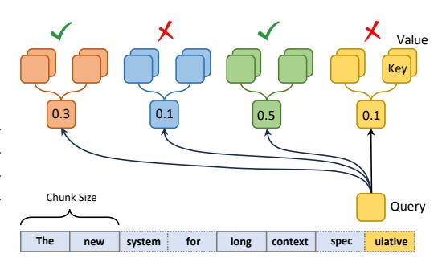
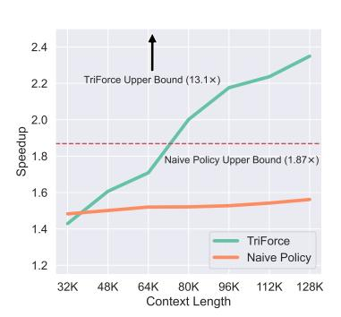
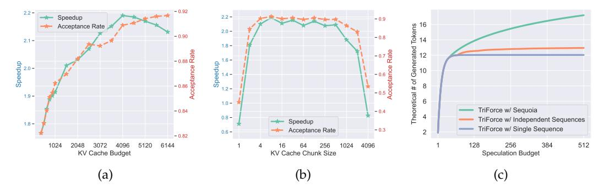

# **4 TRIFORCE**

This section aims to introduce the TRIFORCE, which leverages a retrieval-based KV cache selection policy and a hierarchical speculation system. We first argue that our retrievalbased drafting approach is intuitive and lossless compared to existing strategies such as StreamingLLM and H2O. Subsequently, we introduce the hierarchical system designed to effectively address the dual bottlenecks in speculative decoding, facilitating a substantial improvement in overall speed-up. Finally, TRIFORCE is elaborated in Section [4.3.](#page-6-0)

## <span id="page-5-0"></span>**4.1 Retrieval-based Drafting**

In scenarios requiring long-term contextual dependencies, methods like StreamingLLM and H2O underperform due to their cache updating strategies, which are ineffective at accurately retrieving detailed contextual information because they inevitably and irrecoverably discard KV pairs. In our experiment, we challenge StreamingLLM and H2O with a needle retrieval task [\(Liu et al.,](#page-11-12) [2024b;](#page-11-12) [Peng](#page-12-5) [et al.,](#page-12-5) [2023;](#page-12-5) [Liu et al.,](#page-11-0) [2024a\)](#page-11-0). As detailed in

<span id="page-5-3"></span>> **[图片提取文字 (无描述)]:**
> Value Key 0.3 0.1 0.5 0.1 Chunk Size Query The system for long context spec ulative new


Figure 4: Retrieval-based drafting

Table [1,](#page-5-2) there is a notable drop in their acceptance rates compared to their performance on the PG-19 dataset, highlighting their limitations. Essentially, StreamingLLM and H2O operate on a lossy principle, as evicted tokens are permanently discarded, making them a poor fit for settings requiring the preservation of full KV cache for the target model.

The necessity of keeping the entire KV cache in our settings allows us to select KV cache more freely [\(Singhal et al.,](#page-12-14) [2001\)](#page-12-14). This insight leads us to develop a more effective selection policy for lossless approximations. In our approach, demonstrated in Figure [4,](#page-5-3) KV cache is segmented into small chunks. During the retrieval phase, we calculate the attention between a given query and the average key cache within each chunk. This method effectively highlights the most relevant chunks, enabling us to gather KV cache with a fixed budget based on the scores. As illustrated in Table [1,](#page-5-2) retrieval-based method excels by actively identifying the most crucial information for the task rather than relying on passive and timebased cache management methods. By focusing on relevance over recency, retrieval-based policy demonstrates its potential to handle contextually dense datasets.

<span id="page-5-2"></span>Table 1: Acceptance rates are shown across various tasks, utilizing a 120K context and a 4K budget, while bypassing the initial two layers. There is a notable drop in StreamingLLM and H2O's results on needle retrieval. For reference, Top-K is the theoretical upper bound.

| Method           | Top-K (Ref.) | StreamingLLM | H2O    | Retrieval |
|------------------|--------------|--------------|--------|-----------|
| PG-19            | 0.9921       | 0.9156       | 0.9179 | 0.9649    |
| Needle Retrieval | 0.9989       | 0.0519       | 0.0739 | 0.9878    |

## <span id="page-5-1"></span>**4.2 Hierarchical Speculation**

While addressing the KV cache bottleneck enhances efficiency, the requirement to load whole model weights for drafting reintroduces latency, shifting the bottleneck to model weights again. To tackle this challenge, we implement a hierarchical system, as illustrated in Figure [1.](#page-1-0) This system employs a secondary, lightweight model with StreamingLLM cache to perform initial speculations for the target model with retrieval-based cache (which serves as a draft model for the target model with full KV cache). By establishing this sequential speculation hierarchy, we effectively reduce drafting latency and accelerate overall inference.

**Correctness**: The original output distribution is preserved during the final speculation phase, which is identical to the standard speculative decoding algorithm [\(Leviathan et al.,](#page-11-3) [2023;](#page-11-3) [Chen et al.,](#page-10-3) [2023a\)](#page-10-3), and the proof is trivial.

#### <span id="page-6-0"></span>4.3 Algorithm

TRIFORCE is devised to exploit the bottlenecks associated with both model weights and KV cache to enhance the inference speed of LLMs for long sequence generation. We present the pseudocode for the TRIFORCE in Algorithm 1. It starts by prefilling the target model  $M_p$  with full cache  $C_p$  and draft model  $M_q$  with StreamingLLM cache  $C_q$  using a given input prefix, and then constructs the retrieval cache  $C_r$ . The initialization and update mechanism for the retrieval cache  $C_r$  is guided by the insights of contextual locality discussed in Section 3.2. We first construct  $C_r$  using the last token of the prefix, arranging tokens by the descending order of importance. In subsequent inferences, we overwrite tokens with the least importance, maintaining the relevance and utility of the cache. A reconstruction of  $C_r$  is triggered either when the rolling average acceptance rate drops below a threshold or at a designed stride.

The inference progresses iteratively until it reaches the target sequence length T. After each iteration, cache  $C_r$  and  $C_q$  are updated to prepare for the subsequent speculation phase. Each iteration encompasses two speculations: initially,  $M_q$  utilizes  $C_q$  to predict  $M_p$  with  $C_r$  for  $\gamma_1$  steps until  $n \geq \gamma_2$ . Subsequently, these n tokens are self-verified (Zhang et al., 2023) by  $M_p$  with  $C_p$ . This process constructs a hierarchy: the first layer of hierarchy employs a smaller, faster model  $M_q$  with local context  $C_q$  to speculate the large model  $M_p$  with partial but high-quality global context  $C_r$ , addressing the model weights bottleneck. The second layer utilizes model  $M_p$  with retrieval cache for self-speculation, overcoming the bottleneck caused by KV cache. This hierarchical speculation algorithm boosts efficiency by effectively addressing both bottlenecks. System implementation is detailed in Appendix A.

### <span id="page-6-1"></span>**Algorithm 1 ▲**TRIFORCE

```
1: Input: Prefix [x_1, \dots, x_t], target model M_p with full cache C_p, draft model M_q with
     StreamingLLM cache C_q, target sequence length T, speculation length \gamma_1, \gamma_2, drafting
     phase DRAFT, verification phase VERIFY, and correction phase CORRECT;
 2: Initialize: Prefill M_p, M_q, construct retrieval cache C_r using x_t, N \leftarrow t
 3: while N < T do
          n \leftarrow 0
 4:
          while n < \gamma_2 do
 5:
 6:
               Set q_1, \dots, q_{\gamma_1} \leftarrow \text{DRAFT}(M_q, C_q, x_{\leq N})
                                                                               \rightharpoonup Run M_q with eviction cache C_q
 7:
               Sample \tilde{x}_i \sim q_i, i = 1, \cdots, \gamma_1
 8:
               Set \hat{p}_1, \dots, \hat{p}_{\gamma_1+1} \leftarrow M_p(C_r, x_{\leq N}, \tilde{x}_{\leq \gamma_1}) \triangleright Run M_p with retrieval cache C_r
 9:
               for i = 1 to \gamma_1 do
10:
                   if VERIFY(\tilde{x}_i, q_i, \hat{p}_i) then
11:
                        \hat{x}_{n+i} \leftarrow \tilde{x}_i and n \leftarrow n+1
12:
                        \hat{x}_{n+i} \leftarrow \text{CORRECT}(q_i, \hat{p}_i) \text{ and } n \leftarrow n+1
                        Break
15:
                    end if
               end for
16:
17:
               If all drafted tokens are accepted, sample next token \hat{x}_{n+1} \sim \hat{p}_{\gamma_1+1} and n \leftarrow n+1
18:
19:
          Collect \hat{p}_1, \dots, \hat{p}_n for \hat{x}_1, \dots, \hat{x}_n
          Set p_1, \dots, p_{n+1} \leftarrow M_p(C_p, x_{\leq N}, \hat{x}_{\leq n})
20:
                                                                                      \triangleright Run M_p with full cache C_p
          for i = 1 to n do
21:
22:
               if VERIFY(\hat{x}_i, \hat{p}_i, p_i) then
23:
                    x_{N+i} \leftarrow \hat{x}_i and N \leftarrow N+1
24:
25:
                    x_{N+i} \leftarrow \text{CORRECT}(\hat{p}_i, p_i) \text{ and } N \leftarrow N+1
26:
27:
               end if
28:
          end for
29:
          If all drafted tokens are accepted, sample next token x_{N+1} \sim p_{n+1} and N \leftarrow N+1
          Update C_r, C_q based on the accepted tokens \triangleright Update KV cache for the next iteration
30:
31: end while
```

<span id="page-7-1"></span>Table 2: **On-chip results (A100)**: We indicate the average acceptance rate in parentheses alongside the speedup factor. T means sampling temperature. In the A100 on-chip experiments, with a prompt length of 122K, and a generation length of 256, we evaluate TRIFORCE against the JF68M model with StreamingLLM cache (Naive Policy). The results clearly demonstrate that TRIFORCE significantly surpasses its performance.

| Method                    | T   | Speedup                | Naive Policy           |
|---------------------------|-----|------------------------|------------------------|
| TriForce                  | 0.0 | <b>2.31</b> × (0.9234) | $1.56 \times (0.4649)$ |
| TriForce                  | 0.2 | <b>2.25</b> × (0.9203) | $1.54 \times (0.4452)$ |
| Triforce                  | 0.4 | $2.20 \times (0.9142)$ | $1.47 \times (0.4256)$ |
| Triforce                  | 0.6 | <b>2.19</b> × (0.9137) | $1.42 \times (0.4036)$ |
| TriForce                  | 0.8 | $2.08 \times (0.8986)$ | $1.34 \times (0.3131)$ |
| Triforce                  | 1.0 | $2.08 \times (0.9004)$ | $1.29 \times (0.2872)$ |
| TriForce                  | 1.2 | $2.02 \times (0.8902)$ | $1.27 \times (0.2664)$ |
| Retrieval w/o Hierarchy   | 0.6 | 1.80× (0.9126)         | -                      |
| StreamingLLM w/ Hierarchy | 0.6 | $1.90 \times (0.8745)$ | -                      |

<span id="page-7-2"></span>Table 3: **Offloading results (RTX 4090)**: We present latency comparison between TRIFORCE and Auto-regressive (AR) baseline for various models on different GPU setups. The sampling temperature is set to 0.6. The results indicate that TRIFORCE achieves significant speedups across a range of models and hardware configurations. The entries marked with an asterisk represent the baseline using DeepSpeed-ZeRO-Inference (Aminabadi et al., 2022).

| GPUs                 | Target Model       | TRIFORCE (ms) | AR (ms) | Speedup       |
|----------------------|--------------------|---------------|---------|---------------|
| 2× RTX 4090s         | Llama2-7B-128K     | 108           | 840     | 7.78×         |
| $2 \times RTX 4090s$ | LWM-Text-Chat-128K | 114           | 840     | $7.37 \times$ |
| $2 \times RTX 4090s$ | Llama2-13B-128K    | 226           | 1794    | $7.94 \times$ |
| 1× RTX 4090          | Llama2-7B-128K     | 312           | 1516*   | $4.86 \times$ |
| $1 \times RTX 4090$  | LWM-Text-Chat-128K | 314           | 1516*   | $4.83 \times$ |

## <span id="page-7-0"></span>5 Empirical Evaluation

In this section, our goal is to showcase the capabilities of TRIFORCE, a scalable and robust speculative decoding algorithm designed to expedite the inference of LLMs for long sequence generation, which significantly reduces the wall-clock time. We first present our end-to-end system, highlighting the overall speedup achieved, including both on-chip and offloading settings, followed by a comparison with other methods and ablation experiments.

#### 5.1 End-to-end Results

We demonstrate that TRIFORCE accelerates long sequence generation, up to  $2.31 \times$  on an A100 in the on-chip setting and  $7.78 \times$  on two RTX 4090s with offloading for Llama2-7B-128K.

**Setup.** Our experiments are based on Llama2 and LWM models with 128K context window size (Touvron et al., 2023; Liu et al., 2024a; Peng et al., 2023), which serve as our target models. In this setup, we utilize a 4K retrieval cache as an intermediate draft cache in our hierarchical system, while leveraging the JackFram/Llama68M (JF68M) (Miao et al., 2023) model as the initial draft model. For experiments involving offloading, we aim to maximize memory utilization by filling it up as much as possible and offloading the remaining KV cache to the CPU (AMD EPYC 9754 @ 2.25 GHz), while keeping the model weights on the GPU. Our evaluation is carried out on the PG-19 (Rae et al., 2019) and NarrativeQA (Kočiský et al., 2018) dataset, each testing on 100 examples, configured to a prompt length of 122K for on-chip settings and 127K for offloading settings, and aiming for a generation of 256 tokens. The performance of TRIFORCE is analyzed across various hardware configurations, including on-chip experiments on an A100, and offloading experiments on RTX 4090 GPUs.

**Naive Policy.** Since it is hard to train a draft model with long contexts, we consider JF68M with StreamingLLM cache as a naive policy approach, and its budget is set to 1K. Additionally, we experiment with various temperatures to test its robustness.

**Main Results.** We evaluate TRIFORCE using different temperatures, as depicted in Table 2. We observe that TRIFORCE reaches up to 2.31× speedup for the on-chip setting with a minimal 4K KV cache budget for Llama2-7B-128K. For offloading settings, we provide end-to-end results on consumer GPUs for more models, including Llama2-7B-128K, Llama2-13B-128K, and LWM-Text-Chat-128K. Remarkably, in Table 3 we demonstrate that TRIFORCE can efficiently serve a Llama2-13B with 128K contexts on two RTX 4090s, reaching an average time between tokens as low as 0.226 seconds, which is 7.94× faster than a highly optimized offloading system. Moreover, with TRIFORCE, Llama2-7B-128K can be served with 0.108s/token—only half as slow as the auto-regressive baseline on an A100. We

<span id="page-8-1"></span>> **[图片提取文字 (无描述)]:**
> 2.4 TriForce Upper Bound (13.1×) 2.2 2.0 Speedup 1.8 Naive Policy Upper Bound (1.87×) 1.6 1.4 TriForce Naive Policy 1.2 32K 48K 64K 80K 96K 112K 128K Context Length


Llama2-7B-128K can be served with 0.108s/token—only Figure 5: TRIFORCE's excellent half as slow as the auto-regressive baseline on an A100. We also illustrate how TRIFORCE boosts the efficiency of batched inference, a more frequently employed setting in real-world model serving. TRIFORCE achieves  $1.9\times$  for a batch size of six, with each sample in the batch having 19K contexts, which is demonstrated in Table 4.

<span id="page-8-0"></span>Table 4: **Batching results (A100)**: TRIFORCE showcases its exceptional capability in efficiently handling large batch sizes, consistently exceeding the performance of the JF68M model with StreamingLLM cache across all configurations for Llama2-7B-128K.

| Batch    | Budget   | T   | Speedup       | Naive Policy  |
|----------|----------|-----|---------------|---------------|
| (2,56K)  | (2,1024) | 0.0 | 1.89×         | 1.46×         |
| (2,56K)  | (2,1024) | 0.6 | $1.75 \times$ | $1.35 \times$ |
| (6,19K)  | (6,768)  | 0.0 | $1.90 \times$ | $1.39 \times$ |
| (6,19K)  | (6,768)  | 0.6 | $1.76 \times$ | $1.28 \times$ |
| (10,12K) | (10,768) | 0.0 | $1.72 \times$ | $1.34 \times$ |
| (10,12K) | (10,768) | 0.6 | <b>1.61</b> × | 1.21×         |

**Analysis.** (1) Effectiveness: TRIFORCE's integration of the hierarchical system significantly enhances speedup, with TRIFORCE showing marked improvements over both the StreamingLLM method with hierarchical speculation and retrieval method without the hierarchical system. (2) Scalability: As depicted in Figure 5, TRIFORCE demonstrates excellent scalability with longer context lengths. This scalability is attributed to its high acceptance rate and the growing gap between the draft and the target model's latencies. Theoretically, TRIFORCE could achieve a speedup of up to  $13.1 \times ,7$  times higher than the naive policy, underscoring its significant scaling potential. (3) Robustness: Unlike vanilla speculative decoding methods, TRIFORCE maintains relatively consistent performance across various temperature settings. It exhibits less temperature sensitivity, maintaining an acceptance rate above 0.9 even when the temperature is set to 1.0, highlighting its stability and reliability.

#### 5.2 Comparison with Other Methods

We provide a comparison with REST (He et al., 2023) and Skipping Layers (Zhang et al., 2023). Table 5 compares TRIFORCE, REST, and Skipping Layers with Llama2-7B-128K on an A100 using PG-19 dataset, showing TRIFORCE achieves the best speedup for long sequence generation.

<span id="page-8-2"></span>

| Method          | Speedup       |
|-----------------|---------------|
| TriForce        | 2.31×         |
| REST            | $1.47 \times$ |
| Skipping Layers | 1.36×         |

Table 5: Speedup comparison TRIFORCE retrieves information from the KV cache, alwith REST and Skipping Layers lowing dynamic adaptation to contexts, while REST uses an external predefined datastore. In Table 5, Skipping Layers utilizes 68% of the KV cache, whereas TRIFORCE efficiently uses only 3%, addressing the bottleneck in long-context scenarios better.

<span id="page-9-0"></span>> **[图片提取文字 (无描述)]:**
> - 0.92 2.2 -Speedup -0.9 Tokens 14 Acceptance Rate 2.0 --0.90-0.8 2.1 -1.8 of Generated of Control - 88.0 dnpeeds 1.2 dnpaeds Theoretical # 1.9 -1.0 -TriForce w/ Sequoia -0.4 -0.840.8 -TriForce w/ Independent Sequences Speedup 1.8 -TriForce w/ Single Sequence Acceptance Rate - 0.3 0.6 -- 0.82 512 1024 2048 3072 4096 5120 6144 64 256 1024 4096 128 256 384 KV Cache Chunk Size KV Cache Budget Speculation Budget (a) (c)


Figure 6: (a) Analyzing speedup and acceptance rates across different KV cache budgets reveals that a 4K budget is optimal, balancing acceptance rates and the drafting overhead. (b) For a 4K KV cache budget, excessively small chunk sizes may overfit individual tokens, while overly large chunk sizes could limit selection diversity. (c) TRIFORCE is compatible with tree-based speculations, enhancing the theoretical average number of tokens generated per decoding step of the target model by employing larger speculation budgets.

#### 5.3 Ablation Results

We present extensive ablation studies of TRIFORCE, focusing on three key points: (1) the influence of different KV cache budgets, (2) the impact of chunk size selection, and (3) TRIFORCE's compatibility with tree-based speculative decoding.

#### 5.3.1 KV Cache Budget

As illustrated in Figure 6a, for Llama2-7B-128K, the acceptance rate rises with the cache budget up to 4K, then plateaus towards 1.0. This suggests that increasing the cache size beyond 4K offers diminishing benefits due to drafting latency. Thus, a 4K KV cache budget is optimal for TRIFORCE, balancing high acceptance rates and minimal drafting overhead.

#### 5.3.2 KV Cache Chunk Size

Since we utilize contextual locality to reuse the retrieval cache, we need to examine the impact of KV cache chunk size on performance. Figure 6b shows that smaller chunks may overfit to single tokens, limiting generalization, while larger chunks may dilute high-score tokens with low-score ones, resulting in reduced differentiation among chunks. Large chunks also reduce selection flexibility, constraining diversity within a fixed cache budget.

## 5.3.3 Compatibility with Tree-based Speculative Decoding

We explore the possibility of integrating TRIFORCE with tree-based speculative decoding. Specifically, for Llama2-7B-128K on an A100, we estimate the theoretical number of generated tokens when TRIFORCE is combined with tree structures, including Sequoia (Chen et al., 2024) and Independent Sequences. As depicted in Figure 6c, this integration can potentially improve the end-to-end speedup by utilizing additional speculation budgets.

#### 6 Conclusion

In this work, we introduced TRIFORCE, a hierarchical speculative decoding system aimed at significantly enhancing the efficiency of serving LLMs with long contexts. Leveraging insights from attention sparsity and contextual locality, TRIFORCE mitigates the dual bottlenecks associated with KV cache and model weights. Our empirical experiments demonstrate TRIFORCE's remarkable performance, including a notable speedup of up to  $2.31\times$  on an A100 and  $7.78\times$  on two RTX 4090s with offloading, achieving 0.108s/token—only half as slow as the auto-regressive baseline on an A100. These achievements illustrate TRIFORCE's potential to revolutionize the serving of long-context models for long sequence generation.

