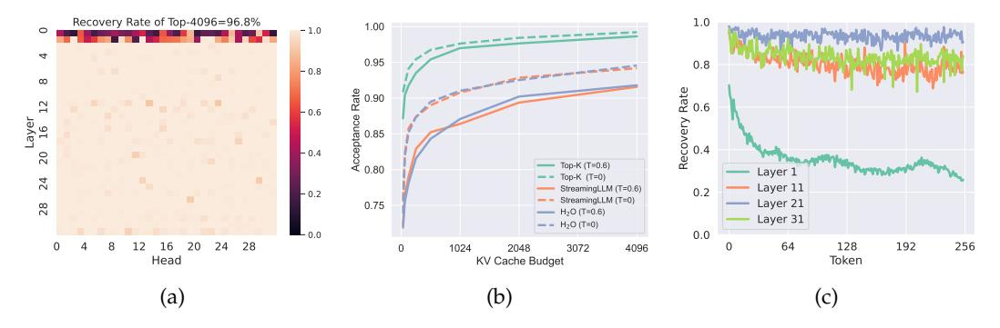

# **▲**TRIFORCE: Lossless Acceleration of Long Sequence Generation with Hierarchical Speculative Decoding

Hanshi Sun1, Zhuoming Chen1, Xinyu Yang1, Yuandong Tian2, Beidi Chen1,2
1Carnegie Mellon Univeristy
2Meta AI (FAIR)
{hanshis, zhuominc, xinyuya2, beidic}@andrew.cmu.edu
yuandong@meta.com

#### **Abstract**

With large language models (LLMs) widely deployed in long content generation recently, there has emerged an increasing demand for efficient long-sequence inference support. However, key-value (KV) cache, which is stored to avoid re-computation, has emerged as a critical bottleneck by growing linearly in size with the sequence length. Due to the autoregressive nature of LLMs, the entire KV cache will be loaded for every generated token, resulting in low utilization of computational cores and high latency. While various compression methods for KV cache have been proposed to alleviate this issue, they suffer from degradation in generation quality. We introduce TRIFORCE, a hierarchical speculative decoding system that is scalable for long sequence generation. This approach leverages the original model weights and dynamic sparse KV cache via retrieval as a draft model, which serves as an intermediate layer in the hierarchy and is further speculated by a smaller model to reduce its drafting latency. TRI-FORCE not only facilitates impressive speedups for Llama2-7B-128K, achieving up to 2.31× on an A100 GPU but also showcases scalability in handling even longer contexts. For the offloading setting on two RTX 4090 GPUs, TRIFORCE achieves 0.108s/token—only half as slow as the auto-regressive baseline on an A100, which attains 7.78× on our optimized offloading system. Additionally, TRIFORCE performs 4.86× than DeepSpeed-Zero-Inference on a single RTX 4090 GPU. TRIFORCE's robustness is highlighted by its consistently outstanding performance across various temperatures. The code is available at https://github.com/Infini-AI-Lab/TriForce.

## 1 Introduction

Large language models (LLMs) with long-context capability, such as GPT-4 (Achiam et al., 2023), Gemini (Team et al., 2023), and LWM (Liu et al., 2024a) continue to emerge and gain proficient application in scenarios including chatbots, vision generation, and financial analysis (Touvron et al., 2023; Chowdhery et al., 2023; Zhao et al., 2023; Reddy et al., 2024). However, losslessly serving these LLMs efficiently is challenging. Because of the autoregressive nature of LLMs, the entire key-value (KV) cache, which stores intermediate key-value states from previous contexts to avoid re-computation, together with model parameters will be loaded into GPU SRAM for every token generated, resulting in low utilization of computational cores. In addition to the large volume of model parameters, the memory footprint of KV cache, which grows linearly with sequence length (Pope et al., 2023), is emerging as a new bottleneck for long sequence generation.

Recent methodologies have proposed KV cache eviction strategies (Xiao et al., 2023b; Zhang et al., 2024b; Liu et al., 2024c; Jiang et al., 2023; Ge et al., 2023) to mitigate the substantial memory footprint of KV cache, which selectively discard KV pairs from the cache based on a designed eviction policy, allowing models to generate texts with a limited KV cache budget. However, considering that discarded KV pairs cannot be restored and the difficulty in

> **[图片提取文字 (无描述)]:**
> [token]: context tokens ulative system for long context spec [token]: accepted tokens [token]: rejected tokens Draft y1 steps repeatedly Speculation Phase 1:  $\gamma_1 = 2$ [token]: tokens sampled from verification phase to generate  $\geq \gamma_2$  tokens:  $[x_1, x_2, ..., x_n]$   $(n \ge \gamma_2)$ Llama-68M + StreamingLLM Cache 0,8 dec 150MB, 0.45ms **Draft Model** dec oding with significantly dec oding significantly enh acaes the Accuracy 9 dec oding significantly enh ances the quality model Further verify Target Model Llama2-7B-128K + Partial Cache  $[x_1, x_2, ..., x_n]$ Speculation Phase 2:  $\gamma_2 = 6$ 0.4 16GB, 14ms Retrieval Cache TriForce Full Cache 0.2 StreamingLLM dec Llama2-7B-128K + Full Cache Target Model (2) - H2O dec oding significantly enh ances the model inference 0.0 78GB, 56ms Full KV Cache 🤗 20 Latency (ms) Return: dec oding significantly enh ances the inference

Figure 1: **Left**: TRIFORCE employs retrieval-based drafting and hierarchical speculation to effectively address the dual bottlenecks. It integrates two models and three caches, comprising a draft model, a target model, a StreamingLLM cache for the draft model, alongside a retrieval cache and a full cache for the target model. The process initiates by repeatedly drafting for  $\gamma_1$  steps, assisting the target model with retrieved partial KV cache in generating over  $\gamma_2$  tokens, which will be further verified by the target model using full KV cache. **Right**: Evaluating the Llama2-7B-128K on a needle retrieval task indicates that KV cache eviction-based methods, such as StreamingLLM, require a trade-off between latency and accuracy. In contrast, our TRIFORCE maintains low latency without sacrificing accuracy.

precisely foreseeing which KV pairs will be crucial for future text generation, they struggle with potential information loss, including hallucination and contextual incoherency (Yang et al., 2024), particularly in long contexts. Such challenges prevent these approaches from boosting speed without sacrificing the performance of models, as illustrated in Figure 1.

Concurrently, speculative decoding, which leverages a lightweight draft model to sequentially predict the next few tokens and let the target model verify the predicted tokens in parallel, is introduced to accelerate LLM inference while provably precisely preserving model output (Leviathan et al., 2023; Chen et al., 2023a; Xia et al., 2024). Nonetheless, deploying it for long sequence generation faces several challenges. First, training draft models to match the context length of target LLMs requires massive computation and it remains questionable whether these small models can achieve the same accuracy with a context length around 1M (Beltagy et al., 2020; Peng et al., 2023; Yan et al., 2024). Second, we found that draft models with existing training-free methods (e.g., KV cache eviction strategies) can result in poor speculating performance. A continuously increasing divergence (Leviathan et al., 2023) is witnessed as the sequence length increases, as shown in Figure 2a.

In pursuit of lossless acceleration, we utilize the lossless feature of speculative decoding as the foundation of our system. An ideal speculative decoding algorithm should (i) be training-free, (ii) maintain a high acceptance rate (Leviathan et al., 2023) with long contexts, and (iii) have low-cost drafting. However, two technical challenges need to be addressed to achieve the goal. First, it is not immediately apparent what we can use for low-latency drafting without training a smaller draft model to match the long context length. Second, the key factors for attaining a high acceptance rate with long contexts remain unclear.

Fortunately, based on our preliminary exploration, three key observations pave the way for designing an applicable system for serving LLMs with long contexts.

Hierarchical Speculation for Dual Memory Bottlenecks: As illustrated in Figures 2b and 2c, we recognize two memory bottlenecks: model weights and KV cache, and the latter gradually becomes the dominant bottleneck as context length increases. This inspires us to apply hierarchical speculation to tackle the two bottlenecks sequentially by different draft models.

<u>Leveraging Attention Sparsity for Speculative Decoding</u>: We identify considerable redundancy within KV cache, finding that a relatively small portion of it is sufficient to achieve a high acceptance rate by using partial KV cache as a draft cache for self-speculation.

*Exploiting Contextual Locality for Drafting Efficiency*: We discover that the information from long context tokens needed by adjacent tokens tends to be similar. This observation suggests

> **[图片提取文字 (无描述)]:**
> 80 0.625 Llama2-7B (batch size=1) KV Cache Model Weights Llama2-7B (batch size=4) 70 Occupancy Rate 0.600 Llama2-13B (batch size=1) Natural Divergence DL 0.525 0.525 0.500 60 Llama2-13B (batch size=4) 6PU HBM V Cache 0.4 30 20 Sliding-window JF68M and Llama2-7B-128K (T=0.6) 0.475 Sliding-window JF68M and Llama2-7B-128K (T=0.8) 10 StreamingLLM JF68M and Llama2-7B-128K (T=0.6) StreamingLLM JF68M and Llama2-7B-128K (T=0.8) 0.450 0.0 128 512 2048 8192 32768 1K 2K 4K 16K 32K 64K 128K 4K 8K 16K 32K 64K 128K 8K Context Length Context Length Context Length (a) (b) (c)

Figure 2: (a) A continuously increasing natural divergence (Leviathan et al., 2023) between the draft model with StreamingLLM or Sliding-window with Re-computation and Llama2-7B-128K is witnessed as the sequence length increases, indicating a falling acceptance rate for speculative decoding with longer contexts. Additionally, temperature sensitivity signals a lack of robustness. (b) Compared with model weights, KV cache gradually becomes another bottleneck with long contexts. (c) KV cache occupies most of the memory as the context length increases.

that a specific segment of the cache can be effectively reused across multiple decoding steps, amortizing the overhead of constructing draft cache and enhancing drafting efficiency.

Building on these insights, we introduce a hierarchical speculation approach. For a long-context target model (e.g., Llama2-7B-128K (Peng et al., 2023)), we leverage the original model weights but only with a small proportion (e.g., 3%) of KV cache as a draft to tackle the bottleneck of KV cache. Hierarchically, the draft model is further speculated by a lightweight model (e.g., Llama-68M) with StreamingLLM cache to address the bottleneck of model weights. We present TRIFORCE, depicted in Figure 1, a scalable and robust speculative decoding system that integrates retrieval-based drafting and hierarchical speculation, optimized for both on-chip and offloading scenarios. Specifically,

- In Section 4.1, by maintaining the full cache, we gain the flexibility to select KV pairs, allowing us to devise a superior selection method, termed retrieval-based drafting. This strategy retrieves required context information for future needs, which is characterized as lossless, particularly in comparison to eviction-based methods such as StreamingLLM and H2O. We further demonstrated its effectiveness and robustness on different datasets.
- In Section 4.2, we propose a hierarchical system to address the dual memory bottlenecks. Using a lightweight model paired with a StreamingLLM cache for initial speculations, we can reduce the drafting latency for the subsequent speculation stage, thereby accelerating end-to-end inference.

Empirically, in Section 5, we perform extensive experiments and ablation studies to demonstrate the effectiveness of TRIFORCE. We show that TRIFORCE achieves up to  $2.31\times$  speedup for Llama2-7B-128K on a single A100 GPU on top of Hugging Face (Wolf et al., 2019) with CUDA graphs (NVIDIA & Fitzek, 2020). For the offloading setting, TRIFORCE attains an impressive  $7.78\times$  on two RTX 4090 GPUs, reaching  $0.108\,$ s/token—only half as slow as the auto-regressive baseline on an A100. TRIFORCE can efficiently serve a Llama2-13B with 128K contexts with 0.226s/token, which is  $7.94\times$  faster on our optimized offloading system. On a single RTX 4090 GPU, TRIFORCE is  $4.86\times$  faster than DeepSpeed-Zero-Inference (Aminabadi et al., 2022)  $^1$ . Further, we show that: (i) TRIFORCE has a theoretical  $13.1\times$  upper bound, demonstrating exceptional scalability when dealing with long contexts; (ii) TRIFORCE is robust across various temperature settings, maintaining an acceptance rate above 0.9 even for a temperature of 1.0; and (iii) TRIFORCE's ability to efficiently process large batches, achieving a  $1.9\times$  speedup for a batch size of six with 19K contexts per sample.

&lt;sup>1The official implementation of DeepSpeed-ZeRO-Inference (Aminabadi et al., 2022) with KV cache offloading currently only supports a single GPU, which computes attention on CPU. Our offloading system transfers KV cache from CPU to GPU, benefiting from Tensor Parallelism.

## 2 Background

## 2.1 Speculative Decoding

Speculative decoding (Stern et al., 2018; Leviathan et al., 2023; Chen et al., 2023a; Kim et al., 2024; Zhang et al., 2023; Santilli et al., 2023; Hooper et al., 2023) is featured by accelerating LLM decoding while precisely maintaining the model's output distribution. As the speed of the auto-regressive decoding process is mainly bound by the time for loading model weights and KV cache to GPU SRAM, speculative decoding leverages the observation that generating one token takes the same time as processing tens of tokens in parallel. Tree-based speculation methods are proposed to fully utilize the speculation budget (Fu et al., 2024; Li et al., 2024). Instead of making one prediction for the next token, tree-based methods leverage multiple candidates to boost the acceptance rate so that more tokens can get accepted (Miao et al., 2023; Sun et al., 2024; Chen et al., 2024). Staged speculation techniques (Spector & Re, 2023; Chen et al., 2023b) have been suggested to further accelerate inference by using a cascade of draft models, and hierarchical speculation shares similarities with these approaches. However, our method focuses on long sequence generation tasks, which presents unique challenges. We use different drafting methods for each speculation phase to address two distinct bottlenecks in long-context scenarios, instead of focusing on model weights at every stage for acceleration. Meanwhile, self-speculation approaches such as Medusa (Cai et al., 2024; Ankner et al., 2024), which are orthogonal to our method, require training efforts and can be integrated into our intermediate draft model.

#### 2.2 KV Cache Eviction Strategies

**StreamingLLM** (Xiao et al., 2023b) addresses the limitations of window attention and sliding window with re-computation by presenting a straightforward yet effective method that allows LLMs to handle infinitely long text sequences without fine-tuning. StreamingLLM stabilizes the performance by retaining critical attention sink tokens together with recent KV for attention computation. By prioritizing sink tokens, StreamingLLM ensures the attention score distribution remains stable, promoting consistent language modeling for long texts.

 $H_2O$  (Zhang et al., 2024b) introduces a greedy but low-cost approach to processing infinite-length input streams, inspired by a simplified version of the heavy-hitters ( $H_2$ ) eviction policy. This method dynamically updates the KV cache based on the cumulative attention scores, systematically removing the least critical KV to maintain a fixed cache size. By leveraging a greedy algorithm based on local statistics,  $H_2O$  effectively selects which KV pairs to preserve in the cache, ensuring efficient inference without compromising quality.

However, it is important to recognize that these techniques do not increase the context window size (Zhang et al., 2024a; Jin et al., 2024; Ge et al., 2023; Jiang et al., 2023). They focus on retaining only the most recent tokens along with either attention sinks or heavy-hitters, while discarding other tokens. These approaches limit the model to processing based on their designed eviction policies and recent tokens. Consequently, they might not be directly applicable to tasks that demand comprehensive, long-context understanding.

#### 2.3 KV Cache Quantization

Several approaches to KV cache quantization have been introduced to enhance the efficiency of inference for long sequence generation, aiming to maintain generation quality while reducing the memory consumption (Xiao et al., 2023a; Hooper et al., 2024; Sheng et al., 2023; Liu et al., 2023a; Zirui Liu et al., 2023; Yue et al., 2024). Quantization methods focus on compressing the bit width of KV cache activations, which is orthogonal to our approach.

#### 3 Observation

Our design of TRIFORCE is inspired by two critical empirical observations regarding LLMs when dealing with long contexts, detailed as follows.

> **[图片提取文字 (无描述)]:**
> Recovery Rate of Top-4096=96.8% 1.0 - 1.0 1.00 0 4 0.95 0.8 - 0.8  $\infty$ Recovery Rate 0 0 5 9 Acceptance Rate 12 - 0.6 Layer 16 - 0.4 20 Top-K (T=0.6) Layer 1 Top-K (T=0) 24 Layer 11 StreamingLLM (T=0.6) 0.2 -0.2-- StreamingLLM (T=0) 0.75 Layer 21 28 — H2O (T=0.6) Layer 31 - - H2O (T=0) 0.0 0 192 16 20 24 64 128 256 8 1024 2048 3072 0 4096 Head Token KV Cache Budget (a) (b) (c)

Figure 3: (a) The Llama2-7B-128K model demonstrates significant attention sparsity with a 120K context. Apart from the first two layers, the rest exhibit significant sparsity. (b) We can utilize partial KV cache and whole model weights to perform self-speculation. High acceptance rates are attainable using existing methods with a limited budget. (c) A notable degree of locality is observed in most layers, which gradually diminishes as context evolves.

#### 3.1 Leveraging Attention Sparsity for Speculative Decoding

**Observation** The phenomenon of attention sparsity in pre-trained LLMs has been discovered by numerous studies (Zhang et al., 2024b; Xiao et al., 2023b; Liu et al., 2023b; 2024c). In our study, we conduct zero-shot inference on the PG-19 test set (Rae et al., 2019) with Llama2-7B-128K model. By visualizing the sparsity across different attention heads, demonstrated in Figure 3a, we observe that with a context length of 120K, it is possible to recover over 96% of the attention score with merely 4K tokens across almost all layers.

**Analysis** The presence of sparsity within the attention blocks suggests that a fraction of KV cache could serve as a draft cache to attain a high acceptance rate during self-speculative decoding. Since KV cache is the bottleneck under this setting, we can load whole model weights with partial KV cache as a draft model. Figure 3b demonstrates that utilizing only 1K tokens could theoretically achieve a 97.6% acceptance rate with Top-K selection method. While this scenario represents an optimal theoretical upper bound, practical implementations like  $\rm H_2O$  and StreamingLLM exhibit promising results, achieving over 90.5% acceptance rates with 1K KV cache budget. It should be noted that we maintain a full cache for the initial two layers for illustration purposes, while no layers are skipped in our practical system implementation for efficiency.

## 3.2 Exploiting Contextual Locality for Drafting Efficiency

**Observation** Our exploration reveals that the information from long context tokens needed by adjacent tokens tends to be similar. In our experiments, with the context length established at 120K, we instruct the model to generate 256 tokens. By choosing the top-4K indices according to the attention score of the last prefilled token, we use these indices to gather the attention scores for the subsequently generated tokens and assess the score's recovery rate for the initially prefilled 120K tokens. As shown in Figure 3c, it leads to high recovery across almost all layers and a slowly decreasing trend as the number of tokens increases.

**Insights** This observation allows for a single construction of the cache to suffice for multiple decoding steps, thereby amortizing the latency of constructing draft cache and boosting efficiency. As new KV cache are introduced, guided by the understanding that recent words are more strongly correlated with the tokens currently being decoded, these entries will replace the less significant ones. Cache re-building operations can be scheduled at regular intervals or adaptively in response to a drop in the acceptance rate, which ensures that the cache remains dynamically aligned with the evolving context. Notably, both StreamingLLM and H2O incorporate this principle implicitly. H2O consistently retains tokens with high scores, and StreamingLLM reuses extensive local information and sink tokens, which both reduce the necessity for complete cache reconstruction.

