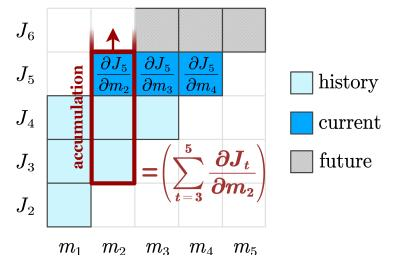

# 2 Related Works

Memory-Enhanced Transformers. Recent studies highlight memory-enhanced transformers for long text extrapolation. Pioneering work, RMT [\[20\]](#page-9-6), combines RNN with transformer for segment-level recurrence. AutoCompressor [\[21\]](#page-9-7) improves this by using a fully-connected RNN, though its LongBench [\[5\]](#page-8-4) performance can be enhanced. Activation Beacon [\[23\]](#page-9-9) introduces two key improvements of direct migration of memory activation from the encoder to the decoder and a dedicated multi-head attention (MHA) module for memory. The BABILong [\[24\]](#page-9-10) study shows that the GPT-2 [\[25\]](#page-9-11) + RMT model outperforms advanced models like GPT-4 [\[26\]](#page-9-12) and GPT-3.5 in handling extensive contextual information, underscoring the potential of memory-enhanced transformers.

Context Distillation. Context distillation has emerged as an effective approach for knowledge compression and transfer. Early studies, such as Wingate's research [27], focus on compressing prompts by replacing them with shorter learnable prompts. This method laid the foundation for subsequent research. Gist Tokens [22] advances this concept by training general-purpose summary tokens, allowing prompt compression without separate training. We utilize a similar approach with learnable prompts for context compression. The ICAE [28] model builds upon Gist Tokens, incorporating LoRA fine-tuning and an auto-encoding task for training. With a four-times compression ratio, ICAE demonstrates near-perfect input reconstruction accuracy.

**Unbiased BPTT Approximation**. Training RNNs often relies on the resource-intensive Back-Propagation Through Time method (BPTT) [29]. Researchers have proposed unbiased approximations like NoBackTrack [30] and UORO [31] to reduce memory and compute overhead, opening new possibilities for efficient sequence model training. ARTBP [32] mitigates noise by using a flexible memory approach and incorporating compensatory factors, maintaining accuracy and efficiency for long sequences. While these methods have advanced sequence model research, they are not directly applicable to memory-enhanced transformers due to their focus on regular RNNs and lack of consideration for specific constraints in memory-enhanced transformers.

### 3 Methodology

> **[图片提取文字 (无描述)]:**
> × num segments LoRA memory tokens ordinal tokens MHA MHA i-th encoder layer i-th Decoder layer i-th transfer head layer- i layer-i+1

Figure 2: We enhance the encoder's summary ability by using LoRA fine-tuning and adding a transfer head to each layer, which aligns the "<mem>" in each encoder layer with its matching decoder layer.

### 3.1 Overall Framework

Figure 1 showcases our proposed UIO-LLMs architecture, which uses an encoder-decoder framework enhanced with "<mem>" tokens to capture the preceding text's essence. Additionally, we introduce a novel algorithm for unbiased gradient estimation, enabling efficient training of memory-enhanced transformers on long texts without significantly increasing parameters.

### 3.2 Streamlined Encoder-Decoder Architecture

Our method features an encoder-decoder structure, allowing for independent input handling by the encoder and parallel compression of lengthy texts. By partitioning the long text X into multiple l-length segments  $x_1, x_2, ..., x_k$  where  $x_t = (x_t^{(1)}, x_t^{(2)}, ..., x_t^{(l)})$  and incorporating a residual portion  $x_{k+1}$  not exceeding l, parallel compression on each segment becomes feasible. The remaining portion is then directly fed into the decoder. To augment the encoder's capacity to summarize contextual information, in Figure 2, we follow [17] to conduct LoRA fine-tuning on  $W_Q$  and  $W_V$  at every layer:

$$Q \leftarrow hW_O^{\text{Lora}}, \quad K \leftarrow hW_K, \quad V \leftarrow hW_V^{\text{Lora}}, \quad O \leftarrow \text{MHA}(Q, K, V)W_O,$$
 (1)

where h is the activation. Upon completing the encoding process, the subsequent phase entails the transmission of memory from the encoder to the decoder. Initially, as the forward propagation of the encoder unfolds, it is essential to retain the activation associated with the "<mem>" tokens for each layer. Subsequently, we construct a transfer head

where LoRA is adopted to fine-tune matrices  $W_K$  and  $W_V$ , which are then utilized to perform linear transformations on the preserved memory activations of each layer. This process culminates in the generation of the KV cache:

$$h_{\text{ord}}, h_{\text{mem}} \leftarrow \text{split}(h), \quad K_{\text{mem}} \leftarrow h_{\text{mem}} W_K^{\text{Lora*}}, \quad V_{\text{mem}} \leftarrow h_{\text{mem}} W_V^{\text{Lora*}}.$$
 (2)

To distinguish it from the previous notation, we employ the symbol \* in Eq. (2), which signifies the use of a separate instance of LoRA. Subsequently, we integrate the newly obtained KV cache, specifically  $K_{\rm mem}$  and  $V_{\rm mem}$ , with the existing KV cache of the decoder. In the context of positional encoding for the decoder, we consider the combined KV cache as a singular entity and apply positional encoding commencing from position index 0. Overall, this study's encoder and transfer head respectively introduce two additional LoRA modules per layer. Consequently, the set of trainable parameters encompasses those with the LoRA modules and the "<mem>" tokens. This streamlined approach to model architecture design results in the newly incorporated parameters constituting a mere 2% of the Llama2-7b-chat model [18], contributing to an efficient and optimized system. Conversely, the Activation Beacon [23] method significantly contributes to a more substantial portion of the model's trainable parameters, accounting for over 33% to fine-tune each attention layer.

In the token-by-token generation stage, once the aggregate length of the generated sequence  $x'_{k+1}$  and the residual part  $x_{k+1}$  reaches l tokens, we forward the combined sequence  $[x_{k+1}, x'_{k+1}]$  to the encoder for further compression and remove the associated KV caches from the decoder.

### 3.3 Unbiased Incremental Optimization

## 3.3.1 Memory-Enhanced Transformers are Fully-Connected RNNs

> **[图片提取文字 (无描述)]:**
> $m_t$  $[m_1,m_2]$  $[m_1]$  $[m_1,m_2,m_3]$  $J_2$  $x_t$

Figure 3: Our memory-enhanced transformers can be conceptualized as fully-connected RNNs.

We realize, as illustrated in Figure 3, our memory-enhanced transformers are analogous to fully-connected RNNs, the general formula of which can be defined as:

$$J_t, m_t = f_t(x_t, [m_1, m_2, ..., m_{t-1}] \mid \Theta), \tag{3}$$

where for each segment t, analogous to the t-th time step in RNNs:  $x_t$  is the current input;  $m_1$  to  $m_{t-1}$  are the memories from previous steps. The model function  $f_t$  represents the memory-enhanced transformer, consistent across time steps.  $J_t$  is the loss for segment t, and  $m_t$  is the current memory.  $\Theta$  represents all model parameters, encompassing those of the encoder, decoder, and transfer head. Specifically, the decoder's parameters are frozen, while the encoder's parameters and those of the transfer head are fine-tuned using LoRA [17]. Notice the concept of utilizing BPTT training for memory-enhanced transformers, treating them as RNNs and initially focusing on the last-step memory, was pioneered in RMT [20]. We extend by considering all prior memories, aligning more closely with fully-connected RNNs that allow each time step to leverage the complete history of memories.

**Optimization**. To update  $\Theta$ , we first derive its gradient as:

$$\nabla_{\Theta} = \sum_{t=1}^{T} \frac{\partial J_{t}}{\partial \Theta} = \sum_{t=1}^{T} \sum_{s=1}^{t-1} \left[ \frac{\partial J_{t}}{\partial m_{s}} \cdot \frac{\partial m_{s}}{\partial \Theta} + \sum_{\substack{s1\\s.t.s < s1 < t}} \frac{\partial J_{t}}{\partial m_{s1}} \cdot \frac{\partial m_{s1}}{\partial m_{s}} \cdot \frac{\partial m_{s}}{\partial \Theta} + \sum_{\substack{s1\\s.t.s < s1 < s2 < t}} \frac{\partial J_{t}}{\partial m_{s2}} \cdot \frac{\partial m_{s1}}{\partial m_{s1}} \cdot \frac{\partial m_{s1}}{\partial m_{s}} \cdot \frac{\partial m_{s}}{\partial \Theta} + \dots \right],$$

$$(4)$$

where T represents the quantity of time steps (segments). Essentially, this gradient is also a result of the BPTT algorithm [33] that has to integrate computational graphs across all T time steps.

Accurately calculating  $\frac{\partial J_t}{\partial \Theta}$  is complex due to the so intricate interactions of memories across time steps such that we hardly estimate the exact value of  $\frac{\partial m_i}{\partial m_j}$ ,  $\forall i,j$ . Thus, we assume to generate memory for each segment independently, such that  $P(m_t|x_t,[m_1,m_2,...,m_{t-1}])=P(m_t|x_t)$ . Under this premise, we have  $\frac{\partial m_i}{\partial m_j}=0, \ \forall i,j$ . Thus, the gradient is simplified as:

$$\nabla_{\Theta} = \sum_{t=1}^{T} \frac{\partial J_{t}}{\partial \Theta} \approx \sum_{t=1}^{T} \left[ \sum_{s=1}^{t-1} \frac{\partial J_{t}}{\partial m_{s}} \cdot \frac{\partial m_{s}}{\partial \Theta} \right]. \tag{5}$$

Computing  $\frac{\partial J_t}{\partial \Theta}$  necessitates t-1 multiplications, each result of which corresponds to one of the preceding t-1 time steps and involves backpropagation on the respective computational graph. Consequently, as t increases, both the temporal complexity and the storage requirements grow linearly. This presents significant challenges when attempting to effectively train models on lengthy texts that encompass hundreds of time steps. In light of this, we apply the efficient TBPTT [19], which trains RNNs on long sequences by considering the nearest memories within a window of size S:

$$\nabla_{\Theta} = \sum_{t=1}^{T} \frac{\partial J_{t}}{\partial \Theta} \approx \sum_{t=1}^{T} \left[ \sum_{s=1}^{t-1} \frac{\partial J_{t}}{\partial m_{s}} \cdot \frac{\partial m_{s}}{\partial \Theta} \right] \xrightarrow{\text{TBPTT}} \nabla_{\Theta}^{*} = \sum_{t=1}^{T} \left[ \sum_{s=\max(1,t-S)}^{t-1} \frac{\partial J_{t}}{\partial m_{s}} \cdot \frac{\partial m_{s}}{\partial \Theta} \right], \tag{6}$$

which reduces the quantity of multiplications from t-1 to S during the computation of  $\frac{\partial J_t}{\partial \Theta}$ . Therefore, by applying the independent assumption, we have effectively integrated TBPTT into our framework, returning gradients of  $\frac{\partial J_t}{\partial m_s}$  where  $s \in [t-S, t-1]$  at time step t, and preliminarily reducing the complexity of each computational graph.

Eq. (6) is conceptually straightforward but faces two issues: high time complexity of  $\mathcal{O}(T \cdot S)$  depended on the TBPTT window size, and biased gradient computations since the analogy to fully-connected RNNs requires all previous memories. To address these, we introduce incremental TBPTT in Sec. 3.3.2, reducing time complexity to  $\mathcal{O}(T)$ , and an unbiased increment optimization in Sec. 3.3.3, to resolve the bias issue in gradient estimation.

### 3.3.2 Incremental TBPTT

After a careful observation, we realize multiplication with the term  $\frac{\partial m_s}{\partial \Theta}$  in Eq. (6) after applying TBPTT is redundantly computed across various time steps. For ease of an analysis, we start by defining an indicator function I(t,s) as:

$$I(t,s) = \begin{cases} 1 & 1 \le t \le T, \text{ and } \max(1, t - S) \le s \le t - 1, \\ 0 & \text{otherwise,} \end{cases}$$
 (7)

where the condition can be inverted and explicitly solved as:

$$I(t,s) = \begin{cases} 1 & 1 \le s \le T, \ s+1 \le t \le \min(T, s+S), \\ 0 & \text{otherwise.} \end{cases}$$
 (8)

After applying this indicator function, we can rewrite Eq. (6) after TBPTT as follows:

$$\nabla_{\Theta}^{*} = \sum_{t=-\infty}^{+\infty} \left[ \sum_{s=-\infty}^{+\infty} I(t,s) \cdot \frac{\partial J_{t}}{\partial m_{s}} \cdot \frac{\partial m_{s}}{\partial \Theta} \right] = \sum_{s=-\infty}^{+\infty} \left[ \sum_{t=-\infty}^{+\infty} I(t,s) \cdot \frac{\partial J_{t}}{\partial m_{s}} \cdot \frac{\partial m_{s}}{\partial \Theta} \right],$$

$$= \sum_{s=1}^{T} \left[ \sum_{t=s+1}^{\min(T,s+S)} \frac{\partial J_{t}}{\partial m_{s}} \cdot \frac{\partial m_{s}}{\partial \Theta} \right] = \sum_{s=1}^{T} \left[ \left( \sum_{t=s+1}^{\min(T,s+S)} \frac{\partial J_{t}}{\partial m_{s}} \right) \cdot \frac{\partial m_{s}}{\partial \Theta} \right].$$
(9)

We relocate  $\frac{\partial m_s}{\partial \Theta}$  outside of the inner summation by swapping the order of the two summations. This clever maneuver significantly reduces the computational load by a factor of S, thereby enhances the efficiency of the overall algorithm.

Recalling the time step t, we derive the gradients  $\frac{\partial J_t}{\partial m_s}$  for  $s \in [t-S,t-1]$ , which allows us to recognize the potential for accumulating the bracketed terms incrementally in real-time. As a concrete illustration, consider Figure 4 where the window size S=3, the time step t=5, and s=2. This enables us to calculate the gradients  $\frac{\partial J_5}{\partial m_2}$ ,  $\frac{\partial J_5}{\partial m_3}$ , and  $\frac{\partial J_5}{\partial m_4}$  respectively. Once we have determined  $\frac{\partial J_5}{\partial m_2}$ , we can proceed to compute the summation  $\sum_{t=3}^5 \frac{\partial J_t}{\partial m_2}$  in Eq. (9), as the terms  $\frac{\partial J_4}{\partial m_2}$  and  $\frac{\partial J_3}{\partial m_2}$  are computed from the preceding time steps. Thus, our incremental TBPTT, irrespective of S, yields a computational complexity of  $\mathcal{O}(T)$ .

> **[图片提取文字 (无描述)]:**
> $J_6$  $J_5$ history  $\partial m_2$  $J_4$ current  $\partial \boldsymbol{J}_t$  $J_3$ future  $J_2$  $m_1$  $m_3$  $m_5$  $m_A$

Figure 4: An illustration of our incremental gradient accumulation.

### 3.3.3 Unbiased Incremental TBPTT

We continue enhancing the incremental TBPTT algorithm to achieve unbiased estimation of BPTT, leveraging all historical time steps for gradient computation by cleverly truncating the computational graph within a limited TBPTT window. Intuitively, achieving such goal requires a streaming sampling method that ensures, for any given time step t, the probability of retaining the same time step t within the TBPTT window of t is uniform across a mini-batch of samples  $\mathbf{X} = \{X_1, X_2, ..., X_N\}$ :

$$P\left(\mathbf{Z}_{t,s}^{(X_1)} = z_{t,s}^{(X_1)}\right) = P\left(\mathbf{Z}_{t,s}^{(X_2)} = z_{t,s}^{(X_2)}\right) = \dots = P\left(\mathbf{Z}_{t,s}^{(X_N)} = z_{t,s}^{(X_N)}\right), \quad \forall 1 \le s \le t - 1,$$
(10)

where  $z_{t,s}^{(X_i)} = \frac{\partial J_t^{(X_i)}}{\partial m_s} \cdot \frac{\partial m_s}{\partial \Theta}$  represents the numerical gradient of  $J_t^{(X_i)}$  with respect to  $\Theta$  via memory  $m_s$  and  $\mathbf{Z}_{t,s}^{(X_i)}$ 

denotes the corresponding random variable that take the value of  $z_{t,s}^{(X_i)}$  if the time step s is retained in the TBPTT window of time step t, and 0 otherwise. Therefore, the current goal becomes to find a particular solution satisfying Eq. (10). Reservoir Sampling [34], designed to uniformly extract data from a stream of unknown length, fulfills this prerequisite. We arrive at the following conclusion, detail of which has been showed in the supplementary material:

$$P\left(\mathbf{Z}_{t,s}^{(X_1)} = z_{t,s}^{(X_1)}\right) = \dots = P\left(\mathbf{Z}_{t,s}^{(X_N)} = z_{t,s}^{(X_N)}\right) = \min\left(1, \frac{S}{t-1}\right), \forall 1 \le s \le t-1,$$
(11)

where S denotes the size of the TBPTT window. At this point, we have obtained the specific form of the probability distribution of  $\mathbf{Z}_{t,s}^{(X_i)}$ , which can be used for the expectation of gradient estimation:

$$\nabla_{\Theta}^{(\mathbf{X})} = \mathbb{E}_{X_{i} \sim \mathbf{X}} \left[ \sum_{t} \sum_{s=1}^{t-1} \mathbf{Z}_{t,s}^{(X_{i})} \right] = \frac{1}{N} \sum_{t} \sum_{s=1}^{t-1} \left[ z_{t,s}^{(X_{i})} P \left( \mathbf{Z}_{t,s}^{(X_{i})} = z_{t,s}^{(X_{i})} \right) \right]$$

$$= \frac{1}{N} \sum_{t} \sum_{s=1}^{t-1} \left[ \min \left( 1, \frac{S}{t-1} \right) z_{t,s}^{(X_{i})} \right],$$
(12)

which is equivalent to Eq. (5) except for a factor of  $\min(1, S/(t-1))$ . While this factor induces a systematic estimation error, it can be precisely offset by multiplying the resulting gradient  $z_{t,s}^{(X_i)}$  by a compensating factor,  $\max(1, (t-1)/S)$ , thereby enabling the incremental TBPTT algorithm to achieve unbiased gradient estimation of Eq. (5).

### 4 Experimentation

### 4.1 Evaluations and Setups

**Evaluations**. We evaluate our UIO-LLMs on three key aspects: 1) Lossless compression of long contexts, measured by an auto-encoding task with low reconstruction error [28]; 2) Modeling of long contexts, assessed using perplexity on PG-19 [35] and Proof-Pile [36] datasets; 3) Utilization of memories for downstream tasks, tested on 12 datasets from LongBench [5], evaluating performance in Single-Doc QA, Multi-Doc QA, and Summarization.

**Setups**. We use the Llama2-7b-chat model [18] with a context window of 1K and compression ratios of 32 and 8. A larger window improves performance but raises training and inference costs. Trainable parameters include LoRA modules in encoder and transfer head, plus "<mem>" tokens. All LoRA modules have a consistent configuration of r=128 and  $\alpha=512$ .

Our training, upon 8 RTX 3090 GPUs, uses a combined dataset: The first, from Activation Beacon [23], comprises RedPajama [37] and LongAlpaca [38], taking up 95%. The second combines long texts from LongData-Corpus [39] and RedPajama [37]. For models with compression rates of 32 and 8, max token lengths are set to 100K and 25K. We use unbiased incremental TBPTT with S=2 and store up to 3 time steps. We employ Adam with a learning rate of 1e-4 and a cosine scheduler.

### 4.2 Performance Comparisons

**Auto-Encoding Task**. To evaluate UIO-LLMs' long text compression, we use the ICAE auto-encoding task that compresses and reconstructs text [28]. Training details follow the standard process, except for using the MiniPile corpus [40] as training data, filtered to 10K 1K-token samples.

The training pipeline, as depicted in Figure 5, involves encoding the 1K-token samples, producing memory representation, and reconstructing the 1K-token inputs. We assess reconstruction accuracy on a 100-sample test set using

> **[图片提取文字 (无描述)]:**
> $\hat{x}_1^{(1)}\hat{x}_1^{(2)}\dots \hat{x}_1^{(l)}$ teacher forcing

Figure 5: The pipeline for the auto-encoding task.

Table 1: UIO-LLMs' results on auto-encoding tasks assessed by BLEU-4 and Rouge-L for evaluation

| <b>Compression Ratio</b> | BLEU-4↑ | Rouge-L↑ |
|--------------------------|---------|----------|
| 8                        | 0.9851  | 0.993    |
| 32                       | 0.5948  | 0.762    |

BLEU-4 and Rouge-L metrics. Table 1 reports the results. The model performs well, with Rouge-L scores of 0.993 and 0.762 for compression ratios of 8 and 32, respectively. To obtain a more visually comprehensive understanding of the reconstruction results, we chose the first sample from the test set and displayed the reconstruction outcomes using compression ratios of 8 and 32 in Figure 6. We can see that our method mostly recover the original context, demonstrating the capability of our method for lossless compression of long contexts. This significant reconstruction performance lays the foundation for utilizing memory to inference.

