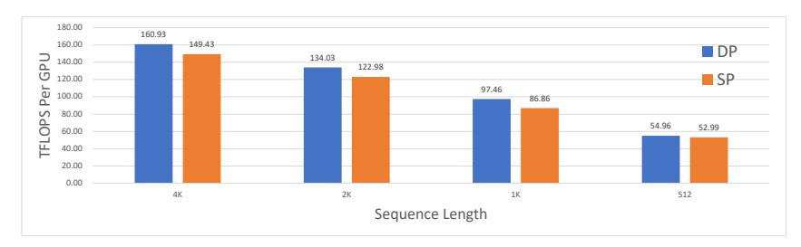
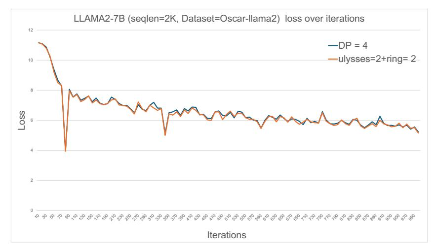

# Tip 4: We suggest that SP has an advantage over TP-sp in terms of communication cost on a large scale. GQA can further reduce the communication cost of SP.

In terms of memory cost, TP-sp holds an advantage over SP. Even when SP employs ZeRO-1/2 to align the memory cost of OS and activations with that of TP-sp, the memory cost of the parameter remains more substantial. However, when SP employs ZeRO3, it achieves a similar memory cost with TP-sp. The SP-Ulysses+ZeRO3 is the exact strategy to scale sequence length employed by the authors of DS-Ulysses [1].

Based on the above analysis, under the same model and input configurations 1, simply switching parallelism from TP-sp to SP-Unified does not increase the trainable sequence length; on the contrary, it is very likely to result in a reduction of the sequence length.

However, SP can still extend the sequence length compared to TP-sp in high parallel degree. When the sequence is very long, as previously analyzed, the proportion of parameter communication volume in the total communication is relatively small. Therefore, the additional communication overhead of an allgather operation introduced by ZeRO has a limited impact.

## Tip 5: We suggest switching TP-sp to SP cannot increase the sequence length in training. SP+ZeRO3 can train a similar sequence length as TP-sp.

Due to the inherent limitation of TP-sp's parallelism, which is capped at hc, it is not possible to further reduce the memory cost of activations by increasing the TP-sp paralleled degree. In contrast, SP can continue to expand its parallel degree by leveraging the SP-Ring technique, thereby enabling the training of larger models on a larger scale.

Tip 6: We suggest a higher degree of SP parallelism, which may need to set a large ring degree when the head number is limited, to train a long sequence across a greater number of computational devices. This is an advantage that cannot be achieved with TP-sp approaches.

**Pipeline Parallelism (PP):** PP partitions transformer blocks across layers, so it is complementary with the SP, which partitions tensors inside a transformer block. Therefore, SP and PP are fully compatible. Since SP can form a unified parallel group with ZeRO for collective communication, we believe TP should still be placed at the lowest dimension of the 4D parallel group partitioning.

Tip 7: We suggest that in 4D hybrid parallelism, the order of process group dimensionality from low to high is TP, SP-Ulysses, SP-Ring, ZeRO-DP, PP.

## 5 Experimental Results

#### 5.1 Performance of Unified SP

We evaluated the attention module's performance using SP-Unified on an L20 PCIe GPU cluster, benchmarking the throughput in TFLOPS. We replicated the parameter settings of the llama3-8B model. Table [3](#page-7-0) illustrates that on an 8xL20 setup, optimal throughput for 32K and 128K sequences was achieved with a ulysses-degree of 4 and ring-degree set to 2. This finding supports Tip 1: SP-Unified is well-suited for heterogeneous networks. The lb-ring, an enhanced version of the standard Ring-Attention with load-balancing, outperformed the original. It consistently outperforms the basic ring attention implementation, with the advantage becoming more pronounced as the sequence length increases.

Table 3: Throughput (iters/sec) of SP-Unified on 8xL20 PCIe fwd-only (Ring-Degree × Ulysses-Degree=8)

| group_num | bs | seqlen | head_num | head_size | ulysses_degree | basic-ring | lb-ring |
|-----------|----|--------|----------|-----------|----------------|------------|---------|
| 4         | 1  | 8K     | 32       | 128       | 8              | 57.346     | 57.098  |
| 4         | 1  | 8K     | 32       | 128       | 4              | 153.134    | 152.189 |
| 4         | 1  | 8K     | 32       | 128       | 2              | 415.5      | 454.93  |
| 4         | 1  | 8K     | 32       | 128       | 1              | 358.595    | 361.969 |
| 4         | 1  | 32K    | 32       | 128       | 8              | 15.229     | 14.262  |
| 4         | 1  | 32K    | 32       | 128       | 4              | 28.584     | 32.818  |
| 4         | 1  | 32K    | 32       | 128       | 2              | 44.348     | 62.754  |
| 4         | 1  | 32K    | 32       | 128       | 1              | 40.478     | 58.377  |
| 4         | 1  | 128K   | 32       | 128       | 8              | 2.563      | 2.586   |
| 4         | 1  | 128K   | 32       | 128       | 4              | 3.217      | 4.235   |
| 4         | 1  | 128K   | 32       | 128       | 2              | 3.399      | 5.476   |
| 4         | 1  | 128K   | 32       | 128       | 1              | 3.131      | 5.186   |

As shown in Table [4,](#page-7-1) we repeated the attention benchmarking on an 8xA100-SXM4 NVLink node, the highest throughput for both 32K and 128K sequence lengths was achieved when the ulysses-degree is set to 8, that is the same as SP-Ulysses. SP-Ulysses demonstrated a significant advantage over SP-Ring. This verified the argument in Sec. [3](#page-2-3) of SP-Ring, that although communication overhead can be hidden through overlapping with computation, it results in a reduction in computational efficiency.

Table 4: Throughput (iters/sec) of SP-Unified on 8xA100-SXM4 NVLink fwd-only (Ring-Degree × Ulysses-Degree=8)

| group_num | bs | seqlen | head_num | head_size | ulysses_degree | basic-ring | lb-ring |
|-----------|----|--------|----------|-----------|----------------|------------|---------|
| 4         | 1  | 32K    | 32       | 128       | 8              | 135.569    | 136.375 |
| 4         | 1  | 32K    | 32       | 128       | 4              | 103.525    | 132.979 |
| 4         | 1  | 32K    | 32       | 128       | 2              | 91.365     | 132.979 |
| 4         | 1  | 32K    | 32       | 128       | 1              | 81.985     | 113.79  |
| 4         | 1  | 128K   | 32       | 128       | 8              | 2.782      | 2.785   |
| 4         | 1  | 128K   | 32       | 128       | 4              | 2.024      | 2.771   |
| 4         | 1  | 128K   | 32       | 128       | 2              | 1.73       | 2.89    |
| 4         | 1  | 128K   | 32       | 128       | 1              | 1.628      | 2.91    |
|           |    |        |          |           |                |            |         |

#### 5.2 End-to-end SP Performance in Megatron-LM

We have incorporated the SP-Unified method into Megatron-LM. Currently, Megatron-LM includes a preliminary version of SP-Ring, but lacks an implementation of SP-Ulysses. Our software is based on Megatron-LM commit 2196398, dated April 12, 2024. The SP-Ring is implemented using Megatron-LM's native Context Parallel, while SP-Ulysses is developed from our repository code. We conducted experiments using the docker image nvcr.io/nvidia/nemo:24.03. By default, we utilize ZeRO-1 for both Data Parallelism (DP) and Sequence Parallelism (SP), and consistently apply Sequence Parallelism Optimization for Tensor Parallelism (TP-sp). We do not employ gradient accumulation or activation recomputation. Our experimental setup includes two GPU nodes, each equipped with 8xA800 GPUs connected via 400GB/s NVLink, and node-to-node communication via 1.6 Tbps RDMA. We have adjusted the MFU computation in Megatron-LM to account only for

effective computations under causal masking. As a result, the MFU is notably lower when training with long sequences compared to the MFU figures printed by Megatron-LM.

#### 5.3 SP vs. DP

Firstly, we compare the performance of SP and DP under the same LLAMA2-7B workload on a single node of A800 GPUs. The global batch size is 8. We use the SP-Unified, and pick the best ulysses-degree and ring-degree settings. In a single node, ulysses-degree = 8 usually achieves the best performance. As shown in Figure [6,](#page-10-0) DP outperforms SP-Unified across various input sequence lengths, which confirms our conclusion in Tip 2.

> **[图片提取文字 (无描述)]:**
> 180.00 160.93 149.43 160.00 DP 134.03 140.00 122.98 ■ SP 120.00 97.46 100.00 86.86 80.00 54.96 52.99 60.00 40.00 20.00 0.00 4K 2K 512 Sequence Length

Figure 5: Comparison DP and SP on LLAMA2-7B Task with global bs=8.

#### 5.4 Hybrid SP and TP

Table [5](#page-8-0) presents the performance of the llama2-7B model on a single node of 8xA800 GPU 80GB. The longest sequence length that can be achieved is 64K, and the best performance is obtained when tp-degree=4 and ulysses-degree=2. It outperforms TP-sp-only by 10%. When seqlen=64K, SP-only will bring OOM issue, which echos our conclusion in Tip 5 that SP is less memory-efficient than TP-sp.

When global-bs=16 and seqlen=30K, SP-Ulysses delivers the optimal performance, significantly surpassing other SP and TP hybrid strategies. It is also 26% better than TP-sp-only in throughput. This indicates that, despite the similar communication cost of SP-Ulysses and TP-sp, SP-Ulysses is more communication efficient than TP-sp in practice in an NVLINK-connected setting, and communication patterns of hybrid SP-Ulysses and SP-Ring sometimes bring better performance.

| seqlen | global-bs | tp-degree | ulysses-degree | ring-degree | FLOPS/GPU | MFU  |  |  |  |
|--------|-----------|-----------|----------------|-------------|-----------|------|--|--|--|
| 64K    | 1         | 4         | 2              | 1           | 154.49    | 0.50 |  |  |  |
| 64K    | 1         | 4         | 1              | 2           | 151.40    | 0.49 |  |  |  |
| 64K    | 1         | 8         | 1              | 1           | 141.85    | 0.45 |  |  |  |
| 30K    | 16        | 2         | 4              | 1           | 155.98    | 0.50 |  |  |  |
| 30K    | 16        | 2         | 1              | 4           | 147.77    | 0.47 |  |  |  |
| 30K    | 16        | 4         | 1              | 1           | 150.05    | 0.48 |  |  |  |
| 30K    | 16        | 1         | 8              | 1           | 163.42    | 0.52 |  |  |  |
| 30K    | 16        | 1         | 1              | 8           | 142.16    | 0.46 |  |  |  |
| 30K    | 16        | 8         | 1              | 1           | 129.12    | 0.41 |  |  |  |
|        |           |           |                |             |           |      |  |  |  |

Table 5: LLAMA2-7B FLOPS per GPU of hybrid parallelism using TP and SP-Unified on a single 8xA800 NVLink node.

We employed a hybrid parallel strategy combining TP and SP-Unified to benchmark the training throughput of LLAMA3-8B across two nodes. The results are shown in Table [6.](#page-9-0) In most of cases, the global batch size is fixed to be 1, aiming to maximize the sequence length. Since llama3-8B has only 8 heads, the maximum product of ulysses-degree and tp-degree is 8. Table [6](#page-9-0) presents throughput in FLOPS on 64K, 80K and 120K.

The optimal performance for sequence lengths of 64K and 80K is achieved with SP-only without TP-sp, the optimal setting of both is ulysses-degree=4 and ring-degree=4. For sequence length is 64K and 80K, the unified SP outperforms the SP-Ring by 13% and 12%, respectively. These results echo our conclusion in Tip 1.

Table 6: LLAMA3-8B FLOPS per GPU of hybrid parallelism using TP and SP-Unified on two RDMA-connected 8xA800 NVLink nodes.

| seqlen | global-bs | tp-degree | ulysses-degree | ring-degree | FLOPS/GPU | MFU  |
|--------|-----------|-----------|----------------|-------------|-----------|------|
| 64K    | 1         | 1         | 8              | 2           | 136.31    | 0.44 |
| 64K    | 1         | 1         | 4              | 4           | 137.48    | 0.44 |
| 64K    | 1         | 1         | 2              | 8           | 129.44    | 0.41 |
| 64K    | 1         | 1         | 1              | 16          | 121.83    | 0.39 |
| 64K    | 1         | 8         | 1              | 2           | 129.75    | 0.42 |
| 64K    | 1         | 4         | 2              | 2           | 122.45    | 0.39 |
| 64K    | 1         | 2         | 4              | 2           | 87.67     | 0.28 |
| 64K    | 1         | 2         | 2              | 4           | 89.35     | 0.29 |
| 64K    | 1         | 4         | 1              | 4           | 122.57    | 0.39 |
| 64K    | 1         | 2         | 1              | 8           | 101.35    | 0.32 |
| 64K    | 2         | 8         | 1              | 1           | 141.20    | 0.45 |
| 80K    | 1         | 1         | 8              | 2           | 147.46    | 0.47 |
| 80K    | 1         | 1         | 4              | 4           | 148.90    | 0.48 |
| 80K    | 1         | 1         | 2              | 8           | 140.13    | 0.45 |
| 80K    | 1         | 1         | 1              | 16          | 132.86    | 0.43 |
| 80K    | 1         | 8         | 1              | 2           | 136.16    | 0.44 |
| 80K    | 1         | 4         | 2              | 2           | 137.49    | 0.44 |
| 80K    | 1         | 2         | 4              | 2           | 111.05    | 0.36 |
| 80K    | 1         | 2         | 2              | 4           | 110.81    | 0.36 |
| 80K    | 1         | 4         | 1              | 4           | 130.27    | 0.42 |
| 80K    | 1         | 2         | 1              | 8           | 121.14    | 0.39 |
| 80K    | 2         | 8         | 1              | 1           | 144.40    | 0.46 |
| 120K   | 1         | 4         | 2              | 2           | 152.51    | 0.49 |
| 120K   | 1         | 2         | 4              | 2           | 136.63    | 0.44 |
| 120K   | 1         | 8         | 1              | 2           | 145.92    | 0.47 |
| 120K   | 1         | 4         | 1              | 4           | 150.96    | 0.48 |

For sequence lengths are 64K and 80K, we can increase the global batch size (global-bs) for the TP+SP hybrid setting when tp-degree=8. However, SP-only always has an OOM issue with globalbs=2. Increasing the global-bs to 2, TP+SP has a 2.7% improvement in throughput to SP-only at the sequence length 64K. But at sequence length 80K, TP+SP with global-bs as 2 is still worse than SP-only with global-bs as 1.

When the sequence length reaches 120K, the optimal performance is achieved with tp-degree=4 and ulysses-degree=2, reaching 152.51 TFLOPS, with an MFU of 0.49. At this sequence length, SP-only meets an OOM issue. This confirms our Tip 5 again, which implies that the memory efficiency of SP is inferior to that of TP-sp. It is noteworthy that two other TP+SP hybrid settings yield similar performance, 0.47 and 0.48 in MFU, which is quite close to the optimal.

Table 7: Exploring Upper Bound of Sequence Length for LLAMA3-8B using TP and SP-Unified on 2 8xA800 NVLink nodes.

| seqlen | global-bs | tp-degree | ulysses-degree | ring-degree | FLOPS/GPU | MFU  |
|--------|-----------|-----------|----------------|-------------|-----------|------|
| 160K   | 1         | 4         | 2              | 2           | 158.64    | 0.51 |
| 160K   | 1         | 8         | 1              | 2           | 156.63    | 0.50 |
| 208K   | 1         | 8         | 1              | 2           | 147.26    | 0.47 |
| 160K   | 1         | 4         | 1              | 4           | 159.37    | 0.51 |
| 190K   | 1         | 4         | 1              | 4           | 157.08    | 0.50 |

We explored the upper bound of sequence length on 2 nodes, and the results are presented in Table [7.](#page-9-1) The largest sequence length was achieved with tp-degree=8 and ring-degree=2. At this point, SP-only could not run due to OOM. Compared to SP, TP-sp is more memory-efficient, hence for training the longest sequences, parallel degrees are limited by 8 attention head numbers should all be assigned to TP-sp. It is noteworthy that we can achieve longer sequence lengths through activation optimization, such as activation recomputation [\[16\]](#page-12-2), and offloading [\[5,](#page-11-4) [15\]](#page-12-1), but these methods will harm MFU.

### 5.5 Convergence

We compared the convergence differences between USP and DP. Using the same dataset, we tested the loss curves over 10K iterations on 4 GPUs. We found that the curves for USP and DP completely overlapped, which validates that our modifications to RoPE and SP-Ring for load balancing are correct.

> **[图片提取文字 (无描述)]:**
> LLAMA2-7B (seqlen=2K, Dataset=Oscar-llama2) loss over iterations 12 -DP = 4-ulysses=2+ring= 2 ୫୬୫୬୫୬୫୫୫୫୫୫୫୬୫୬୫୬୫୬୫୬୫୬୫୬୫*୬*୫୬୫୫୬୫୬୫୬୫୬ Iterations

Figure 6: Comparison the loss of DP and USP on LLAMA2-7B with global bs as 4.

## 6 Future Work

SP on Large Scale Cluster We believe that SP is highly beneficial for extremely large scale LLM training tasks. Currently, for publicly disclosed large-scale model training tasks [\[17,](#page-12-3) [18\]](#page-12-4) over 10K GPUs, SP has not been utilized. This is because these training tasks were started before November 2023, when the SP methods were not yet mature.

Firstly, SP can introduce the dimension that can be partitioned from the sequence length, alleviating the constraints hindered by batch size limitations. MegaScale project [\[18\]](#page-12-4) uses a large global batch size to increase DP degree which impacts convergence. However, we can increase the SP degree instead of the DP degree to reduce the global batch size, thereby avoiding the convergence problem.

Secondly, increasing the SP degree can decrease the activation cost, allowing for longer model context length during training. Theoretically, the SP-Ring degree can be increased arbitrarily, whereas the TP degree is limited by the number of heads. Our experimental results on two nodes have not yet demonstrated this advantage of SP.

SP+ZeRO-3 Megatron-LM does not officially support ZeRO-3, possibly because the TP-sp already reduces memory cost for parameters and gradients, which is also the target of ZeRO-3. We have claimed that ZeRO-3 is highly compatible with SP in Tip 2. Given that Megatron-LM already has an implementation of SP-Ring, ZeRO-3 becomes a necessary feature.

SP+MoE As more and more models transition to a Mixture-of-Experts (MoE) architecture, the research on combining SP with expert parallelism (EP) becomes increasingly significant. The sequence parallelism employed on the attention module is decoupled with the FFN module. Therefore, hybrid sequence parallelism can also be compatible with Mixture of Experts (MoE), as long as the All2All communication between the Attention and FFN modules is carefully designed.

## 7 Conclusion

In this paper, we propose an approach that unifies DeepSpeed-Ulysses and Ring-Attention for sequence parallelism. This method encompasses the capabilities of both techniques, broadening the

applicability and delivering superior performance in some cases. We systematically analyzed the interplay between sequence parallelism and other established parallelism methods, deriving a set of best practice suggestions. These suggestions have been validated through experimental results obtained from two GPU nodes.

## 8 Acknowledgements

We express our gratitude to Zilin Zhu from Tencent. The code utilized in our research was built from his GitHub repository, and he also owns the authorship of Figure [3](#page-3-1) presented in this paper.

## References

- [1] Sam Ade Jacobs, Masahiro Tanaka, Chengming Zhang, Minjia Zhang, Leon Song, Samyam Rajbhandari, and Yuxiong He. Deepspeed ulysses: System optimizations for enabling training of extreme long sequence transformer models. *arXiv preprint arXiv:2309.14509*, 2023.
- [2] Hao Liu, Matei Zaharia, and Pieter Abbeel. Ring attention with blockwise transformers for near-infinite context. *arXiv preprint arXiv:2310.01889*, 2023.
- [3] Vijay Anand Korthikanti, Jared Casper, Sangkug Lym, Lawrence McAfee, Michael Andersch, Mohammad Shoeybi, and Bryan Catanzaro. Reducing activation recomputation in large transformer models. *Proceedings of Machine Learning and Systems*, 5, 2023.
- [4] Mohammad Shoeybi, Mostofa Patwary, Raul Puri, Patrick LeGresley, Jared Casper, and Bryan Catanzaro. Megatron-lm: Training multi-billion parameter language models using model parallelism. *arXiv preprint arXiv:1909.08053*, 2019.
- [5] Jie Ren, Samyam Rajbhandari, Reza Yazdani Aminabadi, Olatunji Ruwase, Shuangyan Yang, Minjia Zhang, Dong Li, and Yuxiong He. Zero-offload: Democratizing billion-scale model training. In *2021 USENIX Annual Technical Conference (USENIX ATC 21)*, pages 551–564, 2021.
- [6] Shenggui Li, Fuzhao Xue, Yongbin Li, and Yang You. Sequence parallelism: Making 4d parallelism possible. *arXiv preprint arXiv:2105.13120*, 2021.
- [7] Shenggui Li, Hongxin Liu, Zhengda Bian, Jiarui Fang, Haichen Huang, Yuliang Liu, Boxiang Wang, and Yang You. Colossal-ai: A unified deep learning system for large-scale parallel training. In *Proceedings of the 52nd International Conference on Parallel Processing*, pages 766–775, 2023.
- [8] Dacheng Li, Rulin Shao, Anze Xie, Eric P Xing, Joseph E Gonzalez, Ion Stoica, Xuezhe Ma, and Hao Zhang. Lightseq: Sequence level parallelism for distributed training of long context transformers. *arXiv preprint arXiv:2310.03294*, 2023.
- [9] Tri Dao, Dan Fu, Stefano Ermon, Atri Rudra, and Christopher Ré. Flashattention: Fast and memory-efficient exact attention with io-awareness. *Advances in Neural Information Processing Systems*, 35:16344–16359, 2022.
- [10] Joshua Ainslie, James Lee-Thorp, Michiel de Jong, Yury Zemlyanskiy, Federico Lebrón, and Sumit Sanghai. Gqa: Training generalized multi-query transformer models from multi-head checkpoints. *arXiv preprint arXiv:2305.13245*, 2023.
- [11] Noam Shazeer. Fast transformer decoding: One write-head is all you need. *arXiv preprint arXiv:1911.02150*, 2019.
- [12] William Brandon, Aniruddha Nrusimha, Kevin Qian, Zachary Ankner, Tian Jin, Zhiye Song, and Jonathan Ragan-Kelley. Striped attention: Faster ring attention for causal transformers. *arXiv preprint arXiv:2311.09431*, 2023.
- [13] Jianlin Su, Murtadha Ahmed, Yu Lu, Shengfeng Pan, Wen Bo, and Yunfeng Liu. Roformer: Enhanced transformer with rotary position embedding. *Neurocomputing*, 568:127063, 2024.

- [14] Samyam Rajbhandari, Jeff Rasley, Olatunji Ruwase, and Yuxiong He. Zero: Memory optimizations toward training trillion parameter models. In *SC20: International Conference for High Performance Computing, Networking, Storage and Analysis*, pages 1–16. IEEE, 2020.
- [15] Jiarui Fang, Zilin Zhu, Shenggui Li, Hui Su, Yang Yu, Jie Zhou, and Yang You. Parallel training of pre-trained models via chunk-based dynamic memory management. *IEEE Transactions on Parallel and Distributed Systems*, 34(1):304–315, 2022.
- [16] Tianqi Chen, Bing Xu, Chiyuan Zhang, and Carlos Guestrin. Training deep nets with sublinear memory cost. *arXiv preprint arXiv:1604.06174*, 2016.
- [17] Ziheng Jiang, Haibin Lin, Yinmin Zhong, Qi Huang, Yangrui Chen, Zhi Zhang, Yanghua Peng, Xiang Li, Cong Xie, Shibiao Nong, et al. Megascale: Scaling large language model training to more than 10,000 gpus. *arXiv preprint arXiv:2402.15627*, 2024.
- [18] Meta AI Team. Introducing meta llama 3: The most capable openly available llm to date. <https://ai.meta.com/blog/meta-llama-3/>, 2024. Accessed: May 2024.