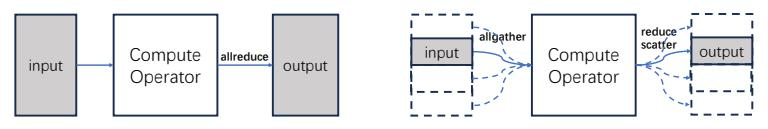
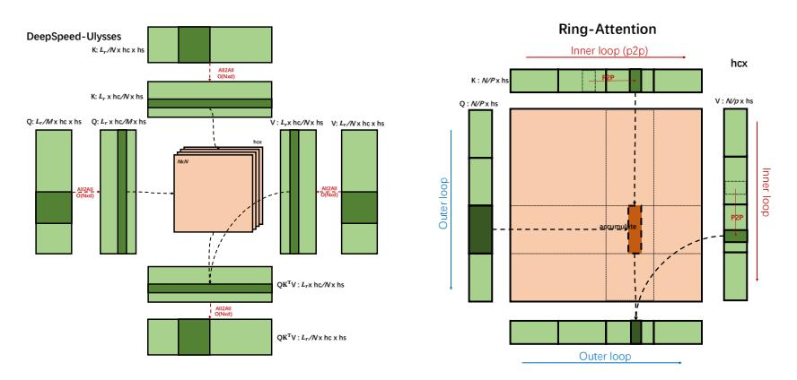
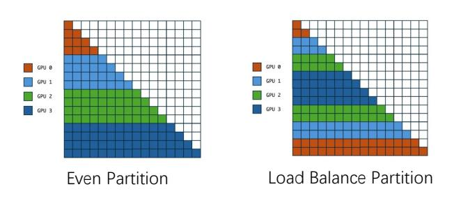
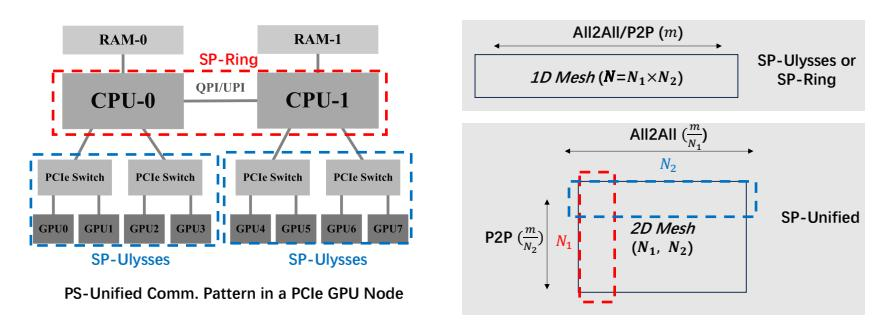

## USP: A Unified Sequence Parallelism Approach for Long Context Generative AI

Jiarui Fang Tencent jiaruifang@tencent.com

Shangchun Zhao Tencent doctzhao@tencent.com

## Abstract

Sequence parallelism (SP), which divides the sequence dimension of input tensors across multiple computational devices, is becoming key to unlocking the longcontext capabilities of generative AI models. This paper investigates the state-ofthe-art SP approaches, i.e. DeepSpeed-Ulysses and Ring-Attention, and proposes a unified SP approach, which is more robust to transformer model architectures and network hardware topology. This paper compares the communication and memory cost of SP and existing parallelism, including data/tensor/zero/pipeline parallelism, and discusses the best practices for designing hybrid 4D parallelism involving SP. We achieved 47% MFU on two 8xA800 nodes using SP for the LLAMA3-8B model training using sequence length 208K. Our code is publicly available at <https://github.com/feifeibear/long-context-attention>.

## 1 Introduction

The field of artificial intelligence is witnessing a trend as the context length in generative AI models grows ever longer. Claude has pioneered this trend in large language models (LLMs) by extending the sequence length to 100K tokens. Following closely in its footsteps, OpenAI's GPT-4 has expanded the context length to 128K tokens. The advent of multi-modality models is propelling this trend forward, with Gemini 1.5 Pro boasting a context length of a staggering 10 million tokens, and OpenAI's Sora, a Diffusion Model, accommodating at least 1 million visual tokens. These breakthroughs underscore the imperative for generative AI techniques to adeptly handle a larger context length.

Sequence Parallelism (SP), a technique that partitions input sequences, has emerged as a promising approach for the training or inference of longer sequences. Following an initial exploration period of two years, by the latter of 2023, two landmark works, DeepSpeed-Ulysses [\[1\]](#page-11-0) and Ring-Attention [\[2\]](#page-11-1), marked the maturation of the SP technique. DeepSpeed-Ulysses maintains constant communication volume when sequence length and compute devices are increased proportionally, while Ring-Attention hides P2P communication costs introduced by SP through overlapping computation and communication. However, challenges remain, such as the SP parallel degree of DeepSpeed-Ulysses is limited to less than the number of attention heads, and the computational efficiency of Ring-Attention degrading due to the subdivision of matrix multiplications. These limitations currently hinder the broader adoption of Sequence Parallelism in distributed Transformer computation.

In this paper, we delve deeper into the realm of SP. We begin by highlighting that Ulysses and Ring are not mutually exclusive approaches; they can be combined through a hybrid parallel strategy to mitigate their drawbacks. Then, we discussed the relationship between SP and data/tensor/zero/expert/pipeline parallelism. The most complex among these is the relationship between SP and tensor parallelism. Since tensor parallelism also has its specific sequence parallel optimizations to reduce activation memory cost [\[3\]](#page-11-2). For each parallelism approach, whether SP should replace it or is there some issue to using SP with it together, remains an open question. After addressing these questions, we have provided a list of best practices for building a 4D hybrid parallelism system.

The primary contributions of this paper include:

- We propose a unified sequence parallel method that integrates DeepSpeed-Ulysses and Ring-Attention, overcoming the shortcomings of both and demonstrating greater robustness to model architecture and network hardware.
- We systematically analyze the application of SP in conjunction with Tensor Parallelism, ZeRO, and Pipeline Parallelism as 4D parallelism, and provide a list of best practices to apply SP.

#### 2 Sequence Parallelism Approaches

<span id="page-1-0"></span>Before delving into the concept of SP, let's review the computational process of the standard Transformer Block. The Notion used in this paper is shown in Table 1, where  $d = hc \times hs$ .

| $\overline{L}$ | Sequence Length | d  | Hidden Dimension | hc | Head Count    |
|----------------|-----------------|----|------------------|----|---------------|
| hs             | Head Size       | bs | Batch Size       | N  | Device Number |

Table 1: Notation for Transformer Parameters

Given input sequences  $Q, K, V \in \mathbb{R}^{L \times d}$ , where L is the sequence length and d is the head dimension, we compute the matrix of outputs as follows:

$$\operatorname{Attention}(Q, K, V) = \operatorname{softmax}\left(\frac{QK^T}{\sqrt{d}}\right)V, \tag{1}$$

Each self-attention sub-layer is accompanied by a feedforward network (FFN), which is applied to each position separately and identically.

$$FFN(x) = \max(0, xW_1 + b_1)W_2 + b_2. \tag{2}$$

Compared to Tensor Parallelism (TP) [4] and ZeRO [5], the research on SP for Transformer models has been relatively underdeveloped for a long time. The challenge lies in the characteristic of attention computation, where the sequence dimension serves as a common dimension in the matrix multiplication after softmax, making it difficult to partition the tensors and distribute the computation across multiple nodes after slicing the sequence dimension.

Early attempts [6–8] at SP were not successful, often leading to redundant memory consumption [6] and inefficient communication pattern [8]. For long input sequences, the best practice is to adopt the *Sequence Parallelism* of Megatron-LM. This method optimizes the AllReduce operation of TP, reducing the memory cost of activations while maintaining the same communication overhead. As shown in Figure 1, the principle of Megatron-LM *Sequence Parallelism* is the similar to ZeRO-2 [5]. It replaces the AllReduce operation on replicated tensors (the left figure) into equivalent allgather and reduce-scatter operations on partitioned data (the right figure). Since an AllReduce operation is exactly a combination of Allgather and ReduceScatter, the communication cost remains the same. The size of the input and output tensors is reduced by a factor of 1/N across N computational devices. Because of the sequence dimension in input/output tensors is partitioned, it is named as *Sequence Parallelism*. However, this form of *Sequence Parallelism* cannot be used independently without tensor parallelism and communication volume remains constant regardless of the degree of parallelism.

<span id="page-1-1"></span>> **[图片提取文字 (无描述)]:**
> reduce allgather scatter output Compute input Compute allreduce output input Operator Operator


Figure 1: The Principle of Megatron-LM Sequence Parallelism.

The maturity of the standalone SP technology is marked by the publication of two milestone papers in late 2023. The DeepSpeed-Ulysses [1], named as **SP-Ulysses**, and Ring-Attention [2], named as **SP-Ring**, solving the longstanding memory and communication issues inherent to SP from two

distinct perspectives. For both methodologies, each computational device is allocated a distinct segment of the Q (query), K (key), V (value), and O (output) tensors, which are segregated along the dimensions of the sequence. There is no redundancy in their storage between devices, which is a primary distinction from the early SP design [\[6\]](#page-11-5).

SP-Ring can be viewed as a distributed version of FlashAttention [\[9\]](#page-11-7). As shown in the right part of Figure [2,](#page-2-0) SP-Ring employs a nested two-level loop that orchestrates the communication and computation in a blockwise fashion. When computing for the blocks of the tensor O segment, if the required tensor K and V blocks are not locally available, Peer-to-Peer (P2P) communication is utilized to fetch them from other devices. Communication can be organized in a Ring fashion, where each device simultaneously sends and receives K, V blocks, allowing communication to overlap computation.

<span id="page-2-0"></span>> **[图片提取文字 (无描述)]:**
> Ring-Attention DeepSpeed-Ulysses Inner loop (p2p) K: L,/Nx hc x hs hcx O(Not) K: N/Px hs K: L, x hc/N x hs V: N/px hs Q: N/Px hs  $Q: L_r/M \times hc \times hs$   $Q: L_r \times hc/M \times hs$ V: L, x hc/Wx hs V: L, /Wx hc x hs Inner loop Outer loop D(Roid) O(Nod) accumulat QKTV: Lrx hc/Wx hs Alizati O(Ned)  $QK^TV: L_r/Nx hc x hs$ Outer loop


Figure 2: SP-Ulysses and SP-Ring.

SP-Ulysses leverages All2All communication for segments of the Q, K, V , and O tensors, as shown in the left part of Figure [2.](#page-2-0) After the All2All operation, the partitioning of these four tensors changes from the sequence dimension L to the dimension of the attention number heads hc. Therefore, the computation of sof tmax(QK<sup>T</sup> )V for each attention head is maintained in its entirety, and can be implemented using the under the hood Attention operator library, like FlashAttention.

## <span id="page-2-3"></span>3 Unified Ulysses-Ring Sequence Parallelism

Currently, both SP-Ulysses and SP-Ring are facing certain issues that hinder their effectiveness in practical applications.

SP-Ulysses is sensitive to the number of attention heads. The parallelism degree [1](#page-2-1) of DS-Ulysses cannot exceed the number of attention heads hc. Consequently, it is not suitable for the GQA (Grouped Query Attention) [\[10\]](#page-11-8) and MQA (Multi-Query Attention) [\[11\]](#page-11-9) scenarios. For instance, Llama3-8B employs GQA with a KV head number of 8, which means that when using DS-Ulysses SP, the maximum SP degree is 8. However, if MQA is used and the KV head number is 1, DS-Ulysses will not function. In addition, since Tensor Parallelism also requires division across the hc dimension, SP-Ulysses, and TP are in conflict.

SP-Ring is inefficient in computation and communication. Ring-Attention segments the Q, K, V, O tensors into smaller blocks, which can lead to a decrease in computation efficiency of the fused operator Sof tmax(QK<sup>T</sup> )V . Even if communication and computation fully overlap, the total execution time lags behind that of DS-Ulysses. When using a causal mask has not been addressed, the DS-Ring has a load-unbalancing issue. DS-Ring does not impose any restrictions on hc.

SP-Ulysses and SP-Ring are currently considered alternative strategies for SP, with the choice of one precluding the other. This point of view was reinforced by the SP-Ring authors in their ICLR open review rebuttal[2](#page-2-2) . Currently, Megatron-DeepSpeed utilizes SP-Ulysses, while Megatron-LM opts for

<span id="page-2-1"></span><sup>1</sup>The parallelism degree is the number of devices that participate in parallel computation. In other words, it is the number of processes in a parallel process group.

<span id="page-2-2"></span>https://openreview.net/forum?id=WsRHpHH4s0&noteId=HIY0tae4Gz

SP-Ring for its SP implementation. However, we claim that, rather than viewing them as rivals, they can work together as a unified SP approach.

As shown in Algorithm [1,](#page-3-0) SP-Ring and SP-Ulysses are organized in a hybrid parallel manner named as USP-Attention to work together in partitioning the sequence dimension. The SP process group is segmented into two orthogonal process group sets: a set of SP-Ring process groups and a set of SP-Ulysses process groups. For a more intuitive understanding, an SP process group can be viewed as a 2D mesh, SP-Ring operates across each column of the mesh, while SP-Ulysses runs across each row. For example, a process group containing 8 processes could viewed as 2 × 4, where a SP-Ulysses process group ulysses\_pg of size 2 and a SP-Ring process group ulysses\_pg of size 4. This is the same as how data parallelism and tensor parallelism process groups are partitioned.

The inputs to the USP-Attention include the segment of the Q, K, andV tensors after being partitioned along the sequence dimension and the output is a tensor O shard. The size of a tensor segment is (bs, L/N, hs, hd). Note that when using MAQ, the shape of the hc for the K and V tensor segments differs from that of the Q tensor. During forward propagation, scatter\_idx is set to 1, and gather\_idx is set to 2. AllToAll4D merges the dimension L and partitions the dimension hc of the tensors Q, K, and V , transforming them into (hc/N, bs, L, d). They also partition the O tensor along the L dimension and merge the hc dimension. During backward propagation, scatter\_idx is set to 2, and gather\_idx is set to 1.

#### <span id="page-3-0"></span>Algorithm 1 Unified Sequence Parallelism Attention Implementation

```
1: function USP-ATTN(ulysses_pg, ring_pg, Q, K, V , scatter_idx, gather_idx)
2: Q ← AllToAll4D(Q, scatter_idx, gather_idx, group = ulysses_pg)
3: K ← AllToAll4D(K, scatter_idx, gather_idx, group = ulysses_pg)
4: V ← AllToAll4D(V, scatter_idx, gather_idx, group = ulysses_pg)
5: O ← LoadBalance-RingAttention(Q, K, V, group = ring_pg)
6: O ← AllToAll4D(O, gather_idx, scatter_idx, group = ulysses_pg)
7: return O
8: end function
```

The vanilla SP-Ring introduces load-unbalancing issues when applying causal attention, as only the lower triangular matrix of QK<sup>T</sup> needs to be computed. As shown in Figure [3,](#page-3-1) if the sequence dimension is divided evenly, the computational tasks are not evenly distributed among the devices. As shown in the left side of the figure, on 4 GPUs the computation load of GPU3 is nearly 7 times that of GPU0.

The solution to the load-unbalancing issue is to reorder the input sequence tokens along the sequence dimension, as depicted on the right side of Figure [3.](#page-3-1) In the figure, the input sequence consists of 16 tokens. Under even partition, GPU0 processes tokens 0- 3, while GPU3 handles tokens 12-15. After the reorder operation for load balance partitioning, GPU0 now processes tokens 0, 1, 14, 15, and GPU3 processes tokens 5,6,11,12. The workloads handled by each GPU are per-

<span id="page-3-1"></span>> **[图片提取文字 (无描述)]:**
> GPU 0 GPU 1 GPU 1 GPU 2 GPU 2 GPU 3 GPU 3 Load Balance Partition **Even Partition**


Figure 3: Loading Balancing for SP-Ring.

fectly balanced, which is a superior solution to the striped attention [\[12\]](#page-11-10).

The aforementioned load balancing method is quite straightforward and a similar implementation has already been applied in Megatron-LM. We present its application for Unified SP method. The Algorithm [2](#page-4-0) extracts and reorders the input sequence from the global input sequence in hybrid Ulysses and Ring parallelism. For the positional encoding only involves element-wise operations, i.e. RoPE [\[13\]](#page-11-11), the same reordering operation also needs to be applied to the positional encoding parameters of the model. Since the operation is applied to the model's input token sequence, which is an integer vector of length bs ∗ L, the additional overhead for load balancing is negligible.

#### <span id="page-4-0"></span>Algorithm 2 Prepare Load Balance Sequence Segment from The Global Input Sequence

```
1: function LOCALBALANCELOCALSEQ(seq, ring\_process\_group, ulysses\_process\_group)
2: ring\_degree \leftarrow ring\_process\_group.get\_world\_size()
3: ring\_rank \leftarrow ring\_process\_group.get\_rank()
4: ulysses\_rank \leftarrow ulysses\_process\_group.get\_rank()
5: seq\_chunks \leftarrow seq.chunk(2 \times ring\_degree)
6: reorder\_seq \leftarrow concat([seq\_chunks[r\_rank], seq\_chunks[2 \times rd - r\_rank - 1]])
7: local\_seq \leftarrow reorder\_seq.chunk(ud)[u\_rank]
8: return local\_seq
9: end function
```

Unified SP is highly flexible and robust, allowing for the various combinations of the Ulysses degree and the Ring degree, as long as the product of the Ulysses degree and the Ring degree equals the SP degree. When the Ulysses degree equals N, it becomes SP-Ulysses, and when the ring degree equals N, it becomes SP-Ring. Therefore, it covers the ability of both SP-Ulysses and SP-Ring.

Firstly, Unified SP can remove the head number limitation of SP-Ulysses. For example, to run llama3-8B  $^3$  with hc=8 in a 16-degree SP, one can set the Ulysses degree to 8 and the ring degree to 2. Secondly, Unified SP allows lower bandwidth and topology requirements for network infrastructure by offering a more robust communication pattern. By setting the Ulysses degree to a value between 1 and N, the Attention communication pattern will be a mix of P2P and All2All as shown in Figure 4. Such a communication pattern is particularly well-suited for heterogeneous communication networks, allowing All2All operations to operate in high-bandwidth interconnections while asynchronous P2P communications operate in lower-bandwidth sections. This is applicable to scenarios such as a node in which GPUs are connected via PCIe Switch or a cluster of GPU nodes between which the network is Ethernet connected.

<span id="page-4-2"></span>Tip 1: We suggest using Unified-SP in place of SP-Ring and SP-Ulysses, as it encompasses the capabilities of both while offering additional benefits.

> **[图片提取文字 (无描述)]:**
> All2All/P2P (m) RAM-0 RAM-1 SP-Ring SP-Ulysses or 1D Mesh ( $N=N_1\times N_2$ ) SP-Ring OPI/UPI CPU-0 CPU-1 All2All  $(\frac{m}{N_1})$ PCIe Switch PCIe Switch PCIe Switch PCIe Switch SP-Unified 2D Mesh GPU3 GPU0 GPU1 GPU2 GPU4 GPU5 GPU6 GPU7 P2P  $(\frac{m}{N_2})$  $(N_1, N_2)$ SP-Ulysses SP-Ulysses PS-Unified Comm. Pattern in a PCIe GPU Node


Figure 4: The Unified-SP is more robust to network hardware topology.

#### 4 SP in 4D Parallelism

SP, as a newly emerged parallelism method, how to integrate it into the existing hybrid parallelism framework of Data Parallelism (DP), Tensor Parallelism (TP), and Pipeline Parallelism (PP) has not been thoroughly studied. This section will analyze the relationships between SP and DP, TP, and PP, and discuss the best practices for designing 4D parallelism involving sequence dimension parallelism.

As shown in Table 2, we analyze the communication and memory cost of a standard transformer block for different parallelism. The impact of GQA is not reflected in the table, but we will analyze it later. Entries in the Communications Params columns indicate the collective communication operations are conducted on the parameters and gradients of the transformer block. It includes the parameters/gradients of the weight and bias tensors of 4 Linear Layers in the Self-Attention layer, as well as 2 Linear Layers of the FFN layer, amounting to a volume of  $12 \times O(d^2)$  elements in the

<span id="page-4-1"></span><sup>&</sup>lt;sup>3</sup>https://github.com/meta-llama/llama3

GPT-2 model. Note that llama3 and llama2 has  $9.37 \times O(d^2)$  elements since the intermediate size is lower. Entries in Communications Act(ivatiom) columns indicate the collective communications are conducted on a single hidden states tensor belonging to activations, containing  $bs \times L \times d$  elements. The memory cost is broken down into model parameters/gradients (**P/G**), Optimizer States (**OS**), and intermediate activation tensors (**Act**).

The Cost of the Communication represents the bandwidth requirements. It is calculated by the product of the communicated element number by an *algorithm bandwidth (algobw)* factor related to the algorithm of collective communication  $^4$ . For the collective communication algorithm of AllReduce, AllGather, ReduceScatter, and AllToAll, the respective algobw factors are  $2\frac{n-1}{n}$ ,  $\frac{n-1}{n}$ ,  $\frac{n-1}{n}$ , and 1. In the table, we approximate the term  $O(\frac{n-1}{n})$  to O(1) for simplicity.

The table is built for the mix-precision training using the  $\mathrm{fp16}(\mathrm{bf16})$  format. The memory requirement for the model parameters and gradients are P and G Bytes. The Optimizer States (OS), which includes the parameter in  $\mathrm{fp32}$ , momentum, and variance in the Adam optimizer, is 6 times that of the  $\mathrm{fp16}$  parameters. The memory requirement for the peak activation is A bytes. The parallel degree is N.

<span id="page-5-0"></span>Table 2: Comparison of Communications and Memory Cost of SP, DP, TP, and ZeRO for a standard transformer block

|                      | Param                         | Commun<br>Cost | ication (FWD+BW<br>Act          | (D)<br>Cost             | Split   Dim      | P/G               | Memory<br>OS | Act        |
|----------------------|-------------------------------|----------------|---------------------------------|-------------------------|------------------|-------------------|--------------|------------|
| SP-Ulysses           | allreduce                     | $12O(d^2)$     | 8*all2all                       | $\tfrac{8}{N}O(bs*L*d)$ | $\mid hc/L \mid$ | P+G               | 6P           | A/N        |
| SP-Ring              | allreduce                     | $12O(d^2)$     | P2P                             | 4O(bs*L*d)              | L/L              | P+G               | 6P           | A/N        |
| DP                   | allreduce                     | $12O(d^2)$     | 0                               | 0                       | bs/bs            | P+G               | 6P           | A/N        |
| ZeRO1                | allgather+<br>reducescatter   | $12O(d^2)$     | 0                               | 0                       | hc/L             | P+G               | 6P/N         | A/N        |
| SP-Unified+<br>ZeRO1 | allgather+<br>reducescatter   | $12O(d^2)$     | P2P+8*al12al1                   | $\leq 4O(bs*L*d)$       | hc/L             | P+G               | 6P/N         | A/N        |
| SP-Unified+<br>ZeRO2 | allgather+<br>reducescatter   | $12O(d^2)$     | P2P+8*al12al1                   | $\leq 4O(bs*L*d)$       | hc/L             | $P + \frac{G}{N}$ | 6P/N         | A/N        |
| SP-Unified+<br>ZeRO3 | 2*allgather+<br>reducescatter | $18O(d^2)$     | P2P+8*all2all                   | $\leq 4O(bs*L*d)$       | hc/L             | $\frac{P+G}{N}$   | 6P/N         | A/N        |
| TP                   | 0                             | 0              | 4*allreduce                     | 8O(bs*L*d)              | hc/d             | $\frac{P+G}{N}$   | 6P/N         | $\alpha A$ |
| TP-sp                | 0                             | 0              | 6*allgather+<br>4*reducescatter | 10O(bs*L*d)             | hc/d             | $\frac{P+G}{N}$   | 6P/N         | A/N        |

**Data Parallelism (DP):** In terms of communication cost, SP is inferior to DP. Both SP and DP require the allreduce operation on gradients during backward propagation. The difference in their communication performance lies in the attention module, where SP introduces additional communications overhead for activations. When the Ulysses degree is set to be greater than 1, the communication overhead of SP will be larger than that of DP due to the all2all operations. When using the Ring method, although the additional P2P communication for attention is overlapped, it introduces extra performance issues. The ideal performance is only to reach the performance of DP without communication for attention. In terms of memory performance, both SP and DP are equivalent, as they all can reduce the activation footprint to 1/N.

Tip 2: We suggest prioritizing the use of DP over SP if possible. Only when the batch size (bs) is insufficient for partitioning should one consider whether to employ SP.

**ZeRO:** ZeRO [14] is a distributed parameter management method that reduces the storage space requirements of each computing device by sharding the Optimizer States (ZeRO-1), Gradients (ZeRO-2), and Parameters (ZeRO-3) across multiple devices. The memory cost for Optimizer States, Gradients, and Parameters is reduced to 1/N of the original. ZeRO can also operate within an SP process group because partitioning along the batch dimension (bs) or the sequence dimension (L) is equivalent to ZeRO's approach. ZeRO is working on the unified process group of size  $N_{sp} \times N_{dp}$ , which combines the SP and DP process groups.

<span id="page-5-1"></span><sup>&</sup>lt;sup>4</sup>https://github.com/NVIDIA/nccl-tests/blob/master/doc/PERFORMANCE.md

Tip 3: We suggest that when utilizing SP, it should always be used in conjunction wit ZeRO-1/2. One can also consider employing ZeRO-3, and Offload techniques [5, 15] to trade off communication cost for memory savings.

**Tensor Parallelism (TP):** The Tensor Parallelism (TP) approach, pioneered by Megatron-LM [4], shards the parameters of models across computing devices. In the TP part of activation tensors, not all are partitioned and distributed across multiple computational devices. Consequently, the memory cost for activations, as reflected in the Table 2, is denoted by the  $\alpha A$ , where  $0<\alpha<1$ . Please refer to the Equation(2) of paper [3] for a more precise  $\alpha$ . TP has been further refined by Megatron-LM Sequence Parallelism [3], which replaces the an allreduce in TP with an allgather and a reducescatter, and therefore reduces the activation memory cost to A/P at the cost of redo two allgathers for attention and FFN. To distinguish Megatron-LM Sequence Parallelism from Ring and Ulysses Sequence Parallelism, we named it TP-sp here.

As shown in Table 2, in terms of communication cost, TP-sp is higher than SP-Ulysses and SP-Ring. Firstly, the communication volume of TP-sp is greater than that of SP-Ring, and the latter can be overlapped with computation. Additionally, the communication volume of TP-sp does not decrease with an increase in parallelism, whereas SP-Ulysses can achieve this. Therefore, TP-sp is inferior to any form of sequence parallelism in terms of communication. The SP has a lower communication cost for activations, but it requires synchronizing gradients and parameters. However, the parameter communication volume is small compared to the activation communication volume, and it can be overlapped by computation. GQA/MQA can reduce SP communication costs, while the communication cost of TP-sp remains unchanged. Assuming the GQA group number is G, the Ulysses and Ring communication cost for K and V is reduced to 1/G, and the activation communication cost is reduced to  $\frac{4}{N}O(bs*L*d)+\frac{4}{N}O(bs*L*d/G)$  and  $\frac{4}{V}Os*L*d/G$ .

